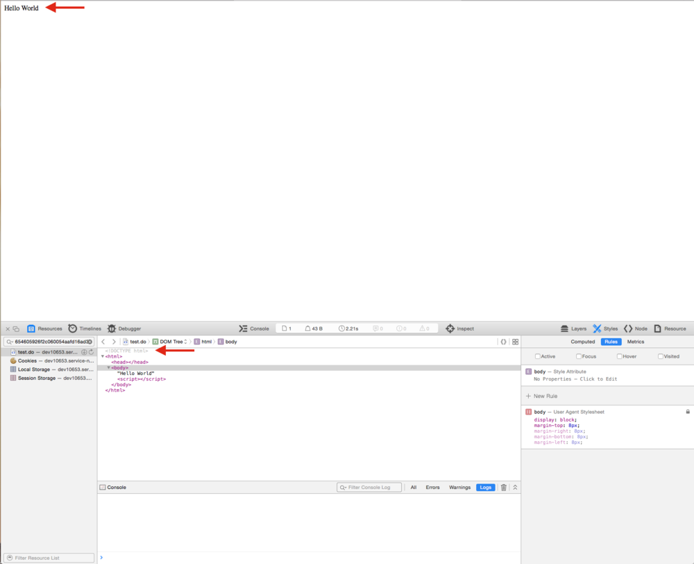

Today, I am going to share a trick I learned to add a doctype to a UI Page based off of [will.leingang][1]'s article [Making a UI Page without using the framework page template][2]. A page's doctype usually doesn't seem to make a huge difference in output but occasionally, certain scripts and html/css tricks require a specific doctype. In my case, I needed the standard HTML5 doctype.

## What Not To Do

As my first attempt, I foolishly tried this for the UI Page:

```xml
<?xml version="1.0" encoding="utf-8" ?>  
<j:jelly trim="false" xmlns:j="jelly:core" xmlns:g="glide" xmlns:j2="null" xmlns:g2="null">  
     <!DOCTYPE HTML>  
     Hello World  
</j:jelly>
```

And ServiceNow promptly informed me:

<figure>
  
  <figcaption>
    ServiceNow UI Page Doctype Error
  </figcaption>
</figure>

In hindsight, I should have seen that coming. Jelly is XML and XML recognizes and interprets a DOTYPE declaration. That could cause the Jelly runner to throw all sorts of errors, bad juju.

## Another Bad Idea

So then my next stroke of genius was to encode the XML entities to trick the parser. Cheap parser loopholes, they exist so we can use them right? So here is the code for attempt #2:

```xml
<?xml version="1.0" encoding="utf-8" ?>  
<j:jelly trim="false" xmlns:j="jelly:core" xmlns:g="glide" xmlns:j2="null" xmlns:g2="null">  
     &lt;!DOCTYPE HTML&gt;  
     Hello World  
</j:jelly>
```

No errors on save and I was feeling pretty clever as I clicked the refresh button on my UI Page. The results were... slightly less than satisfying:

<figure>
  
  <figcaption>
    ServiceNow UI Page Doctype Error Result
  </figcaption>
</figure>

Yes. That is the page I saw in the browser. For those who are still confused, this is the HTML in the browser:

```xml
<html>  
  <head></head>  
  <body>  
    &lt;!DOCTYPE HTML&gt;  
    Hello World  
    <script></script>  
  </body>  
</html>
```

## Problem Solved, Problem Staying Solved

So with that failure, I turned to option #3, leveraging the <g:no\_escape> tag to embed raw html. Since Jelly runs in two phases and the second phase parse would likely complain about a misplaced <!DOCTYPE> as much as phase 1, I had to run no\_escape in phase 2 to eliminate any XML parsing conflicts. This is a common trick I use when XML is getting in my way. Of course, to do this, I needed a string variable containing the raw html to embed, so I also added <g:evaluate>. Here is the UI Page XML:

```xml
<?xml version="1.0" encoding="utf-8" ?>  
<j:jelly trim="false" xmlns:j="jelly:core" xmlns:g="glide" xmlns:j2="null" xmlns:g2="null">  
  <g:evaluate>  
    var docType = '&lt;!DOCTYPE HTML&gt;';  
  </g:evaluate>  
  <g2:no_escape>  
    $[docType]  
  </g2:no_escape>  
  Hello World  
</j:jelly>
```

And the successful result:

<figure>
  
  <figcaption>
    ServiceNow UI Page Doctype Success
  </figcaption>
</figure>

So it took a little trickery to work around the XML pitfalls but in the end I was able to use sysparm_direct=true, send a DOCTYPE to the browser and fix the issue with my script library.

[1]: https://community.servicenow.com/people/will.leingang
[2]: https://community.servicenow.com/community/develop/blog/2015/02/03/a-ui-page-without-the-framework-page-template
