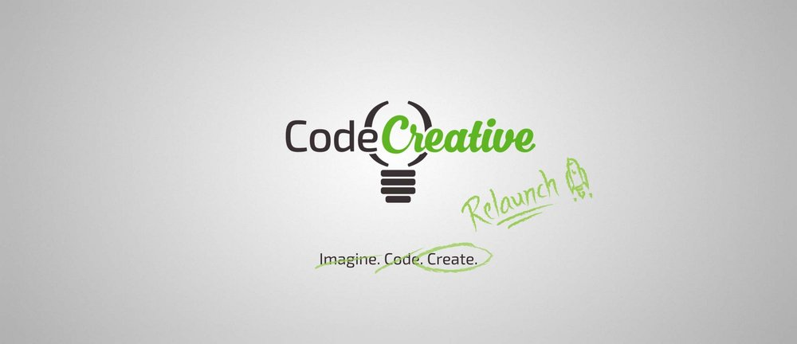
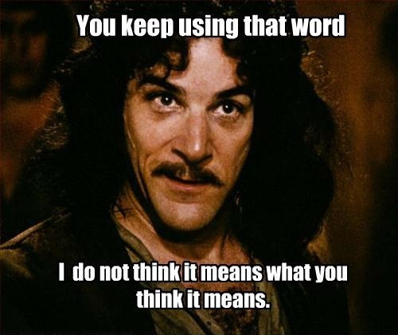

<figure>
  
</figure>

## Breaking the connection to relaunch Code Creative

Nine months, thats how long it takes the female human body to create a new life… conveniently, it’s also how long it has taken me to create absolutely nothing. It’s not that I stopped trying to create or because I was slacking off, quite the contrary. I spent my nights and weekends learning, working on content, writing code, designing graphics, trying to bring my passion project to life. I was doing, I was grinding, I was hustling, I was -ing-ing like no one ever -ing-ed before. This was my baby.

But no matter what I did, I couldn’t make it perfect.

In hindsight, the aphorism “[perfect is the enemy of good][1]” hits me in the face like a 2x4. But, you don’t have to make this same mistake. You don’t have to wait 9 months to stop procrastinating for the sake of perfection. This is how I was able to break that connection to bring Code Creative back to life.

---

## An ever expanding vision

The vision started out simple enough: remove barriers that prevent non-technical people from learning to code. As a former mechanic who spent 5 years or so of my nights and weekends learning to code, I am intimately familiar with the frustration of transitioning into the tech industry in a non-traditional way. It doesn’t have to be so complicated!

So one evening at Hotel Deca in Seattle, I impuslively sat down and cranked out a script and produced my [first video][2]. It felt great. The video was terrible but it felt great. Over the next month or so, I produced [two more videos][3], an article, an [infographic][4], a [teaser][5], and then nothing. I just stopped.

***I could do better. I had to fix it. So I stopped creating and started fixing.***

And there was so much to fix! So much was wrong. The videos were too technical. The intro had the wrong feel. The design was wrong, the branding was thrown together, the white balance was off, the editing was crude, not to mention that it took too long to produce each video, my process was simply amaturish.

I began evaluating alternatives and researching. I tried Wordpress, Ghost, Drupal, Medium and other more obscure options. But none of them were perfect.

---

## Perfect: not what you think it means

<figure>
  
</figure>

So naturally, after not finding the perfect platform, I did what any rational developer would do and decided to write my own. That way I could tailor it to exactly what I needed. It would be perfect, at least for what I needed anyway. But in the mean time, I was creating no content. I was a mechanic making my tools instead of using them.

Months rolled by and I was still busting my tail off working on this platform. It was a blast. I wasn’t worried about completing the project. I didn’t have to. No one was counting on me to complete it. No one was paying me. I had a day job, this was just side hustle. Besides, I was having fun building the platform.

***That’s when it hit me that ‘perfect’ was starting to look a lot like procrastination.***

Avoidance of work… check. Doing more pleasurable tasks… check. Yes, I was definitely procrastinating.

---

## Restoring the vision to break the cycle

Remember the vision? Remove barriers that prevent non-technical people from learning to code. That was the key. Building a platform, while challenging and enjoyable, contributed nothing to that vision. If anything it was the perfect way to fail the vision.

Sure no one else was counting on me to finish this project but ***I was***.

***In failing to create content, I was failing myself.***

This is my vision and my content to share. Realizing how much time I have lost woke me up to that fact. Ultimately, you have to ask yourself, is your perfection serving your vision or is it serving itself? In my case, I am relaunching Code Creative here on Medium. I choose to let my perfectionism serve my vision.

Now it’s your turn. [Just do it][6]. Get up and create something.

[1]: https://en.wikipedia.org/wiki/Perfect_is_the_enemy_of_good
[2]: https://www.youtube.com/watch?v=fOQwpFkcTZs
[3]: https://www.youtube.com/channel/UCmwKZdMYyUD4AWnAIrx5JVw
[4]: /blog/demystifying-glideajax
[5]: https://www.youtube.com/watch?v=7LerV8BMpic
[6]: https://www.youtube.com/watch?v=ZXsQAXx_ao0
