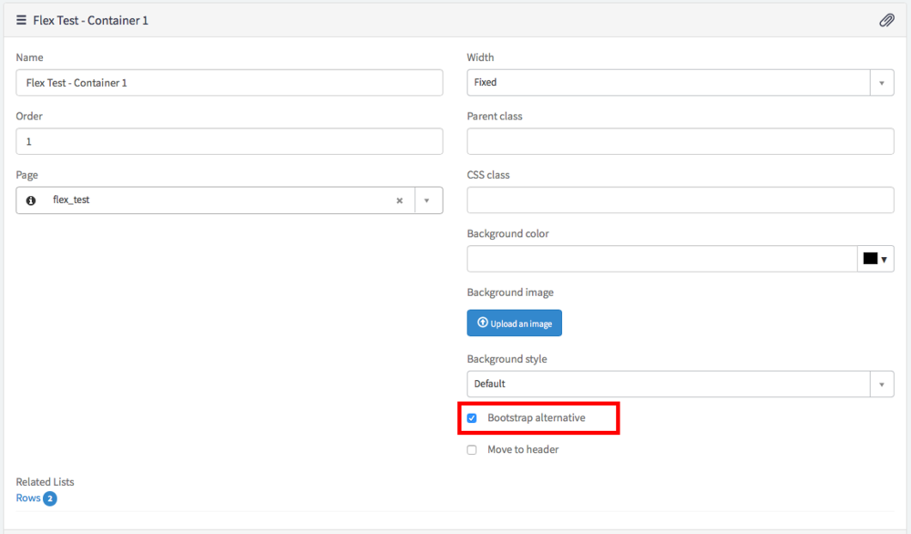

<div class="videoWrapper">
  <iframe width="560" height="315" src="https://www.youtube.com/embed/P_6Ywdx5RvM" frameborder="0" allow="accelerometer; autoplay; encrypted-media; gyroscope; picture-in-picture" allowfullscreen></iframe>
</div>

One of the lesser known features of Service Portal is that you can entirely ditch the Bootstrap grid layout. Technically, this opens up the ability to use Flexbox based layouts. But as some in the Community have found out first hand, using Flexbox as a Bootstrap alternative in Service Portal is not quite as straightforward as it seems.

Most of the "problem" rests in Flexbox's simplicity. Using **only** a simple containing div around a set of item divs, Flexbox can achieve many layouts via CSS. The key word there being **only**. The Flexbox behaviors only work when the container is a direct parent of the Flexbox items. The behaviors are not carried down the HTML chain.

Service Portal on the other hand, thrives on a little bit of complexity. As the video demonstrates, Service Portal not only uses a row + column wrapper to create the Bootstrap layouts but it also adds a few other wrapper elements. If I were a gambling man (I'm not), I'd bet that these extra wrappers are a product of using AngularJS since it is notorious for extra elements that serve only UI logic purposes... that's for another time though.

The short of it... Flexbox requires a few extra steps in Service Portal. The video certainly goes into greater detail but here are the basic steps:

## 1. Add Flexbox CSS to the Theme

In case you aren't already familiar, this may require a couple steps. If you navigate to the Portal record, you can use the Theme reference field to get to the Portal's theme. From there, you can either add a new CSS Include (which requires creating a CSS Style Sheet) or add the styles to an existing CSS Include. Any way you approach it, here is the bare minimum that you will need:

```css
.wrap {
  display: flex;
}

.wrap_item, .wrap_item > span, .wrap_item > span > div {
  display: flex;
  flex: 1 0 auto;
}
```

Fairly straight forward, right? The wrap class is the main Flexbox container while wrap_item is the Flexbox item. Why not use flex and flex_item? Honestly, I think Service Portal already has some Flex classes that you may be able to use but I haven't figured those ones out yet! So I'd rather not muddle the classes.

## 2. Mark the Container Record as Bootstrap Alternative

<figure>
  
  <figcaption>
    Toggle On Service Portal Bootstrap Alternative Layout
  </figcaption>
</figure>

Putting a checkmark in this box tells Service Portal to remove the Bootstrap row / column classes so that you can take over the layout for that container yourself. I like to do this from the Page Editor rather than the Page Designer.

## 3. Add wrap class to the Row record

Once again, this can be accomplished from the Page Editor. Just select the row you want to be controlled by Flexbox and add "wrap" to the "CSS class" field.

## 4. Add wrap_item class to the Column record

Basically, we are doing the same thing as Step 3 except adding the wrap_item class to the Column instead of the Row. In the CSS, you will note that wrap_item controls not only the Column div but also a couple child elements as well. This extends the Flexbox behavior far enough down the hierarchy of elements to reach the outer element of the widget. You can check the video for more details and to see it in action.

## Wrap Up

Using other Flexbox CSS declarations you can achieve some pretty flexible CSS driven layouts. It's a great way to expand your display options and since Flexbox and Service Portal have the same browser support, there aren't many reasons not to give it a shot.

I'll be the first to say that this is hardly the only way to accomplish Flexbox layouts on Service Portal. This is just the first way that I have come across. Got a way you prefer? Sound off!
