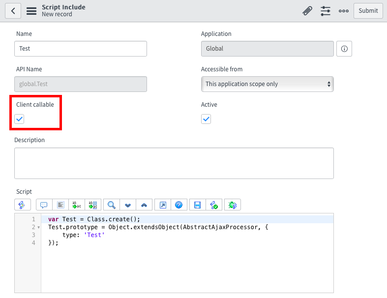

After my [Demystifying GlideAjax][1] infographic I always meant to go back and write a GlideAjax troubleshooting guide. Both troubleshooting my own scripts and helping folks on the ServiceNow Community, I run into the same mistakes over and over and over again. And in spite of making the same mistakes, and eventually stumbling across the same solutions, I've (shamefully) never quite refined my troubleshooting process on this one. I'm pretty sure if I forget sysparm_name in my Client Script again, ServiceNow is going to send people to my door to reclaim my ServiceNow certificates until I go through remediation training.

So to hopefully avoid any future "[the files are in the computer][2]" moments during my troubleshooting, here are some helpful tips on troubleshooting GlideAjax.

---

## Script Include

```js
var HelloWorld = Class.create();
HelloWorld.prototype = Object.extendsObject(AbstractAjaxProcessor, {
   helloWorld: function() {
      return "Hello " + this.getParameter('sysparm_user_name') + "!";
   },

   _privateFunction: function() { // this function is not client callable     

   }

});
```

### Inherit from the AbstractAjaxProcessor

Checkout Line 2 in the above Script Include. Notice that Object.extendsObject? That is absolutely vital to the Ajax script. The AbstractAjaxProcessor Script Include provides a standard set of functions that every GlideAjax Script Include must implement. The interface basically acts as a mediator that allows extracting data from the XML request and building the XML response that GlideAjax relies upon for messaging between client and server.

No AbstractAjaxProcessor, no XML messages, no GlideAjax. Make sure a line like this exists in your Script Include.

### Do not use an initialize function

This may be less obvious, but do you notice that there is no initialize function in the Script Include example. This is actually extremely important. The AbstractAjaxProcessor has its own initialize function and creating this function on your inheriting Script Include overrides the base class initialize function. It has a similar result to not inheriting the AbstractAjaxProcessor at all.

Normally, when using class inheritance like this, you would explicitly call the base class function (in Prototype.js this is done with the $super parameter) but unless it has changed recently, I've never been able to do this in ServiceNow.

That said, you can copy the initialize function from AbstractAjaxProcessor to your Script Include, but keep in mind that future changes to AbstractAjaxProcessor could break your Script Include in upgrades if you do this.

### Mark the Script Include as Client Callable

<figure>
  
  <figcaption>
    Client Callable Script Include
  </figcaption>
</figure>

Another possible point of failure for GlideAjax is failing to mark the Script Include as Client callable. If there is not a check in the Client callable checkbox, then GlideAjax doesn't know the Script Include exists. This checkbox is a security measure and prevents malicious users from being able to call any Script Include from the client using browser dev tools.

As a bonus, go ahead and check Client callable as your first step. When you follow up by tying in a Name, ServiceNow will automatically script a basic GlideAjax Script Include. This will take care of both the previously mentioned initialize function and AbstractAjaxProcessor issues.

### Use a Public Function

GlideAjax can only use public functions from the client script. The distinguishing feature is the presence or absence of the underscore (\_) at the front of the function name. Public functions will start with a letter, private functions will start with an underscore. So if your function name is \_doSomethingCool, GlideAjax will not be able to use it. You will need to provide a public interface such as doSomethingCool. You can see this at work in the above Script Include between the helloWorld function and the \_privateFunction function.

Personally, I like to structure my GlideAjax functions so that the legwork is done in a private function while the public function handles all the GlideAjax parameters and value returns. That way I can test my private functions using a background script without GlideAjax interfering.

### Set Return Values

GlideAjax has two ways of setting the answer values in the message that gets returned to the client. The first way is to simply use a "return" statement as done in the helloWorld function above on line 4. This will set the "answer" parameter for the Client Script to consume.

The other approach is to use the this.newItem and the setAttribute function calls in order to set multiple answer values. You can see this approach at play in the below Script Include from the ServiceNow Wiki.

```js
/*
 * MyFavoritesAjax script include Description - sample AJAX processor returning multiple value pairs
 */
var MyFavoritesAjax = Class.create();
MyFavoritesAjax.prototype = Object.extendsObject(AbstractAjaxProcessor, {

    /*
     * method available to client scripts call using:
     * var gajax = new GlideAjax("MyFavoritesAjax");
     * gajax.addParam("sysparm_name", "getFavorites");
     */
    getFavorites : function() {
        // build new response xml element for result
        var result = this.newItem("result");

        result.setAttribute("message", "returning all favorites");

        //add some favorite nodes with name and value attributes
        this._addFavorite("color", "blue");
        this._addFavorite("beer", "lager");
        this._addFavorite("pet", "dog");

        // all items are returned to the client through the inherited methods of AbstractAjaxProcessor
    },

    _addFavorite : function(name, value) {
        var favs = this.newItem("favorite");
        favs.setAttribute("name", name);
        favs.setAttribute("value", value);
    },

    type : "MyFavoritesAjax"

});
```

Either way, it is important to set a return value in your publicly accessed function. In most cases, the simple return value is all you need.

### Mark Script Include Public if Needed

When accessing a GlideAjax Script Include from a public UI Page or Public CMS page, you also need to make your Script Include public. This is accomplished by setting the isPublic attribute on the Script Include object as shown below. This is another one of those security features to protect your Script Includes from malicious users. Without it, any user on the internet could use your GlideAjax script. In other words, be careful about which Script Includes you make public and test the security of those scripts and the tables that they access.

```js
var HelloWorld = Class.create();
HelloWorld.prototype = Object.extendsObject(AbstractAjaxProcessor, {
   helloWorld: function() {
      return "Hello " + this.getParameter('sysparm_user_name') + "!";
   },

   _privateFunction: function() { // this function is not client callable     

   },

   isPublic: true

});
```

---

## Client Script

```js
var ga = new GlideAjax('HelloWorld');
ga.addParam('sysparm_name','helloWorld');
ga.addParam('sysparm_user_name',"Bob");
ga.getXML(HelloWorldParse);

function HelloWorldParse(response) {
   var answer = response.responseXML.documentElement.getAttribute("answer");
   alert(answer);
}
```

### Correct Script Include Name

It's sad to say but make sure you use the correct Script Include name on the first line of your GlideAjax call in your Client Script. In line 1 above, you see 'HelloWorld' in the first and only parameter to the GlideAjax constructor function. This is used by GlideAjax to find the correct Script Include server side so if you spell it wrong, you won't get your desired results.

### Correct Function Name as sysparm_name

Likewise, you have to have something like line 2 in the above Client Script. That is, you need to add a parameter called sysparm_name which should map to the public function you want to call on the Script Include. In this case we are calling helloWorld on the Script Include. Traditionally, GlideAjax has been fairly silent when it fails to find the correct Script Include or function on that Script Include. It just assumes you meant to do that and keeps on going with an empty or undefined response. So double check the function call and spelling of the parameters passed, it can be as simple as that.

### Remember a Callback

So you can do GlideAjax synchronously or asynchronously. Async GlideAjax is what you will want to use in most circumstances and to do that you have to pass a callback function. You can see this in the above Client Script in both the getXML function and the function named HelloWorldParse. When getXML retrieves the information from the server, HelloWorldParse will be called with the results. Notice the parameter "response" in the HelloWorldParse function. Don't forget that.

Without this callback, your server data gets dumped into the abyss after being retrieved.

### Treat Result as a Primitive Data Type

Lastly, remember to treat the "answer" as a primitive. In other words, on the line where you see response.responseXML.documentElement.getAttribute('answer'), remember that the result of that function is not a complex object. You may have a GlideRecord server side, but in the Client Script you have a string, number, boolean, null, or undefined value.

That means there is no reason to do getAttribute('answer').doSomething(). There is no doSomething, it doesn't exist. The reason is the hidden XML message under the hood of GlideAjax. To communicate between the Client Script and Script Include, an XML message is used. Since XML doesn't understand GlideRecord or other complex objects, any value you pass will be converted to a primitive type.

---

## Last Troubleshooting Tip

Add logging statements to both your Client Script and Script Include. The messaging that occurs between them can make it difficult to determine where in the process the breakdown occurs. Following a trace of logging statements can reveal where the process stops which may help identify the cause.

Got other troubleshooting tips for GlideAjax? Let me know, I'd love to include them!

[1]: /blog/demystifying-glideajax
[2]: https://www.youtube.com/watch?v=H2uHBhKTSe0
