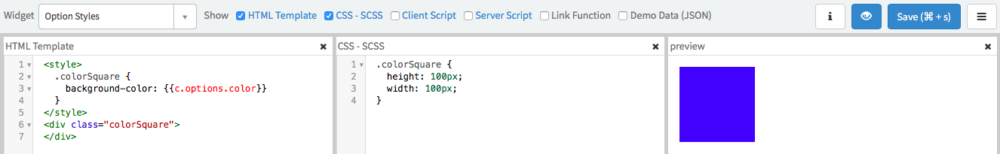
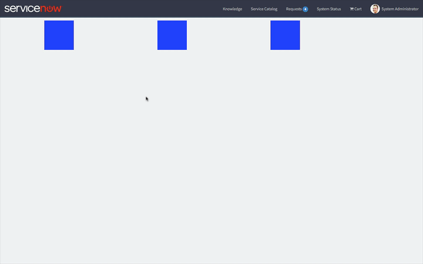

**Warning:** This article is an example of what not to do. Avoid using these practices in your ServiceNow instance.

---

[Previously][1], we built a widget with configurable CSS styles and I briefly mentioned that using the \<style\> tag wasn't a great idea. I want to revisit that thought and explore some of the problems that you might encounter when using the \<style\> tag in a Service Portal Widget. I will use the colored square widget again to demonstrate.

## The Widget

<figure>
  
  <figcaption>
    Using Style Tag in Widget HTML
  </figcaption>
</figure>

So first, let's take a look at this widget. You'll notice that I am using a \<style\> tag instead of the ng-style directive this time. This is accomplished using the Angular.js curly brace notation around the **c.options.color** widget option. So far, things look good. We still have blue square and we can still configure the color of that square when we place it on Service Portal page.

In a traditional Angular.js application, this is a perfectly legitimate way of injecting dynamic styles into the HTML as long as the style tag is within the Angular scope. In fact, when I was first approached with a question on this, I responded with the rough equivalent of "sure, I use this approach all the time". I hadn't come up with a scenario where this presented a problem... until I started working on the previous article.

---

## The problem of cascading styles

<figure>
  
  <figcaption>
    Unexpected Results: All squares stay the same color as the last configured widget instance
  </figcaption>
</figure>

It only took me a moment to realize... my widget was overriding its own CSS

<aside class="ccPullQuote right w-50">
  <p>It only took me a moment to realize... my widget was overriding its own CSS</p>
</aside>

Until now, all my widgets either existed as a single instance on the page or required the same styled options for every instance on the page. But as I was creating one of the gifs to demonstrate configuring widget options in the previous article, I noticed that all the squares remained the same color as the last square as can be seen in the above gif.

Whoops.

It only took me a moment to realize what should have been evident from the start - my widget was overriding its own CSS. Think of it this way, each square on the page injects its own copy of the Widget HTML into the page. So in the above page, the HTML has been copied 3 times... and so has my style tag. The rendered HTML (minus the cruft) would resemble the following block:

```html
<!-- Widget Instance 1 -->
<style>
  .colorSquare {
    background-color: red;
  }
</style>
<div class="colorSquare">
</div>

<!-- Widget Instance 2 -->
<style>
  .colorSquare {
    background-color: green;
  }
</style>
<div class="colorSquare">
</div>

<!-- Widget Instance 3 -->
<style>
  .colorSquare {
    background-color: #d5d5d5;
  }
</style>
<div class="colorSquare">
</div>
```

If you didn't see it before, surely you see it now. The colorSquare class is replicated 3 times in 3 separate style tags. Because of how CSS works, the last background-color specified for colorSquare overrides the others. This is why all of the squares are the same color as the last.

Now you could do some fancy footwork with dynamic class names or ID's but there is at least one other reason to avoid style tags in your Widget HTML.

---

## Style Tags Aren't Scoped

So one of the things I love about the CSS -SCSS code block in widgets is that the preprocessor adds a prefix to ensure that the styles are scoped to that widget only. Style tags in the HTML code block don't go through the preprocessor and so they aren't properly scoped.

This means that you can affect the entire page and every widget on the page with some poorly planned class names. You could view this as a way to break out of the scoped model for those rare cases where you WANT your Widget to affect the outer scopes. But in general you will want to avoid this practice and keep your styles within the CSS - SCSS block and the ng-style directive.

[1]: /blog/intro-to-configurable-styles-for-service-portal-widgets
