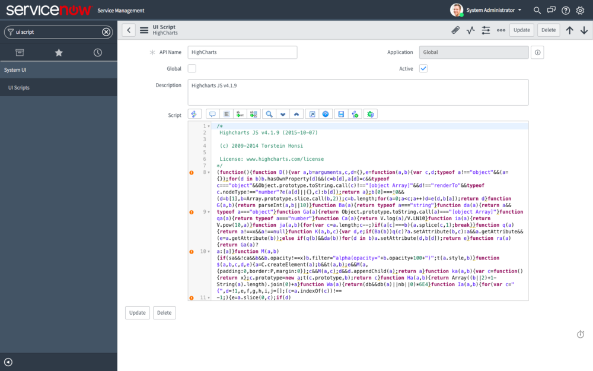
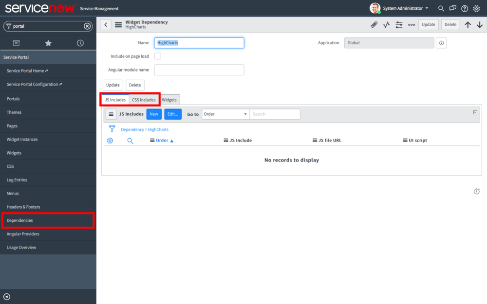
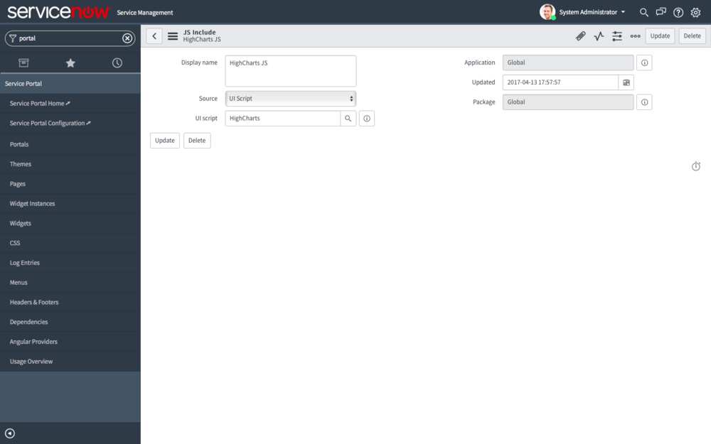
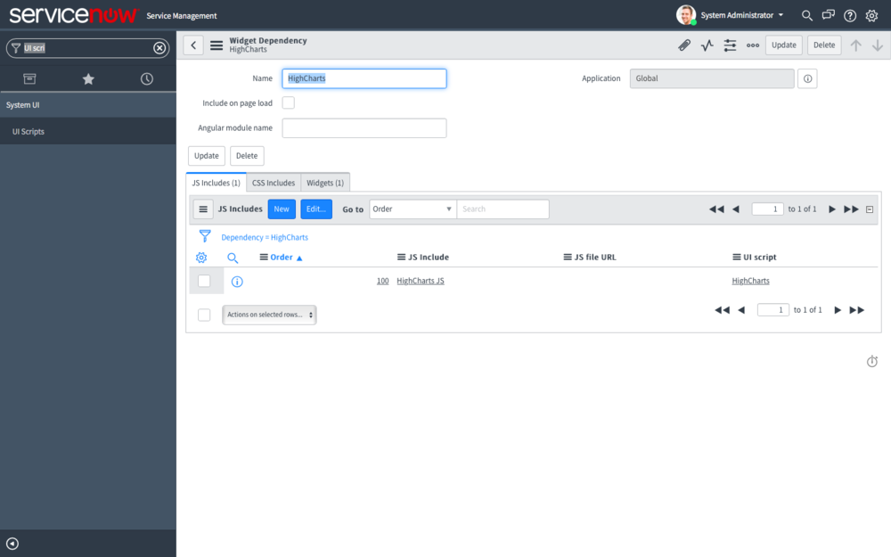
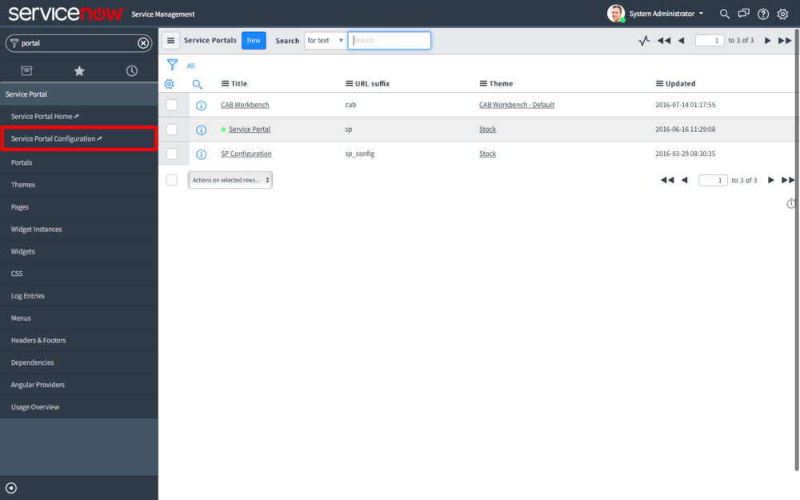
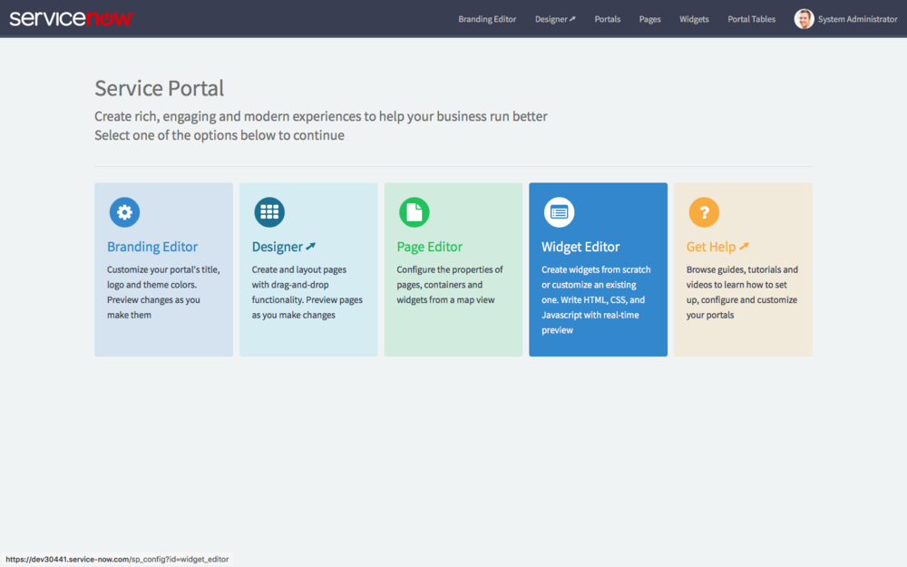
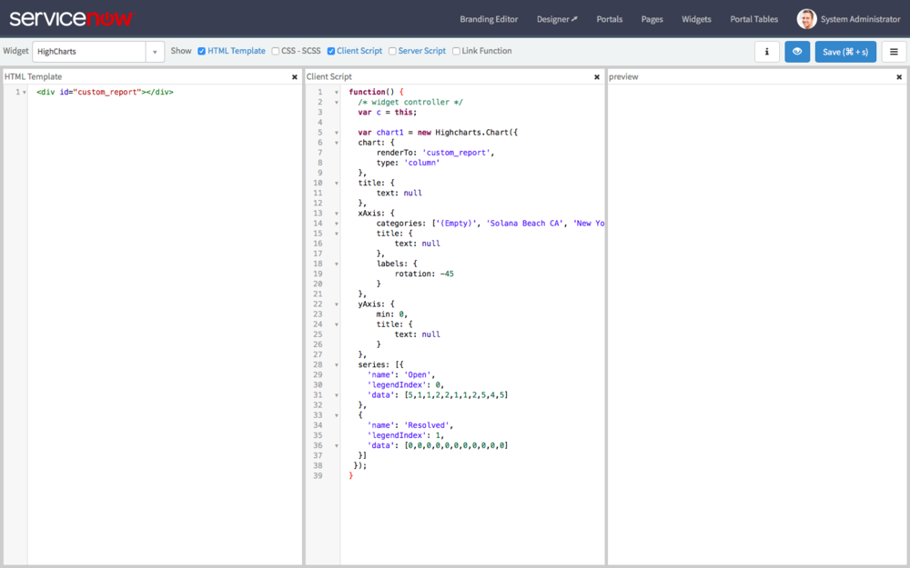
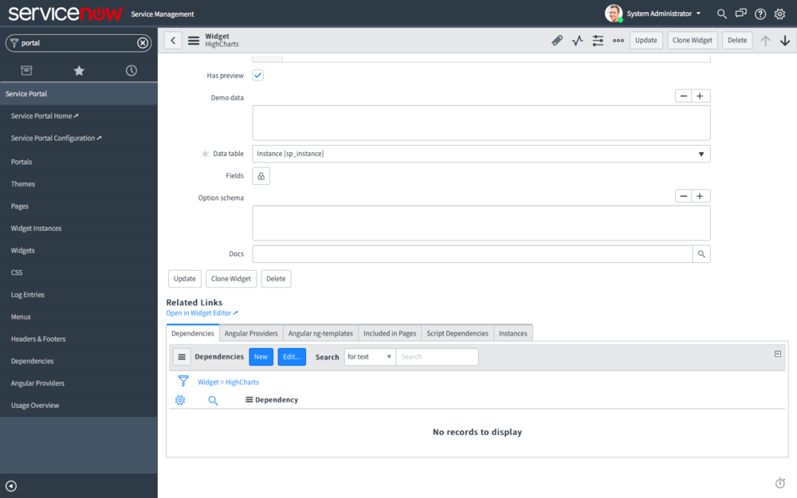
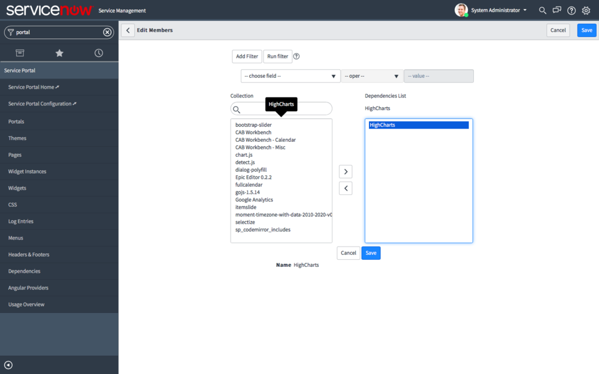
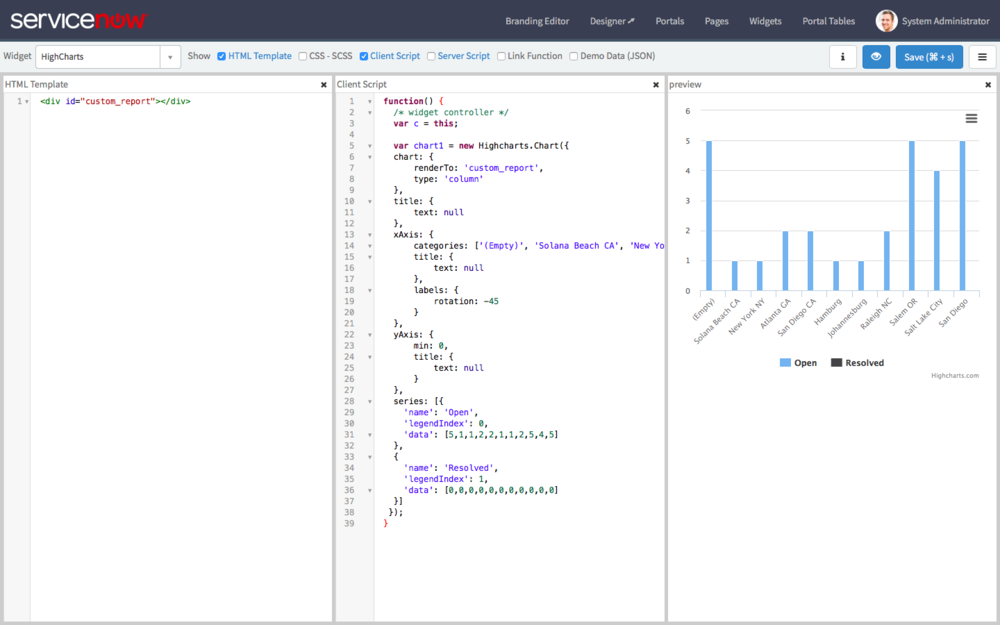

**WARNING:** The use of HighCharts in this way may require the purchase of an additional license from Highsoft. Use in production at your own risk.

**Read the Whole Series:**

1. Intro to HighCharts in Service Portal (This Post)
2. [Configuring HighCharts in Service Portal][1]
3. [Generate HighChart Data in a Widget Server Script][2]
4. [Making the HighChart Widget Reusable][3]

[Download the Widget][4]

---

About 2 years ago, I demonstrated how to build [custom charts using HighCharts][5] with a UI Page and kicked off what would eventually become Code Creative. But it didn't occur to me that I haven't revisited custom charts since Service Portal came out until a recent question I received.

So over the next few weeks we're going to take a look at how to upgrade that old and busted UI Page custom chart and trade it in for a Service Portal widget custom chart.

---

## Step 1: Create HighChart Dependencies

After some quick digging through client code, I discovered the updated script that ServiceNow is using for charting and reporting:

- /scripts/GlideV2ChartingIncludes.jsx?v=03-22-2017_2342

Unfortunately, I also discovered that Service Portal does not like the GlideV2ChartingIncludes. So I dug through and discovered that it is using HighCharts v4.1.9 (Istanbul). To get around the charting include issue, I downloaded [HighCharts v4.1.9][6] and created a UI Script of it in ServiceNow so I could create a dependency.

If you aren't already familiar with the Service Portal concept of Dependencies, it is likely exactly what you are thinking. Dependencies allow you to specify which client side libraries a Widget is dependent on. That way, if multiple Widgets on a page are dependent on the same libraries, those libraries are only included in the page once. Very handy.

To create our dependencies, we need to:

1.  Navigate to System UI > UI Scripts
2.  Create a new UI Script for HighCharts
3.  Navigate to Service Portal > Dependencies
4.  Create a new Dependency Record
5.  Using the JS Includes related list, create a new JS Include with the above UI Script

<figure>
  
  <figcaption>
    Create HighCharts UI Script
  </figcaption>
</figure>

<figure>
  
  <figcaption>
    Create Widget Dependency for HighCharts
  </figcaption>
</figure>

<figure>
  
  <figcaption>
    Create HighCharts JS Include as a Dependency
  </figcaption>
</figure>

<figure>
  
  <figcaption>
    Resulting HighCharts Widget Dependency
  </figcaption>
</figure>

Now we are ready to include HighCharts in a Widget!

---

## Step 2: Build the Chart Widget

As usual, I prefer to build my Widgets using the Widget Editor but in this case we do have to temporarily dive into the Table/Form view in order to wire up our dependency:

1. Navigate to Service Portal > Service Portal Configuration
2. Click Widget Editor
3. Create a New Widget (I named mine HighCharts, details below)
4. From the backend interface, navigate to Service Portal > Widgets
5. Open the HighCharts Widget
6. From the Dependencies related list, add the HighCharts dependency we created previously
7. Return to the Widget Editor and reload the preview

<figure>
  
  <figcaption>
    Build the Chart Step 1
  </figcaption>
</figure>

<figure>
  
  <figcaption>
    Build the Chart Step 2
  </figcaption>
</figure>

<figure>
  
  <figcaption>
    Build the Chart Step 3
  </figcaption>
</figure>

<figure>
  
  <figcaption>
    Build the Chart Step 5
  </figcaption>
</figure>

<figure>
  
  <figcaption>
    Build the Chart Step 6
  </figcaption>
</figure>

<figure>
  
  <figcaption>
    Build the Chart Step 7
  </figcaption>
</figure>

For simplicity sake, I hardcoded the chart series and categories objects but in the future we will generate this server side. The beauty of the Service Portal approach is a clean delineation between HTML template, Client Script, and Server Script... something that the UI Page muddled horribly. Within Service Portal we can see a very simple HTML and a Client Script that in all reality is a [pretty basic HighCharts][7] script with nothing extra.

For reference, here are the scripts:

**HTML**

```html
<div id="custom_report"></div>
```

**Client Script**

```js
function() {
  /* widget controller */
  var c = this;

    var chart1 = new Highcharts.Chart({  
  chart: {  
      renderTo: 'custom_report',  
      type: 'column'  
  },  
  title: {  
      text: null  
  },  
  xAxis: {  
      categories: ['(Empty)', 'Solana Beach CA', 'New York NY', 'Atlanta GA', 'San Diego CA', 'Hamburg', 'Johannesburg', 'Raleigh NC', 'Salem OR', 'Salt Lake City', 'San Diego'],  
      title: {  
          text: null  
      },  
      labels: {  
          rotation: -45  
      }  
  },  
  yAxis: {  
      min: 0,  
      title: {  
          text: null  
      }  
  },  
  series: [{
        'name': 'Open',
        'legendIndex': 0,
        'data': [5,1,1,2,2,1,1,2,5,4,5]
    },
    {
        'name': 'Resolved',
        'legendIndex': 1,
        'data': [0,0,0,0,0,0,0,0,0,0,0]            
    }]  
 });  
}
```

---

## Conclusion

Honestly, this was so quickly accomplished that I am extremely excited about diving deeper into the capabilities of HighCharts and Service Portal. There is so much left to explore. We've only touched the surface of HighCharts and so far are only using hardcoded data in the client script. So stay tuned over the next few weeks for the rest of this series as we build from this basic widget.

[1]: /blog/configuring-highcharts-in-service-portal
[2]: /blog/generate-highchart-data-in-a-widget-server-script
[3]: /blog/making-the-highchart-widget-reusable
[4]: /downloads/HighCharts-Widget.zip
[5]: /blog/how-to-build-custom-charts-and-reports
[6]: http://code.highcharts.com/4.1.9/highcharts.js
[7]: http://www.highcharts.com/docs/getting-started/your-first-chart
