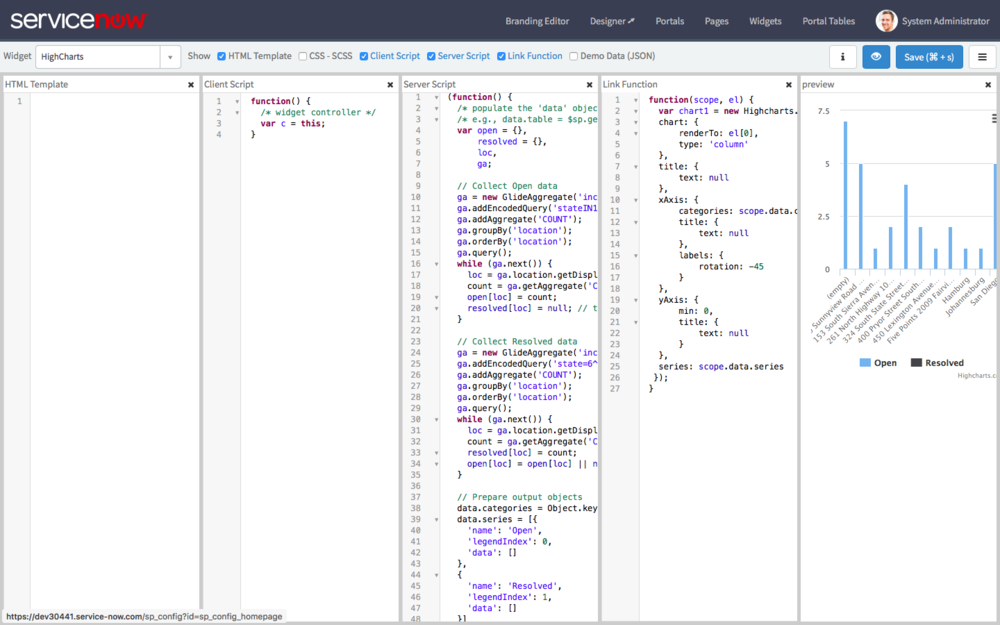
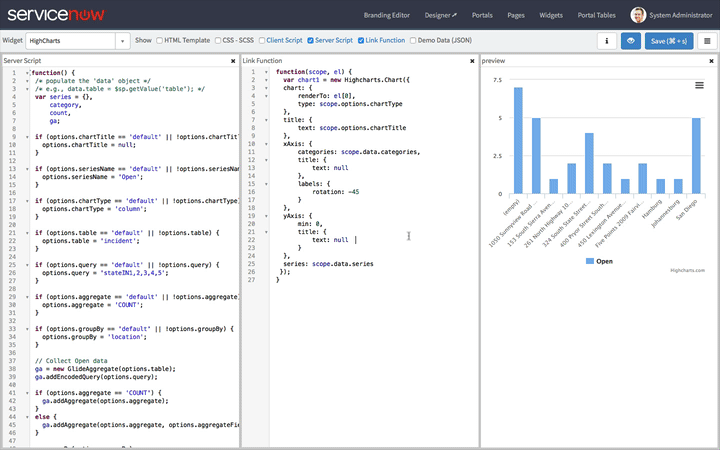
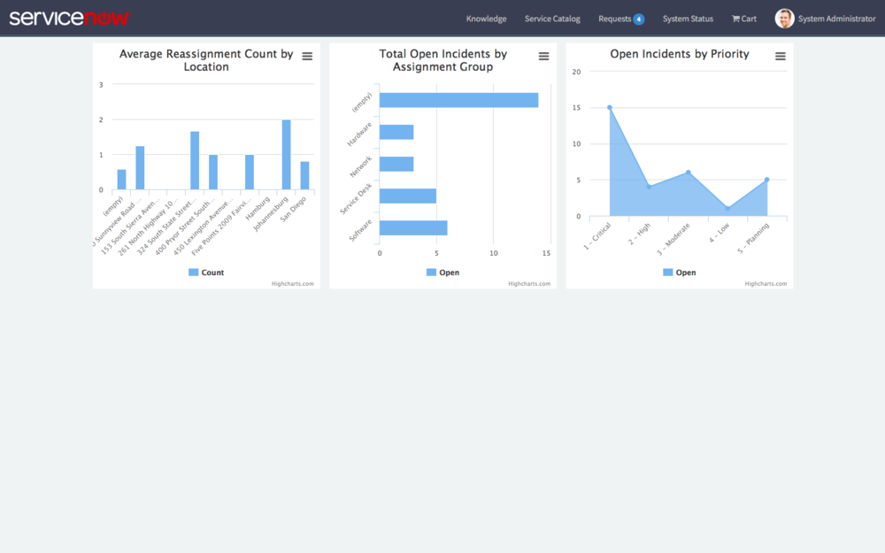
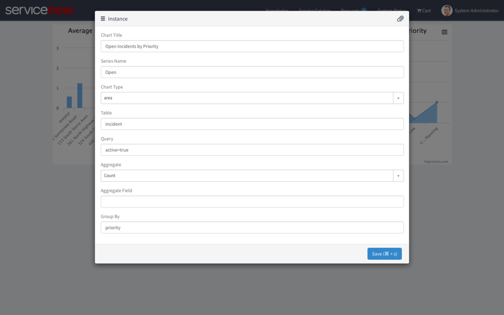
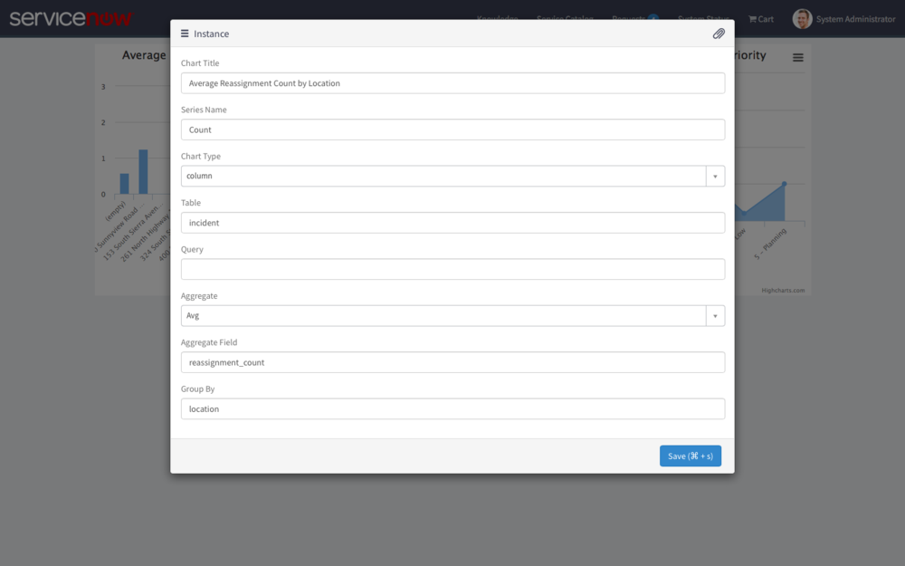

**WARNING:** The use of HighCharts in this way may require the purchase of an additional license from Highsoft. Use in production at your own risk.

**Read the Whole Series:**

1.  [Intro to HighCharts in Service Portal][1]
2.  [Configuring HighCharts in Service Portal][2]
3.  [Generate HighChart Data in a Widget Server Script][3]
4.  Making the HighChart Widget Reusable (This Post)

[Download the Widget][4]

---

Up until now, the [HighChart Widget][5] that we've been working on has remained... well... mostly unusable. It is still hardcoded and built in such a way that adding multiple widget instances to a page is just absurd. In this article, we are going to make some final changes that actually make this Widget useful in an actual Service Portal. To keep the changes simple, we are going to keep the chart to a single series of data. Let's take a look at the changes we need to make:

---

## Step 1: Remove the HTML ID

<figure>
  
  <figcaption>
    HighChart Widget with Link Function
  </figcaption>
</figure>

As I've indicated in a previous article, ID's in the HTML template are generally unnecessary and in certain circumstances can cause trouble. In our case, a static ID ruins the ability to create multiple instances on a page. We could use the ng-attr-id directive from Angular to make the ID dynamic but you will definitely run into some Angular order of execution issues and I think there is a better way if we move our HighCharts client script to the Link function. So as part of this first step, I am going to take a couple actions:

1. Remove the Div with the ID attribute from the HTML
2. Move the **new HighCharts.Chart()** call to the Link function

The first part is easy because we can actually remove the entire HTML Template all together. HighCharts will embed the chart directly into the Service Portal generated widget wrapper with one simple change to the Link function script (Don't forget to click the Link Function check box in the Widget Editor, it is off by default). Speaking of which, here is the new Link function:

```js
function(scope, el) {
  var chart1 = new Highcharts.Chart({  
    chart: {  
        renderTo: el[0],  
        type: 'column'  
    },  
    title: {  
        text: null  
    },  
    xAxis: {  
        categories: scope.data.categories,  
        title: {  
            text: null  
        },  
        labels: {  
            rotation: -45  
        }  
    },  
    yAxis: {  
        min: 0,  
        title: {  
            text: null  
        }  
    },  
    series: scope.data.series  
  });
}
```

For the most part, it is very similar to our old Client Script function. Here are the few changes that have been made:

1. The outter function uses the Angular Link Function signature which you can learn more about from the [Angular docs on Directives][6]
2. Changed renderTo property to el[0] which refers to the outermost element of the Widget. In other words, we will render the chart to the Widget wrapper
3. Changed **c.data** to **scope.data** for both Series and Categories. The Link function passes in the scope to the first parameter of the function which we have called **scope**. This is part of Angular's internal processing.

And with this move, we also need to clear out the Client Script which will now look like this:

```js
function() {
  /* widget controller */
  var c = this;
}
```

---

## Step 2: Clean Up Server Script

<figure>
  
  <figcaption>
    Cleanup HighChart Widget Server Script
  </figcaption>
</figure>

So next, we need to prepare the Server Script for its grand dynamic makeover. For this step, I want to take two actions in particular:

1. Remove the Resolved data series to reduce the number of series to 1 (we will be using Widget Options to generate this series, so it will be easier if we only have 1)
2. Clean up some variable names like the Open data series so that it is more generic

In the pictured Server Script, you can see that I have removed the block of code for collecting the Resolved Series, removed other references to the Resolved Series, and renamed the following variables:

- open: series
- loc: category

Don't worry about making these immediate changes to your own code, we still have more changes to make to the Server Script.

---

## Step 3: Add support for Widget Options

Next, we want the widget to be user / admin configurable, so that naturally means adding Widget Options. As a best practice, I usually recommend normalizing, validating, and providing some error feedback on Widget Options (it is user input after all) but since I am trying to keep things simple, I am only going to do some basic normalizing. The primary variables that I want to convert to Widget Options are:

- **Chart Title:** Title to display on the chart, useful when you've got multiple charts on the page
- **Series Name:** the name of the data Series
- **Chart Type:** the type of HighChart to render (column, bar, line, area, etc)
- **Table:** the table to query from
- **Query:** the query to apply to the table
- **Aggregate:** Count, Sum, Average
- **Aggregate Field:** When summing or averaging, which field contains numeric values to sum or average
- **Group By:** The field which represents the categories across the x-axis

It's important to note that two of these options, chart title and chart type, need to be passed to the Link Function. So we do need to make those quick changes by adding **scope.options.chartType** and **scope.options.chartTitle** to the appropriate properties in that script. At this point, we are finished with all code changes, so here are the final scripts:

**HTML**

Ha, just kidding, there is no HTML

**Client Script**

```js
function() {
  /* widget controller */
  var c = this;
}
```

**Link Function**

```js
function(scope, el) {
  var chart1 = new Highcharts.Chart({  
    chart: {  
        renderTo: el[0],  
        type: scope.options.chart_type  
    },  
    title: {  
        text: scope.options.chart_title  
    },  
    xAxis: {  
        categories: scope.data.categories,  
        title: {  
            text: null  
        },  
        labels: {  
            rotation: -45  
        }  
    },  
    yAxis: {  
        min: 0,  
        title: {  
            text: null  
        }  
    },  
    series: scope.data.series  
   });
}
```

**Server Script**

```js
(function() {
  /* populate the 'data' object */
  /* e.g., data.table = $sp.getValue('table'); */
  var series = {},
          category,
          count,
          ga;

  if (options.chart_title == 'default' || !options.chart_title) {
      options.chart_title = null;
  }

  if (options.series_name == 'default' || !options.series_name) {
      options.series_name = 'Open';
  }

  if (options.chart_type == 'default' || !options.chart_type) {
      options.chart_type = 'column';
  }

  if (options.table == 'default' || !options.table) {
      options.table = 'incident';
  }

  if (options.query == 'default' || !options.query) {
      options.query = 'stateIN1,2,3,4,5';
  }

  if (options.aggregate == 'default' || !options.aggregate) {
      options.aggregate = 'COUNT';
  }

  if (options.aggregate_field == 'default' || !options.aggregate_field) {
      options.aggregate_field = null;
  }

  if (options.group_by == 'default' || !options.group_by) {
      options.group_by = 'location';
  }

  // Collect Open data
  ga = new GlideAggregate(options.table);
  ga.addEncodedQuery(options.query);

  if (options.aggregate == 'COUNT') {
      ga.addAggregate(options.aggregate);
  }
  else {
      ga.addAggregate(options.aggregate, options.aggregate_field);
  }

  ga.groupBy(options.group_by);  
  ga.orderBy(options.group_by);  
  ga.query();
  while (ga.next()) {
      category = ga.getElement(options.group_by).getDisplayValue() + '' || '(empty)';

      if (options.aggregate == 'COUNT') {
          count = ga.getAggregate('COUNT') * 1;
      }
      else {
          count = ga.getAggregate(options.aggregate, options.aggregate_field) * 1;
      }

      series[category] = count;
  }

  // Prepare output objects
  data.categories = Object.keys(series);
  data.series = [{
      'name': options.series_name,
      'legendIndex': 0,
      'data': []
  }]

  // Transform collected objects into data arrays
  data.categories.forEach(function(it) {
      data.series[0].data.push(series[it]);
  });
})();
```

---

## Step 4: Add Widget Options

<figure>
  
  <figcaption>
    Add HighCharts Widget Options
  </figcaption>
</figure>

Now that we have added support in the code for Widget Options, we can configure the options themselves. Here are the options we need to configure:

- **Chart Title** (String)
- **Series Name** (String)
- **Chart Type** (Choice) Line, Area, Bar, Column
- **Table** (String)
- **Query** (String)
- **Aggregate** (Choice) Count, Avg, Sum
- **Aggregate Field** (String)
- **Group By** (String)

---

## Step 5: Configure Widget Options

With the Widget Options in place, we can add a few instances of the HighChart widget to a page and begin customizing the charts. In the following example, I customize 3 different charts with 3 different sets of options.

<figure>
  
  <figcaption>
    3 HighCharts Widgets in Service Portal
  </figcaption>
</figure>

<figure>
  
  <figcaption>
    HighChart Widget Instance 3
  </figcaption>
</figure>

<figure>
  
  <figcaption>
    HighChart Widget Instance 2
  </figcaption>
</figure>

<figure>
  
  <figcaption>
    HighChart Widget Instance 1
  </figcaption>
</figure>

---

## Conclusion

Over the last few articles of this series, we have built a custom reporting widget from scratch. Obviously there is much work that can be done to improve this widget not to mention the possible licensing issues. Needless to say, I'm not going to be rushing this thing to the ServiceNow store. But we've demonstrated a number of Service Portal's capabilities and built a configurable widget from the ground up. I may continue to build off of this in the future or maybe I will attack a free charting library. What are your thoughts?

[1]: /blog/intro-to-highcharts-in-service-portal
[2]: /blog/configuring-highcharts-in-service-portal
[3]: /blog/generate-highchart-data-in-a-widget-server-script
[4]: /downloads/HighCharts-Widget.zip
[5]: /blog/intro-to-highcharts-in-service-portal
[6]: https://docs.angularjs.org/guide/directive
