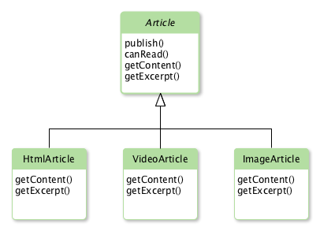

[Back to Interface Design Patterns for Script Includes][1]

## Introduction

The first interface design pattern for Script Includes that we will take a closer look at is the Class Pattern. The primary use case for this interface pattern is to leverage inheritance... or more properly prototypal inheritance. Prototypal inheritance will allow a Script Include to inherit behaviors from another. One example of this is Script Includes that inherit from AbstractAjaxProcessor to create Glide Ajax scripts but let's look at a custom application example.

## Problem Definition

We've been asked to build a custom Blog application for use by HR to communicate relevant news and events to employees. The requirements specify that there are 3 types of articles that HR wants to be able to publish: plain ol' HTML, video article, and an image gallery article for sharing those amazing company barbecues. While HTML articles will display a typical excerpt, the image gallery and video articles will display the video or first image in the gallery as their excerpt for a better user experience. In order to encapsulate all the behaviors of these articles in a common place, and for the convenience of this article, we have made the architectural decision to implement these behaviors in a set of Script Includes.

## Example Solution

<figure>
  
  <figcaption>
    Figure 1: Blog Application UML
  </figcaption>
</figure>

In Figure 1, you can see the UML Class Diagram showing the inheritance hierarchy for our Script Includes. The Article class will house our base logic, specifically the publish and canRead implementations, while the HTMLArticle, VideoArticle, and ImageArticle classes will inherit the base functions and override getContent and getExcerpt for their own specific implementations.

Let's take a look at how this works in the Script Includes:

### Article Script Include

```js
var Article = Class.create();
Article.prototype = {
    initialize: function(gr) {
        gs.print('Initialize Article');
    },

    publish: function() {
        gs.print('Great!  Now its published!');
    },

    canRead: function() {
        gs.print('Yes, you can read this if you are logged in');
    },

    getContent: function() {
        throw 'You must implement this in an inheriting class';
    },

    getExcerpt: function() {
        throw 'You must implement this in an inheriting class';
    },

    type: 'Article'
};
```

### Inheriting Script Includes

```js
// HTML Article Script Include
var HtmlArticle = Class.create();
HtmlArticle.prototype = Object.extendsObject(Article, {
    initialize: function(gr) {
        Article.prototype.initialize.call(this, gr);
        gs.print('Initialize HtmlArticle');
    },

    getContent: function() {
        gs.print('<h1>This is the HTML Article Content</h1>');
    },

    getExcerpt: function() {
        gs.print('<p>HTML Excerpt</p>');
    },

    type: 'HtmlArticle'
});

// Video Article Script Include
var VideoArticle = Class.create();
VideoArticle.prototype = Object.extendsObject(Article, {
    initialize: function(gr) {
        Article.prototype.initialize.call(this, gr);
        gs.print('Initialize VideoArticle');
    },

    getContent: function() {
        gs.print('Video: Just Push Play');
    },

    getExcerpt: function() {
        gs.print('Little Video Thumbnail: Just Push Play');
    },

    type: 'VideoArticle'
});

// Image Article Script Include
var ImageArticle = Class.create();
ImageArticle.prototype = Object.extendsObject(Article, {
    initialize: function(gr) {
        Article.prototype.initialize.call(this, gr);
        gs.print('Initialize ImageArticle');
    },

    getContent: function() {
        gs.print('Pretty Pictures!');
    },

    getExcerpt: function() {
        gs.print('Pretty Thumbnails!');
    },

    type: 'ImageArticle'
});
```

So lets take note of a few things:

1. The Article Base Class implements initialize, canRead, and publish functions but throws an error to force inheriting classes to override getContent and getExcerpt.
2. Inheriting classes call the Article base class initialize function. This is not explicitly required but can allow implementing a base initialize while adding additional behavior in inheriting classes.
3. Inheriting classes provide their own, overriding implementations for getContent and getExcerpt.

So now, when we try these out in a background script, we get the following output:

### Background Script

```js
new HtmlArticle().getContent();
gs.print('-------------------Next-------------------');
new VideoArticle().getContent();
gs.print('-------------------Next-------------------');
new ImageArticle().getContent();
```

### Output

```txt
*** Script: Initialize Article
*** Script: Initialize HtmlArticle
*** Script: <h1>This is the HTML Article Content</h1>
*** Script: -------------------Next-------------------
*** Script: Initialize Article
*** Script: Initialize VideoArticle
*** Script: Video: Just Push Play
*** Script: -------------------Next-------------------
*** Script: Initialize Article
*** Script: Initialize ImageArticle
*** Script: Pretty Pictures!
```

We can clearly see both the base class and inheriting classes in action. Each inheriting class is able to establish its own behaviors without having to duplicate the base class behaviors that are shared.

## Advantages

1. Allows inheriting behaviors with less code than a comparable approach using composition (which is required when not using prototypes)
2. Generally accepted as "faster" and having a lower memory footprint than closure based object approaches. This does warrant further discussion as it pertains to the ServiceNow platform specifically... another time.

## Disadvantages

1. Typically more verbose and is less clear about its properties and methods than other approaches
2. Is less effective at encapsulation and information hiding than closure approaches

[1]: /blog/interface-design-patterns-for-script-includes
