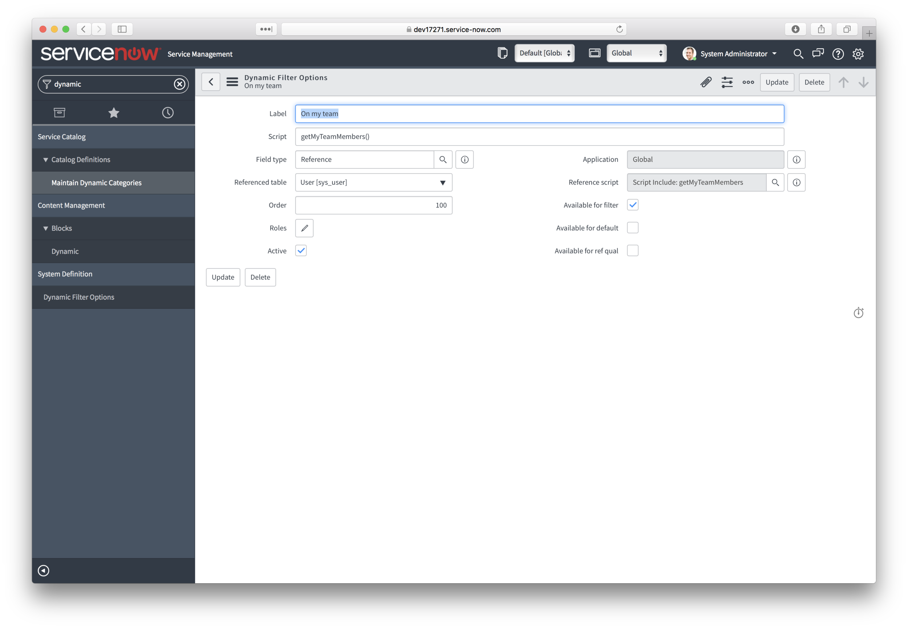

[Back to Interface Design Patterns for Script Includes][1]

## Introduction

The function pattern is the simplest but also the most flexible interface design pattern for Script Includes. It is the foundation for the Revealing Module Pattern and can be used as a constructor or factory function for any of the other interface types. As a factory function, this pattern can provide a Scoped App with a flexible internal API that can easily evolve as complexity increases. Today, the function may handle the behavior, tomorrow it can evolve into a factory that returns the object which in turn handles the behavior. That said, this pattern is best used for simple one off functions such as Scripted Filters or Dynamic Filter Options.

## Problem Definition

Department Managers want to be able to keep track of their team's IT requests and incidents but currently that means creating filters such as 'caller=jane,steve,bob,sue,etc' every time they want to see a report or list filtered to their team members. We have been asked to provide an easy filter criteria that they can use to save time when creating these report slices. To accomplish this, we are going to use a dynamic filter option.

## Example Solution

For our dynamic filter option, "On my team", we are going to create a Script Include which returns the currently logged in user's team members based on group assignment. Let's take a look at the Script include (**don't forget to mark it as Client Callable or it won't work**):

### Script Include: getMyTeamMembers

```js
var getMyTeamMembers = function() {
    var myGroups = gs.getUser().getMyGroups().toArray().join(','),
        gr = new GlideAggregate('sys_user_grmember'),
        myTeam = [];
    gr.addEncodedQuery('groupIN' + myGroups);
    gr.groupBy('user');
    gr.query();
    while (gr.next()) {
        myTeam.push(gr.user + '');
    }

    return myTeam;
};
```

The script uses GlideSystem (gs) to obtain the currently logged in user's assigned groups. Then, using a GlideAggregate (to filter duplicates), it queries the user's associated with those groups from the sys_user_grmember table and returns that list of users. Simple and straightforward.

Next we create the Dynamic Filter Option:

### Dynamic Filter Option

<figure>
  
  <figcaption>
    Figure 1: Dynamic Filter Option
  </figcaption>
</figure>

<figure>
  
  <figcaption>
    Figure 2: Using the Dynamic Filter Option
  </figcaption>
</figure>

As you can see in Figure 1, we give the filter option an easy to understand name, assign it to User Reference Fields, and provide our Script Include for the functionality. And in Figure 2, you can see the dynamic filter option in use. In this case, I find the Function Pattern is simpler than all the boilerplate required by the Class Pattern and the script field on the filter option is easier to read without the **new** keyword plus script include plus function name.

## Advantages

1. Reduces the amount of boilerplate from the [Class Pattern][2] in both the Script Include definition and implementation.
2. Makes the Script Include itself easier to read
3. Since a function can return any type in Javascript, this is one of the most flexible of all the interface patterns when used as a factory function.

## Disadvantages

1. The simplicity can end up masking the Script Include when used in other scripts. The **new** keyword can be viewed as a signal that says "Hey I'm a Script Include". This pattern has no such signal.
2. Care must be taken on the return value to maintain a consistent interface. Revealing Module Pattern is an iteration of the Function Pattern that attempts to solve this.

[1]: /blog/interface-design-patterns-for-script-includes
[2]: /blog/interface-design-patterns-class-pattern
