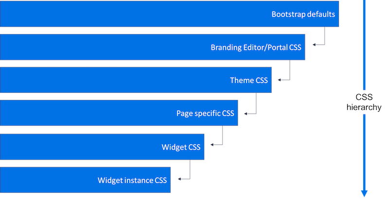

In my work on the *Getting Started with Service Portal* Guide, I decided to include some information on the order the CSS is processed but truth be told I wasn't 100% certain on it myself. Naturally I hit up the ServiceNow Docs and came across the following image:

<figure>
  
  <figcaption>
    Not Entirely Accurate Hierarchy of style application in the Service Portal
  </figcaption>
</figure>

Using that as a basis, I began writing an article on the process. But the more I wrote, the more I realized my experiences didn't line up with the documentation. There seemed to be so many caveats that I started to doubt the docs on this matter. So I scoured all the usual Service Portal haunts to try and find something that could account for my experiences. But most of what I found were slightly different versions of the same story.

So I put on my thinking cap and started to question the CSS Hierarchy chart and I realized that it ignores a fairly critical piece of information: Service Portal uses a SASS preprocessor, not just CSS. This would be irrelevant if Service Portal compiled a single minified CSS file as in many traditional front-end development build processes. But as I began to reverse engineer Service Portal's CSS process I realized that it generates multiple smaller CSS blobs, many of which are embedded in \<style\> tags in the header.

It turns out that our simple CSS hierarchy is actually a two stage process which if not understood and carefully honored can yield some downright weird results. Let's tackle this the same way I did, by working backwards:

## Stage 2: Output CSS to the HTML Header

At the end of the process, the \<style\> tags are rendered out to the final HTML page. To understand this better, we can easily use our Web Inspector to identify the CSS that is rendered. I added a single class based declaration to each of the major locations for CSS in Service Portal where each class was named for the record on which it appeared:

- .portal-css: Portal CSS variable field
- .theme-css: Theme CSS variable field
- .page-css: The Page Specific CSS field
- .include-css: Style Sheet CSS on a Theme via CSS Includes
- .widget-css: The Widget CSS - SCSS field
- .instance-css: The Widget Instance CSS field

By reviewing the output in the Web Inspector, I identified that the Portal and Theme styles were all over the place (more on this in a moment) but the others were ordered consistently. Here is the overall order that the CSS blobs appear in the final HTML from top to bottom (highest precedence therefore is bottom to top due to the cascading nature of CSS):

1. ServiceNow Specific StyleSheet (oddly called CSS Includes)
2. Generated Bootstrap CSS
3. Patch
4. CSS Include's Style Sheet record's CSS
5. Font-Awesome
6. Page record's CSS
7. Alternating Sequence of:
  - Widget record's CSS
  - Widget's Instance records' Stylesheets

But wait, what happened to the Portal and Theme CSS output? Well, those are officially CSS **Variable** fields... or more accurately **SASS Variable** fields. Which leads us to the first step in the process:

## Stage 1: SCSS Build Pipeline

Roughly half of the CSS blobs above are built from SCSS with Portal, Theme, and Bootstrap / ServiceNow SCSS Variables injected in. Each of those blobs is processed individually which looks something like this:

```SCSS
/* Portal CSS Variables */
$portal-scss: #fff;

/* Theme CSS Variables */
$theme-scss: #ddd;

/* Bootstrap / ServiceNow CSS Variables */
$bootstrap-scss: #000 !default;

/* CSS Field / Stylesheet to be processed */
.page-css {
  color: #fff;
}
```

The build pipeline basically creates a concatenated file composed of:

- Portal CSS Variables field
- Theme CSS Variables field
- Bootstrap / ServiceNow CSS Variable sheet
- Whatever final page is being built

This concatenated file build process is used for each of the following files and fields:

**Only one file**

- Bootstrap

**One File Per Record**

- CSS Include
- Page
- Widget
- Widget Instance

Now, this has **massive** implications for Portal and Theme CSS Variable Fields. Any style declarations (CSS selectors, not variables) in Portal or Theme CSS Variable fields will be duplicated for each style tag rendered in this build process.

And that royally jacks up the nice pretty CSS Hierarchy diagram above.

## More Complexities

Now, if all that wasn't enough to make your head spin, let's pile on a little. All of this CSS Hierarchy business is further mucked up by the fact that source order isn't even the most important factor in the **cascading** nature of style sheets. We can't simply say that because one style tag comes last, it takes precedence and overwrites other styles. That's not how this works. That's not how **any** of this works.

CSS cascades according to multiple criteria in the following precedence order:

1. Importance
2. Specificity
3. Source Order

That said, understanding the sequence of the style sheets in Service Portal **is** still an important piece of the equation. All else being equal, source order is the final decision maker.

## Conclusion

Woop de doo, what does it all mean Basil? Here's what you really want. There are two things we need to understand: the final sequence of the CSS sheets and the sequence of the SCSS sheets in the build process.

### Final CSS Sequence

1. ServiceNow Specific StyleSheet (oddly called CSS Includes)
2. Generated Bootstrap CSS
  - Including Portal and Theme records' CSS at the top of this blob
3. Patch
4. Each CSS Include's Style Sheet record's CSS
  - Including Portal and Theme records' CSS at the top of each blob
5. Font-Awesome
6. Page record's CSS
  - Including Portal and Theme records' CSS at the top of this blob
13. Alternating Sequence of:
  - Each Widget record's CSS
      - Including Portal and Theme record CSS at the top of each blob
  - Each Widget's Instance records' Stylesheets
      - Including Portal and Theme record CSS at the top of each blob

You'll notice the repetition of the Portal and Theme CSS throughout the final sequence. This is dependent on whether or not any CSS styles are declared in those variable fields. This is why you should likely steer clear of CSS styles in the Theme and Portal records, it eliminates their duplication, simplifies the final output, and makes the cascading more predictable.

### SCSS Build Order

1. Portal CSS Variable field
2. Theme CSS Variable field
3. Bootstrap / ServiceNow CSS Variables
4. Bootstrap / CSS Include / Page / Widget / Widget Instance

This is important to note since SCSS variables **will** override unless the **!default** flag is appended to the end of the variable. Due to this, you will likely want all of your Theme variables to be !default since you will likely want to vary your theme on a portal by portal basis.

Also of note, variables in CSS Includes, Pages, Widgets, and Widget Instances are not processed with one another. Stated another way, Widget Instances can not use Widget SCSS Variables. Anything on the 4th bullet of the build order has no knowledge each other.

### Final Word

So as a quick summary, the following image is an approximation of what actually happens in the CSS build and output process:

<figure>
  
  <figcaption>
    Service Portal SASS - CSS Build Process
  </figcaption>
</figure>

Which leaves us with a few takeaways:

1. Avoid using CSS styles in Portal and Theme records (use variables only)
2. Use **!default** on variables in the Theme record in Kingston and later
3. Understand the **Final CSS Sequence** and the **SASS Build Process** pictured above to determine the source order of cascading rules
4. Don't forget that CSS Specificity and **!important** can ignore source order
