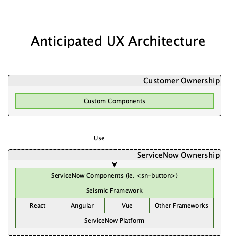
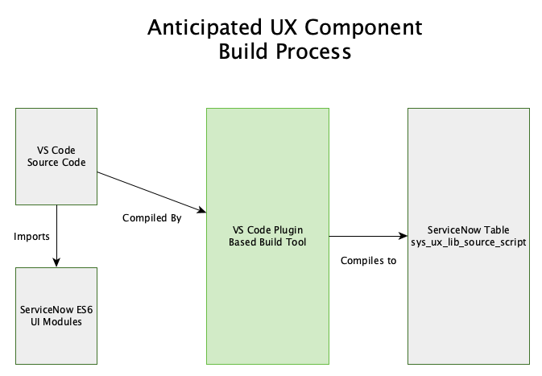

  <iframe src="//www.youtube.com/embed/EJcGhTMQShk?wmode=opaque&amp;enablejsapi=1" height="480" width="854" scrolling="no" frameborder="0" allowfullscreen="">
  </iframe>

The alternate working title of this article was *Jace Was Right*. In case you missed it over the weekend, I posted the video above to youtube covering the new UX system that powers ServiceNow Workspaces. And according to reliable information, this system will be eventually taking over most, if not all, of the web UI's at ServiceNow including Service Portal. While there is a good chance that Service Portal will still be the primary choice for new end user interfaces for at least the next year, it's worth exploring what this new UX system promises for the future.

With that in mind, I'd like to answer some of the common questions that I've been asked about this framework. Keep in mind, there isn't any documentation yet and so everything in this article is speculative based on my own research into the framework's code, construction, and a number of conversations.

## Can I use React (Vue, Angular, etc)?

Technically, yes **but** this is not likely the intended use. In my video, I hack a React component into the system and that is exactly how it should be considered... a hack. In reality, it appears that Seismic will expose a proprietary ServiceNow component system that operates using [Web Components][1] as opposed to any specific JS framework.

<figure>
  
  <figcaption>
    Anticipated UX Architecture
  </figcaption>
</figure>

The above image shows what I anticipate the UX architecture to be from a code standpoint. The proprietary component system appears to use JSX as the templating language and definitely seems inspired by React and Redux in many ways. But we will likely be encouraged to embed ServiceNow native components via custom elements such as sn-button, sn-table, and sn-form as opposed to hand crafting everything ourselves. Likewise, these components appear to be able to leverage ServiceNow exposed behaviors. In this way, ServiceNow could rewrite sn-button from a React component to a Vue component and our code would still work without an issue.

In that way, ServiceNow will leverage various technologies under the hood of Seismic. We as customers I anticipate will leverage Seismic, not any other UI framework. So brush up on your JSX but anticipate leaving React at home!

## How will we build these components?

It looks like we are going to get access to some sort of VS Code plugin with an embedded build tool. This will let us write components with an ES6 syntax using JSX providing a familiar modern UI development experience.

<figure>
  
  <figcaption>
    Anticipated UX Component Build Process
  </figcaption>
</figure>

This is quite a shift from the current Service Portal in browser experience but for experienced UI developers will likely be a seamless transition. On the other hand, many buisness crossover folks who are used to the everything in ServiceNow approach might have a bit of a learning curve.

Ultimately, [Create React App][2] should give you a decent idea of what the experience could feel like if you need to calm your nerves. If you are comfortable waiting patiently, I expect we'll have a much better idea by the time Knowledge 20 rolls around.

## Is it ready?

It doesn't appear so. It looks like Service Portal should still be the primary go to for end use interfaces at least for the next year, maybe two by my estimate. I would expect a similar roll out as Service Portal as well. We'll get a Helsinki "there but not there release". We'll get a Geneva "WHy did I get myself into this release". And then we'll get the "I can't believe I ever lived without this" release. To be honest, if ServiceNow waits until it's perfect to release it and skips the first two pain releases... I will be sad and disappointed. They have been doing quite a bit different recently, so we will see.

Overall though, the initial rollout appears to be through Workspaces which are deisgned for fulfiller and internal users. Then the system will likely expand from there.

## Where is the source code of your component?

Right, I did say I would give access to that didn't I. Again, keep in mind we won't likely be using React directly so this is just a hacked example. But if you want to take a look at my component's source code, you can download them here:

<a href="downloads/Source Script.jsx" download>Source Code</a>

<a href="downloads/Compiled Script.js" download>Babel Compiled Code</a>

The source code is the script the ES6 module that I created, adapted from the Create React App. Once it was ready, I used BabelJS as a manual build process to create the compiled code. The compiled code, plus the function wrapper is what I injected into the ServiceNow UX Source Code table.

## Conclusion

Overall, I think this system is very promising for the future of UI on ServiceNow. I love that fulfiller and requester UI's could potentially have a common component base. I also love the future proofing that Seismic appears to offer by acting as an abstraction layer over other technologies like React. The only thing I don't like is that it isn't 100% ready yet. It's hard to want to invest in Service Portal at this point knowing that something with a brighter future is right around the corner.

[1]: https://developer.mozilla.org/en-US/docs/Web/Web_Components
[2]: https://github.com/facebook/create-react-app