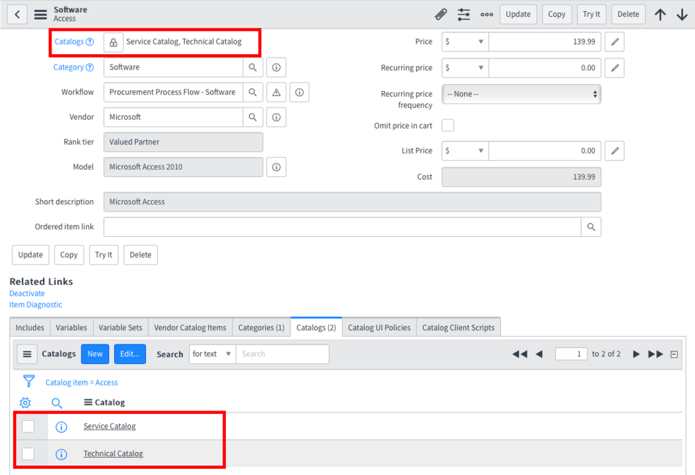

Previously, I talked about [Nested GlideRecords][1] in scripts and the performance impact they can have on your applications. Being able to identify these miscreants is great but we really need to get them out of any mission critical scripts where they are slowing down response times. Here are a couple strategies to kick those GlideRecords out of the nest and to teach them to fly.

## 1. Array Flattened GlideRecord

Normally, in a Nested GlideRecord, you run a GlideRecord query for each record in the result of the first GlideRecord. Often times, the simplest way out is to simply collect a list of the queryable criteria (sys_id or other key like field) and use it as part of an **IN** criteria within a second GlideRecord query **outside** of the first. I used this technique in the last article as seen in the below example:

```js
var users = [];

var count = new GlideAggregate('sys_user');
count.addQuery('email', '!=', '');
count.groupBy('email');
count.addAggregate('COUNT');
count.query();
while (count.next()) {
  if ((count.getAggregate('COUNT') * 1) > 0) {
      users.push(count.email + '');
  }
}

var user = new GlideRecord('sys_user');
var prevUser = '';
user.addQuery('email', 'IN', users.join(','));
user.orderBy('email');
user.query();
while (user.next()) {
  if (prevUser == user.email + '') {
    gs.print(user.email);
  }
  // Else, skip the original user
  prevUser = user.email + '';
}
```

Notice the use of the **users** array to collect a list of email addresses. That list is then applied to the second **user**  query with an **IN** criteria. In this way, we compress many smaller queries into a single query containing all the criteria.

**When to Use:** Use this approach when two GlideRecord queries are being explicitly called in the nested pattern and changing the data model is too risky.

**When to Avoid:** Whenever you can use any other method. Seriously, this method creates longer code that is harder to understand. You're basically creating a database JOIN in application logic.

## 2. Copy Data To The Queried Record

With this strategy, you create Business Rules to copy a frequently queried field from its original table (source) to the frequently queried table (destination). The destination table in this case acts as a cache for the source data. One example of this is the Catalogs field on the Catalog Item table. Did you ever notice that the Related List called Catalogs is kept in sync with the GlideList field called Catalogs:

<figure>
  
  <figcaption>
    ServiceNow Catalogs Kept In Sync
  </figcaption>
</figure>

With only the Related List, it would take at least two queries to get all the Catalog Items in a given Category. In a worst case, it would take one query on the Catalog related list and then one additional one to dot-walk the Catalog Item data. With the GlideList, we can perform a single query directly on the Catalog Item table.

The tradeoff here is that we are trading "write operation" performance for "read operation" performance. That is, we add business rules on Insert and Update to sync the field to the Related List and vice versa. Insert and Update will take a little longer but reading the data requires fewer queries.

**When to Use:** Definitely consider this instead of GlideRecord queries in ACLs! Also quite useful for aggregating data such as the Update Count field on tasks. Sometimes useful instead of dot-walking when dealing with related lists whose data is frequently queried with the parent record.

**When to Avoid:** Avoid this strategy in most circumstances when dot-walking a record, especially if many fields are required from the dot-walked reference. There is still a better tool for this.

## 3. Create Database Views

An often asked question in the ServiceNow Community is "how do I perform a Database Join with GlideRecord?" Well, you don't. You create [Database Views][2]. Database Views in ServiceNow allow you to effectively merge related records from multiple tables into a single queryable source. Here's an example:

```js
var gr = new GlideRecord('incident');
gr.setLimit(10);
gr.query();
while (gr.next()) {
  var callerNum = gr.caller.phone_number + '';
}
```

In the above script, that dot-walk to the caller's phone number field is going to cost us. In this case, it will cost us an extra 10 queries, one for each record found in the orginal query (notice the setLimit). With a Database View, we can merge Incident record fields to their related User's by the Caller field:

```js
var gr = new GlideRecord('incident_caller');
gr.setLimit(10);
gr.query();
while (gr.next()) {
  var callerNum = gr.cl_phone_number + '';
}
```

Now, notice in the above script that we query **incident_caller** instead of **incident**. Creating a Database View creates a sort of virtual table in ServiceNow which you can query with GlideRecord and it can contain fields from any of the joined tables. In this case, we are assuming the view was created as a join between Incident and Caller with the relevant Caller Phone Number field on the view. Now that we have a true database JOIN, this script will only take 1 query compared to the previous script's 10.

Keep in mind that even with Database views you can run into performance problems on larger tables (I'm looking at you Task). Be sure to add appropriate indexes to speed up your view.

**When to Use:** Whenever dot-walking from one table to another within a GlideRecord loop is causing performance issues, particularly in CMS or ServicePortal. The farther you dot-walk from the root record, the more likely you are to encounter this issue. Also consider this approach in any of the previous scenarios where you will frequently use the fields in the presented view.

**When to Avoid:** When the Database View would not contribute significantly to critical performance issues and when the Database View is not part of regular query patterns. In other words, avoid this approach for one off scripts.

## Bonus: Avoid Only Indexing

When met with database performance issues we have a habit of just throwing an index at it. And yes, indexes are a great tool but designing efficient data access patterns (avoiding Nested GlideRecords in this case) should be the first step in solving (and ideally preventing) database related performance issues.

[1]: /blog/nested-gliderecords-are-killing-your-app-performance
[2]: http://wiki.servicenow.com/index.php?title=Database_Views#gsc.tab=0
