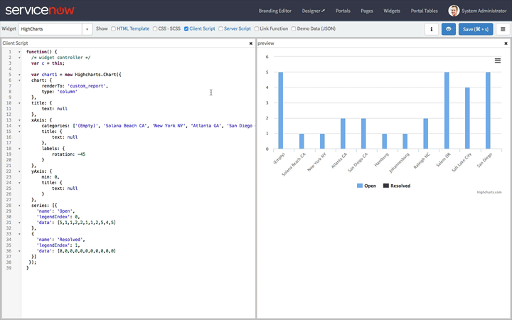

**WARNING:** The use of HighCharts in this way may require the purchase of an additional license from Highsoft. Use in production at your own risk.

**Read the Whole Series:**

1.  [Intro to HighCharts in Service Portal][1]
2.  Configuring HighCharts in Service Portal (This Post)
3.  [Generate HighChart Data in a Widget Server Script][2]
4.  [Making the HighChart Widget Reusable][3]

[Download the Widget][4]

---

One of the greatest points of confusion from some of my previous articles on HighCharts stems from a lack of understanding of the HighCharts API and in particular the HighCharts configuration options object. So before I dive any further into the deep end on HighCharts and Service Portal, it's worth taking a moment to explore some things we can do with the HighCharts configuration options object.

You can find a deeper dive on the HighCharts API in the [HighCharts Docs][5] but we will take a look at some of the basics in this article through the lens of Service Portal. If you haven't already read it, I recommend starting with [Intro to HighCharts in Service Portal][6] since I will be picking up with the Widget created in that article.

---

## The Widget Client Script

```js
function() {
  /* widget controller */
  var c = this;

  var chart1 = new Highcharts.Chart({  
    chart: {  
        renderTo: 'custom_report',  
        type: 'column'  
    },  
    title: {  
        text: null  
    },  
    xAxis: {  
        categories: ['(Empty)', 'Solana Beach CA', 'New York NY', 'Atlanta GA', 'San Diego CA', 'Hamburg', 'Johannesburg', 'Raleigh NC', 'Salem OR', 'Salt Lake City', 'San Diego'],  
        title: {  
            text: null  
        },  
        labels: {  
            rotation: -45  
        }  
    },  
    yAxis: {  
        min: 0,  
        title: {  
            text: null  
        }  
    },  
    series: [{
        'name': 'Open',
        'legendIndex': 0,
        'data': [5,1,1,2,2,1,1,2,5,4,5]
    },
    {
        'name': 'Resolved',
        'legendIndex': 1,
        'data': [0,0,0,0,0,0,0,0,0,0,0]            
    }]  
  });  
}
```

I've copied the Widget's client script here for convenience. On close inspection, you will notice that nearly the entire script can be boiled down to:

```js
var chart1 = new Highcharts.Chart(configurationOptions)
```

And when you put it that way, it is impressive just how much we can accomplish with so little effort thanks to HighCharts. As long as you know how to initialize the configuration options object, you can make almost any chart that you can imagine. Conveniently, nearly every chart can be broken down into just a few required properties and if you are familiar with Excel charting, many of these terms will be familiar:

---

## Chart Object

The chart in the script above contains the properties renderTo and type. This object specifies general chart options and options regarding the plot area itself. The bare minimum we need to specify are:

* **renderTo:** The element ID or element to which we will render the chart
* **type:** The type of chart (line, area, bar, column, pie, etc) to render in the plot area

<figure>
  
  <figcaption>
    Changing the Chart Type in the Service Portal Widget
  </figcaption>
</figure>

Clearly the fun option here is the chart type. You can see me changing nothing but the chart type in the above animation and getting immediate results. It's important to note that some chart types require very specific configurations for the data series (think pie charts, scatter plots, box plots, etc) but many of the most common charts are completely interchangeable.

---

## xAxis Object

The xAxis object describes attributes about the horizontal axis on most chart types. In my object, I have removed the title and rotated the labels a little bit to make things easier to read at smaller sizes but the most important attribute on this object is the categories array. As you can see, the categories array is just an array of strings that represent the categories that line the bottom of the chart (or the vertical axis in the case of the bar chart). This makes the object very easy to build from a GlideRecord or other server script.

Go ahead and change the string values in the array and save your Widget. The real time updates in the Widget Preview really help you explore the capabilities of this object.

On thing to note, is that the categories array and the data array in each series object should be the same size for all of the charts that we have shown. That is, each category should have a data point for each series... otherwise the chart may not display as expected.

---

## yAxis Object

In the charts we are looking at, the yAxis is decidedly boring. The only thing we are doing is removing the title (they just seem distracting for our current purposes) and setting the minimum value to 0 in order to establish the scale. Without that minimum value, the chart may choose a negative number, a decimal, or some other odd amount that makes no sense for the given chart.

There are plenty of other configuration options to toy with and you can even set categories on the yAxis but we're here to cover the basics.

---

## Series Object

<figure>
  
  <figcaption>
    Changing HighChart Series Data
  </figcaption>
</figure>

Now for the bread and butter of the charts: the series object. A series is represented on the chart as a line, collection of bars, collection of columns... ie. the visualization. You can plot multiple series on a chart to get grouped and stacked bars and lines as well. In the code, the series object is actually an array of series objects (to support multiple series of course). Each series object specifies:

* **name:** The name of the series displayed in the legend (Open and Resolved in the above)
* **legendIndex:** The number of the order the series appears in
* **data:** An array of data values, one for each category

In the above screencast, you can see me changing the values of both series. After adjusting the first series data by multiplying each value by 10, the chart doesn't change much except for the yAxis automatically adjusting the scale. The changes to the second series (originally all 0's) is much more interesting since you can see the Resolved series jump from the baseline to the new values.

---

## Final Thoughts

The few objects and properties we discussed in this article are just a small taste of the capabilities of HighCharts. You can check out the full [API reference][7] for more info. But with just the few options we discussed here, you should be able to construct a wide array of charts that you can use in the Service Portal. With these basics out of the way, now we can start having fun.

[1]: /blog/intro-to-highcharts-in-service-portal
[2]: /blog/generate-highchart-data-in-a-widget-server-script
[3]: /blog/making-the-highchart-widget-reusable
[4]: /downloads/HighCharts+Widget.zip
[5]: http://www.highcharts.com/docs
[6]: /blog/intro-to-highcharts-in-service-portal
[7]: http://api.highcharts.com/highcharts/
