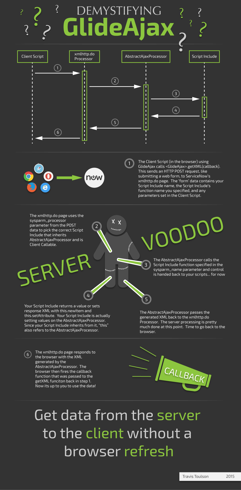

Let's face it, unless you're a web developer who has been on the AJAX bandwagon for a while, GlideAjax can be downright confusing. At best, it is often a mystical voodoo incantation, sure you can say the words but your just one "Klaatu verata necktie" away from unleashing a horde of undead code that will leave you wanting to unload a fist full of boomstick on your computer. With that in mind, I have put together the infographic below to illuminate your path, equip you for the debugging battles ahead, and return you to your time. Or return to you, your time. Whichever.

<figure>
  
  <figcaption>
    Demystifying GlideAjax
  </figcaption>
</figure>
