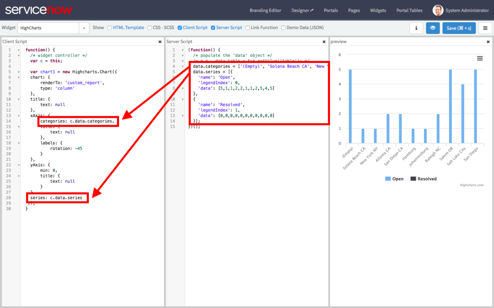
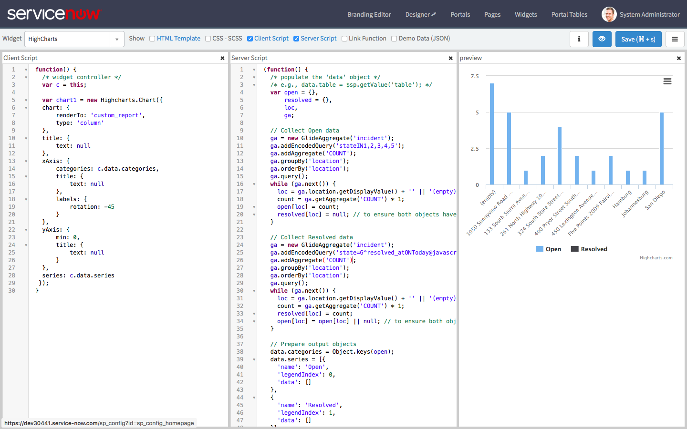

**WARNING:** The use of HighCharts in this way may require the purchase of an additional license from Highsoft. Use in production at your own risk.

**Read the Whole Series:**

1.  [Intro to HighCharts in Service Portal][1]
2.  [Configuring HighCharts in Service Portal][2]
3.  Generate HighChart Data in a Widget Server Script (This Post)
4.  [Making the HighChart Widget Reusable][3]

[Download the Widget][4]

---

Up until now, we've only dealt with custom charts using HighCharts with hardcoded data. The next step in creating a custom chart is to report on actual ServiceNow data by wiring up GlideRecord queries in the server script to the HighCharts configuration object in the client script. At this risk of repeating myself too often, Service Portal makes this much easier compared to the UI Page approach. I will be using the widget created in [Intro to HighCharts in Service Portal][5] as a base again. Let's take a look:

---

## Step 1: Replace hardcoded data with Server data object

In the UI Page approach, we had to perform some JSON encoding and decoding to properly transfer data from the server side \<g:evaluate\> to the client side \<script\>. Service Portal, though, provides the **data** object which handles the JSON transmission from server to client for us. Our first step is to move the HighCharts **categories** array and the **series** array from the hardcoded client side values to the server data.

<figure>
  
  <figcaption>
    Hardcoded Values should move to the Server Script
  </figcaption>
</figure>

In the above image, notice that i have replaced the categories and series objects with c.data properties and added the original hardcoded values to the server script as properties of the data object. The result is the same whether the values are hardcoded client side or server side, which means now we can build the categories and series objects using GlideRecord.

---

## Step 2: Dynamically generate server data

Previously, I used an approach that micromanaged a category array and an array for each series of data. Essentially, I merged the data collection and data transform steps into a single procedural mess. This time, I am going to separate collection and transform processes to make the scripts a little more manageable.

For the new process, I am going to use one collection object for each data series which will act as a simple map from x values to y values for the data series (think something like **(empty) = 5, Solana Beach CA = 1, New York NY = 1, etc**). This data will be collected using a GlideAggregate but could also be accomplished with a GlideRecord. Then, I will convert the collection object into the required categories and series arrays in a transform step. So this is the basic outline of the process:

1.  Collect values from GlideAggregate
2.  Prepare data output objects
3.  Transform collection objects into data output category and series arrays

Since I want to keep both Open and Resolved data series, I will need two GlideAggregates by grouped by location (the x axis), one for each series. Here are the relevant pieces of code:

**Collect Values from GlideAggregate**

```js
var open = {},
        resolved = {},
        loc,
        ga;

// Collect Open data
ga = new GlideAggregate('incident');
ga.addEncodedQuery('stateIN1,2,3,4,5');
ga.addAggregate('COUNT');  
ga.groupBy('location');  
ga.orderBy('location');  
ga.query();
while (ga.next()) {
    loc = ga.location.getDisplayValue() + '' || '(empty)';
    count = ga.getAggregate('COUNT') * 1;
    open[loc] = count;
    resolved[loc] = null; // to ensure both objects have the same x axis values
}

// Collect Resolved data
ga = new GlideAggregate('incident');
ga.addEncodedQuery('state=6^resolved_atONToday@javascript:gs.daysAgoStart(0)@javascript:gs.daysAgoEnd(0)');
ga.addAggregate('COUNT');  
ga.groupBy('location');  
ga.orderBy('location');  
ga.query();
while (ga.next()) {
    loc = ga.location.getDisplayValue() + '' || '(empty)';
    count = ga.getAggregate('COUNT') * 1;
    resolved[loc] = count;
    open[loc] = open[loc] || null; // to ensure both objects have the same x axis values
}
```

**Prepare Data Output Objects**

```js
// Prepare output objects
data.categories = Object.keys(open);
data.series = [{
    'name': 'Open',
    'legendIndex': 0,
    'data': []
},
{
    'name': 'Resolved',
    'legendIndex': 1,
    'data': []
}]
```

**Transform collection objects into data output category and series arrays**

```js
// Transform collected objects into data arrays
data.categories.forEach(function(it) {
    data.series[0].data.push(open[it]);
    data.series[1].data.push(resolved[it]);
});
```

---

## Conclusion

<figure>
  
  <figcaption>
    Final HighChart Widget with Server Data
  </figcaption>
</figure>

With our new server script in place, we can now see a chart in the preview that is actually leveraging real data in our instance! It can definitely stand some cleaning up particularly on the y-axis increments (unless we can count half an incident) but those are smaller details we can easily achieve in the client script HighChart options.

The cool part here is that we are definitely not limited to just using GlideRecord or GlideAggregate to make calculations like we are with native reports. We can use web services or other data collection methods, run advanced calculations, and derive complex metrics for plotting on this chart. It's all just a matter of tweaking the server script to suit your purposes.

So here are the final widget scripts so you can play with this in your own instance (don't forget the HighChart dependencies from [Intro to HighCharts in Service Portal][6]:

**HTML**

```html
<div id="custom_report"></div>
```

**Client Script**

```js
function() {
  /* widget controller */
  var c = this;

    var chart1 = new Highcharts.Chart({  
  chart: {  
      renderTo: 'custom_report',  
      type: 'column'  
  },  
  title: {  
      text: null  
  },  
  xAxis: {  
      categories: c.data.categories,  
      title: {  
          text: null  
      },  
      labels: {  
          rotation: -45  
      }  
  },  
  yAxis: {  
      min: 0,  
      title: {  
          text: null  
      }  
  },  
  series: c.data.series  
 });  
}
```

**Server Script**

```js
(function() {
  /* populate the 'data' object */
  /* e.g., data.table = $sp.getValue('table'); */
  var open = {},
          resolved = {},
          loc,
          ga;

  // Collect Open data
  ga = new GlideAggregate('incident');
  ga.addEncodedQuery('stateIN1,2,3,4,5');
  ga.addAggregate('COUNT');  
  ga.groupBy('location');  
  ga.orderBy('location');  
  ga.query();
  while (ga.next()) {
      loc = ga.location.getDisplayValue() + '' || '(empty)';
      count = ga.getAggregate('COUNT') * 1;
      open[loc] = count;
      resolved[loc] = null; // to ensure both objects have the same x axis values
  }

  // Collect Resolved data
  ga = new GlideAggregate('incident');
  ga.addEncodedQuery('state=6^resolved_atONToday@javascript:gs.daysAgoStart(0)@javascript:gs.daysAgoEnd(0)');
  ga.addAggregate('COUNT');  
  ga.groupBy('location');  
  ga.orderBy('location');  
  ga.query();
  while (ga.next()) {
      loc = ga.location.getDisplayValue() + '' || '(empty)';
      count = ga.getAggregate('COUNT') * 1;
      resolved[loc] = count;
      open[loc] = open[loc] || null; // to ensure both objects have the same x axis values
  }

  // Prepare output objects
  data.categories = Object.keys(open);
  data.series = [{
      'name': 'Open',
      'legendIndex': 0,
      'data': []
  },
  {
      'name': 'Resolved',
      'legendIndex': 1,
      'data': []
  }]

  // Transform collected objects into data arrays
  data.categories.forEach(function(it) {
      data.series[0].data.push(open[it]);
      data.series[1].data.push(resolved[it]);
  });
})();
```

[1]: /blog/intro-to-highcharts-in-service-portal
[2]: /blog/configuring-highcharts-in-service-portal
[3]: /blog/making-the-highchart-widget-reusable
[4]: /downloads/HighCharts+Widget.zip
[5]: /blog/intro-to-highcharts-in-service-portal
[6]: /blog/intro-to-highcharts-in-service-portal
