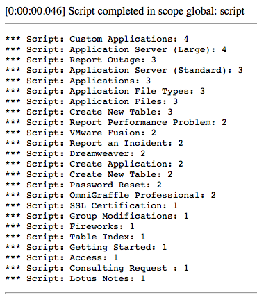

After posting last week's [GlideRecord Full Text Search][1] article using *123TEXTQUERY321*, [Jeff Pierce][2] reached out and reminded me of a better way of doing it using *IR_AND_OR_QUERY*. So special thanks to him for helping to clear this up!

I have since updated my previous article to this approach but I wanted to take a moment to dive into the multiple methods of Full Text Search and their differences.

## IR_AND_QUERY

<figure>
  
  <figcaption>
    IR_AND_QUERY Results
  </figcaption>
</figure>

Behind the scenes, the method previously demonstrated (*123TEXTQUERY321*) behaves in the same way as using *IR_AND_QUERY*. If we use similar code to last time, replacing only the search method, we will yield the same Catalog Item results in our query. The change in the script below can be seen on line 2, for example, using *IR_AND_QUERY* instead of *123TEXTQUERY321.* There is no difference between the below script and last week's script (aside from the title field no longer being weighted to 100).

```js
var gr = new GlideRecord('sc_cat_item');
gr.addQuery('IR_AND_QUERY', 'Application');
gr.query();

while (gr.next()) {
  gs.print(gr.name + ': ' + gr.ir_query_score);
}
```

So what's the problem? Well instead of searching for the text *Application*, let's assume a user enters *Test Application* instead. No sense in a screenshot, there aren't any results in my instance. But wait! Why wouldn't the *Custom Application* Catalog Item show up in a search for *Test Application*? Surely there is some relevance!

A record has to match all search terms to be considered relevant for both 123TEXTQUERY321 and IR_AND_QUERY.

<aside class="ccPullQuote right w-50">
  <p>A record has to match all search terms to be considered relevant for both 123TEXTQUERY321 and IR_AND_QUERY.</p>
</aside>

In this case though, that isn't how *IR_AND_QUERY* works. This query method will join the search terms with an *AND* conjunction. In other words, in this case it will search for Catalog Items with *Test AND Application* in the searchable text. A record has to match all search terms to be considered relevant for both *123TEXTQUERY321* and *IR_AND_QUERY*. And that's exactly why this method is often not the best, there are simply too many scenarios that won't match any records.

## IR_OR_QUERY

The *IR_OR_QUERY* search method on the other hand will perform an OR conjunction on the search terms. By that, I mean that a search text of *Test Application* will in actuality search for *Test OR Application*. Any record containing either word in its searchable fields will be considered a relevant hit.

```js
var gr = new GlideRecord('sc_cat_item');
gr.addQuery('IR_OR_QUERY', 'Test Application');
gr.query();

while (gr.next()) {
  gs.print(gr.name + ': ' + gr.ir_query_score);
}
```

When we execute the above code (changes on line 2) we can see results that are similar to our original search for the term *Application*. This is fantastic! Now multiple search terms will no longer eliminate an entire list of potential hits as is the case with the previous search methods.

Any record containing either word in its searchable fields will be considered a relevant hit \[for IR_OR_QUERY\].

<aside class="ccPullQuote right w-50">
  <p>Any record containing either word in its searchable fields will be considered a relevant hit \[for IR_OR_QUERY\].</p>
</aside>

But there is still a flaw. If I have two Catalog Items, *Test Application* and *Custom Application*, and I run a search for *Test Application* using *IR_OR_QUERY*, which would you expect to rank higher? *Test Application* at face value seems the more relevant... it's an exact match for heaven's sake! But thanks to *IR_OR_QUERY*, its possible that *Test Application* may not even rank near the top depending on the search terms discovered in the body. As few as 3 appearances of the term *Application* will offset the a match of all terms. Its two (different) matched terms vs 3 (same) matched terms and the *IR_OR_QUERY* doesn't care about how many of the original terms were matched the way *IR_AND_QUERY* does.

## IR_AND_OR_QUERY

In most cases, we would want to give deference to exact matches or content that matches all search terms. If a user searches for *Dell XPS Computer*, we would hope for a Dell XPS computer to rank more highly than a knowledge article that says *computer* a lot. This is where *IR_AND_OR_QUERY* comes into play. The *IR_AND_OR_QUERY* executes according to its name:

1. Execute *IR_AND_QUERY*
2. Check number of results against glide.ts.query.and_or_limit property or text_search_and_or_limit table attribute
3. If # of results is greater
    1. Return results
4. If # of results is less than
    1. Execute *IR_OR_QUERY* and return results

*IR_AND_OR_QUERY* is often the best choice for full text search.

<aside class="ccPullQuote right w-50">
  <p>IR_AND_OR_QUERY is often the best choice for full text search.</p>
</aside>

With this process, *IR_AND_OR_QUERY* can attempt to defer to results that match all search terms but in the event that not enough are found, it can fallback to a sensible *IR_OR_QUERY*. For this reason, the *IR_AND_OR_QUERY* is often the best choice for full text search.

```js
var gr = new GlideRecord('sc_cat_item');
gr.addQuery('IR_AND_OR_QUERY', 'Server Application');
gr.query();

while (gr.next()) {
  gs.print(gr.name + ': ' + gr.ir_query_score);
}
```

But the more important lesson to learn here is don't trust your memory, notes from years ago, or things you read on the internet.

[1]: /blog/how-to-do-full-text-search-with-gliderecord
[2]: https://www.linkedin.com/in/jeffpiercecms/
