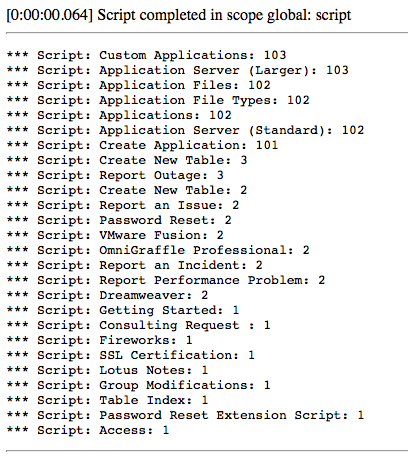

**UPDATE:** After posting this article, Jeff Pierce reminded me of a better way than the original 123TEXTQUERY321 approach. I have since updated the scripts and article here and provided a deeper explanation in [another article][1].

---

When looking at the form filters in ServiceNow, I think all admins and developers reach a point where we start to wonder "How do I search Keywords in my scripts?" After all, that full text search using "for text" or the "Keywords" filter is so tantalizing for any custom CMS / Service Portal search feature.

<figure>
  
  <figcaption>
    Zing Text Search on ServiceNow Form
  </figcaption>
</figure>

For those unaware, this global / full text search capability is powered by [Zing][2] in ServiceNow and it can easily fly under your radar as I realized recently when perusing some comments in the Now community. After all, the encoded query is actually a little misleading: **GOTO123TEXTQUERY321=\*@example.com**. After some experimenting, research, or reverse engineering, you will likely discover that the GOTO part is completely unnecessary but otherwise this full text search is completely accessible through GlideRecord directly (scripts updated to use the IR_AND_OR_QUERY instead of the 123TEXTQUERY321):

```js
var gr = new GlideRecord('sc_cat_item');
gr.addQuery('IR_AND_OR_QUERY', 'Application');
gr.query();

while (gr.next()) {
  gs.print(gr.name + ': ' + gr.ir_query_score);
}
```

In the above script, you will notice 2 things:

1. I am searching the field "IR_AND_OR_QUERY"
2. An additional field is added to the resulting GlideRecord called ir_query_score

## Search IR_AND_OR_QUERY

Searching on the IR_AND_OR_QUERY is the magic that tells GlideRecord "query this value in the Zing global text search." The cool part is that it seems to be compatible with other searches as well. So you can add additional search criteria such as active=true or some more advanced GlideRecord query and it will filter down your Zing results. I'm honestly not sure how that works under the hood but the results are pretty awesome!

## Relevancy Scores

<figure>
  
  <figcaption>
    Background Script Text Search Results
  </figcaption>
</figure>

Even better is that the calculated [document scores][3], the assumed relevance of the document to the search term, is actually added to the record field called **ir_query_score**. One thing to keep in mind is that the weighted scores are adjusted by adding the ts_weight attribute to a field's dictionary attribute. For example, take a look at the previous background script results as run in my dev instance in the image.

See how "Custom Applications" has a score of 103. That's because I added an attribute **ts_weight=100** to the sc_cat_item.name field. So the names are weighted 100x heavier than any other content on the record.

You'll also note that in my script, I don't have any sort order defined. The text search not only seems automatically order by the score in descending order; it also appears to resist any other ordering. Any time I add an order by field, it breaks the result scoring and possibly the result set entirely.

It seems a small price to pay, I can always manually order the records with an array sort if its that important.

[1]: /blog/gliderecord-full-text-search-explained
[2]: http://wiki.servicenow.com/index.php?title=Administering_Global_Text_Search#gsc.tab=0
[3]: http://wiki.servicenow.com/index.php?title=Document_scoring#gsc.tab=0
