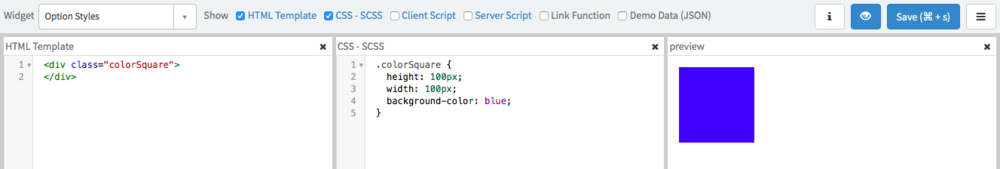
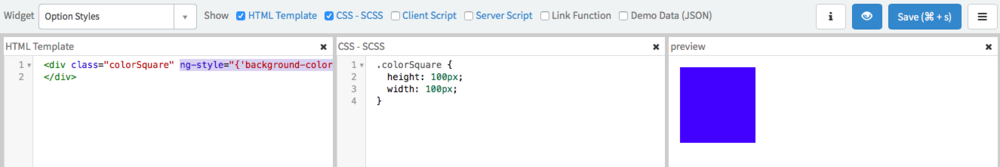
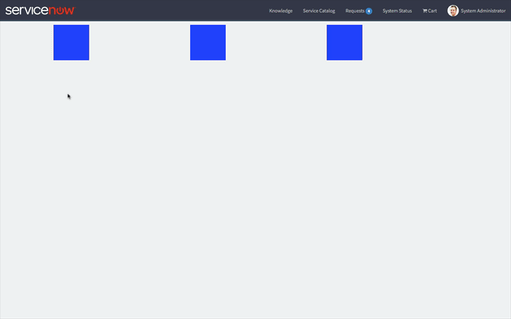

**Note:** This article assumes a basic working knowledge of Service Portal Designer, Service Portal Widget development, and the Widget Editor.

In my [Service Portal CSS Best Practices][1] post, I mentioned that as widget developers we should avoid hardcoding colors and use CSS variables to allow overriding default styles. Sometimes we want to take this idea to the next level by allowing portal admins to configure the look and feel of widgets without touching code at all. Let's take a look at how we can accomplish this with a simple example using Widget Options.

---

## Step 1: Create a widget without configurable styles

Ok, so creating a widget is outside the scope of this article but we do need a Service Portal Widget before we can make it configurable. For this exercise, you can use this widget that I've created called **Option Styles**. It's the greatest and most awesome widget ever created... it's a blue square.

Alright so it's not the greatest widget ever made but its simple enough to illustrate the technique with as little code as possible. You can download the XML to upload to your instance [here][2] if you want to follow along.

<figure>
  
  <figcaption>
    Option Styles Widget
  </figcaption>
</figure>

---

## Step 2: Add Widget Options

<figure>
  
  <figcaption>
    Add Widget Options
  </figcaption>
</figure>

Next, we need to add a configurable option to our newly created widget. In this case, we want to let ServiceNow admins configure the color of our marvelous square. Branding is important after all. To add an option:

1. Click on the hamburger menu
2. Click Edit Option Schema from the menu
3. Click the "+" sign in the Widget Options Schema modal
4. Complete the option form, in our case:
    1. Label: Color
    2. Name: color
    3. Type: string
    4. Default Value: blue
5. Click Save

This creates a configurable option for Admins to change and a sensible default value goes a long way to making a more usable widget, so I set mine to blue. I did notice that the default doesn't always work on the first try, so you may have to apply a color manually anyway.

---

## Step 3: Use Widget Option in Styles

Now that we have a configurable option, we have to actually use it in our code. Service Portal conveniently adds all option values to the **c.options** object using the Name field from the option as the property. In other words, we can access our option via **c.options.color**.

Unfortunately, we can't use this within the CSS - SCSS code block of our widget. This SCSS gets run through a SASS processor and injected into the <head> tag of the html document... well outside the Angular scope where c.options exists. What we can do is use the Angular ng-style directive but we also need to remove background-color from the CSS - SCSS.

**HTML**

```html
<div class="colorSquare" ng-style="{'background-color': c.options.color}">
</div>
```

**CSS - SCSS**

```css
.colorSquare {
  height: 100px;
  width: 100px;
}
```

The ng-style directive takes a javascript object where the keys are the CSS properties and the values are the values of the CSS property. In this case, we are setting background-color to c.options.color.

**Warning:** You might be tempted to use a style tag. At first this will appear to work but avoid this approach. I'll cover the problems associated with this in a future article.

Go ahead and save the widget and you should see the preview reload. If you've wired it up correctly, the square is still blue thanks to the widget options!

<figure>
  
  <figcaption>
    A Blue Square Thanks To Widget Options
  </figcaption>
</figure>

---

## Step 4: Add and Configure Some Widgets

<figure>
  
  <figcaption>
    Configure Color Square Widget Options
  </figcaption>
</figure>

Now you can configure the Widget Options. In the above clip, I have added 3 instances of the widget to a new page. You can see me change the color of each instance individually (Ctrl+click brings up the context menu if you aren't already aware of that trick). On the last square, I apply a hex code color: #d5d5d5. Since ng-style generates a style attribute, any method of specifying a CSS color will work here.

Using this technique, you can apply a whole host of configurable styles to your widgets!

[1]: /blog/6-best-practices-for-service-portal-css
[2]: downloads/Option+Styles+Widget.zip
