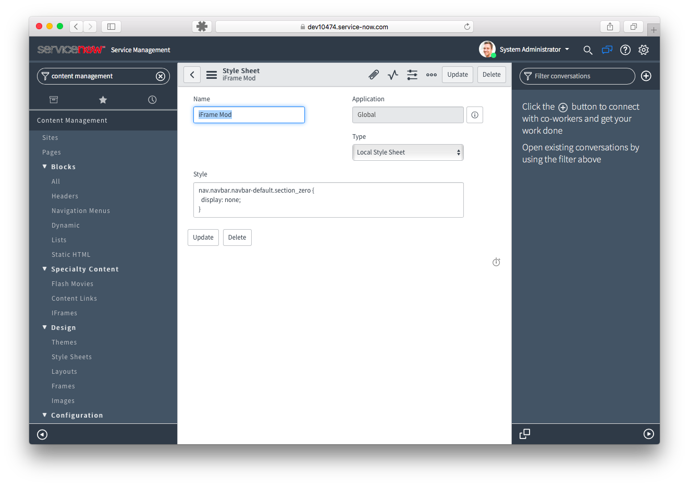
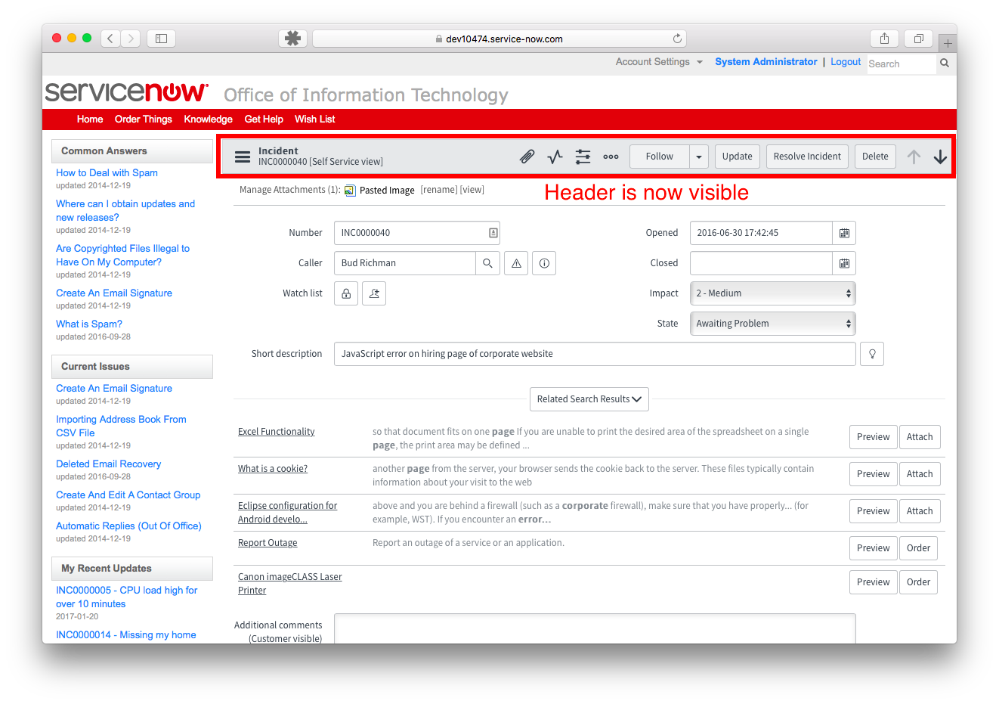

**UPDATE (04/09/2017):** This issue appears to be fixed in Istanbul Patch 3

---

If your organization is using CMS and you are considering upgrading to Istanbul, be on the lookout for a potential issue. Theme CSS styles may not be applied to iFrame content in the CMS for some instances after upgrading to Istanbul. ServiceNow is already looking into the issue so hopefully we will have a resolution soon but I know of a few instances out there that might find this to be a deal breaker for an upgrade so I thought it best to advise the Community.

See the [Community post][1] that led to this discovery for more information.

## Am I Affected?

Instances which match all of the following criteria may be affected:

- Upgrading to Istanbul from a previous release
- Using CMS
- Using iFrame content within the CMS
- CMS Theme contains styles which target the iFrame content

I will point out though that not all instances have been able to replicate this issue and I am not sure why yet. As of this writing, I have replicated this in three out of three instances that I have tested in (all Developer instances), a Community member has replicated it, and ServiceNow was not able to replicate it at first but has since replicated it at least once. So there is a chance that some instances are unaffected.

## What are the risks?

In Helsinki instances and prior, it was common to write CSS styles in the theme that were designed to change the look and feel of **iFrame content**: a phrase which here means any ServiceNow form views, list views, and UI Pages which, barring a more elegant option, were embedded in the CMS causing immediate and unspeakable pain to the developer (Sorry, I've been watching too much "A Series of Unfortunate Events" lately). Generally, the CSS styles might be used to hide the form header, change the fonts to fit with the CMS theme, change colors, or hide certain features from the end user view.

After upgrading to Istanbul, the iFrame content will appear unchanged by the CSS styles. In other words, the forms will have their header and all native styles in tact. For many, this will be a minor cosmetic change but as I indicated above, some folks have invested quite a bit into modifying iFrame content and the impact to user experience could be jarring.

## What Should I Do?

If you are considering upgrading to Istanbul, I wouldn't let this deter you just yet. My recommendation is to upgrade a dev instance with your CMS and see if your instance is affected. If not, happy day! If you do find issues then you can determine if they are merely cosmetic or will truly impact user experience.

You can use this as an opportunity to consider investing in an upgrade to Service Portal

If you find that your user experience is negatively impacted then you can make the decision to hold off on upgrading to Istanbul. Be sure to submit an Incident to ServiceNow so that you will receive updates when a fix or workaround is provided. Also, you can use this as an opportunity to consider investing in an upgrade to Service Portal. What? I'm a big fan of it.

## Steps to Reproduce

For those wanting to experience this issue first hand and possibly help troubleshoot, here are the steps to reproduce:

1. Grab a Helsinki or earlier instance
2. Add CSS Stylesheet to theme to hide the Form Navbar in iFramed content
3. Verify that the navbar is hidden
4. Verify that the iFramed content is using the ess prefix using the Web Inspector
5. Verify that the CSS stylesheet is applied to the iFramed content using the Web Inspector Resource tab
6. Upgrade the instance to Helsinki
7. Verify that the navbar is now visible
8. Verify that the iFramed content is still using the ess prefix using the Web Inspector
9. Verify that the CSS stylesheet is NOT applied to the iFramed content using the Web Inspector Resource tab

## Example

Below are some screenshots from one of my attempts. In my attempt, I used CSS to hide the native form header as indicated in the Community post using a Helsinki Instance. I then upgraded the instance, checked the CMS and found the form header was visible. I also tried this on a Geneva > Helsinki > Istanbul upgrade with the same results.

### Helsinki Instance

<figure>
  
  <figcaption>
    Stylesheet Created for CMS
  </figcaption>
</figure>

<figure>
  
  <figcaption>
    CMS Header Successfully Removed
  </figcaption>
</figure>

<figure>
  
  <figcaption>
    CSS Is Included In The CMS Page
  </figcaption>
</figure>

### Istanbul Instance After Upgrade

<figure>
  
  <figcaption>
    Istanbul CMS Header Is Still Visible
  </figcaption>
</figure>

<figure>
  
  <figcaption>
    CSS Stylesheets Are No Longer In The CMS
  </figcaption>
</figure>

Were you able to replicate this issue? Got any tips or workarounds? Let us know!

[1]: https://community.servicenow.com/thread/252706
