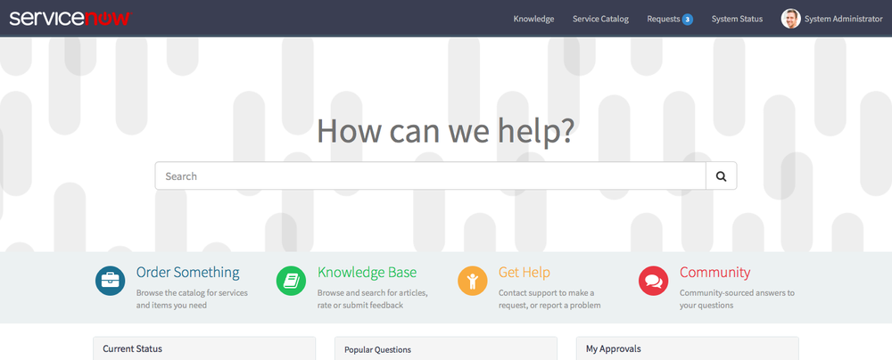

<figure>
  
  <figcaption>
    ServiceNow Service Portal
  </figcaption>
</figure>

So for the last week and a half I have been spending some time exploring the new Service Portal on the [ServiceNow developer site][1]. In fact, I may have been spending a bit too much time on it as my *In House Designer* expressed some displeasure:

<figure>
  
  <figcaption>
    Sarah's Tweet
  </figcaption>
</figure>

But the time spent has been fruitful and I have learned quite a bit about this new tool. Here are some of my key takeaways:

## Service Portal is not CMS

When I first sat down with Service Portal I was expecting a spiritual successor to CMS. All of my dreams and hopes for it were tied up in how well it would serve the goals of CMS and in that I completely missed a much larger vision.

***[CMS] is primarily focused on how different types of content are supposed to be displayed***

The CMS application at its heart is a content driven application. Like Wordpress and other similar platforms, it is primarily focused on how different types of content are supposed to be displayed in the portal. Essentially, an incident should look like an incident and a knowledge article should look like a knowledge article. This content first approach meant that the theme and UI were merely the second thought and it showed. Even lists and list definitions were tied right back to the content type. It was challenging to create reusable themes and components that could be easily configured. There are a number of turnkey solutions out there dedicated to helping CMS solve this problem.

***[Service Portal’s] architecture is focused on breaking up the UI into reusable components***

Service Portal on the other hand is a UI driven application that inherits much of its structure from the AngularJS framework. It’s basically an *Export* link away from being an AngularJS build tool and like AngularJS, its architecture is focused on breaking up the UI into reusable components. Service Portal also offers a grid based layout engine which combined with components make the application a killer UI builder.

And that’s a key distinction between CMS and Service Portal. CMS is for making self-service portals on the ServiceNow platform while Service Portal is how you do UI on ServiceNow’s platform. I can easily see it as a replacement for UI pages and homepages as well as CMS.

## It requires a different way of thinking

The great thing in CMS was plugging in native ServiceNow forms. UI Actions, UI Policies, Client Scripts, they all just worked. CMS was presented as an extension of the internal UI to end users. We could easily show a different view of the internal form to end users and wrap it in a more attractive frame. But whats that line about not stopping to think whether or not we should?

Well, for better or worse, Service Portal solves this issue for us. There is a widget for displaying catalog items and a widget for displaying native forms but neither works exactly the same as native catalog items or native forms. Catalog client scripts for example didn’t seem to work for me. UI Policies on native forms, marking fields readonly, ACL’s… none of it seemed to behave the same on Service Portal as it did on the internal UI.

There is a good chance that a lot of existing behavior will flat out break for people in Service Portal. But this isn’t necessarily bad.

There is a good chance that a lot of existing behavior will flat out break for people in Service Portal. But this isn’t necessarily bad. This forces us to think differently about what we present to end users. How would you feel for example if buying something off Amazon required a form with a single question that when answered opened an unfolding set of questions amounting to 25 in total, displayed 4 at a time but only after answering certain questions and only on the first Tuesday of leap years.

I hazard a guess that you wouldn’t buy much from Amazon.

And this is a critical issue with most CMS’s and their respective adoption rates. We’ve made complicated, poorly designed end user interfaces too easy. What works for internal users doesn’t necessarily work for end users.

Service Portal addresses this by encouraging us to keep it simple and yes I do believe this is by design. Besides, new is always better.

## Service Portal’s possibilities are endless

The moment that threw me off the most was when I realized for the first time that the Service Portal Configuration UI was built using Service Portal. How meta.

In all seriousness, though, thats pretty awesome. A Service Portal to edit other Service Portals. This discovery is what made me realize that my hopes and dreams for Service Portal didn’t go far enough. If you are building custom applications, definitely consider Service Portal for your UI.

For end user portals, not everyone will want to choose Service Portal over CMS, that much I admit. There is definitely a cost with Service Portal.

One thing I can assure you, those that choose Service Portal won’t regret it.

[1]: https://developer.service-now.com/
[2]: https://twitter.com/hashtag/inhousedeveloper?src=hash
[3]: https://twitter.com/servicenow
[4]: https://twitter.com/hashtag/serviceportal?src=hash
[5]: https://twitter.com/hashtag/designerapproved?src=hash
[6]: https://twitter.com/sftoulson/status/728421411912458241
