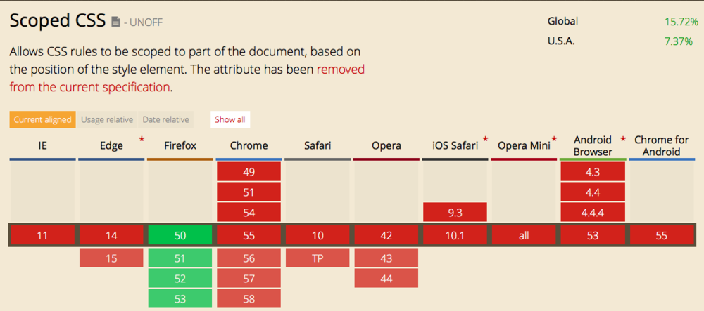
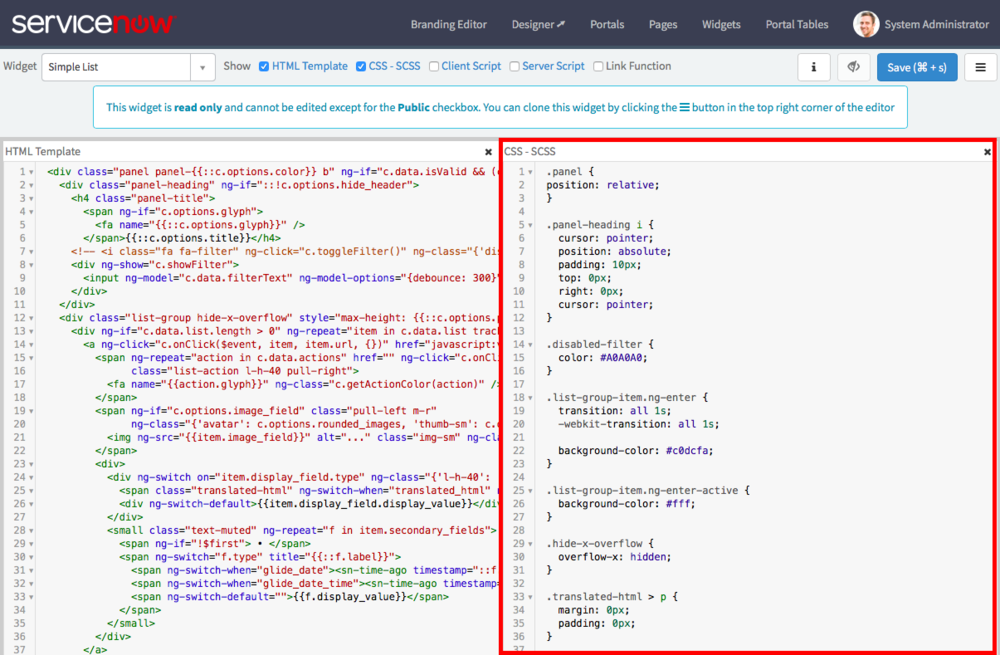

<figure>
  
  <figcaption>
    Scoped CSS Screenshot from CanIUse.com
  </figcaption>
</figure>

Service Portal as a Content Management System has introduced something that now seems like an obvious oversight in all other CMS applications. In fact, its such a obvious, painful oversight that countless others have attempted some sort of solution. CSS Preprocessors, the HTML5 spec, and the recent CSS and JS specs all introduced scoped concepts such as a [scoped attribute][1], scope pseudo selector, and scoping capability with Shadow DOM most of which was promptly ignored by browsers and removed from spec.

I'm talking about Scoped CSS, that is CSS which only applies to a specific part of your html page. ServiceNow executed this one so subtly that you may never actually notice this at work which is a real shame. I only discovered this while intentionally trying to bleed my widget CSS into the rest of the page (specifically, I tried to manipulate the html and body tags from a Widget). So with that, let's take a look at this glorious gift from the Service Portal team.

## CSS in the Service Portal Simple List Widget

<figure>
  
  <figcaption>
    Service Portal CSS Editor
  </figcaption>
</figure>

"Scoped CSS" may actually be a bit fancy terminology wise because in all reality it is still just plain ol CSS. It all starts out in the widget CSS - SCSS editor panel. This panel contains all the CSS that applies to the widget that you are editing.

What you may not realize though, is that CSS will only apply to instances of that specific widget type (in this case the Simple List widget). Instances of different widget types will have no idea how this works. For example, take a look at the panel CSS in the Service Portal CSS Editor:

```css
.panel {
  position: relative;
}
```

Now, normally, CSS like that would apply to every HTML node matching the **.panel** selector. This could cause major problems across other widgets in your portal. What if you installed some custom portal widgets from a ServiceNow Partner, some from ServiceNow Share, and developed a few of your own. That CSS in one widget would technically apply to all widgets using the **.panel** selector. Imagine a widget throwing around an absolute position declaration instead... yikes.

## CSS in the Browser

But Service Portal does something cool behind the scenes. When I look at this CSS using the browser's web inspector I see this:

```css
.v5b255672cb03020000f8d856634c9c28 .panel {
  position: relative;
}
```

Wait a second, whats that weird prefix **v5b255672cb03020000f8d856634c9c28**? Well, it seems that Service Portal adds a class prefix to every widget type. And because of how [CSS specificity][2] works, this CSS will only apply to widgets of the Simple List type. Other widget panels will be left untouched.

This seemingly small change has a number of implications for Service Portal developers but that is best left for another time.

[1]: http://www.w3schools.com/tags/att_style_scoped.asp
[2]: https://css-tricks.com/specifics-on-css-specificity/
