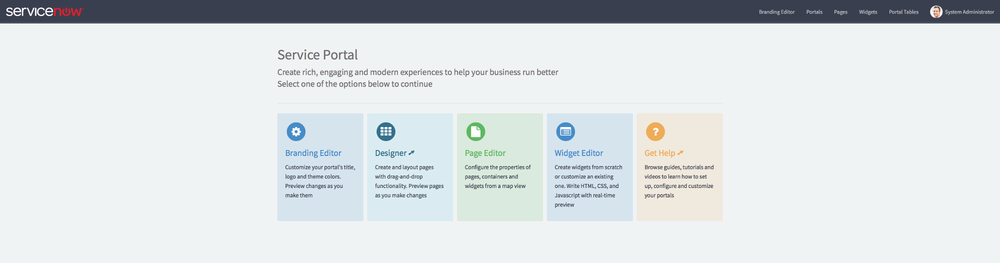
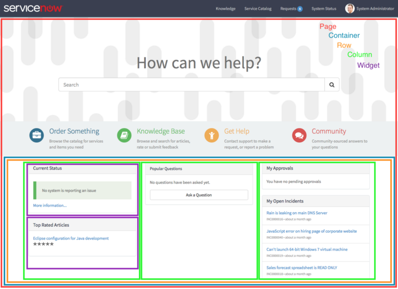

<figure>
  
  <figcaption>
    ServiceNow Service Portal Designer
  </figcaption>
</figure>

Hopefully [my last post][1] on Service Portal helped you to figure out whether you or your client are ready to take advantage of this new powerful tool. Before we actually dig in and start coding and building portals though, it will help to understand a bit about the components that make up the Service Portal and what they actually do.

Don’t let the Service Portal Configuration link in the application fool you. Like all ServiceNow applications, Service Portal is table driven and as such there is a rich data model underneath to leverage. If you wanted to, you could build an entire portal using the native list / form interface of ServiceNow. Personally, I like to leverage the best of both worlds so to start out we will take a look at the most important components and how they might relate to your prior CMS experience:

---

## Portals (sp_portal)

Portal records are the equivalent of CMS Site records. There is virtually no difference. Like the predecessor, the Portal record defines a URL extension. The out of box portal for example uses instance.service-now.com/sp. That sp is defined on the Portal record.

<aside class="ccPullQuote right w-50">
  
Portal records are the equivalent of CMS Site records

</aside>

Additionally, the Portal record contains some basic configuration such as referencing the Theme, a few standard pages like login and 404, logo, icon, and some base css.

This is one major difference between CMS and Service Portal, CSS is spread out throughout the application records. It’s important to put the right CSS on the right record. In this case, the portal record’s CSS should contain basic CSS variables. **Be careful though, the Service Portal Configuration portal will overwrite this field.**

---

## Themes (sp_theme)

<figure>
  
  <figcaption>
    Yes, Service Portal uses the Sass preprocessor for CSS
  </figcaption>
</figure>

Theme’s are a bit different in Service Portal than CMS. First of all, as previously stated, CSS is spread throughout the Service Portal records. The header has its own CSS, the footer has its own, and every widget has its own CSS. The real beauty is that all this CSS is actually [Sassy CSS][2] complete with variables. And who doesn’t love a little sass.

More on that in future posts but the short of it is that it makes your Service Portal widgets easier to change, more configurable, and more portable. CSS in the actual Theme record will likely include less actual CSS and fewer CSS include files.

Also of note, Themes include references to the header widget, the footer widget, and JS include files. But again, widgets contain references to their own CSS and JS scripts including external dependencies… so your Theme record might be a little thin except for some theme based variables.

---

## Pages (sp_page), Containers (sp_container), Rows (sp_row), Columns (sp_column)

<figure>
  
  <figcaption>
    Pages, Containers, Rows, and Columns… Oh my!
  </figcaption>
</figure>

Pages are where things get a little weird. After all, this is AngularJS we are talking about here… it’s a *Single Page* Application. While there is some similarity between CMS Pages and Service Portal Pages in that both basically describe the content areas. But that’s about the end of the similarities.

Service Portal pages are referenced via URL using the *id* parameter (instance.service-now.com/sp?id=*pageid*) and can be used in *ANY* Service Portal. That’s right, Pages do not have a defined relationship to Portal records. Pages just exist. They can be public, internal, or role based… but they just exist. Any portal can display any page.

<aside class="ccPullQuote right w-50">
  
Basically, a Page is just the top level logical container for the layout engine.

</aside>

Basically, a Page is just the top level logical container for the layout engine. The layout engine uses bootstrap natively but can be configured to use something else (like flex box) using CSS classes on each of the layout records which include Pages, Containers, Rows, and Columns. See the above image for a visual diagram of the layout.

Each of the layout records has fields that help configure the bootstrap behavior of the component, so don’t overlook those. All of these records types combined replace the CMS layout records in a much more robust, abstracted way.

Most of the time you will only see these records through the drag and drop interface (except maybe pages) but know that the records are there under the hood if you need them.

---

## Widgets (sp_widget) and Widget Instances (sp_instance)

I really should move Widgets and Widget Instances to the top. These guys are where the real power is. In fact, the previously mentioned Header and Footer records… Widgets. In Service Portal, if you see it, it’s probably a widget.

So the gist of this is simple. Widgets define the HTML template, the CSS, the client and server JS, and any CSS / JS dependencies required to display a specific *thing* on the Service Portal. What sort of *thing*? Well… anything.

Image Carousel? Make a widget. Menus? Widget. List of records? Widget. Header? Widget. Image gallery? Widget. Blog post? Why not… widget. Artificial Intelligence bent on world domination? Widget… and maybe some integrations.

Think of it this way, a developer will create a Widget and give it certain capabilities using variables, code, and maybe some additional tables. An administrator can then drag and drop the widget into a portal page and configure it using the variables without touching code. This is a truly incredible separation of concerns that did not readily exist in CMS.

Trust me, we will be covering a lot more on this later.

---

## Angular Providers (sp_angular_provider)

[Angular providers][3] are a bit of a confusing subject… even for Angular Developers. Slightly more confusing is that Service Portal groups [Directives][4] in with Angular Providers whereas AngularJS usually keeps the topics separate.

When you work with Widgets for a short time, you will discover that they do not play well with others. Frankly, they are a bit full of themselves and they don’t like to share… anything. They don’t readily share data and their templates are isolated which can occasionally result in some duplication.

This is where Angular Providers come into play. Angular Services, Directives, and Factories can all be used to mediate data and templates between these white glove widgets. These are client-side only scripts for building up the AngularJS application in Service Portal. More advanced developers will likely find uses for this but most of the time a Widget will do.

---

Stay tuned for next time when we actually start putting some of this to work!

[1]: /blog/4-reasons-youre-not-ready-for-service-portal
[2]: http://sass-lang.com/
[3]: https://docs.angularjs.org/guide/providers
[4]: https://docs.angularjs.org/guide/directive
