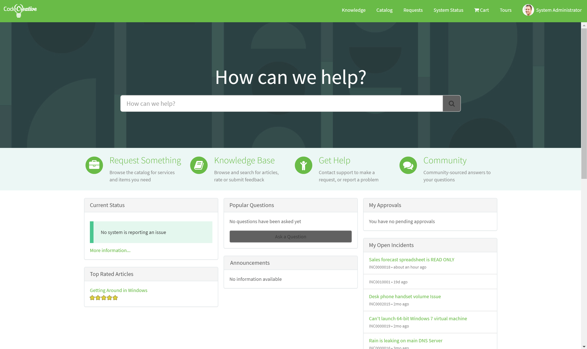
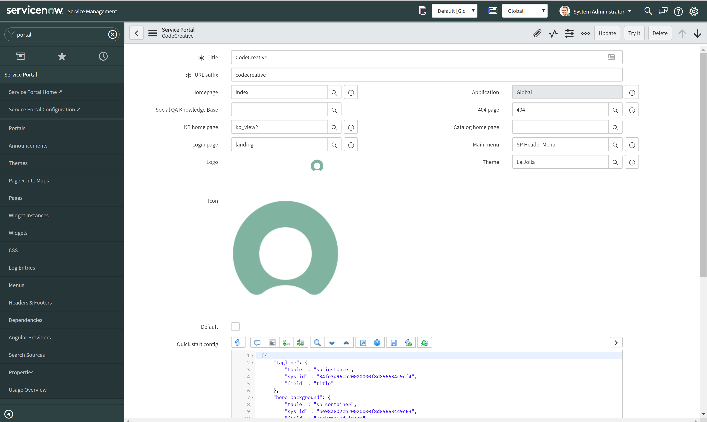
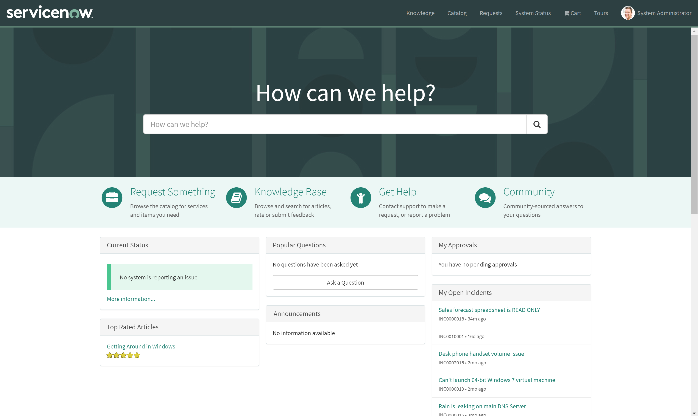
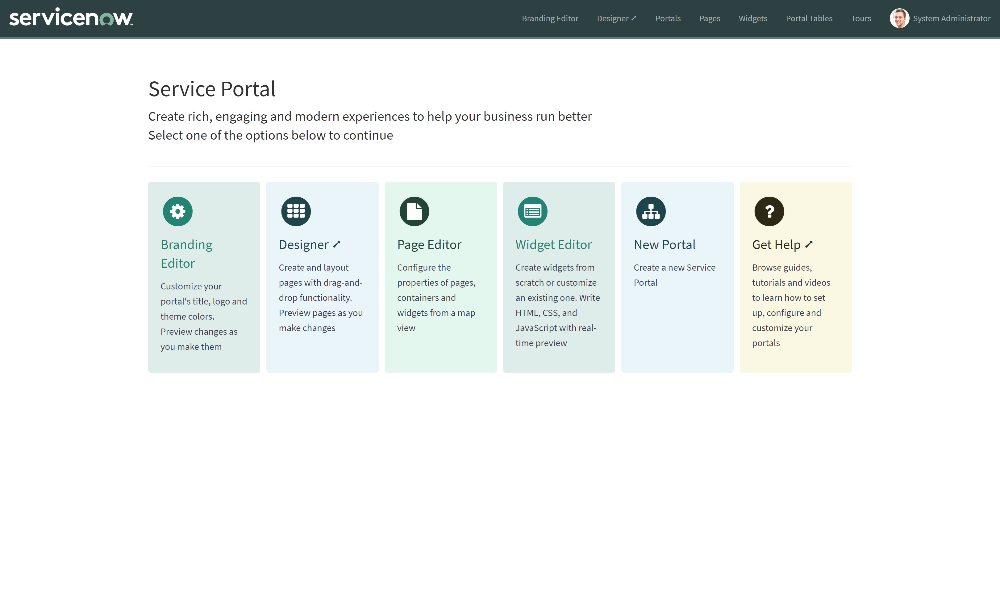
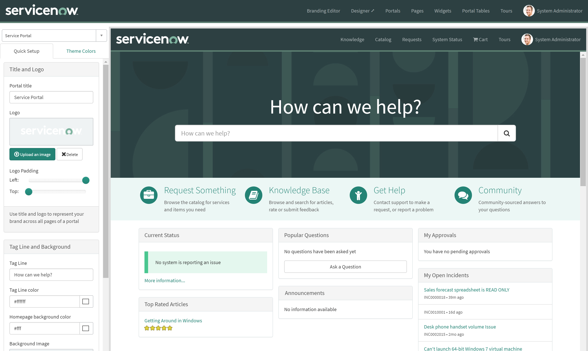

**Objective:** To use the Service Portal Branding Editor to modify the branding of a portal.

<figure>
  
  <figcaption>
    Exercise Goal
  </figcaption>
</figure>

Modifying the basic branding is a great way to get introduced to Service Portal. It is an easy skill to pick up which requires no code and can be performed by administrators.

In this exercise, we will clone the baseline ITSM portal to create our own portal to modify through the rest of this guide.

## Exercise

Follow the below instructions to complete the exercise:

1. Download the following resources:
  - <a href="downloads/CodeCreative_Logo.png" download>CodeCreative Logo</a>

2. Log in to your Personal Developer Instance

3.  Using the **Filter navigator**, navigate to **Service Portal > Portals** [(Learn more about the Portal Record)][1]

4. Open the **Service Portal** record with the **sp** URL Suffix

5. Insert as a new record with the following changes:

  - **Title:** CodeCreative
  - **URL Suffix:** codecreative

6. Open the newly created Portal record

7.  Click the **Try It** button to open the portal in a new window [(Learn more about the baseline portal)][2]

8. Switch tabs to return to the Admin UI

9.  Using the **Filter navigator**, navigate to **Service Portal > Service Portal Configuration** [(Learn more about the configuration portal)][3]

10.  Click the **Branding Editor** link [(Learn more about the Branding Editor)][4]

11. From the dropdown picker in the left hand sidebar, change **Service Portal** to **CodeCreative**

12. On the **Quick Setup** tab in the left hand sidebar, update the following (using the provided image above):

  - **Portal Title:** CodeCreative
  - Logo
  - Logo left and top padding as needed

13. On the **Theme Colors** tab in the left hand sidebar, update the following:

  - Navbar background: #69bd45
  - Navbar divider: #69bd45
  - Navbar link color: #ffffff
  - Navbar link hover color: #ffffff
  - Button default background: \#616161
  - Primary: #69bd45
  - Text color: \#616161
  - Text muted: \#888
  - Link color: #69bd45

14. Open the browser tab with the CodeCreative portal

15. Refresh the page to view the branding changes

16.  In the browser URL, change **codecreative** to **sp** and hit enter [(Learn more about the URL Structure)][9]

## Review

### Portal Record

<figure>
  
  <figcaption>
    Service Portal Record
  </figcaption>
</figure>

The Portal record (sp_portal) is the topmost component in the Portal hierarchy. This record is what allows the Service Portal framework to support multiple portals. Each record represents and contains the configuration for a single portal. Using the fields on this form, each portal can specify its own:

- **Title:** Text displayed in the browser tab to indicate the site the user is on

- **URL suffix:** Each portal uses its own URL defined by the URL Suffix

- **Content Pages:** The Homepage, Social QA Knowledge Base, KB Home page, Login page, 404 page, and Catalog home page fields define various pages that are used by various baseline widgets such as breadcrumbs to assist in portal navigation

- **Logo:** The logo that appears in the page header

- **Main menu:** The main menu that appears on the right hand side of the page header

- **Theme:** The theme defines the CSS styles, header widget, and footer widget used in the portal

- **Icon:** The icon used as both the favicon in the browser tab and in the ServiceNow Mobile App

- **Quickstart config:** JSON package configured using the Branding Editor interface, you will rarely edit this directly

- **CSS variables:** SASS variables for building configurable portal styles. When using the Branding Editor, you will notice many of the variables are stored here

[(Return to Exercise)][5]

### Baseline Portal

<figure>
  
  <figcaption>
    Baseline Portal - La Jolla Theme
  </figcaption>
</figure>

The baseline ITSM portal is configured to allow users to order from the Service Catalog, view Knowledge, and track their Requests and Incidents. It is a great starting point for many new portals. In this exercise, we have cloned the baseline portal to start. Many implementations will elect to modify the baseline portal directly which is certainly an option.

Modifying the baseline portal prevents future updates, though, and it can be very helpful to see how ServiceNow chooses to evolve their portal over time. You will see that I take a similar non-destructive, clone first approach to modifying other portal components.

[(Return to Exercise)][6]

### Configuration Portal

<figure>
  
  <figcaption>
    Configuration Portal
  </figcaption>
</figure>

The configuration portal provides a few different custom UI's for configuring Service Portals. Yes, it is a Service Portal for configuring Service Portals. Here are the available tools from the Configuration Portal:

- **Branding Editor:** The Branding Editor allows configuring the basic colors, images, and text used by the Service Portal and it's widgets

- **Designer:** The Designer is a drag and drop interface for editing Service Portal pages

- **Page Editor:** The Page Editor provides a navigable tree view of the components on the page which assists with editing pages and their components

- **Widget Editor:** The Widget Editor is where you will spend most of your life as a portal developer. It is the UI for editing the code that renders widgets in the portal

- **New Portal:** The New Portal option opens a new Portal record for editing.

- **Get Help:** Links to the ServiceNow Docs site for Portal documentation

[(Return to Exercise)][7]

### Branding Editor

<figure>
  
  <figcaption>
    Branding Editor
  </figcaption>
</figure>

The Branding Editor allows configuring the basic colors, images, and text used by the Service Portal and it's widgets. It is a great place to start when styling a new portal. If you are paying close attention to your Portal record, you will notice the color options specified in the Branding Editor will update the CSS Variables field, the Logo updates the Logo field, the Title updates the Title field, and some of the other options are stored in the Quick start config field.

This effectively means that you don't *have* to use the Branding Editor but it is still quite useful.

[(Return to Exercise)][8]

### URL Structure

The URL Structure is very important in Service Portal and reflects an odd flexibility in the framework compared to other CMS's. Here's the structure:

https://**instance name**.service-now.com/**url suffix**?id=**page id**

As always, we start with the instance name. If you refer back to the Portal record, you will recall that we define a URL suffix on the record. By using that URL suffix at the tail of the instance URL, we tell ServiceNow to navigate to that portal.

The wild oddity, though, is the page id. When no id is provided, we navigate to the homepage. Because we cloned the baseline ITSM portal, we have two portals with the same homepage. In fact, every page in the Service Portal framework is visible in every portal by URL. This makes data security and widget security that much more important to enforce since a quick URL change can inadvertently give a user access to a portal to which they can not otherwise navigate.

[(Return to Exercise)][10]

## Explore

Try these next challenges on your own for further learning:

1. What do you think would happen if you used a small background image (less than 500px wide) or a large logo image?  Try it and find out.

2. What do you think would happen if you changed the CSS color values directly on the Service Portal's CSS Variables field and updated the record?  Give it a shot and open the Branding Editor to see what happens.

[1]: #portal-record
[2]: #baseline-portal
[3]: #configuration-portal
[4]: #branding-editor
[5]: #backto-portal-record
[6]: #backto-baseline-portal
[7]: #backto-configuration-portal
[8]: #backto-branding-editor
[9]: #url-structure
[10]: #backto-url-structure
