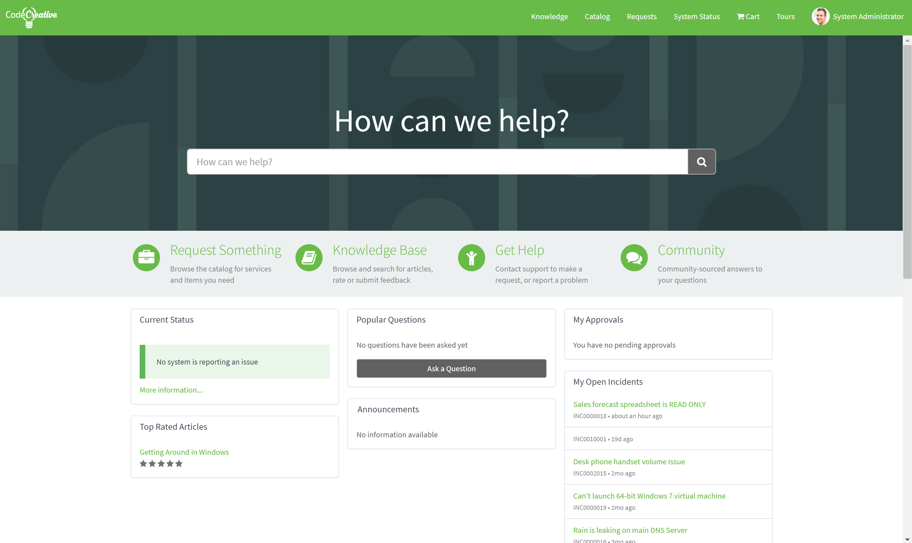

**Objective:** To create a custom theme and apply it to a Service Portal to further modify the portal style.

<figure>
  
  <figcaption>
    Exercise Goal
  </figcaption>
</figure>

Creating a theme takes our styles one step further and brings our portal closer to compliance with a corporate style guide. With just a little SASS and CSS we can take our portal a long way.

In this exercise, we will clone the La Jolla Theme record, modify it's styles, and apply it to the CodeCreative portal we created in the last exercise.

## Exercise

Follow the below instructions to complete the exercise:

1. Log in to your Personal Developer Instance

2. <span id="backto-theme-record"></span> Using the **Filter navigator**, navigate to **Service Portal > Themes** [(Learn more about the Theme Record)][1]

3. Open the **Theme** record with the Name **La Jolla**

4. <span id="backto-sass-variables"></span> Review the SASS variables used in the **CSS variables** field [(Learn more about the SASS Variables)][2]

5. Observe the CSS Includes Related List has two records listed

6. Insert as a new record with the following changes:

  - **Name:** CodeCreative
  - **CSS variables:** <Blank>

7. Open the **CodeCreative** Portal record

8. Update the record with the following changes:

  - Theme: **CodeCreative**

9. Open the CodeCreative Service Portal

10. Observe the current style of the portal

11. Open the **CodeCreative** Theme record

12. Update the record with the following **CSS variables**:

    ```scss
    $btn-default-color: #ffffff !default;
    $input-border-focus: $brand-primary !default;

    /* Panels */
    $panel-default-border: transparent !default;
    $panel-default-heading-bg: transparent !default;
    ```

13. Refresh the CodeCreative portal

14. Observe that the button text is now white and the panel headings have changed

## Review

### Theme Record

The Theme record (sp_theme) contains reusable elements that are shared across all pages of a portal to which it is applied. This includes Header, Footer, basic styles, as well as injected CSS Stylesheets and JavaScript files.  

Because of this, Themes should ideally be built in a way that they can be used by any Portal. Highly specific code should be avoided as it can often be located more closely to the point of use.

One of the best uses of Themes is defining reasonable defaults for Bootstrap SCSS Variables and ServiceNow SCSS Variables.

[(Return to Exercise)][4]

### SASS Variables

The CSS variables field, similar to the CSS variables field on the Portal record, allows injecting SASS variables into the framework's stylesheets. Service Portal uses a combination of [Bootstrap 3's SASS Variables][7] in addition to ServiceNow specified SASS variables such as **$sp-tagline-color**.

By setting these variables in the CSS variables fields, Service Portal Admins and Developers can change quite a bit about their portal without having to touch any CSS classes or ids themselves.

The changes made in this exercise could have been made by manipulating CSS styles directly using element, class, and id selectors. Compared to CSS classes and ids, however, SASS Variable usage is much more stable and less subject to change. Elements, classes, and id selectors have been known to change, sometimes almost arbitrarily, between ServiceNow versions. SASS Variables have proven much more stable and in most cases are the best way to make portal wide changes.

[(Return to Exercise)][5]

## Explore

Try these next challenges on your own for further learning:

1. Do you think you can change the container sizes via the theme?  How about giving them fluid widths? Try it and find out.

2. Can you change the homepage icon bar's background color using SASS Variables? Which variable does the trick?

3. Can you find Widget records whose CSS field use variables? Which variables do they use?

[1]: #theme-record
[2]: #sass-variables
[4]: #backto-theme-record
[5]: #backto-sass-variables
[7]: https://github.com/twbs/bootstrap-sass/blob/master/assets/stylesheets/bootstrap/_variables.scss
