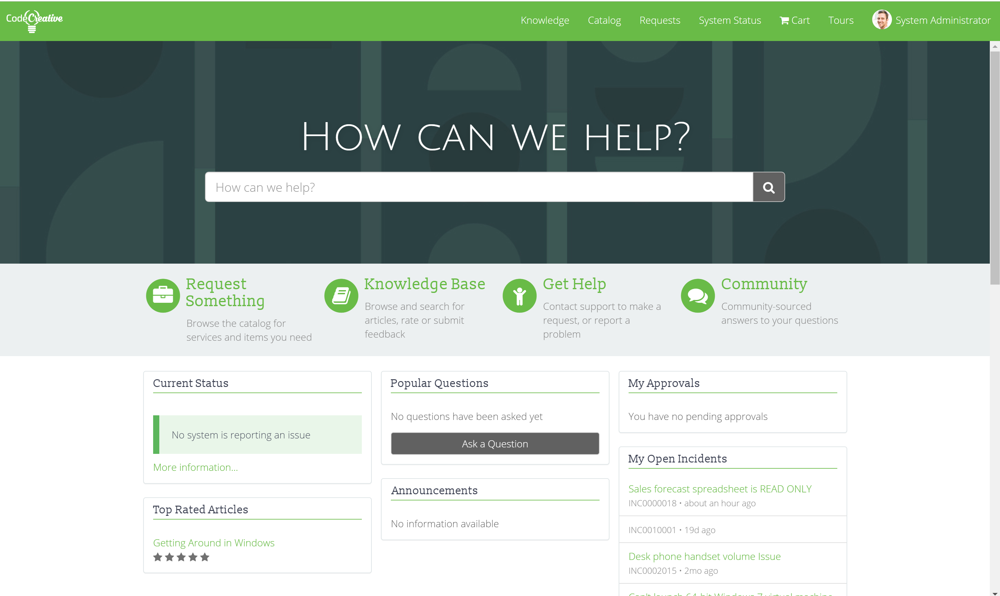

**Objective:** To further modify the theme and styles, including fonts, using CSS Includes on the Theme record.

<figure>
  
  <figcaption>
    Exercise Goal
  </figcaption>
</figure>

Now that we have a basic theme, let's introduce some new fonts and styles using Theme CSS Includes. CSS Includes are the best place to put CSS styles that should be applied across every page of the portal.

In this exercise, we will create a CSS Include, add it to our CodeCreative Theme record, and update our portals styles to reflect the Exercise Goal pictured above.

## Exercise

Follow the below instructions to complete the exercise:

1. Log in to your Personal Developer Instance

2. Using the **Filter navigator**, navigate to **Service Portal > CSS**

3. <span id="backto-style-sheet-records"></span> Click **New** to create a new CSS Style Sheet record [(Learn more about the Style Sheet Record)][1]

4. Save the record with the following changes:

  - **Name:** CodeCreative Styles
  - **CSS:**

    ```css
    @import url('https://fonts.googleapis.com/css?family=Julius+Sans+One|Open+Sans:300|Slabo+13px');
    ```

5. Open the **CodeCreative** Theme record created in the previous exercise

6. <span id="backto-css-include-records"></span> In the **CSS Includes** related list at the bottom of the form, click the **Edit** button [(Learn more about the CSS Include Record)][2]

7. Use the slushbucket interface to add the **CodeCreative Styles** record to the right hand list

8. Click **Save** to update the **CSS Includes** related list

9. Using list editing, update the **Order** field of the **CSS Include** record to 100

10. From the **CodeCreative** Theme record, update the CSS Variables to the following:

    ```scss
    /* Creating a Theme Exercise */
    $btn-default-color: #ffffff !default;
    $input-border-focus: $brand-primary !default;

    $panel-default-border: transparent !default;
    $panel-default-heading-bg: transparent !default;

    /* Overriding Styles Exercise */

    $font-family-sans-serif: "open sans", Sans-Serif !default;
    $font-family-serif: "slabo 13px", Serif !default;
    $font-size-base: 16px !default;
    $headings-font-family: $font-family-serif !default;
    ```

11. <span id="backto-changing-fonts"></span> Navigate to the CodeCreative Service Portal and observe the changes [(Learn more about the Changing Fonts)][3]

12. From the **CodeCreative** Theme record, once more update the CSS Variables to the following:

    ```scss
    /* Creating a Theme Exercise */
    $btn-default-color: #ffffff !default;
    $input-border-focus: $brand-primary !default;

    $panel-default-border: transparent !default;
    $panel-default-heading-bg: transparent !default;

    /* Overriding Styles Exercise */

    $font-family-sans-serif: "open sans", Sans-Serif !default;
    $font-family-serif: "slabo 13px", Serif !default;
    $font-size-base: 16px !default;
    $headings-font-family: $font-family-serif !default;

    $font-family-alternate: "julius sans one", Sans-Serif !default; /* Custom Variable */
    ```

    <span id="backto-creating-new-sass-variables"></span> [(Learn more about the Creating New SASS Variables)][4]

13. From the **CodeCreative Styles** Style Sheet record, update the CSS field to:

    ```SCSS
    @import url('https://fonts.googleapis.com/css?family=Julius+Sans+One|Open+Sans:300|Slabo+13px');

    #homepage-search h1,
    #homepage-search h2,
    #homepage-search h3,
    #homepage-search h4,
    #homepage-search h5,
    #homepage-search h6 {
      font-family: $font-family-alternate;
      font-weight: 500;
      text-shadow: 0 2px 10px rgba(0,0,0,.15);
    }
    ```

14. <span id="backto-using-css-selectors-in-themes"></span>  Navigate to the CodeCreative Service Portal and observe the changes [(Learn more about Using CSS Selectors in Themes)][5]

## Review

### Style Sheet Records

Style Sheet records are roughly equivalent to CSS Files when using file system based HTML build tools. Any portal wide CSS should be placed into a Style Sheet record and included via CSS includes. This is also a great way to include CSS from external libraries as well.

As of the current release, Style Sheet records are processed into \<style\> tags that are embedded in the head tag of the rendered portal. Thus, the typical debates between a single CSS file and multiple are mostly irrelevant. It is possible that multiple Style Sheet records could reduce performance due to iterating additional database records but the impact has not been extensively studied.

[(Return to Exercise)][6]

### CSS Include Records

ServiceNow Style Sheet records are not used until they are included in a Portal theme. This is important to keep in mind when cloning existing themes. The existing theme may have required dependencies in the form of CSS Includes and JS Includes. Fortunately, the same Style Sheet records can be included in multiple Themes.

It's important to note the Order field on CSS Includes. This field is easy to overlook after adding a Style Sheet via the slushbucket but it should not be ignored. CSS evaluation is very dependent on the order in which it is included in an HTML page. Setting the order field ensures that the CSS Includes are added to the final portal in a consistent order.

[(Return to Exercise)][7]

### Changing Fonts

It's amazing how much simply changing the default fonts in the Service Portal can alter it's personality. Many organizations indicate specific fonts which should be used in a corporate style guide. In addition to matching colors, matching the correct fonts takes a portal a long way towards reflecting an organizations brand design.

So its great that Service Portal makes changing the fonts fairly painless. In this exercise, we used the @import rule to import a Google Font style sheet by URL. The same approach can be used for any publicly hosted font.

For fonts that are not publicly hosted, there are still a few options:

1. Host the Font as an Attachment in ServiceNow
2. Use a Data URI and Base64 encode the font files directly into your Style Sheet
3. When all else fails, find a similar font that is publicly hosted

And of course, this all applies to adding Icon Fonts as well!

[(Return to Exercise)][8]

### Creating New SASS Variables

We've already discussed using Bootstrap and ServiceNow created SASS variables but we should also note that we can define our own SASS variables as well. In this exercise, we defined the custom variable **$font-family-alternate** in our Theme record and then leveraged it in our CSS Included Style Sheet record. This variable does not appear in any Bootstrap or ServiceNow provided SASS. I made it up just for this exercise.

These variables can then be used in CSS Includes as well as Page specific CSS, Widget CSS, and Widget Instance CSS which we have yet to explore. Creating these types of variables is a way to create extremely flexible, powerful themes.

**Important:** Using SASS Variables in CSS Includes is not available in instance versions prior to Madrid. Prior to Madrid, CSS Includes must be hardcoded with plain CSS.

[(Return to Exercise)][9]

### Using CSS Selectors in Themes

One of my hardest lessons learned on Service Portal has been related to direct CSS manipulation via CSS selectors. Unfortunately, CSS elements, classes, and ids used by ServiceNow are not always consistent between versions. In my original Service Portal Crash Course, I targeted an **h1** heading selector which in the very next version changed to an **h2**, breaking the CSS I created.

For this reason, CSS selectors should be used carefully and sparingly when targeting ServiceNow's HTML. You will note that I have carefully selected the **#homepage-search** heading by targeting all possible heading level elements (1-6). The other CSS selector used is a well established, highly used Bootstrap panel-title selector.

Despite defensive coding practices, we can easily imagine the **#homepage-search** id being removed or an upgrade to Bootstrap 4, breaking **.panel-title** selectors. Be aware of the potential for these sorts of breaking changes. Assess your implementation's risk tolerance before extensively using CSS selectors outside of your own Widgets.

[(Return to Exercise)][10]

## Explore

Try these next challenges on your own for further learning:

1. Can you change the color of the Rating Stars on the homepage? How many ways can you find? Which do you think is the lowest risk and why?

2. Do you think you can use SASS to make dynamic color variations such as lighter and darker versions of your base color?

[1]: #style-sheet-records
[2]: #css-include-records
[3]: #changing-fonts
[4]: #creating-new-sass-variables
[5]: #using-css-selectors-in-themes
[6]: #backto-style-sheet-records
[7]: #backto-css-include-records
[8]: #backto-changing-fonts
[9]: #backto-creating-new-sass-variables
[10]: #backto-using-css-selectors-in-themes
