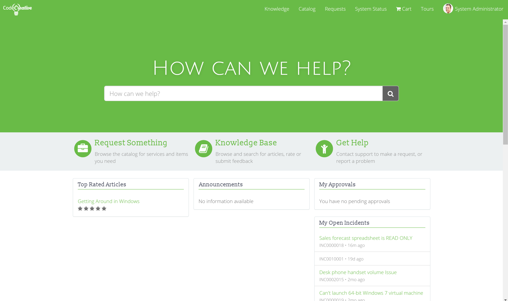
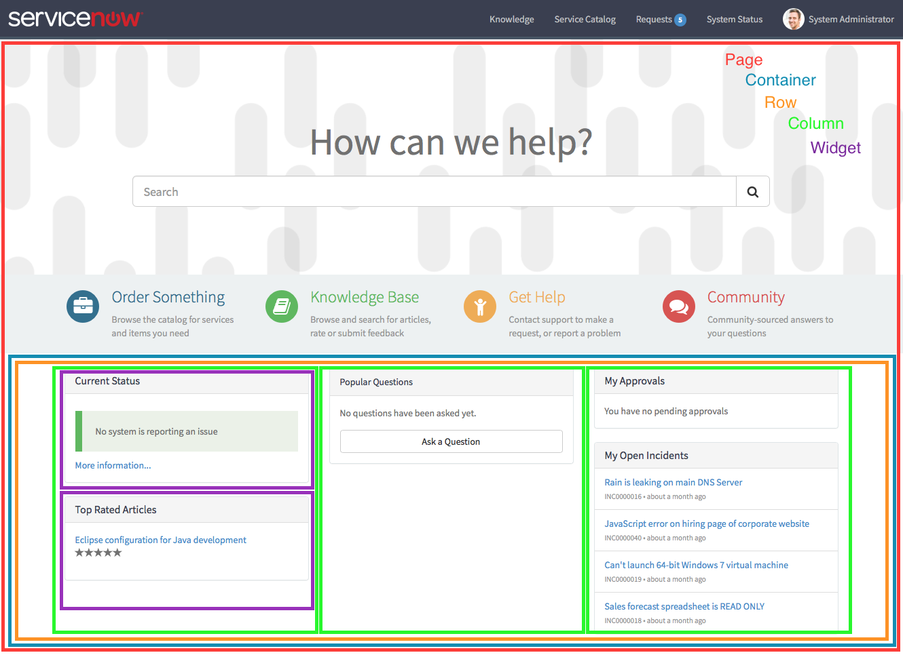
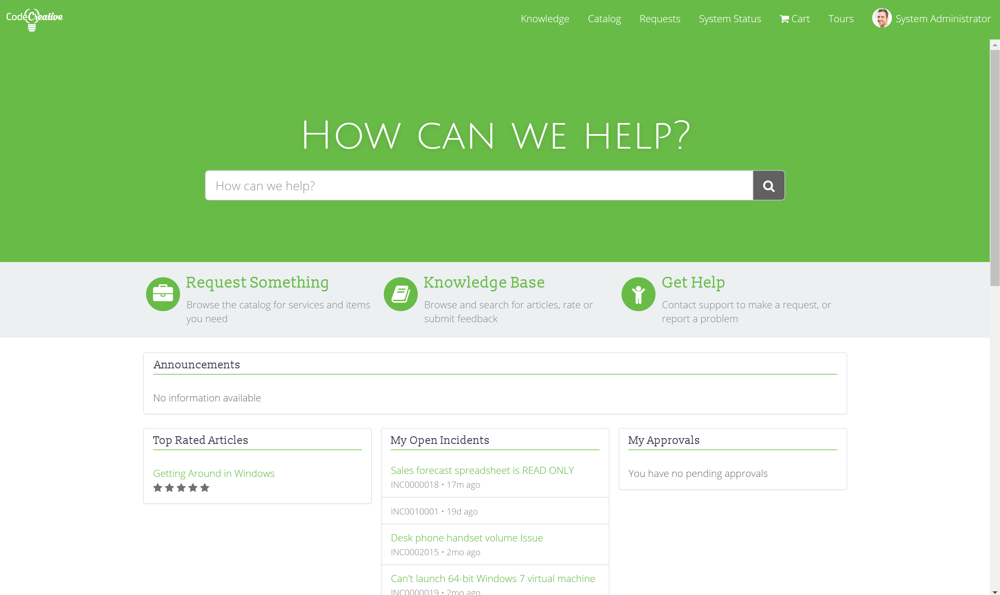

**Objective:** To create a customized homepage for the portal.

<figure>
  
  <figcaption>
    Exercise Goal
  </figcaption>
</figure>

With the portal level components coming together strong, let's turn our attention to the page level components. Service Portal comes with a built in layout engine that makes assembling pages a breeze.

In this exercise, we will explore cloning and customizing pages in Service Portal by creating a custom homepage.

## Exercise

Follow the below instructions to complete the exercise:

1. Log in to your Personal Developer Instance

2. Using the **Filter navigator**, navigate to **Service Portal > Pages**

3. Open the **Page** record where the id is **index**

4.  Observe the Page specific CSS field [(Learn more about Page Records)][1]

5.  Click **Clone Page** to create a new copy of the Page record [(Learn more about Cloning Pages)][2]

6. Save the newly cloned **Page** record with the following values:

  - **Title:** CodeCreative Homepage
  - **ID:** cc_index

7.  Under the **Page Content** section of the form, observe the component hierarchy of the Page [(Learn more about Page Components)][3]

7.  From the **CodeCreative Homepage** record, click the **Open in Designer** link towards the bottom of the page [(Learn more about the Service Portal Designer)][4]

8. In the Service Portal Designer, click the **Community** text block

9. Click the **trashcan icon** highlighted in blue at the top right of the Icon Link block

10. When prompted, click **Yes** to confirm that you want to permanently delete the selected item

11. Click the empty **Column** where **Community** used to be

12. Click the **trashcan icon** in the top right corner of the interface

13. When prompted, click **Yes** to confirm again

14. Click the **Request Something** Icon Link

15. In the breadcrumb at the top of the page, click **Column** to select the column

16. Click the **Pencil** icon in the top right corner to edit the **Column** record

17.  Change the **Size - md** to **4** [(Learn more about Column Sizing)][5]

18. Click **Save** to save the **Column** record

19. Using the previous steps, change the **Size - md** for **Knowledge Base** and **Get Help**

20. Using the previous steps, delete the following Widgets:

  - Current Status
  - KB News
  - Subscribed Questions
  - Popular Questions

21. Click the image background behind the **How can we help?** text

22. Verify that **Container** is selected in the breadcrumb, if not, click Container in the breadcrumb to select it

23. Click the **Pencil** to edit the Container record

24. Save the Container record with the following changes:

  - **Background Color:** #69bd45
  - Under **Background Image**, click the **Delete** button

25. Open the **CodeCreative** portal and observe that the new homepage has not taken effect

26. Update the **CodeCreative** portal record with the following changes:

  - **Homepage:** cc_index

27. Refresh the **CodeCreative** portal and observe that the new homepage is visible

## Review

### Page Records

Like pretty much everything else in Service Portal and ServiceNow, pages are stored in records on a table. Each one is represented by an **ID** which is used in the Service Portal URL as the id parameter. Most of the fields on the form are fairly simple and have vary specific impacts:

- **Title:** Changes the title displayed in the Browser tab when on the portal page
- **ID:** Used in the portal URL text to show the page, similar to a slug in other CMS platforms
- **Public:** Allows the page to be viewed by users without any role. Keep in mind, content on the page must be made public as well to be visible
- **Draft:** Draft pages will show a 404 page when navigated to. Makes the page invisible while under construction
- **Roles:** Specifies that the page can only be seen by users with specific roles

Also of note is the **Page Specific CSS** field. Like most CSS fields in Service Portal, it supports SASS and the SASS variables provided by the Portal and Theme records as well as Bootstrap. For styles that should only affect a single page, this is a great place to put it.

[(Return to Exercise)][6]

### Cloning Pages

Cloning pages is a powerful feature in that it makes a copy of the Page record and every component that appears on the page. For scenarios like this scenario, we only wanted to change a few things on the homepage. While we could have made the changes directly to the **index** page, that page was provided by ServiceNow. Changing that page would block future updates to the page.

By cloning the index page, we can make changes while also protecting the original page. Depending on the page cloned, you may need to take some additional steps. Pages like the homepage, Knowledge Home, Service Catalog Home, 404 Page, Login Page, and Social QA Home need to be updated on the Portal record. Some widgets are configured to link to these specific pages (such as breadcrumbs). When we updated the Homepage field on the **CodeCreative** portal record, we ensured our new homepage was the default page for this portal.

Some pages are not configured on the Portal record but still have Widgets that link to them. To clone pages like the Catalog Item pages, you may want to create a **Page Route Map** record for your portal to route the old page to the new one.

[(Return to Exercise)][7]

### Page Components

<figure>
  
  <figcaption>
    Page Component Hierarchy
  </figcaption>
</figure>

Service Portal pages leverage Bootstrap CSS to provide the layout. As such there are many familiar components in the component hierarchy of Service Portal. The basic structure of any Portal page is:

- Page (sp_page)
- Container (sp_container)
- Row (sp_row)
- Column (sp_column)
- Widget Instance (sp_instance and other subtables)
- Widget (sp_widget)

Please note that each component, like the page, is stored as a record on different tables in the portal framework. Each record can be navigated to in the native interface and updated like any other record. The first 3 components are layout components derived directly from their Bootstrap counterpart.

Containers support adding background images or background colors along with configuring a few Bootstrap specific options. Or you can disable Bootstrap for the container by selecting **Bootstrap alternative**.

Containers, Rows, and Columns also support adding additional CSS classes which can be useful for container color striping, setting padding and spacing, and other targeted CSS modifications.

Widgets and Widget Instances we will go into greater depth in the next exercise.

[(Return to Exercise)][8]

### Service Portal Designer

The Service Portal Designer is a WYSIWYG interface for editing Service Portal pages. Although the component records can be edited directly in the native UI, the Service Portal Designer provides a useful way of visualizing the changes as they are made.

The left hand sidebar contains drag and drop tools for adding layout components and widgets to the currently edited page. The canvas area that takes up most of the page shows the current state of the portal. Users can click the different components to select and edit them using the breadcrumb and toolbar above the canvas.

But again, keep in mind that if anything is not working as desired in the Service Portal Designer, the records can be accessed and updated directly from the Page record.

[(Return to Exercise)][9]

### Column Sizing

Columns in Service Portal are sized according to Bootstrap Column sizing unless the Container is set to **Bootstrap alternative**. It is very important to get acquainted with Bootstrap 3's approach to sizing if you are not already familiar.

From a basic standpoint, Bootstrap divides containers into a grid with rows and columns. The containers in Service Portal by default are fixed width and divided up into 12 equal width grid columns. Each column can take up anywhere from 1-12 grid columns. Since the grid columns are of equal width, you can think of each column being 1/12 or 8.333% of the width of the container.

Columns can also vary their width depending on the width of the screen. Screen width is indicated by t-shirt sizes (xs, sm, md, lg).

Put all that together and the Column record's size fields start to make a little more sense. Each of the following fields represent how wide each page column should be, the number of grid columns it should take up, on the specified screen size.

- **Size - xs:** Grid column width on extra small screens
- **Size - sm:** Grid column width on small screens
- **Size - md:** Grid column width on medium screens
- **Size - lg:** Grid column width on large screens

You can also vary the column sizes. Just because you drag and drop a **4 | 4 | 4** set of columns in the Service Portal Designer doesn't mean you can't edit it to be **8 | 2 | 2**. By manipulating your column sizes at different page widths, you can get some really attractive site design reflow that makes the most of the available space.

Or... you know... Bootstrap alternative and use flexbox or grid. Your call.

[(Return to Exercise)][10]

## Explore

Try this next challenge on your own for further learning:

1. Using the techniques learned in this exercise, see if you can change the existing CodeCreative portal to look like the following:

<figure>
  
  <figcaption>
    Challenge Goal
  </figcaption>
</figure>

[1]: #page-records
[2]: #cloning-pages
[3]: #page-components
[4]: #service-portal-designer
[5]: #column-sizing
[6]: #backto-page-records
[7]: #backto-cloning-pages
[8]: #backto-page-components
[9]: #backto-service-portal-designer
[10]: #backto-column-sizing
