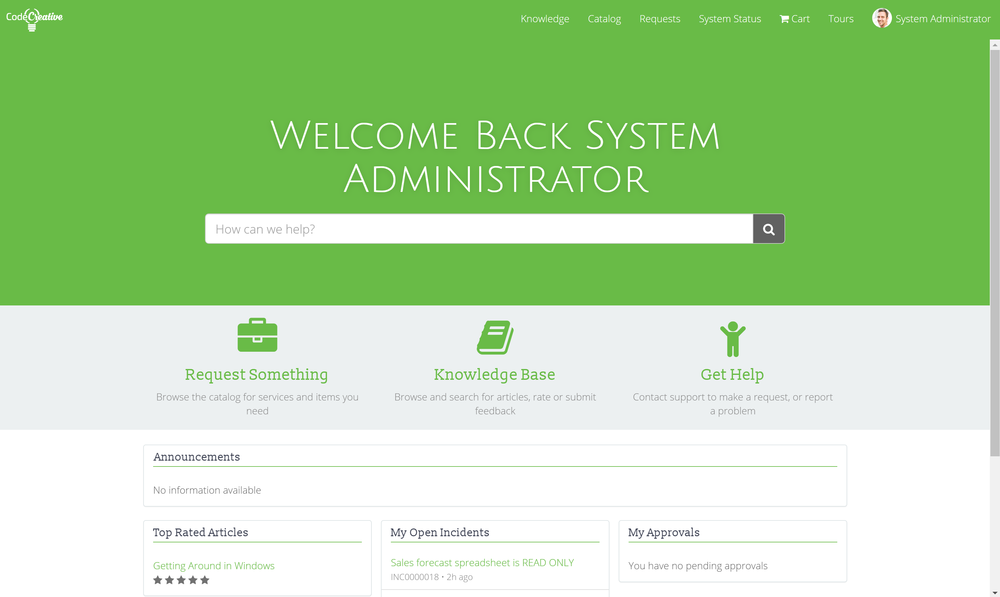
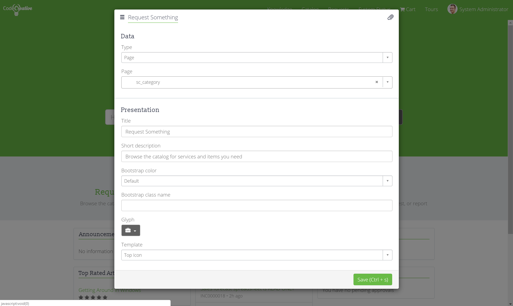
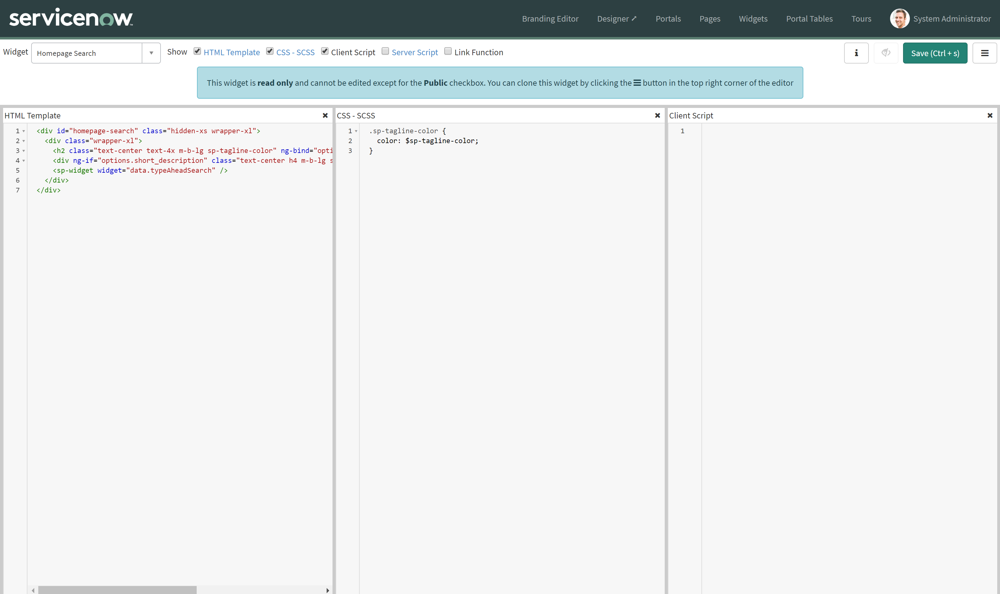

**Objective:** To configure and create simple Widgets in Service Portal

<figure>
  
  <figcaption>
    Exercise Goal
  </figcaption>
</figure>

One more step to finish up our portal: Widgets. Widgets are the heart and soul of the Service Portal world. All of the content from the header to the footer, the menus, the lists, the forms, all of it is driven by Widgets. Widgets can be as simple or complex as you need.

In this exercise, we will explore the basic foundations of Widgets, Widget Instances, and Instance options which are necessary to begin Widget development.

## Exercise

Follow the below instructions to complete the exercise:

1. Log in to your Personal Developer Instance

2. Open the **CodeCreative** Service Portal in a new browser tab

3. <span id="backto-portal-admin-context-menu"></span> Hold the Control (Ctrl) key on your keyboard and right click on **Request Something** [(Learn more about the Portal Admin Context Menu)][1]

4. In the context menu that appears, click **Instance Options**

5. <span id="backto-widget-instance-options"></span> Observe the available options [(Learn more about Widget Instance Options)][2]

6. Save the Instance Options with the **Template** changed to **Top Icon**

7. Repeat the previous steps to change the Instance Options for **Knowledge Base** and **Get Help** as well (Icon Link)

8. Open the **Instance Options** for the **My Open Incidents** list (Simple List)

9. Observe that this Widget has a different set of options

10. Save the Instance Options with the **Maximum entries** changed to **5**

11. Hold the Control (Ctrl) key on your keyboard and right click on the **How can we help** text (Homepage Search)

12. <span id="backto-widget-editor"></span> In the context menu that appears, click **Widget in Editor** [(Learn more about the Widget Editor)][3]

13. Click the **Hamburger icon** to expand a dropdown menu

14. <span id="backto-cloning-widgets"></span> Click **Clone "Homepage Search"** [(Learn more about Cloning Widgets)][4]

15. Set the **Widget name** to **CodeCreative Search**

16. Click **Submit**

17. In the **Widget** dropdown in the top left corner, select **CodeCreative Search**

18. Save the Widget with the following scripts:

    **HTML**
    ```html
    <div id="homepage-search" class="hidden-xs wrapper-xl">
      <div class="wrapper-xl">
      	<h2 class="text-center text-4x m-b-lg sp-tagline-color">Welcome {{ c.getWelcomeText() }}</h2>
      	<div ng-if="options.short_description" class="text-center h4 m-b-lg sp-tagline-color" ng-bind="options.short_description"></div>
      	<sp-widget widget="data.typeAheadSearch" />
      </div>
    </div>
    ```

    **CSS - SCSS**
    ```SCSS
    .sp-tagline-color {
    	color: $sp-tagline-color;
    }
    ```

    **Client Script**
    ```js
    function() {
      /* widget controller */
      var c = this;

    	c.getWelcomeText = function() {
    		if (c.data.previouslyVisited == 'true') {
    			return 'Back ' + c.data.userName;
    		}
    		else {
    			return c.data.userName;
    		}
    	}
    }
    ```

    **Server Script**
    ```js
    data.typeAheadSearch = $sp.getWidget('typeahead-search', options.typeahead_search);
    data.userName = gs.getUserDisplayName();
    data.previouslyVisited = gs.getUser().getPreference('user_viewed_portal_' + $sp.getValue('url_suffix')) || 'false';

    if (data.previouslyVisited == 'false') {
    	gs.getUser().savePreference('user_viewed_portal_' + $sp.getValue('url_suffix'), 'true');
    }
    ```

19. Open the **CodeCreative** portal homepage browser tab

20. Hold the Control (Ctrl) key on your keyboard and right click on the **How can we help** text (Homepage Search)

21. <span id="backto-widget-instances"></span> In the context menu that appears, click **Instance in Page Editor** [(Learn more about Widget Instances)][5]

22. Save the Widget Instance record with the **Widget** changed to **CodeCreative Search**

23. Refresh the **CodeCreative** portal homepage and observe the tagline text reads **Welcome (username)**

24. <span id="backto-dynamic-widgets"></span> Refresh the **CodeCreative** portal homepage once more and observe the tagline text reads **Welcome back (username)** [(Learn more about Dynamic Widgets)][6]

## Review

### Portal Admin Context Menu

With a quick CTRL+Right Click (or CMD+Right Click) for Mac, Portal Administrators have access to some pretty amazing tools via the Portal Admin Context Menu. You'll be pressed to find a faster way to access the myriad of configuration options for your portal components.

There are some limitations. The context menu will only appear if you directly click on a Widget that is not the header, footer, or embedded widget. Aside from those limitations, any other widget will display the context menu. When displayed, the context menu will let the administrator take a number of actions:

- **Instance Options:** Configure the Instance Options for the clicked Widget Instance
- **Instance in Page Editor:** Opens the Page Editor portal with the clicked Widget Instance selected
- **Page in Designer:** Opens the current page in the Service Portal Page Designer UI
- **Edit Container Background:** Opens a modal that allows editing the Container record that is the parent of the clicked Widget Instance
- **Widget Options Schema:** Opens a modal displaying the clicked Widget Instance's Instance Option schema
- **Widget in Form Modal:** Opens a modal displaying the Widget record in a form view
- **Widget in Editor:** Opens the Widget of the clicked Widget Instance in the Widget Editor UI
- **Log to Console:** Two log to console options log the current Widget Instance state variables to the browser console for debugging and troubleshooting

[(Return to Exercise)][7]

### Widget Instance Options

<figure>
  
  <figcaption>
    Configure Widget Instance Options
  </figcaption>
</figure>

When adding Widgets to a portal page, those Widget Instances are configurable depending on the Instance Options that are exposed by the Widget. Instance Options are simply variables that the Widget uses to change it's appearance. For example, the Icon Link Widget allows selecting different templates: Top Icon, Circle Icon, and Color Box. Each template will display the widget in a slightly different way.

Instance Options are broken down into 3 categories: Data, Behavior, and Presentation. Data options control how data is queried or handled by the Widget. Behavior options allow modifying the actions that the Widget takes. Presentation options control how the Widget is displayed or rendered. Some widgets offer many options for configuring it while others offer none.

It's also interesting to note that some options are exposed in the Widget's code but not displayed in the Instance Options.

[(Return to Exercise)][8]

### Widget Editor

<figure>
  
  <figcaption>
    Widget Editor
  </figcaption>
</figure>

The Widget Editor is a UI to learn and love since most portal developers will spend most of their time here. The Widget Editor exposes the primary fields needed to configure any Widget:

- **HTML Template:** The HTML template controls the rendered output in the browser. It is technically an AngularJS template partial and so it supports all AngularJS bindings.
- **CSS - SCSS:** The CSS - SCSS field is scoped specifically to the widget and should not leak styles to other widgets. Most CSS should be located in the Widget records. As the SCSS indicates, SASS variables from Bootstrap, the Theme, and the Portal records are supported.
- **Client Script:** The Client Script is an AngularJS Client Controller executed using the **controller as** syntax. This allows the JS **this** variable to act as $scope. In most widgets, you will see a **var c = this;** which accounts for most Widget's use of **c** instead of **this** or **$scope**.
- **Server Script:** The Server Script is where traditional GlideRecord, Script Include, and other ServiceNow server code is executed. Some magical binding helps keep the Server Script's **data** object in sync with the Client Script's **this.data** object which eases passing data from server to the client.
- **Link Function:** Less frequently used, the Link Function is the AngularJS Directive Link function where most jQuery style DOM manipulation should happen.

**Hamburger Menu Options**

- **Public:** Makes the Widget publicly visible though the data behind the widget may need additional work to make it publicly visible.
- **Edit Option Schema:** Allows adding Instance Options that are exposed via the Server Script's **options** object and the Client Script's **c.options** object.

[(Return to Exercise)][9]

### Cloning Widgets

Cloning Widgets is not quite as foolproof as cloning pages. Angular Templates in particular are not cloned due to Unique Key violations. For the most part, cloning a Widget is fairly reliable and allows you to modify existing Widgets without blocking upgrades.

[(Return to Exercise)][10]

### Widget Instances

You may have noticed me repeatedly differentiating between Widgets and Widget Instances. Widgets and Widget Instances are separate records and separate concepts.

A **Widget** is the code template used to display content in the portal.

A **Widget Instance** is created when a Widget is added to a Page. Every time a Widget is added to a Page it creates a new Widget Instance. Each Instance can be configured separately, allowing the same code template to be applied to different configurations. This allows a single Widget like the Simple List Widget to render multiple different types of content like a list of Incidents, a list of Links, or a list of Change Requests.

[(Return to Exercise)][11]

### Dynamic Widgets

In this exercise, we used very little code to accomplish a neat dynamic feature. By using a User Preference, we setup a dynamic welcome message that would say **Welcome back** after the user had visited the portal once. If the same widget is used in multiple portals, it tracks each portal's first visit separately.

It's amazing how much can be accomplished with Service Portal widgets. Tying a rich front-end experience using AngularJS to a powerful back-end like ServiceNow really opens up the opportunities.

Explore how you can combine System Properties, GlideRecord, and User Preferences to create rich experiences. The widget we created in this exercise is just scratching the surface of what is possible.

[(Return to Exercise)][12]

## Explore

Try these next challenges on your own for further learning:

1. How many configurable Widgets can you find in the baseline portal? Can you think of any Instance Options you wish you could configure? How do you think you might be able to implement those?

2. See if you can create a simple list using ng-repeat in a Widget. Refer to AngularJS documentation on ng-repeat if you need help.

[1]: #portal-admin-context-menu
[2]: #widget-instance-options
[3]: #widget-editor
[4]: #cloning-widgets
[5]: #widget-instances
[6]: #dynamic-widgets
[7]: #backto-portal-admin-context-menu
[8]: #backto-widget-instance-options
[9]: #backto-widget-editor
[10]: #backto-cloning-widgets
[11]: #backto-widget-instances
[12]: #backto-dynamic-widgets
