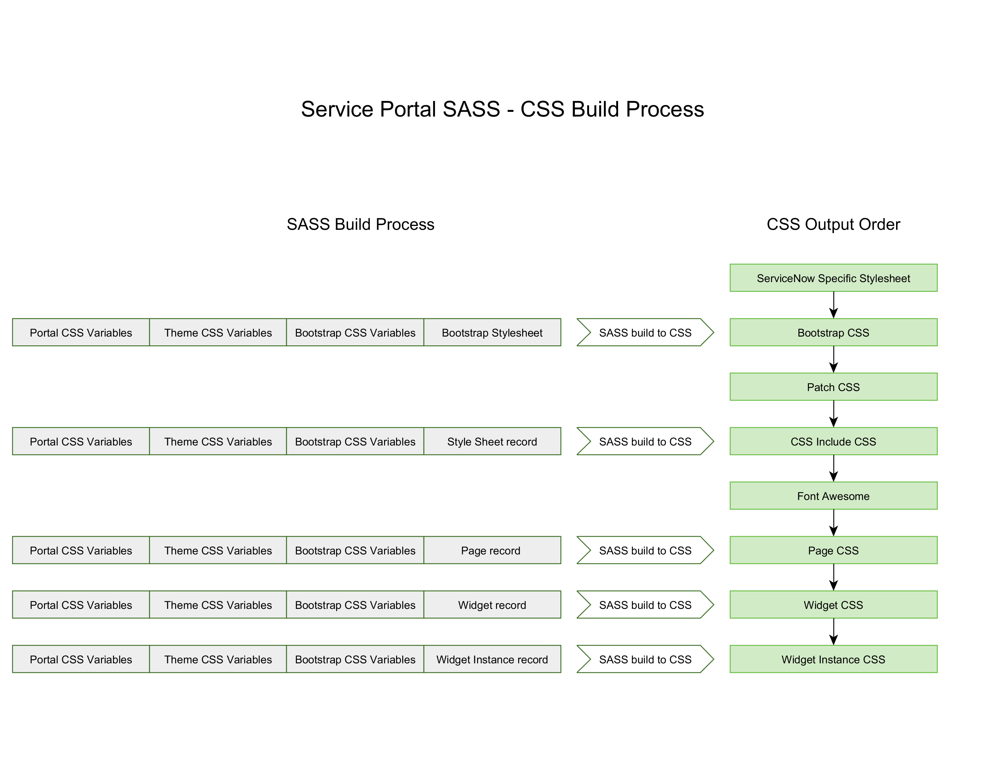

So far we have reviewed many different CSS fields across the Service Portal framework. Since CSS evaluation is highly dependent on it's order, it helps to understand how these different fields get ordered and processed.

Unfortunately, much of the documentation around this can lead to even more confusion. In order to understand the whole picture, we first have to understand that Service Portal does not generate a single blob of CSS. In fact, it generates many smaller blobs many of which are generated by passing them separately through a SASS processor.

Here is a high level visualization of the process:

<figure>
  
  <figcaption>
    Service Portal SASS - CSS Build Process
  </figcaption>
</figure>

Each of the green rectangles represents a CSS file or CSS style tag that is included in the final Service Portal HTML. They are listed from top to bottom in the same order that they are listed in the resulting HTML.

Each of the gray rectangles represents a SASS Variable sheet that is concatenated with the SASS of the resulting CSS before being processed. Notice that the Portal CSS Variables field, Theme CSS Variables field, and the Bootstrap / ServiceNow SASS Variable sheet are appended multiple times.

This causes any CSS rules included in the Portal and Theme records to be duplicated many times in the final output CSS. The SASS preprocessor build process also has some potentially unexpected behaviors in that SASS Variables used in the CSS Includes, Page record, Widget records, and Widget Instance records are handled individually. They are not processed together. In other words, CSS on a Widget Instance can not refer to a SASS variable defined in the Widget record.

Let's take a look at how best to use this information in each of the CSS fields in Service Portal:

## Use of Portal and Theme CSS

Since any CSS styles in Portal and Theme records get duplicated many times, avoid using them. On the other hand, Portal and Theme records are a great place for defining and overriding SASS variables. In most cases, we would expect the Portal variables to override the Theme variables. This allows us to vary a Theme on a portal by portal basis.

Due to the order in which Portal and Theme variables are processed, though, we need to use the **!default** declaration in each variable of the Theme record. This instructs the SASS processor to only assign the variable with the Theme record **if** the variable has not been previously assigned (by the Portal record).

In versions prior to Kingston, the Portal and Theme processing order are switched. Prior to Kingston, you will not use the **!default** declaration in the Theme record.

## Use of CSS Includes

Prior to Madrid, CSS Includes do not support SASS variables. This greatly limits their flexibility in terms of helping to develop a configurable theme. They can still be used for certain Bootstrap overrides where no variable is provided by Bootstrap.

Starting in Madrid, though, CSS Includes support SASS variables and become the workhorse for powerful, customizable themes. With SASS variable support it is possible to import or generate CSS for building a library of UI widgets that is easily configured on a portal by portal basis. Instead of using Bootstrap provided panels, you could create your own common UI components and build widgets around those.

Keep in mind, though, variables should be declared in the Portal and Theme. They should only be applied in CSS Includes, otherwise the other components will be unaware of the variables / variable overrides.

## Use of Page, Widget, and Widget Instance CSS

The remaining locations for CSS are more straight forward. Once you get past the Portal, Theme, and CSS Includes, most of the remaining CSS will fall into the Widget record. That's not to say you shouldn't put CSS in the Page or Widget instance but well designed CSS is broadly reusable. Page and Widget Instance records by definition are very narrowly scoped and therefore mostly used to override defaults in very specific circumstances.

## Conclusion

Due to the particular processing model Service Portal uses for the various CSS fields, there are a few guidelines that can help keep SASS and CSS well structured in any Service Portal:

1. Avoid using CSS styles in Portal and Theme records (use variables only)
2. Use **!default** on variables in the Theme record in Kingston and later
3. Understand the **Final CSS Sequence** and the **SASS Build Process** pictured above to determine the source order of cascading rules
4. Don't forget that CSS Specificity and **!important** can ignore source order
