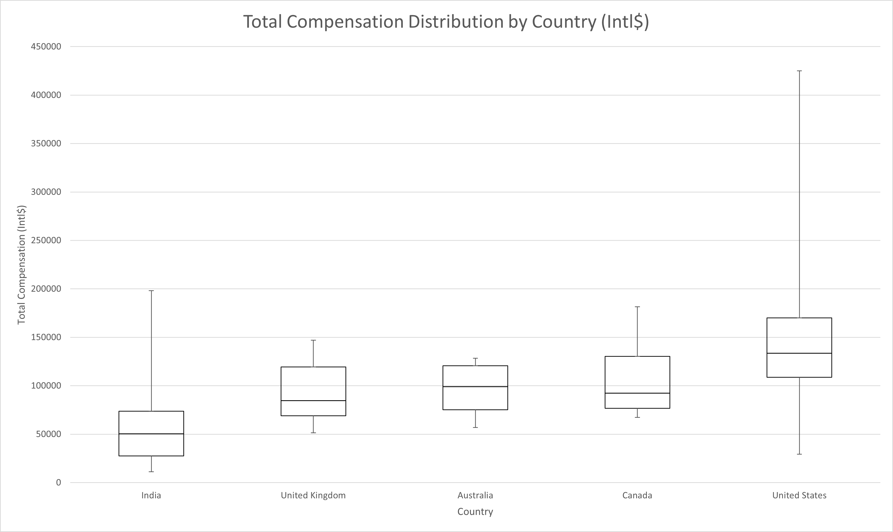
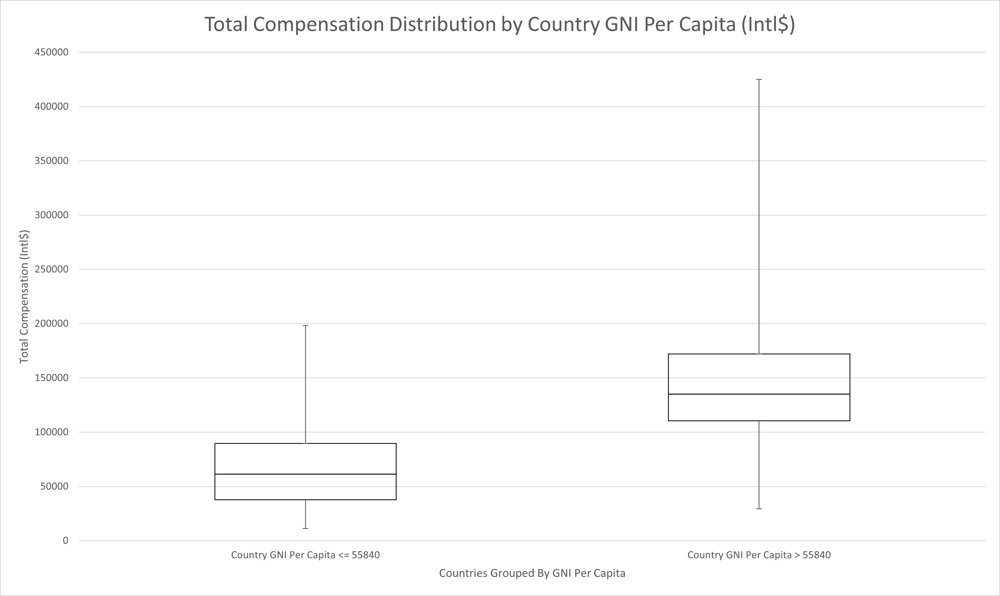
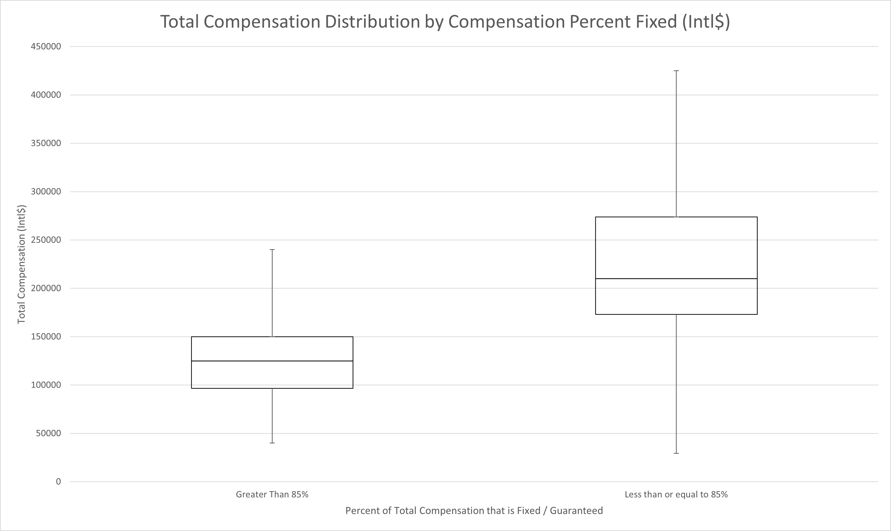

The primary goal of the Salary Survey was to identify which features had the strongest influence on an individual's compensation. Ideally, this would have provided insights into what actions an individual could take to maximize their worth. The results of the analysis were significantly less inspiring than anticipated. Overall, the analysis found that when compared to random prediction models, somewhere between 81% and 93% of the ability of the collected data to predict an individual's compensation could be summarized by an individual's country of employment, years of experience, and (for United States based workers) what percent of your total compensation is guaranteed vs variable.

| Prediction Model                     | Mean Absolute Percent Error (MAPE) |
|--------------------------------------|------------------------------------|
| Optimum Model                        | 0.13523                            |
| Top Features Model                   | 0.27040                            |
| Traditional Salary Table Model       | 0.29396                            |
| Top Regression Model                 | 0.32912                            |
| Random Prediction Model              | 2.75631                            |
| Educated Random Prediction Model     | 1.17475                            |

The table above shows 5 regression tree models that were trained during the analysis and the resulting Mean Absolute Percent Error of each model when it was used to predict the survey result set ([Read more about the Regression Tree training methods][1]). The Optimum Model was trained using all available features generated from the data set. The Top Features and Top Regression models were both trained using only the features with the highest calculated feature importance using the Optimum Model ([Read more about the Feature Importance methods][2]). The Top Features model used the ANOVA process exclusively while the Top Regression model used a polynomial regression on years of experience in the leaf nodes ([Read more about polynomial regression methods][3]). The Traditional Salary Table model used a traditional salary table broken down by country, current job role, and years of experience at 0 to 3 years, 4 to 7 years, and 8 years or more instead of a training method (see Nelson Frank Salary Survey table for a similar breakdown). The Random Prediction model and Educated Random Prediction model represent a random guess about an individual's compensation. The Random Prediction model predicted a random compensation value between the minimum and maximum values in the dataset while the Educated Random Prediction narrowed the random range to the range of highest probability between Intl$ 48,268 and Intl$ 179,214.

Using these models, it can be seen that if a random guess would on average be 2.76 times larger or 2.76 times smaller than the individual's actual compensation. A more strategic guess significantly improves the accuracy but would still be 1.17 times smaller or larger on average than the individual's actual compensation. The ability of the calculated data to predict an individual's compensation can then be computed by comparing the ratio of differences between the random guess models and the trained models. When making this comparison, the Top Regression model easily describes most of the predictive capability of the dataset with only marginal improvements being yielded by using all available features.

The features used in the Top Features and Top Regression models were selected by a standard process of calculating feature importance known as [Leave One Covariant Out][4]. The resulting models and corresponding feature importance are depicted in the table below.

| Feature (Leave One Covariant Out) | MAPE     | Feature Importance |
|-----------------------------------|----------|--------------------|
| Country of Employment             | 0.170491 | 0.035261819        |
| Compensation - Percent Fixed      | 0.147614 | 0.012384286        |
| Years of Experience               | 0.145322 | 0.010091939        |
| Skill Usage                       | 0.139566 | 0.004335953        |
| Age                               | 0.139071 | 0.00384119         |
| Product Usage - Capabilities      | 0.139025 | 0.003795129        |
| Satisfaction                      | 0.138965 | 0.003735063        |
| Number of Different Employers     | 0.137737 | 0.002507545        |
| Product Usage - Applications      | 0.137317 | 0.002087391        |
| Benefits                          | 0.136079 | 0.000849057        |
| Ethnicity                         | 0.135843 | 0.000613216        |
| Current Job Role                  | 0.13523  | 0                  |
| Statements                        | 0.132169 | -0.003060647       |
| Work Effort                       | 0.13015  | -0.005079925       |
| Current Job Level                 | 0.1301   | -0.005129381       |

Though slightly less informative than the previous model comparison, a significant gap can be seen between the top three features importance score compared to all features after them. The remainder of this section will take a close look at each of these features and their impact on compensation.

## Country of Employment

<a href="images/total-compensation-by-country.png">
    <figure>
    
    <figcaption>
        Total Compensation Distribution by Country (Intl$)
    </figcaption>
    </figure>
</a>

|        | India   | United Kingdom | Australia | Canada  | United States |
|--------|---------|----------------|-----------|---------|---------------|
| Min    | 11,315  | 51,471         | 56,944    | 67,227  | 29,200        |
| Q1     | 27,581  | 68,933         | 75,173    | 76,680  | 108,750       |
| Median | 50,283  | 84,558         | 98,958    | 92,437  | 133,500       |
| Q3     | 73,630  | 119,499        | 120,659   | 130,251 | 170,000       |
| Max    | 198,020 | 147,059        | 128,472   | 181,513 | 425,000       |

The feature with the highest feature importance by far is country of employment. As shown in the boxplot above, different countries can yield very different compensation distributions. For example, on average, workers in India are compensated 38% of the [purchasing power][5] (38 cents per dollar) of workers in the United States while other nations tend to sit in the middle. Countries with few survey submissions were omitted from the chart above to preserve anonymity. On average, compensation in Poland appears to be the lowest while compensation in Switzerland appears to be the highest as shown in the table below.

| Country                | Median Compensation (Intl$) |
|------------------------|-----------------------------|
| Poland                 | 19,643                      |
| Italy                  | 44,776                      |
| India                  | 50,283                      |
| Netherlands            | 52,308                      |
| Sweden                 | 56,857                      |
| Costa Rica             | 60,500                      |
| Philippines            | 66,837                      |
| Prefer not to disclose | 69,405                      |
| Brazil                 | 72,000                      |
| Ukraine                | 79,210                      |
| Germany                | 81,756                      |
| United Kingdom         | 84,558                      |
| Belgium                | 92,171                      |
| Canada                 | 92,437                      |
| Australia              | 98,958                      |
| Bulgaria               | 107,899                     |
| United States          | 133,500                     |
| Spain                  | 152,381                     |
| Switzerland            | 195,993                     |

Some of those values may not be representative of the overall ServiceNow industry population within each country due to many countries having a small number of submissions. That said, a deeper relationship between country of employment and compensation is revealed when viewing a country through the lens of it's economic strength. By associating each country with it's [GNI Per Capita][6], a deeper pattern emerges as seen in the chart below.

<a href="images/total-compensation-by-country-gni-per-capita.png">
    <figure>
    
    <figcaption>
        Total Compensation Distribution by Country GNI Per Capita (Intl$)
    </figcaption>
    </figure>
</a>

|        | Country GNI Per   Capita <= 55840 | Country GNI Per Capita > 55840 |
|--------|-----------------------------------|--------------------------------|
| Min    | 11,315                            | 29,200                         |
| Q1     | 37,718                            | 110,513                        |
| Median | 61,292                            | 135,000                        |
| Q3     | 89,754                            | 172,100                        |
| Max    | 198,020                           | 425,000                        |

This distribution groups countries with lower economic strength (Country GNI Per Capita <=55840) and those with higher economic strength (Country GNI Per Capita > 55840). It is clear that from a purchasing power standpoint, it is far better to live in a country with a stronger economy. This also highlights that it is incorrect to assume that workers are compensated equally regardless of country of employment when adjusting for currency differences. Workers in developing nations are objectively compensated a lower purchasing power than their developed nation counterparts. The particular split at Intl$ 55,840 was determined to be the optimum split when comparing the ANOVA F Values and at this point the difference has developing nation workers being compensated just 45% of the [purchasing power][5] of their developed nation counterparts. Though not investigated in this analysis, this finding may also have serious implications for the ethics of current international outsourcing practices from developed nations to developing nations.

Anecdotally, this trend appeared to extend to localized geographies as well. It was much more challenging to verify regional and local differences due to thinning of the dataset across a broader number of feature values. There were instances where it appeared that workers in the South Eastern United States for example were compensated lower than their North Eastern and West Coast counterparts. Likewise, similar trends were somewhat visible when evaluating rural vs urban regions but more concerte data and analysis of this phenomena is required to confirm. If proven, this could likewise challenge the ethics of current insourcing practices.

The important takeaway from this is that the difference in compensation across geographic boundaries is not simply a difference in currency value. It is not simply a cost of living adjustment but rather is a quality of life adjustment. Workers in developing economies are objectively compensated lower purchasing power because of their disadvantaged economic situation.

## Compensation Structure

The second most important feature in the dataset for predicting compensation is the percent of an individual's compensation that is fixed or guaranteed. This feature primarily affected only workers in the United States. Despite being limited to affecting only 40% of the sample population, the impact on compensation was enough to make it the second most important feature.

<a href="images/total-compensation-by-compensation-percent-fixed.png">
    <figure>
    
    <figcaption>
        Total Compensation Distribution by Compensation Percent Fixed (Intl$)
    </figcaption>
    </figure>
</a>

|        | Country GNI Per Capita <= 55840   | Country GNI Per Capita > 55840 |
|--------|-----------------------------------|--------------------------------|
| Min    | 11,315                            | 29,200                         |
| Q1     | 37,718                            | 110,513                        |
| Median | 61,292                            | 135,000                        |
| Q3     | 89,754                            | 172,100                        |
| Max    | 198,020                           | 425,000                        |

As shown in the distribution above, workers in the United States who accept a higher percentage of variable pay are much more likely to out earn their fixed pay counterparts. Workers falling into a more traditional salary plus bonus or other high percent fixed structure are likely to earn only 45% of the amount their variable pay peers are compensated on average. There are some important aspects to note about this relationship. For the rest of this analysis, the greater than 85% fixed pay group will be referred to as the low risk pay group and the other group the high risk pay group.

First, the relationship does not have a strong correlation, rather the relationship appears probabilstic. That is, there appears to be no relationship where each step increase in variable percentage correlates to some proportional increase in total compensation. Rather, there is a region between 80% and 90% fixed compensation where the probability of high earners on one side of the line and low earners on the other side of the line is at it's peak. The 85% fixed compensation line is where this probabilistic split has it's greatest effect on the resulting distributions.

Second, the minimum value for the high risk pay group is extremely misleading. Most of the first quartile of that pay group is skewed toward the upper first quartile line with very few approaching the minimum. While the boxplot is better at protecting anonymity of individual survey submissions, it hides some of the concentration of values. In this case, it's very important to note that nearly every worker in the high risk pay group is within or above the fourth quartile of the low risk pay group. The impact of this feature for US Based workers is quite extreme.

Third, the cause of variable pay in the high risk pay group varies significantly. Some worked significantly more hours and were hourly. Some worked significantly more hours and were salary. Some did not work more hours at all. Some participated in sales. There was no single mechanism by which the high risk pay group assumed higher risk. The only consistency between them was that a large percentage of their compensation was in fact at risk for some reason or another.

Of the three most important features, percent fixed compensation is the one over which workers may have the most control. Conversely, not all workers are equally positioned to assume more risk in their compensation. Also, strategies that leverage increasing risk in order to increase compensation will be highly dependent on a number of aspects outside of the worker's control such as their ability to assume the risk and employers' willingness and ability to reward the risk. Even if every worker was able to assume additional risk, that does not directly imply that the market is willing sustain more higher risk pay group workers. These constraints may significantly limit how many workers can leverage risk taking strategies to yield higher compensation. For those who can, the reward may be well worth the risk according to current data.

## Years of Experience

The third most important feature is in fact a collection of closely correlated features, years of experience. The salary survey responses included breakdowns of total years of experience, years of experience in IT, and years of experience in ServiceNow in addition to a few others that were not included in the top feature group. Although models were trained using only total, IT, or ServiceNow years of experience, the best result was obtained when selecting specific experience for different countries. For the United States and Australia, ServiceNow experience was most correlated with compensation. For India, IT experience was most relevant. Lastly, for the United Kingdom and Canada, total experience was most informative. Other countries had few enough responses that the median value of the country was used for prediction without regard for experience.

The approximate relationships between years of experience and compensation can be seen in the [median compensation scatter plots reference page][7]. Each chart pictures a parabolic line with it's r-squared and equation that describes the approximate relationship between the values. The charts summarize the individual compensation values using the median for each year of experience. The actual equation used for prediction was calculated by performing the same regression on all individual data points, so it does differ slightly from the summary charts. The summary charts are used here to protect anonimity of individual values while still showing the approximate relationship.

It is interesting to note that each relationship has some degree of decline after a certain number of years of experience.  This is the reason a polynomial regression was selected instead of a linear regression. While the regression is significantly more accurate in some countries than others, there is a clear relationship between the central tendency of compensation values and the years of experience of the individual workers. 

The analysis did not delve deeply into the qualities of the relationship between the years of experience and median compensation. While it is worth a brief discussion here, further research is required to justify any hard conclusions about the nature of this relationship. On one hand, most job descriptions are based heavily on years of experience, so the appearance of this feature is no surprise. 

Somewhat troubling, however, is the fact that when years of experience was removed from the model the individual's skills usage and prodct usage did not adequately compensate for the loss of information. Stated another way, compensation is more directly influenced by how old a worker is than by the nature of work performed routinely by the worker.

One possible explanation is that with time comes wisdom. That is, perhaps workers with more experience are more likely to have accumulated knowledge, skills, and intuition that improves the quality or speed of the work performed and therefore the actual work performed is less important to a worker's value. This explanation fails to account for the parabolic decline for worker's with significantly more years of experience. Is there a point at which workers of a certain age and experience become obsolete and fail to keep up with current trends? Is there an age or experience at which natural decline makes older, more experienced workers less valuable?

Alternatively, is there a generally accepted "normal" where less scrutiny is placed on the value of a worker? This is a much more troubling explanation in which the value of a worker is based more on collective bias than on objecive value. Considering that no objective measure of the job performed by workers appears in the top influencing features, this possibility has some credibility. Take note that no where in the top features is the job title, job role, or job skill level. These descriptors of a workers primary function are not considered as predictive of compensation as years of experience. Consider that a moment. It is more valuable to know that an individual has been working for 5 years than whether the individual is a Project Manager, Developer, Administrator, or Architect. Likewise it is more important to know years of experience than whether the individual performs complex integrations in multiple programming languages or simply configures UI Policies day to day.

The importance of this distinction should not be taken lightly. Much like country of employment, years of experience is not a feature that can be significantly influenced by the worker. The one decision a worker can make is when they begin accumulating experience. Once that decision is made, the third most significant feature in determining compensation is set.

## Remaining Features

The decision tree method had difficulty distnguishing influences from some of the less influential features. To get a better idea, the remaining features were compared [in a more targeted way][8] to get an idea of which ones may be more influential. The following table summarizes the findings of the peer group comparisons to rank which feature had the most influence on the resulting [peer group comparison chart][9]. The lower the sum weighted similarity distance, the more similar the peer group comparison was to the overall population's distribution and therefore the less influence that feature is likely to have on compensation. In the sections that follow, these potential influences will be explored more thoroughly.

| Rank | Feature Category | Feature                                                    | Sum Weighted Similarity Distance from   Overall Population Distribution |
|------|------------------|------------------------------------------------------------|-------------------------------------------------------------------------|
| 4    | Skills Usage     | Scripted REST API Development                              | 0.097161505                                                             |
| 5    | Skills Usage     | HTML                                                       | 0.095815733                                                             |
| 6    | Demographics     | US Bureau of Economic Analysis Region                      | 0.09343748                                                              |
| 7    | Demographics     | Gender                                                     | 0.093318119                                                             |
| 8    | Certifications   | CIS - IT Service Management                                | 0.087537171                                                             |
| 9    | Demographics     | India Province                                             | 0.086731074                                                             |
| 10   | Skills Usage     | CSS                                                        | 0.082713366                                                             |
| 11   | Demographics     | Ethnicity                                                  | 0.081253857                                                             |
| 12   | Product Usage    | Custom Applications                                        | 0.080894175                                                             |
| 13   | Skills Usage     | Product Demo                                               | 0.078347961                                                             |
| 14   | Skills Usage     | Project Management                                         | 0.075069136                                                             |
| 15   | Skills Usage     | Architectural Design                                       | 0.074191233                                                             |
| 16   | Product Usage    | Service Portal / UX / Front End                            | 0.071912118                                                             |
| 17   | Product Usage    | Number of ServiceNow Capabilities Frequently Used          | 0.068054367                                                             |
| 18   | Skills Usage     | Integration Development                                    | 0.067070599                                                             |
| 19   | Certifications   | Certified Application Developer                            | 0.066798617                                                             |
| 20   | Skills Usage     | Change Management                                          | 0.061986568                                                             |
| 21   | Skills Usage     | Documentation                                              | 0.061500558                                                             |
| 22   | Skills Usage     | Skill Score                                                | 0.058090816                                                             |
| 23   | Product Usage    | CSM                                                        | 0.053958416                                                             |
| 24   | Product Usage    | Performance Analytics                                      | 0.051477248                                                             |
| 25   | Skills Usage     | Javascript                                                 | 0.051192803                                                             |
| 26   | Skills Usage     | Front End Development                                      | 0.048330675                                                             |
| 27   | Skills Usage     | Service Catalog Design                                     | 0.046300199                                                             |
| 28   | Education        | Highest Level of Education Completed                       | 0.045021207                                                             |
| 29   | Statements       | My org would be negatively impacted if I left              | 0.04442921                                                              |
| 30   | Skills Usage     | Sales                                                      | 0.044097215                                                             |
| 31   | Current Role     | Current Job Level                                          | 0.043967644                                                             |
| 32   | Product Usage    | Virtual Agent                                              | 0.043684015                                                             |
| 33   | Product Usage    | ITOM                                                       | 0.043424216                                                             |
| 34   | Skills Usage     | Process Design                                             | 0.043052824                                                             |
| 35   | Certifications   | CIS - Human Resources                                      | 0.04249674                                                              |
| 36   | Product Usage    | Now Mobile                                                 | 0.04249674                                                              |
| 37   | Certifications   | CIS - Customer Service Management                          | 0.04160118                                                              |
| 38   | Statements       | I contribute directly to reducing costs                    | 0.041484654                                                             |
| 39   | Skills Usage     | Lead Generation / Marketing                                | 0.039571193                                                             |
| 40   | Demographics     | Disability Status                                          | 0.038566437                                                             |
| 41   | Current Role     | Hours Worked This Year                                     | 0.037913439                                                             |
| 42   | Certifications   | Total CIS Certifications                                   | 0.037072014                                                             |
| 43   | Skills Usage     | Service Catalog Configuration                              | 0.034884202                                                             |
| 44   | Skills Usage     | Multilingual                                               | 0.033983361                                                             |
| 45   | Product Usage    | Security Operations                                        | 0.032781055                                                             |
| 46   | Certifications   | Certified System Administrator                             | 0.032754754                                                             |
| 47   | Statements       | I contribute directly to revenue                           | 0.032419293                                                             |
| 48   | Education        | Field of Study                                             | 0.032384483                                                             |
| 49   | Product Usage    | ITBM                                                       | 0.032226011                                                             |
| 50   | Product Usage    | Flow Designer                                              | 0.032205756                                                             |
| 51   | Certifications   | CIS - Security Incident Response                           | 0.030796716                                                             |
| 52   | Product Usage    | GRC                                                        | 0.030347693                                                             |
| 53   | Product Usage    | Predictive Intelligence                                    | 0.030078899                                                             |
| 54   | Satisfaction     | With Future Career Prospects                               | 0.029108007                                                             |
| 55   | Product Usage    | Workflow Editor                                            | 0.028208044                                                             |
| 56   | Product Usage    | Software Asset Management                                  | 0.02815335                                                              |
| 57   | Skills Usage     | Teamwork                                                   | 0.026380562                                                             |
| 58   | Current Role     | Current Job Level                                          | 0.025807456                                                             |
| 59   | Product Usage    | Integration Hub                                            | 0.025363553                                                             |
| 60   | Skills Usage     | Jelly                                                      | 0.024671979                                                             |
| 61   | Certifications   | CIS - Event Management                                     | 0.024042111                                                             |
| 62   | Statements       | My org would find it challenging to replace me             | 0.023360423                                                             |
| 63   | Product Usage    | HRSD                                                       | 0.021693629                                                             |
| 64   | Product Usage    | Number of Applications Frequently Used                     | 0.020682642                                                             |
| 65   | Certifications   | CIS - Project Portfolio Management                         | 0.019401762                                                             |
| 66   | Certifications   | CIS - Vulnerability Response                               | 0.019071784                                                             |
| 67   | Satisfaction     | With Current Role                                          | 0.018968141                                                             |
| 68   | Certifications   | CIS - Discovery                                            | 0.01880962                                                              |
| 69   | Certifications   | CIS - Application Portfolio Management                     | 0.01856695                                                              |
| 70   | Skills Usage     | Workspaces Configuration                                   | 0.018255737                                                             |
| 71   | Satisfaction     | With Current Employer                                      | 0.016876796                                                             |
| 72   | Certifications   | CIS - Field Service Management                             | 0.01671854                                                              |
| 73   | Skills Usage     | Client Script Development                                  | 0.016709593                                                             |
| 74   | Statements       | I contribute directly to maintaining and improving quality | 0.016292407                                                             |
| 75   | Satisfaction     | With Current Pay                                           | 0.0161013                                                               |
| 76   | Certifications   | CAS - Performance Analytics                                | 0.013684831                                                             |
| 77   | Skills Usage     | Communication and Presentation Skills                      | 0.012823957                                                             |
| 78   | Demographics     | Veteran Status                                             | 0.012479472                                                             |
| 79   | Skills Usage     | Flexibility / Adaptability                                 | 0.011736932                                                             |
| 80   | Certifications   | CIS - Software Asset Management                            | 0.011201897                                                             |
| 81   | Certifications   | CIS - Cloud Management                                     | 0.009189427                                                             |
| 82   | Certifications   | CIS - Risk and Compliance                                  | 0.009110295                                                             |
| 83   | Skills Usage     | Drive and Enthusiasm                                       | 0.008925966                                                             |
| 84   | Product Usage    | ITSM                                                       | 0.008847008                                                             |
| 85   | Skills Usage     | UI Policy Configuration                                    | 0.00806053                                                              |
| 86   | Skills Usage     | Other Programming Languages                                | 0.008025326                                                             |
| 87   | Certifications   | CIS - Service Mapping                                      | 0.00700313                                                              |
| 88   | Certifications   | CIS - Vendor Risk Management                               | 0.006593352                                                             |
| 89   | Product Usage    | Service Catalog                                            | 0.006380565                                                             |
| 90   | Skills Usage     | Business Rule Development                                  | 0.006251159                                                             |
| 91   | Product Usage    | ATF                                                        | 0.005071987                                                             |
| 92   | Certifications   | Certified Master Architect                                 | 0.003777068                                                             |

[1]: /guides/servicenow-salary-influence-survey-2020/methods/#step-3-top-influencing-features-analysis
[2]: /guides/servicenow-salary-influence-survey-2020/methods/#calculate-feature-importance
[3]: /guides/servicenow-salary-influence-survey-2020/methods/#multiple-regression-prediction
[4]: /guides/servicenow-salary-influence-survey-2020/methods/#calculate-feature-importance
[5]: /guides/servicenow-salary-influence-survey-2020/methods/#purchasing-power-parity-adjustment
[6]: /guides/servicenow-salary-influence-survey-2020/methods/#gni-dollars-per-capita-atlas-2019
[7]: /guides/servicenow-salary-influence-survey-2020/experience-scatter-plots/
[8]: /guides/servicenow-salary-influence-survey-2020/methods/#step-4-targeted-feature-analysis
[9]: /guides/servicenow-salary-influence-survey-2020/methods/#peer-group-comparison