Beyond the top influencing features, the members of the ServiceNow community expressed an interest in exploring what influence a variety of other features may have. In the next section, the influence of demographic features on compensation will be explored. The methods used in this section can be viewed [here][1].

## Gender

<a href="images/total-compensation-by-gender-and-country-gni-per-capita.png">
    <figure>
    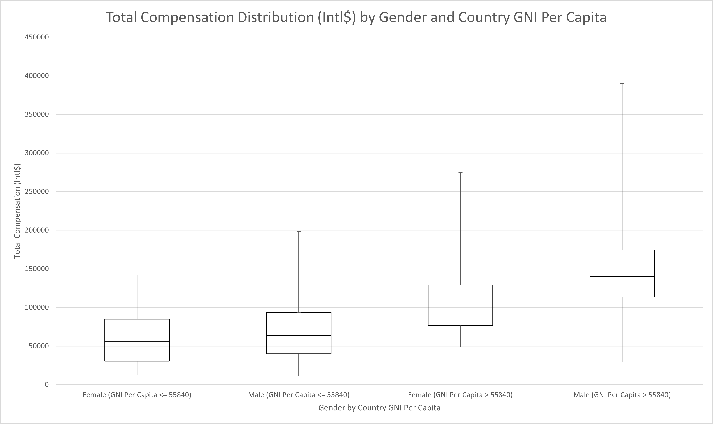
    <figcaption>
        Total Compensation Distribution (Intl$) by Gender and Country GNI Per Capita
    </figcaption>
    </figure>
</a>

|        | Female (GNI Per Capita <=   55840) | Male (GNI Per Capita <= 55840) | Female (GNI Per Capita > 55840) | Male (GNI Per Capita > 55840) |
|--------|------------------------------------|--------------------------------|---------------------------------|-------------------------------|
| Min    | 12,730                             | 11,315                         | 48,880                          | 29,200                        |
| Q1     | 30,646                             | 40,075                         | 76,500                          | 113,527                       |
| Median | 55,634                             | 63,910                         | 118,560                         | 140,000                       |
| Q3     | 84,866                             | 93,588                         | 129,157                         | 174,500                       |
| Max    | 141,773                            | 198,020                        | 275,000                         | 390,000                       |

The gender pay gap is a thoroughly researched phenomenon and all indications point toward the existence of the pay gap within the ServiceNow industry as well. From the population wide perspective, female workers are compensated 85% to 87% of the purchasing power compared to male workers on average as shown in the image above. Using a more traditional wording, women in the ServiceNow industry are compensated between 85 cents and 87 cents per dollar on average when compared to men. For the remainder of this discussion, the gender specific terms "women" and "men" will be used although it should be noted that the survey answers and therefore the charts and data used sexual identity terms "female" and "male" despite the question asking for the individual's gender identity. 

Gender ranks 7th in terms of feature importance measures. This is particularly noteworthy since the selected for importance is technically biased against selecting gender as compared to the 4th, 5th, and 6th ranked features. There is a high probability that gender may in fact be significantly more important but it's importance is being downplayed by the relatively low representation by women and non-binary in the industry. Exploratory experimentation indicated that if women were represented in similar proportion to their global population representation without changing the compensation distribution difference, it is very likely that gender would have appeared in the top 3 features. 

Furthermore, women are also severely underrepresented in the ServiceNow industry. While women compose around 50% of the world population (and similar on a country by country basis), they only compose around 17% of the ServiceNow industry according to the survey. It does not appear as though underrepresentation is the cause of the gender pay gap, as not all underrepresented minorities show a similar trend. When discussing the broader impact of the gender pay gap across all industries, however, representation in high compensation fields such as those in the ServiceNow industry is often reported as a significant cause of the overall pay gap. In this way, both representation and the pay gap within the industry are separate issues which need to be addressed if the gender pay gap is to be eliminated.

### Peer Group Comparison

<a href="images/peer-group-comparison-gender.png">
    <figure>
    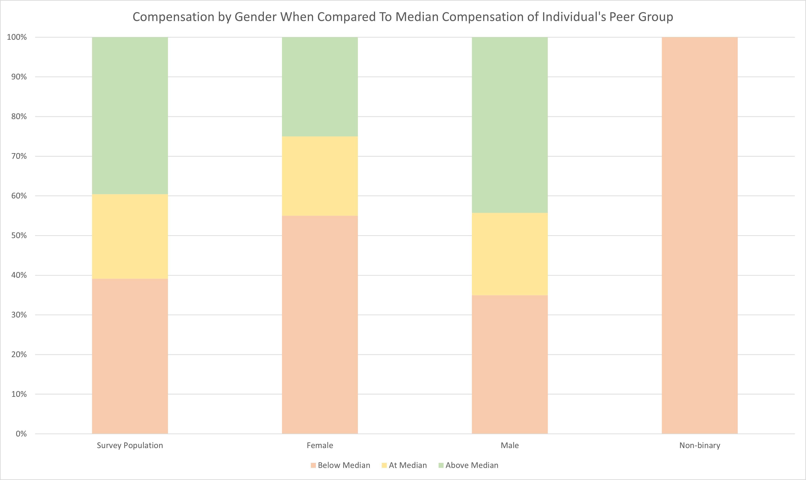
    <figcaption>
        Compensation by Gender When Compared To Median Compensation of Individual's Peer Group
    </figcaption>
    </figure>
</a>

|                   | Below Median | At Median | Above Median |
|-------------------|--------------|-----------|--------------|
| Survey Population | 39.13%       | 21.30%    | 39.57%       |
| Female            | 55.00%       | 20.00%    | 25.00%       |
| Male              | 34.97%       | 20.77%    | 44.26%       |
| Non-binary        | 100.00%      | 0.00%     | 0.00%        |

Due to the politicized nature of the gender pay gap discussion, a greater level of scrutiny is often given to research in this area. As such, extra scrutiny was applied to the Salary Influence Survey analysis in this area to explore common arguments against the gender pay gap. First, a peer group comparison grouped women and men according to the top influencing features of country, years of experience, and percent of compensation that is fixed. Within those groupings, women are significantly more likely than men within the overall population to be compensated below the median value for their peer group. Women were compensated below the median value 55% of the time but were compensated above the median value just 25% of the time. Men on the other hand were compensated below the median just 35% of the time while they were compensated above the median 44% of the time. The figure above depicts these groupings. While non-binary are included in the chart, the data is much less reliable due to a very low representation. The implication here is that the gender pay gap is still present when controlling for the most significant influencing features on compensation.

### Anticipated Total Hours Worked

<a href="images/gender-analysis-anticipated-hours-worked.png">
    <figure>
    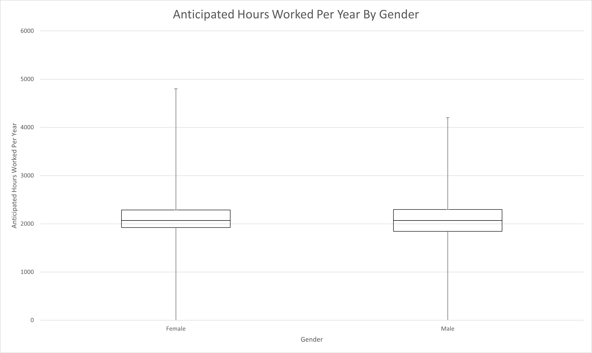
    <figcaption>
        Anticipated Hours Worked Per Year By Gender
    </figcaption>
    </figure>
</a>

|        | Female | Male  |
|--------|--------|-------|
| Min    | 0      | 0     |
| Q1     | 1,924  | 1,844 |
| Median | 2,070  | 2,070 |
| Q3     | 2,288  | 2,299 |
| Max    | 4,800  | 4,200 |

A common argument against the gender pay gap is that women are more likely to take time off to take care of their children or various other gender specific needs. Within the ServiceNow industry, however, women anticipate working the same number of hours as men. In fact, there is a slight bias in the distribution that indicates women anticipate that they may work slightly more hours in most cases. While noting that there is a difference between actual hours worked and anticipated hours worked, any assertion that this result should be discarded because it is not actual hours worked should likewise discard the rest of the survey since the entirety is subject to the same self-report bias.

### Similarity of Work

<a href="images/gender-analysis-skill-rest-api.png">
    <figure>
    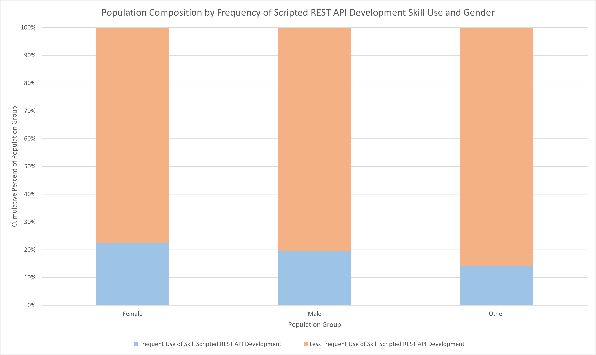
    <figcaption>
        Population Composition by Frequency of Scripted REST API Development Skill Use and Gender
    </figcaption>
    </figure>
</a>

|        | Frequent Use of Skill Scripted   REST API Development | Less Frequent Use of Skill   Scripted REST API Development |
|--------|-------------------------------------------------------|------------------------------------------------------------|
| Female | 22.50%                                                | 77.50%                                                     |
| Male   | 19.67%                                                | 80.33%                                                     |
| Other  | 14.29%                                                | 85.71%                                                     |

<a href="images/gender-analysis-skill-html.png">
    <figure>
    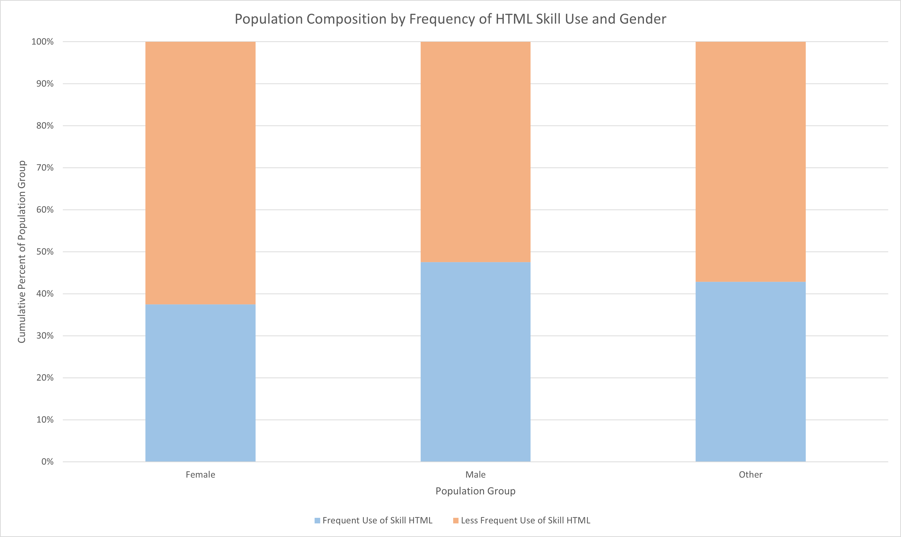
    <figcaption>
        Population Composition by Frequency of HTML Skill Use and Gender
    </figcaption>
    </figure>
</a>

|        | Frequent Use of Skill HTML | Less Frequent Use of Skill HTML |
|--------|----------------------------|---------------------------------|
| Female | 37.50%                     | 62.50%                          |
| Male   | 47.54%                     | 52.46%                          |
| Other  | 42.86%                     | 57.14%                          |

Another common argument is that these statistics do not compare women and men in a side by side, doing the same job type comparison. Firstly, this analysis has already improved the comparison by its limitation to the ServiceNow industry itself. Therefore, the argument that women choose lower paying career paths does not apply. Secondly, the analysis shows strong indications that the skills, products, and knowledge have very little influence on compensation in the industry to begin with. Lastly, for the sake of argument, the analysis indicates that women and men are in fact using job skills in similar frequency and proportional to their overall population distribution. Simply stated, women and men appear to be performing remarkably similar jobs within the survey results analyzed. Of particular note are the two skills that ranked slighly higher than gender in terms of importance: REST API Development and HTML skills. In both cases, depicted above, it is clearly seen that women have a similar probability of using those potentially higher value skills in their jobs as men. Men are slightly more likely to use HTML in the performance of their job duties, but this is unlikely to have the significance to account for the whole gender pay gap. All of these data points combine to indicate that it is highly unlikely that there is any merit to the argument that women are performing different job duties or making different career choices significant enough to cause the gender pay gap.

### Education Similarity

<a href="images/gender-analysis-education.png">
    <figure>
    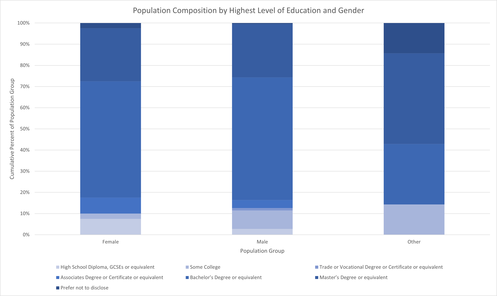
    <figcaption>
        Population Composition by Highest Education Level and Gender
    </figcaption>
    </figure>
</a>

|        | High School Diploma, GCSEs or   equivalent | Some College | Trade or Vocational Degree or   Certificate or equivalent | Associates Degree or Certificate or   equivalent | Bachelor's Degree or equivalent | Master’s Degree or equivalent | Prefer not to disclose |
|--------|--------------------------------------------|--------------|-----------------------------------------------------------|--------------------------------------------------|---------------------------------|-------------------------------|------------------------|
| Female | 7.50%                                      | 2.50%        | 0.00%                                                     | 0.075                                            | 0.55                            | 0.25                          | 0.025                  |
| Male   | 2.73%                                      | 8.74%        | 1.09%                                                     | 3.83%                                            | 57.92%                          | 0.251366                      | 0.005464               |
| Other  | 0.00%                                      | 14.29%       | 0.00%                                                     | 0.00%                                            | 28.57%                          | 0.428571                      | 0.142857               |

A less frequently used argument is that there is a difference in the education level between men and women which contributes, once again generally related to an assumed difference in priorities between the genders. The analysis finds no merit to this argument as men and women have very similar education level distributions as seen in the chart above. Furthermore, in exploring some of the more specific scenarios it was found that in many higher compensation groups, women completed higher levels of education (generally a Master's Degree) despite receiving lower compensation than men with similar profiles.

### Other Explanations

With most of the traditional arguments against the gender pay gap having been addressed, there are still a few other potential rational explanations that can be examined. Women had nearly identical breakdowns of certifications, field of study in college, geographic region, remote work percent, job title, current job level, perception of their contribution, and level of satisfaction compared to men. Women were slightly less likely to consider themselves Senior experienced level instead of Intermediate compared to men but the data shows that those two job levels are more alike than different.

<a href="images/peer-group-comparison-gender-majority.png">
    <figure>
    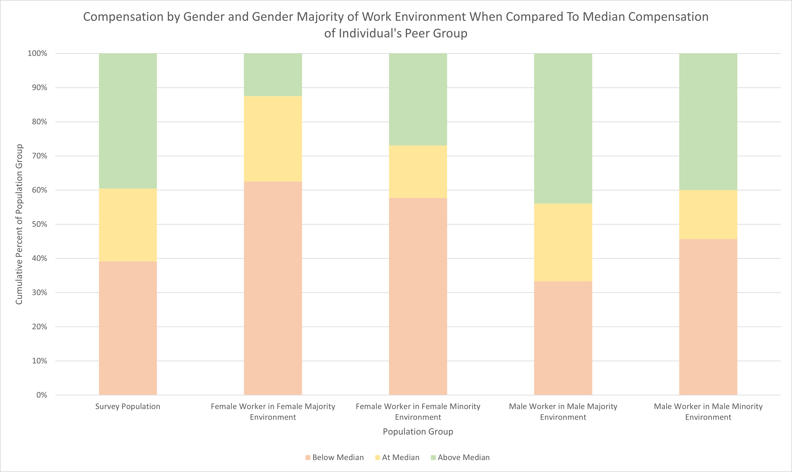
    <figcaption>
        Compensation by Gender When Compared To Median Compensation of Individual's Peer Group
    </figcaption>
    </figure>
</a>

|                                                | Below Median | At Median | Above Median |
|------------------------------------------------|--------------|-----------|--------------|
| Survey Population                              | 39.13%       | 21.30%    | 39.57%       |
| Female Worker in Female   Majority Environment | 62.50%       | 25.00%    | 12.50%       |
| Female Worker in Female   Minority Environment | 57.69%       | 15.38%    | 26.92%       |
| Male Worker in Male Majority   Environment     | 33.33%       | 22.76%    | 43.90%       |
| Male Worker in Male Minority   Environment     | 45.71%       | 14.29%    | 40.00%       |

Lastly, team gender composition was examined to determine if an individual's gender was more or less important than their gender relative to their teammates. In a sense, which is more important, individual identity or similarity? As the chart above shows, men in any environment stay relatively close to the population norm in terms of distribution of compensation at, above, and below the median. Both women and men are impacted by working for teams composed of mostly men. In this situation, women are twice as likely to be compensated above median value compared to women in teams composed of mostly men while men have an increased probability of below median compensation compared to men in teams composed of mostly men. Ultimately, from a compensation standpoint, it appears better to be a man in a woman majority work environment than a woman in any work environment in the ServiceNow industry. It is possible that similarity would have a greater influence if women were better represented in the industry overall but current data indicates that gender is more important than similarity to an individual's team.

## Ethnicity

<a href="images/total-compensation-by-ethnicity.png">
    <figure>
    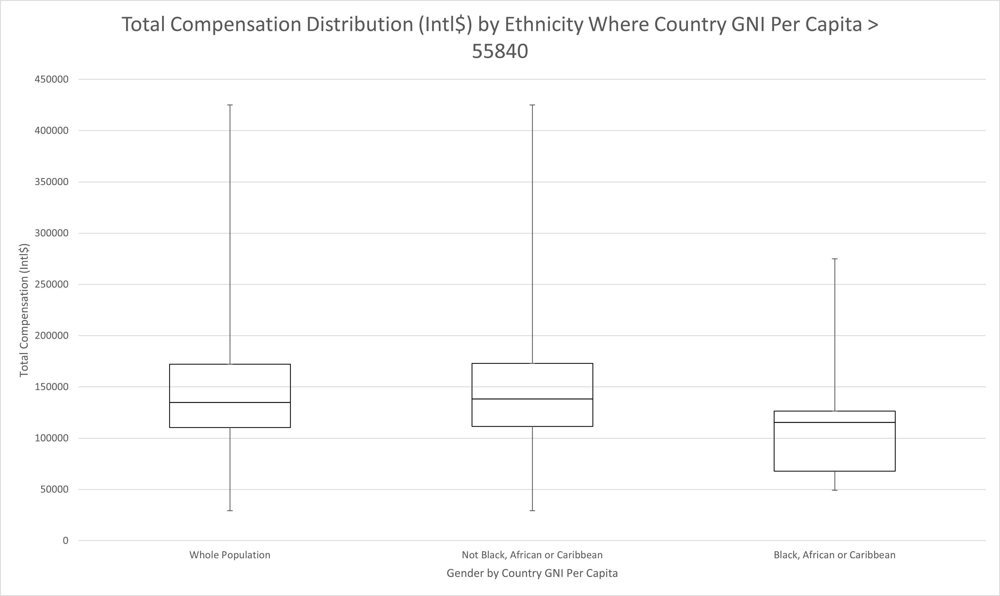
    <figcaption>
        Total Compensation Distribution (Intl$) by Ethnicity Where Country GNI Per Capita > 55840
    </figcaption>
    </figure>
</a>

|         | Whole Population | Not Black, African or Caribbean | Black, African or Caribbean |
|---------|------------------|---------------------------------|-----------------------------|
| Min:    | 29,200           | 29,200                          | 49,200                      |
| Q1:     | 110,514          | 111,541                         | 67,938                      |
| Median: | 135,000          | 138,200                         | 115,500                     |
| Q3:     | 172,100          | 172,913                         | 126,547                     |
| Max:    | 425,000          | 425,000                         | 275,000                     |

Similar to Gender, the racial pay gap is another well documented phenomenon from which the ServiceNow industry is not immune. Interestingly, the impact of ethnicity seems limited to countries with stronger economies since most countries with GNI Per Capita <= 55840 had very low racial diversity. For this reason, the rest of the discussion on ethnicity will focus on countries with a GNI Per Capita > 55840. 

The discussion will also tend to focus more on those identifying as Black, African or Caribbean. Although there was some variation, the other ethnic identities fell within 95% of their respective median compensation values while Black, African, and Carribean people were compensated just 84% of the purchasing power of their peers (84 cents per dollar). Overall, ethnicity is ranked 11th in importance but it is troubling that it is ranked so highly despite such a small proportion of the population being impacted. On one hand, the metric used is slightly biased in favor of features with multiple values such as ethnicity. On the other, the bias should be mitigated by low representation of ethnicities other than White / Caucasian and Asian. Given larger represenation of minority ethnicities, there is a high probability that Ethnicitiy would have ranked much higher.

### Peer Group Comparison

<a href="images/peer-group-comparison-ethnicity.png">
    <figure>
    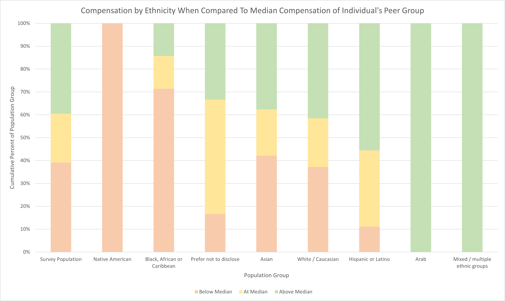
    <figcaption>
        Compensation by Ethnicity When Compared To Median Compensation of Individual's Peer Group
    </figcaption>
    </figure>
</a>

|                                | Below Median | At Median | Above Median |
|--------------------------------|--------------|-----------|--------------|
| Survey Population              | 39.13%       | 21.30%    | 39.57%       |
| Arab                           | 0.00%        | 0.00%     | 100.00%      |
| Asian                          | 42.20%       | 20.18%    | 37.61%       |
| Black, African or Caribbean    | 71.43%       | 14.29%    | 14.29%       |
| Hispanic or Latino             | 11.11%       | 33.33%    | 55.56%       |
| Mixed / multiple ethnic groups | 0.00%        | 0.00%     | 100.00%      |
| Native American                | 100.00%      | 0.00%     | 0.00%        |
| Prefer not to disclose         | 16.67%       | 50.00%    | 33.33%       |
| White / Caucasian              | 37.23%       | 21.28%    | 41.49%       |

Once again, do to the politicized nature of the racial pay gap, extra care will be given to analyze potential covariants and control for alternative arguments. First, the peer group comparison strongly indicates that there are significant differences depending on ethnicity. Once again, although some ethnicities indicate a strong relationship in the peer group comparison, most of the below and above median compensation values for minority ethnicities were within 95% of the median of their peers. Black, African or Caribbean people, however, are below median compensation 70% of the time while also being compensated just 84% of the median value on average. This figure gives a strong indication as to why ethnicity has such strong importances despite the metric biases. Compared to other features, the impact of ethnicity is quite extreme despite impacting smaller population groups.

### Anticipated Work Hours

<a href="images/ethnicity-analysis-anticipated-hours-worked.png">
    <figure>
    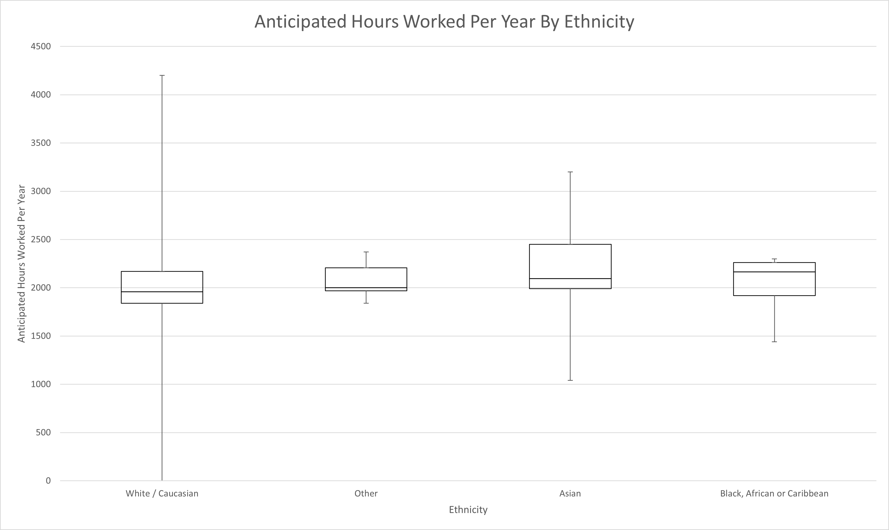
    <figcaption>
        Anticipated Hours Worked Per Year By Ethnicity
    </figcaption>
    </figure>
</a>

|        | White / Caucasian | Other | Asian | Black, African or Caribbean |
|--------|-------------------|-------|-------|-----------------------------|
| Min    | 0                 | 1,840 | 1,040 | 1,440                       |
| Q1     | 1,840             | 1,968 | 1,992 | 1,920                       |
| Median | 1,960             | 2,000 | 2,096 | 2,165                       |
| Q3     | 2,169             | 2,208 | 2,450 | 2,263                       |
| Max    | 4,200             | 2,370 | 3,200 | 2,300                       |

The first potential covariant to examine is anticipated work hours this year. In this case, Black, African or Caribbean respondents anticipate working on average 26 work days (8hr) per year more than their White / Caucasian counterparts. Counting weekends, that is over a month of extra work anticipated despite being compensated below median compared to their peers.

### Similartiy of Work

<a href="images/ethnicity-analysis-skill-rest-api.png">
    <figure>
    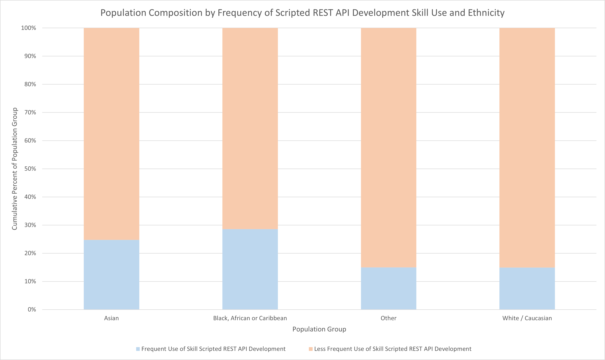
    <figcaption>
        Population Composition by Frequency of Scripted REST API Development Skill Use and Ethnicity
    </figcaption>
    </figure>
</a>

|                             | Frequent Use of Skill Scripted   REST API Development | Less Frequent Use of Skill   Scripted REST API Development |
|-----------------------------|-------------------------------------------------------|------------------------------------------------------------|
| Asian                       | 24.77%                                                | 75.23%                                                     |
| Black, African or Caribbean | 28.57%                                                | 71.43%                                                     |
| Other                       | 15.00%                                                | 85.00%                                                     |
| White / Caucasian           | 14.89%                                                | 85.11%                                                     |

<a href="images/ethnicity-analysis-skill-html.png">
    <figure>
    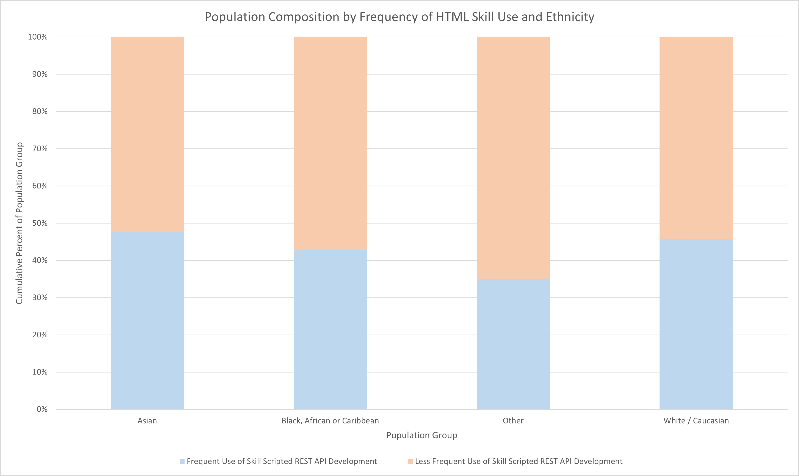
    <figcaption>
        Population Composition by Frequency of HTML Skill Use and Ethnicity
    </figcaption>
    </figure>
</a>

|                             | Frequent Use of Skill Scripted   REST API Development | Less Frequent Use of Skill   Scripted REST API Development |
|-----------------------------|-------------------------------------------------------|------------------------------------------------------------|
| Asian                       | 47.71%                                                | 52.29%                                                     |
| Black, African or Caribbean | 42.86%                                                | 57.14%                                                     |
| Other                       | 35.00%                                                | 65.00%                                                     |
| White / Caucasian           | 45.74%                                                | 54.26%                                                     |

In terms of similarity of work, the only significant difference is that Black, African or Caribbean respondents are almost twice as likely as White / Caucasian respondents to frequently make use of the higher value skill of Scripted REST API Development. With Scripted REST API Development and HTML skills having the strongest influence in terms of skills use in the respondents current role, there is no indication that the difference in compensation is due to covariance between ethnicity and value of skills used. If anything, Black, African or Caribbean respondents should expect to be compensated higher than median at a higher rate than average based on their skills usage if anything.

### Education Similarity

<a href="images/ethnicity-analysis-education.png">
    <figure>
    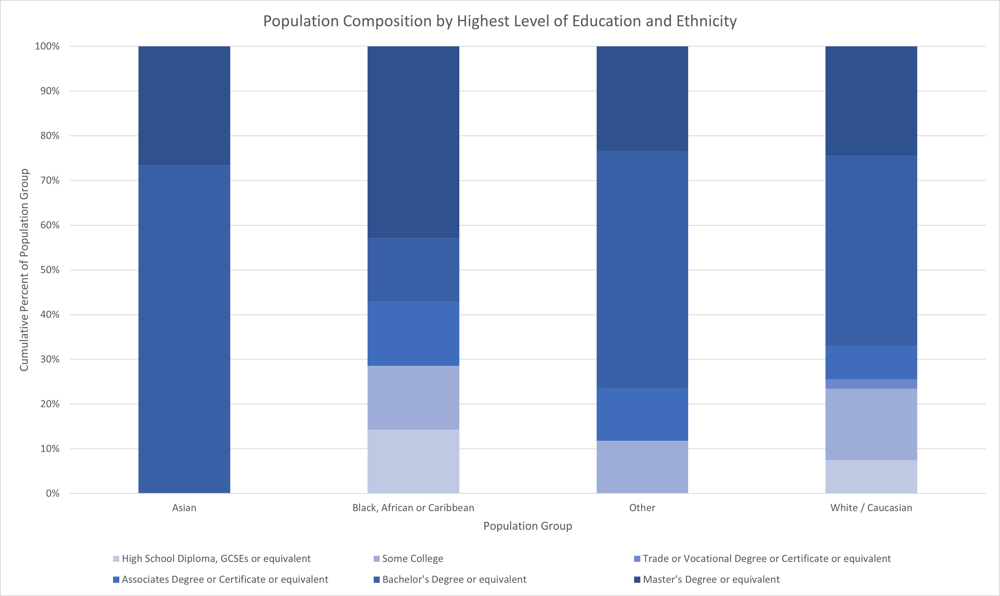
    <figcaption>
        Population Composition by Highest Level of Education and Ethnicity
    </figcaption>
    </figure>
</a>

|                             | High School Diploma, GCSEs or   equivalent | Some College | Trade or Vocational Degree or Certificate or   equivalent | Associates Degree or Certificate or   equivalent | Bachelor's Degree or equivalent | Master’s Degree or equivalent |
|-----------------------------|--------------------------------------------|--------------|-----------------------------------------------------------|--------------------------------------------------|---------------------------------|-------------------------------|
| Asian                       | 0.00%                                      | 0.00%        | 0.00%                                                     | 0.00%                                            | 73.39%                          | 26.61%                        |
| Black, African or Caribbean | 14.29%                                     | 14.29%       | 0.00%                                                     | 14.29%                                           | 14.29%                          | 42.86%                        |
| Other                       | 0.00%                                      | 10.00%       | 0.00%                                                     | 10.00%                                           | 45.00%                          | 20.00%                        |
| White / Caucasian           | 7.45%                                      | 15.96%       | 2.13%                                                     | 7.45%                                            | 42.55%                          | 24.47%                        |

According to education, the distribution once again seems to indicate that minorities in general operate under higher expectations for lower compensation. Black, African or Caribbean respondents were significantly more likely to have earned a Master's Degree compared to either the White / Caucasian or the Asian majority groups. They are also more likely to have only a High School Diploma or equivalent but it is important to note that level of education in the ServiceNow industry is correlated with higher compensation and unlikely to influence significantly higher rates of below median compensation. Therefore, even from an education standpoint, Black, African, or Caribbean respondents should expect to be at median or above at a significantly higher rate.

### Other Explanations

While there is little indication that other features from the dataset significantly impact compensation, it is still worth examining a few remaining trends since some interactions between features may have a compounding effect not detected by the analysis methods used. Unlike with gender, where men and women were fairly comparable in the remaining categories, there are some significant differences between ethnicities in the remaining areas. For example, although all ethnicity groups are represented across the different job roles in a similar distribution, Black, African and Caribbean people are slightly more likely to have no certifications and also are more likely to have completed a business related degree as opposed to a technology specific degree compared to other ethnicities. They are also more likely to identify their skill level as intermediate as opposed to senior, similar to women. 

More interestingly, Black, African, and Caribbean people are about 3 times as likely to believe their organizations would not be negatively impacted if they left or that their organization would not find it challenging to replace them. Overall, they appear to feel much more replaceable in their roles. This is particularly noteworthy as this was the only group found where more than a third felt that they were replaceable. There are many possible interpretations and there is no one positive or negative interpretation that is more likely than any other with the given data. The purpose of highlighting it here is merely to call out the anomaly of such a significant proportion of any given population in the data holding this view. Every other group reviewed overwhelmingly felt that their contributions were in some way difficult to replace.

Lastly, it is worth noting that similar to the gender analysis, there was an indication that similarity to the ethnic majority of one's team may have some small impact on compensation. Overwhelmingly however, it is far better to be White / Caucasian in a majority-minority team than to be a minority ethnicity on any team from a compensation standpoint.

## Disability Status

<a href="images/peer-group-comparison-disability-status.png">
    <figure>
    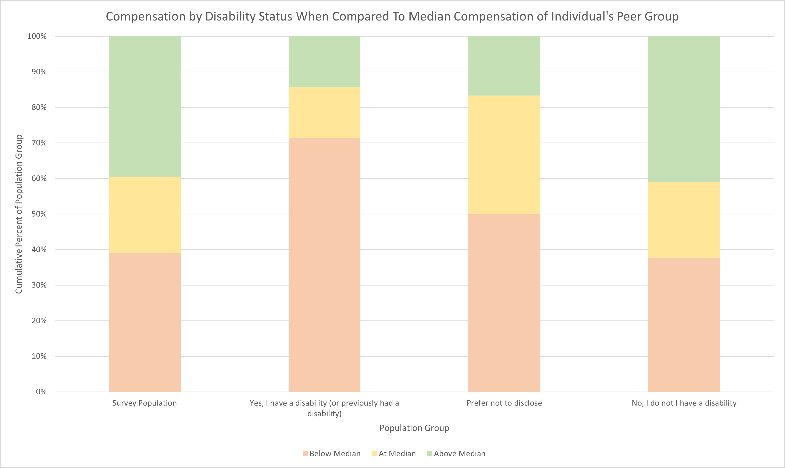
    <figcaption>
        Compensation by Disability Status When Compared To Median Compensation of Individual's Peer Group
    </figcaption>
    </figure>
</a>

|                                                             | Below Median | At Median | Above Median |
|-------------------------------------------------------------|--------------|-----------|--------------|
| Survey Population                                           | 39.13%       | 21.30%    | 39.57%       |
| Yes, I have a disability (or   previously had a disability) | 71.43%       | 14.29%    | 14.29%       |
| Prefer not to disclose                                      | 50.00%       | 33.33%    | 16.67%       |
| No, I do not I have a   disability                          | 37.79%       | 21.20%    | 41.01%       |

Disability status was ranked 40th out 92 features in terms of importance. Although the individual impact indicates that disability has a similarly strong influence to other demographic features, the overall importance rank is quite low. This was largely in part due to the low representation within the industry.

## Geographic Region

<a href="images/peer-group-comparison-us-bea-region.png">
    <figure>
    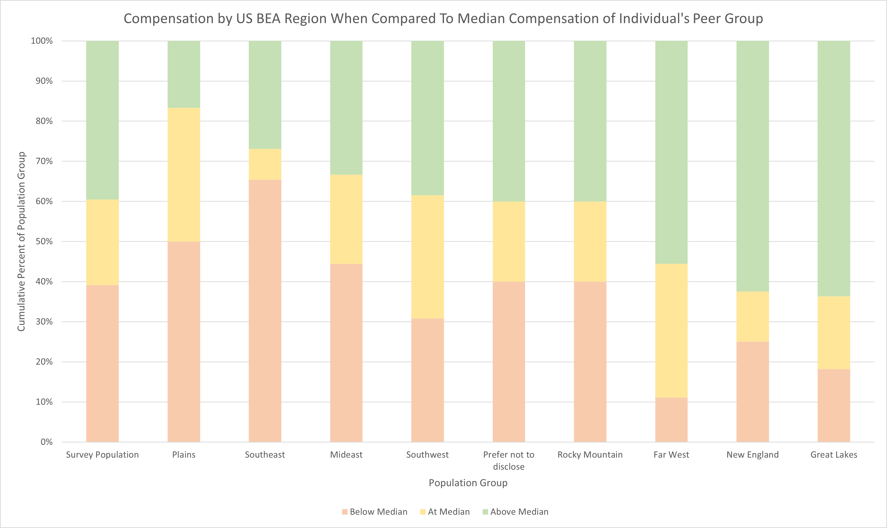
    <figcaption>
        Compensation by US BEA Region When Compared To Median Compensation of Individual's Peer Group
    </figcaption>
    </figure>
</a>

|                        | Below Median | At Median | Above Median |
|------------------------|--------------|-----------|--------------|
| Survey Population      | 39.13%       | 21.30%    | 39.57%       |
| Far West               | 11.11%       | 33.33%    | 55.56%       |
| Great Lakes            | 18.18%       | 18.18%    | 63.64%       |
| Mideast                | 44.44%       | 22.22%    | 33.33%       |
| New England            | 25.00%       | 12.50%    | 62.50%       |
| Plains                 | 50.00%       | 33.33%    | 16.67%       |
| Prefer not to disclose | 40.00%       | 20.00%    | 40.00%       |
| Rocky Mountain         | 40.00%       | 20.00%    | 40.00%       |
| Southeast              | 65.38%       | 7.69%     | 26.92%       |
| Southwest              | 30.77%       | 30.77%    | 38.46%       |

<a href="images/peer-group-comparison-india-province.png">
    <figure>
    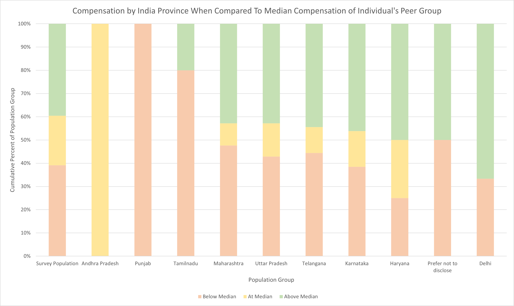
    <figcaption>
        Compensation by India Province When Compared To Median Compensation of Individual's Peer Group
    </figcaption>
    </figure>
</a>

|                        | Below Median | At Median | Above Median |
|------------------------|--------------|-----------|--------------|
| Survey Population      | 39.13%       | 21.30%    | 39.57%       |
| Andhra Pradesh         | 0.00%        | 100.00%   | 0.00%        |
| Punjab                 | 100.00%      | 0.00%     | 0.00%        |
| Tamilnadu              | 80.00%       | 0.00%     | 20.00%       |
| Maharashtra            | 47.62%       | 9.52%     | 42.86%       |
| Uttar Pradesh          | 42.86%       | 14.29%    | 42.86%       |
| Telangana              | 44.44%       | 11.11%    | 44.44%       |
| Karnataka              | 38.46%       | 15.38%    | 46.15%       |
| Haryana                | 25.00%       | 25.00%    | 50.00%       |
| Prefer not to disclose | 50.00%       | 0.00%     | 50.00%       |
| Delhi                  | 33.33%       | 0.00%     | 66.67%       |

While country of employment has already been identified as the most important feature, it is still interesting to note that other geographic features still provided yet more information. For example, those in the Southeast Bureau of Economic Analysis region were much more likely to be compensated below median value. Similar could be said for certain regions of India. There is a strong indication that in addition to country economic power, local economic regions also influence compensation. This leaves an open question as to whether metropolitan area economies or other subdivisions have an influence as well. It is very likely that given sufficient data of economic strength for subdivisions of a country, a more accurate compensation prediction model could be generated. If this were to be performed, it would demonstrate that the importance of physical location is even higher to overall compensation than already implied by the current model. Both US and India geographic features ranked 6th and 9th respectively in terms of importance.

## Veteran Status

<a href="images/peer-group-comparison-veteran-status.png">
    <figure>
    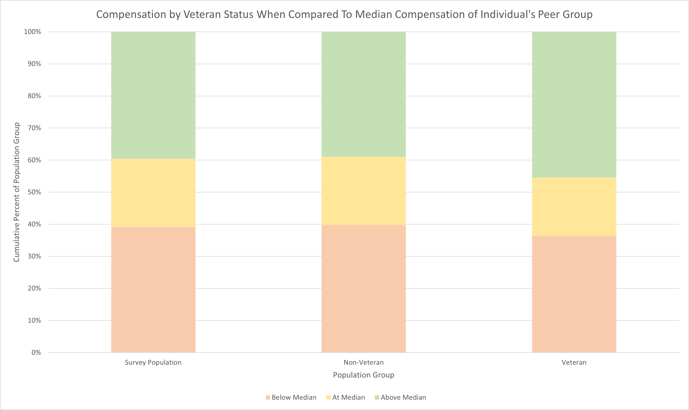
    <figcaption>
        Compensation by Veteran Status When Compared To Median Compensation of Individual's Peer Group
    </figcaption>
    </figure>
</a>

|                   | Below Median | At Median | Above Median |
|-------------------|--------------|-----------|--------------|
| Survey Population | 39.13%       | 21.30%    | 39.57%       |
| Non-Veteran       | 39.81%       | 21.30%    | 38.89%       |
| Veteran           | 36.36%       | 18.18%    | 45.45%       |

Veteran status ranked 78th out of 92 features in terms of importance in predicting compensation.

[1]: /guides/servicenow-salary-influence-survey-2020/methods/#step-4-targeted-feature-analysis