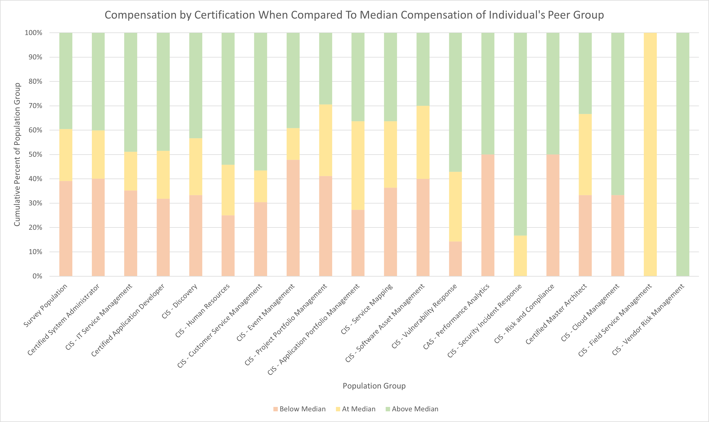
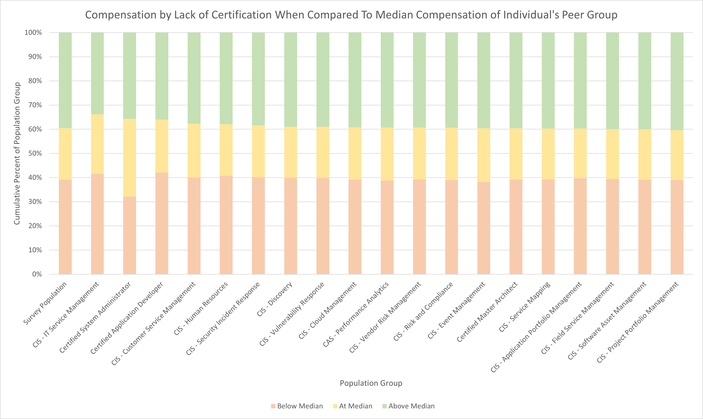
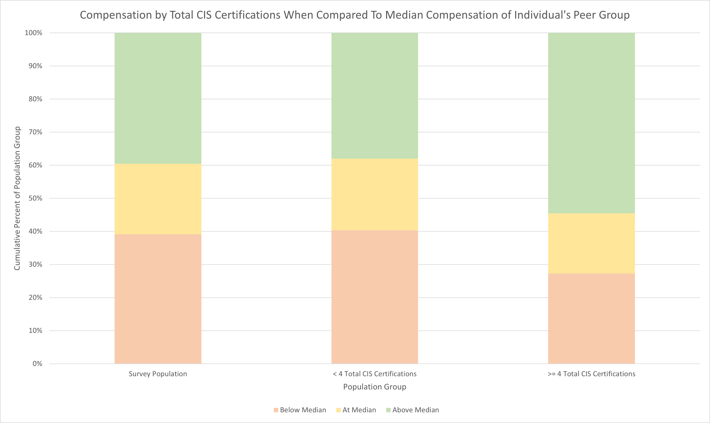
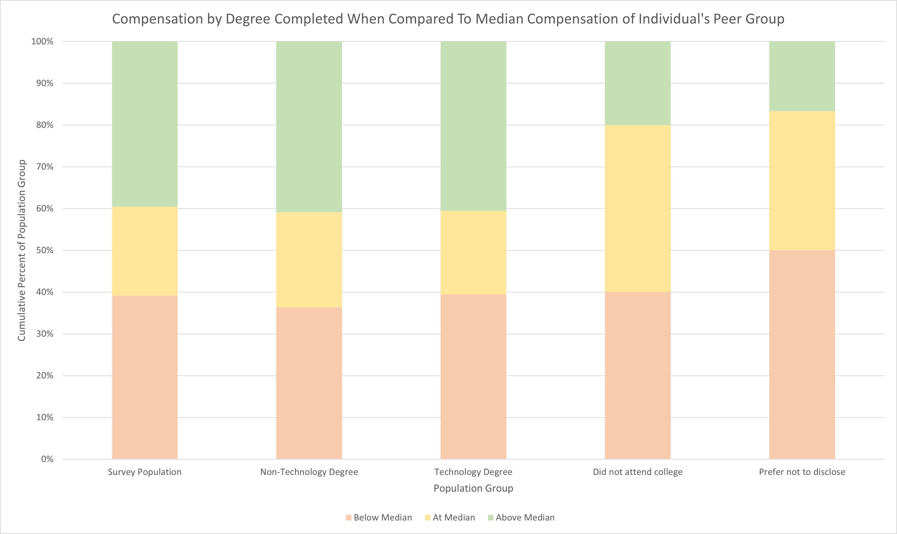
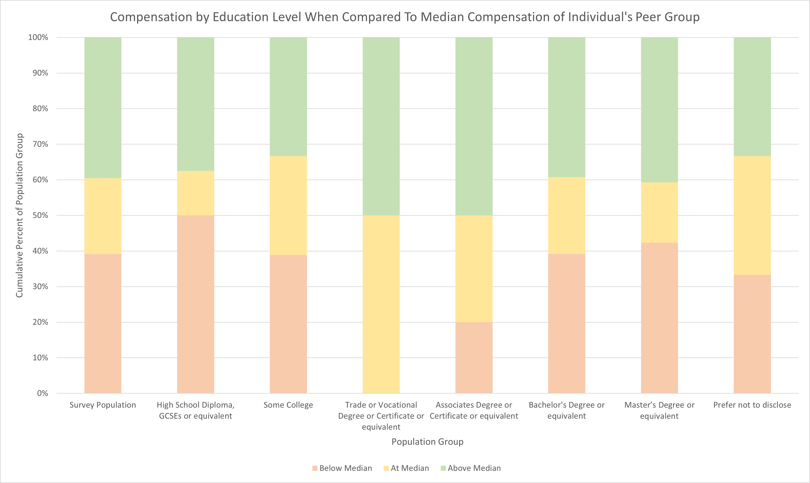

## Certifications

<a href="images/peer-group-comparison-certifications.png">
    <figure>
    
    <figcaption>
        Compensation by Certification When Compared To Median Compensation of Individual's Peer Group
    </figcaption>
    </figure>
</a>

|                                        | Below Median | At Median | Above Median |
|----------------------------------------|--------------|-----------|--------------|
| Survey Population                      | 39.13%       | 21.30%    | 39.57%       |
| Certified System Administrator         | 40.10%       | 19.80%    | 40.10%       |
| CIS - IT Service Management            | 35.23%       | 15.91%    | 48.86%       |
| Certified Application Developer        | 31.82%       | 19.70%    | 48.48%       |
| CIS - Discovery                        | 33.33%       | 23.33%    | 43.33%       |
| CIS - Human Resources                  | 25.00%       | 20.83%    | 54.17%       |
| CIS - Customer Service Management      | 30.43%       | 13.04%    | 56.52%       |
| CIS - Event Management                 | 47.83%       | 13.04%    | 39.13%       |
| CIS - Project Portfolio   Management   | 41.18%       | 29.41%    | 29.41%       |
| CIS - Application Portfolio Management | 27.27%       | 36.36%    | 36.36%       |
| CIS - Service Mapping                  | 36.36%       | 27.27%    | 36.36%       |
| CIS - Software Asset   Management      | 40.00%       | 30.00%    | 30.00%       |
| CIS - Vulnerability Response           | 14.29%       | 28.57%    | 57.14%       |
| CAS - Performance Analytics            | 50.00%       | 0.00%     | 50.00%       |
| CIS - Security Incident   Response     | 0.00%        | 16.67%    | 83.33%       |
| CIS - Risk and Compliance              | 50.00%       | 0.00%     | 50.00%       |
| Certified Master Architect             | 33.33%       | 33.33%    | 33.33%       |
| CIS - Cloud Management                 | 33.33%       | 0.00%     | 66.67%       |
| CIS - Field Service Management         | 0.00%        | 100.00%   | 0.00%        |
| CIS - Vendor Risk Management           | 0.00%        | 0.00%     | 100.00%      |

<a href="images/peer-group-comparison-certifications-lack-of.png">
    <figure>
    
    <figcaption>
        Compensation by Lack of Certification When Compared To Median Compensation of Individual's Peer Group
    </figcaption>
    </figure>
</a>

|                                          | Below Median | At Median | Above Median |
|------------------------------------------|--------------|-----------|--------------|
| Survey Population                        | 39.13%       | 21.30%    | 39.57%       |
| CIS - IT Service Management              | 41.55%       | 24.65%    | 33.80%       |
| Certified   System Administrator         | 32.14%       | 32.14%    | 35.71%       |
| Certified Application   Developer        | 42.07%       | 21.95%    | 35.98%       |
| CIS - Customer Service   Management      | 40.10%       | 22.22%    | 37.68%       |
| CIS - Human Resources                    | 40.78%       | 21.36%    | 37.86%       |
| CIS - Security Incident   Response       | 40.18%       | 21.43%    | 38.39%       |
| CIS - Discovery                          | 40.00%       | 21.00%    | 39.00%       |
| CIS - Vulnerability Response             | 39.91%       | 21.08%    | 39.01%       |
| CIS - Cloud Management                   | 39.21%       | 21.59%    | 39.21%       |
| CAS - Performance Analytics              | 38.84%       | 21.88%    | 39.29%       |
| CIS - Vendor Risk Management             | 39.30%       | 21.40%    | 39.30%       |
| CIS - Risk and Compliance                | 38.94%       | 21.68%    | 39.38%       |
| CIS - Event Management                   | 38.16%       | 22.22%    | 39.61%       |
| Certified Master Architect               | 39.21%       | 21.15%    | 39.65%       |
| CIS - Service Mapping                    | 39.27%       | 21.00%    | 39.73%       |
| CIS - Application Portfolio   Management | 39.73%       | 20.55%    | 39.73%       |
| CIS - Field Service Management           | 39.47%       | 20.61%    | 39.91%       |
| CIS - Software Asset   Management        | 39.09%       | 20.91%    | 40.00%       |
| CIS - Project Portfolio   Management     | 38.97%       | 20.66%    | 40.38%       |

<a href="images/peer-group-comparison-total-cis-certifications.png">
    <figure>
    
    <figcaption>
        Compensation by Total CIS Certifications When Compared To Median Compensation of Individual's Peer Group
    </figcaption>
    </figure>
</a>

|                                 | Below Median | At Median | Above Median |
|---------------------------------|--------------|-----------|--------------|
| Survey Population               | 39.13%       | 21.30%    | 39.57%       |
| < 4 Total CIS   Certifications  | 40.38%       | 21.63%    | 37.98%       |
| >= 4 Total CIS   Certifications | 27.27%       | 18.18%    | 54.55%       |

Overall, most certifications appear to have little influence on compensation. The top two ranked certifications in terms of influence were CIS IT Service Management and Certified Application Developer at 8th and 19th respectively. The ranking of certifications took into consideration both the influence of having the certification and the influence of not having the certification. For the two aforementioned certifications, the difference odds of being compensated above median value compared to one's peers increased by about 13 percentage points. It is interesting to note that these are also the second and third most popular certifications.  The popularity of the ITSM and CAS certifications appears to place them in the perfect position of relevance: rare enough to be of value but popular enough to be considered attainable by employers. The vast majority of certifications, however, have very low rankings with many appearing at the lowest importance ranks. 

While some certifications do appear to have a strong individual importance such as CIS Vendor Management and CIS Cloud Management, their popularity limits the influence on the population as a whole. It is difficult to tell whether the individual influence trend on these certifications would continue if their popularity increased. Certainly, there is at least a level of saturation which when reached, such as the Certified System Administrator certification, where the value is reduced.

This should not be taken to mean that there is no value in most ServiceNow certifications. It is still possible, in fact probable, that certifications act as gatekeepers into specific peer groups. In a scenario where everyone in your peer group completed the same certifications, certifications would be expected to have a low influence on compensation.

## College Education

<a href="images/peer-group-comparison-degree-completed.png">
    <figure>
    
    <figcaption>
        Compensation by Degree Completed When Compared To Median Compensation of Individual's Peer Group
    </figcaption>
    </figure>
</a>

|                        | Below Median | At Median | Above Median |
|------------------------|--------------|-----------|--------------|
| Survey Population      | 39.13%       | 21.30%    | 39.57%       |
| Non-Technology Degree  | 36.36%       | 22.73%    | 40.91%       |
| Technology Degree      | 39.43%       | 20.00%    | 40.57%       |
| Did not attend college | 40.00%       | 40.00%    | 20.00%       |
| Prefer not to disclose | 50.00%       | 33.33%    | 16.67%       |

<a href="images/peer-group-comparison-education-level.png">
    <figure>
    
    <figcaption>
        Compensation by Education Level When Compared To Median Compensation of Individual's Peer Group
    </figcaption>
    </figure>
</a>

|                                                           | Below Median | At Median | Above Median |
|-----------------------------------------------------------|--------------|-----------|--------------|
| Survey Population                                         | 39.13%       | 21.30%    | 39.57%       |
| High School Diploma, GCSEs or   equivalent                | 50.00%       | 12.50%    | 37.50%       |
| Some College                                              | 38.89%       | 27.78%    | 33.33%       |
| Trade or Vocational Degree or   Certificate or equivalent | 0.00%        | 50.00%    | 50.00%       |
| Associates Degree or   Certificate or equivalent          | 20.00%       | 30.00%    | 50.00%       |
| Bachelor's Degree or   equivalent                         | 39.23%       | 21.54%    | 39.23%       |
| Master’s Degree or equivalent                             | 42.37%       | 16.95%    | 40.68%       |
| Prefer not to disclose                                    | 33.33%       | 33.33%    | 33.33%       |

Highest level of education completed is ranked 28th out of 92 features in terms of importance in predicting compensation. The calculation method was also biased in favor of features like Education Level with multiple values. It is likely that the importance is actually lower than indicated, despite it already having relatively low importance.