## Current Job Level

<a href="images/peer-group-comparison-job-level.png">
    <figure>
    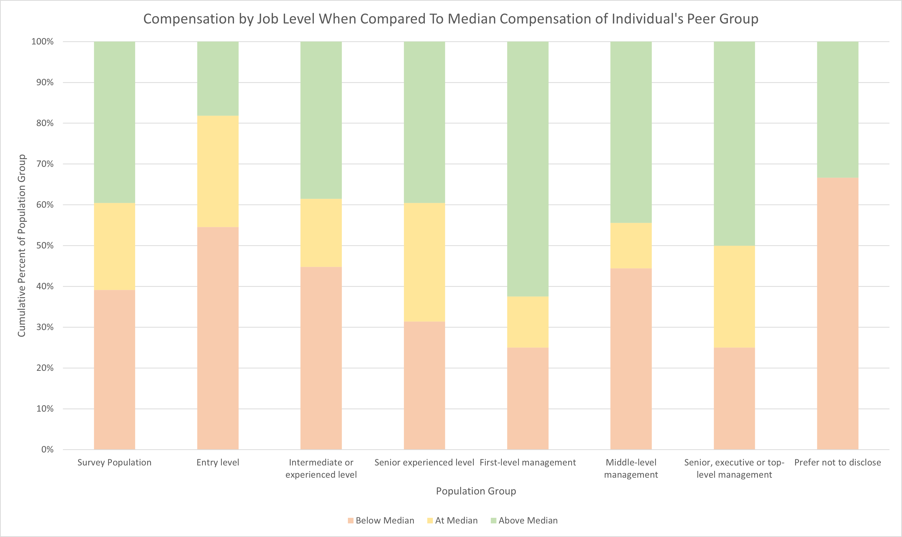
    <figcaption>
        Compensation by Current Job Level When Compared To Median Compensation of Individual's Peer Group
    </figcaption>
    </figure>
</a>

|                                             | Below Median | At Median | Above Median |
|---------------------------------------------|--------------|-----------|--------------|
| Entry level                                 | 54.55%       | 27.27%    | 18.18%       |
| Intermediate or   experienced level         | 44.79%       | 16.67%    | 38.54%       |
| Senior experienced level                    | 31.40%       | 29.07%    | 39.53%       |
| First-level management                      | 25.00%       | 12.50%    | 62.50%       |
| Middle-level management                     | 44.44%       | 11.11%    | 44.44%       |
| Senior, executive or   top-level management | 25.00%       | 25.00%    | 50.00%       |
| Prefer not to disclose                      | 66.67%       | 0.00%     | 33.33%       |

<a href="images/peer-group-comparison-job-level-summary.png">
    <figure>
    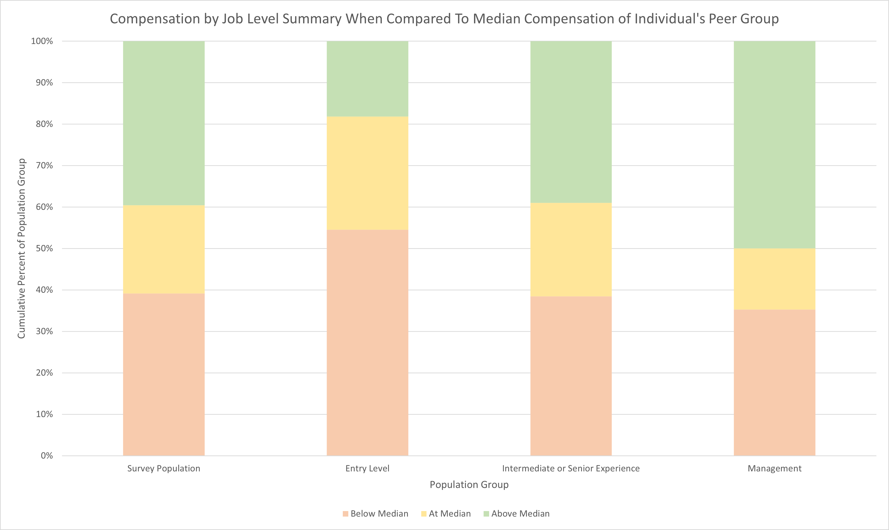
    <figcaption>
        Compensation by Current Job Level Summary When Compared To Median Compensation of Individual's Peer Group
    </figcaption>
    </figure>
</a>

|                                     | Below Median | At Median | Above Median |
|-------------------------------------|--------------|-----------|--------------|
| Survey Population                   | 39.13%       | 21.30%    | 39.57%       |
| Entry Level                         | 54.55%       | 27.27%    | 18.18%       |
| Intermediate or Senior   Experience | 38.46%       | 22.53%    | 39.01%       |
| Management                          | 35.29%       | 14.71%    | 50.00%       |

Current job level is ranked at 31st and 58th out of 92 features in terms of importance in predicting compensation. The highest rank refers to the breakdown shown in the second chart while the lowest ranking breakdown is not shown. The summary was used to mitigate the metric bias in favor of features with many values. Overall, even in the best case, current job level has relatively low importance.

## Skills Usage

<a href="images/peer-group-comparison-skill-usage.png">
    <figure>
    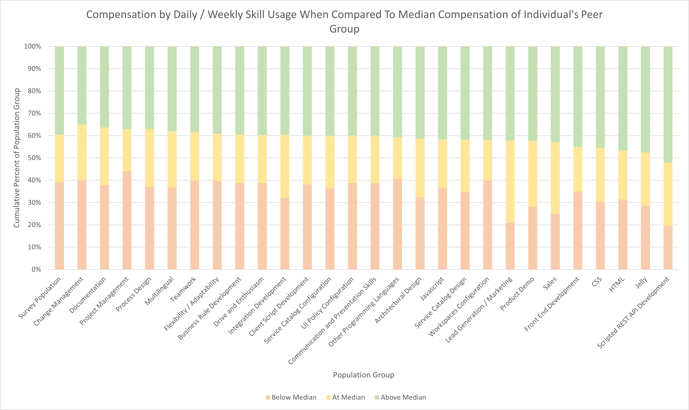
    <figcaption>
        Compensation by Daily / Weekly Skill Usage When Compared To Median Compensation of Individual's Peer Group
    </figcaption>
    </figure>
</a>

|                                         | Below Median | At Median | Above Median |
|-----------------------------------------|--------------|-----------|--------------|
| Survey Population                       | 39.13%       | 21.30%    | 39.57%       |
| Change Management                       | 40.00%       | 25.00%    | 35.00%       |
| Documentation                           | 37.90%       | 25.81%    | 36.29%       |
| Project Management                      | 44.06%       | 18.88%    | 37.06%       |
| Process Design                          | 37.08%       | 25.84%    | 37.08%       |
| Multilingual                            | 36.71%       | 25.32%    | 37.97%       |
| Teamwork                                | 39.81%       | 21.76%    | 38.43%       |
| Flexibility / Adaptability              | 39.61%       | 21.26%    | 39.13%       |
| Business Rule Development               | 38.85%       | 21.66%    | 39.49%       |
| Drive and Enthusiasm                    | 38.73%       | 21.57%    | 39.71%       |
| Integration Development                 | 32.05%       | 28.21%    | 39.74%       |
| Client Script Development               | 38.18%       | 21.82%    | 40.00%       |
| Service Catalog Configuration           | 36.36%       | 23.64%    | 40.00%       |
| UI Policy Configuration                 | 0.3875       | 0.2125    | 0.4          |
| Communication and Presentation   Skills | 38.68%       | 21.23%    | 40.09%       |
| Other Programming Languages             | 40.74%       | 18.52%    | 40.74%       |
| Architectural Design                    | 32.32%       | 26.26%    | 41.41%       |
| Javascript                              | 36.57%       | 21.71%    | 41.71%       |
| Service Catalog Design                  | 34.69%       | 23.47%    | 41.84%       |
| Workspaces Configuration                | 0.4          | 0.18      | 0.42         |
| Lead Generation / Marketing             | 21.05%       | 36.84%    | 42.11%       |
| Product Demo                            | 28.13%       | 29.69%    | 42.19%       |
| Sales                                   | 25.00%       | 32.14%    | 42.86%       |
| Front End Development                   | 35.00%       | 20.00%    | 45.00%       |
| CSS                                     | 30.23%       | 24.42%    | 45.35%       |
| HTML                                    | 31.43%       | 21.90%    | 46.67%       |
| Jelly                                   | 28.57%       | 23.81%    | 47.62%       |
| Scripted REST API Development           | 19.57%       | 28.26%    | 52.17%       |

<a href="images/peer-group-comparison-infrequent-skill-usage.png">
    <figure>
    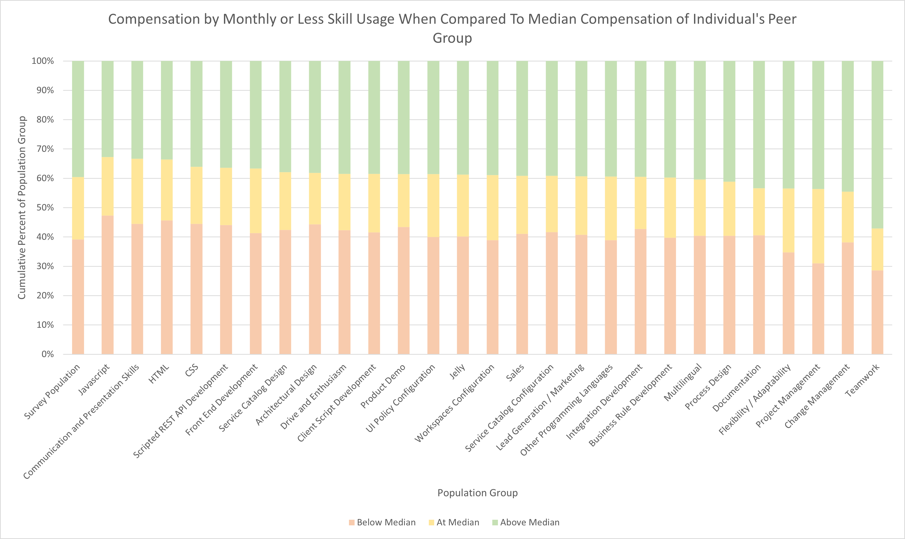
    <figcaption>
        Compensation by Monthly or Less Skill Usage When Compared To Median Compensation of Individual's Peer Group
    </figcaption>
    </figure>
</a>

|                                         | Below Median | At Median | Above Median |
|-----------------------------------------|--------------|-----------|--------------|
| Survey Population                       | 39.13%       | 21.30%    | 39.57%       |
| Javascript                              | 47.27%       | 20.00%    | 32.73%       |
| Communication and Presentation   Skills | 44.44%       | 22.22%    | 33.33%       |
| HTML                                    | 45.60%       | 20.80%    | 33.60%       |
| CSS                                     | 44.44%       | 19.44%    | 36.11%       |
| Scripted REST API Development           | 44.02%       | 19.57%    | 36.41%       |
| Front End Development                   | 41.33%       | 22.00%    | 36.67%       |
| Service Catalog Design                  | 42.42%       | 19.70%    | 37.88%       |
| Architectural Design                    | 44.27%       | 17.56%    | 38.17%       |
| Drive and Enthusiasm                    | 42.31%       | 19.23%    | 38.46%       |
| Client Script Development               | 41.54%       | 20.00%    | 38.46%       |
| Product Demo                            | 43.37%       | 18.07%    | 38.55%       |
| UI Policy Configuration                 | 40.00%       | 21.43%    | 38.57%       |
| Jelly                                   | 40.19%       | 21.05%    | 38.76%       |
| Workspaces Configuration                | 38.89%       | 22.22%    | 38.89%       |
| Sales                                   | 41.09%       | 19.80%    | 39.11%       |
| Service Catalog Configuration           | 41.67%       | 19.17%    | 39.17%       |
| Lead Generation / Marketing             | 40.76%       | 19.91%    | 39.34%       |
| Other Programming Languages             | 38.92%       | 21.67%    | 39.41%       |
| Integration Development                 | 42.76%       | 17.76%    | 39.47%       |
| Business Rule Development               | 39.73%       | 20.55%    | 39.73%       |
| Multilingual                            | 40.40%       | 19.21%    | 40.40%       |
| Process Design                          | 40.43%       | 18.44%    | 41.13%       |
| Documentation                           | 40.57%       | 16.04%    | 43.40%       |
| Flexibility / Adaptability              | 34.78%       | 21.74%    | 43.48%       |
| Project Management                      | 31.03%       | 25.29%    | 43.68%       |
| Change Management                       | 38.18%       | 17.27%    | 44.55%       |
| Teamwork                                | 28.57%       | 14.29%    | 57.14%       |

<a href="images/peer-group-comparison-skill-score.png">
    <figure>
    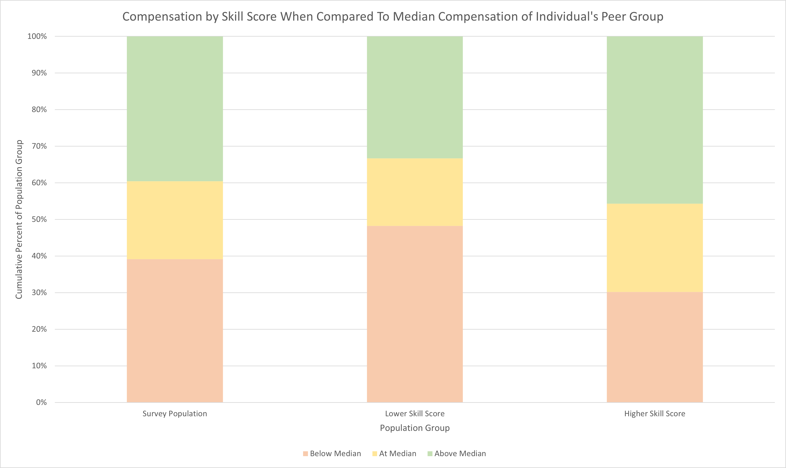
    <figcaption>
        Compensation by Skill Score Compared To Median Compensation of Individual's Peer Group
    </figcaption>
    </figure>
</a>

|                    | Below Median | At Median | Above Median |
|--------------------|--------------|-----------|--------------|
| Survey Population  | 39.13%       | 21.30%    | 39.57%       |
| Lower Skill Score  | 48.25%       | 18.42%    | 33.33%       |
| Higher Skill Score | 30.17%       | 24.14%    | 45.69%       |

Skill importance rankings for predicting compensation are distributed all across the list. The two highest in terms of importance are Scripted REST API Development and HTML which are ranked 4th and 5th respectively. Oddly, similar skills such as CSS, Front End Development, and Integration Development are a little further down the list. The importance of most skills appears to be highly circumstantial as opposed to a general trend across the population. Whereas most of the demographic and certification features that rank high in importance remain important regardless of decision tree construction, skills will vary greatly in importance depending on which early decision tree splits are chosen. Front end development skills and integration skills do seem to rank among the most important skills regardless of initial splits though, so there is some indication that their appearance is significant and not simply random chance. In the current models, what drives their importance is both the increased likelihood of being compensated above median value when frequently using those skills and the increased likelihood of being compensated below median value when the frequency of using those skills is lower. Both of these skill sets are considered niche skills in the industry, so there is also some common sense support for the results as well.

## ServiceNow Product Usage

<a href="images/peer-group-comparison-product-usage.png">
    <figure>
    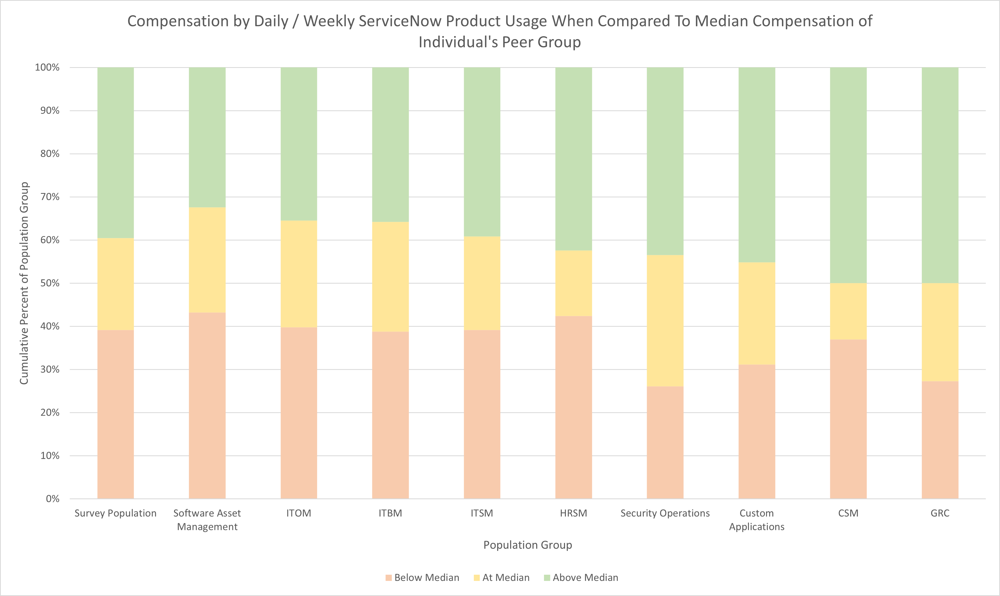
    <figcaption>
        Compensation by Daily / Weekly ServiceNow Product Usage When Compared To Median Compensation of Individual's Peer Group
    </figcaption>
    </figure>
</a>

|                           | Below Median | At Median | Above Median |
|---------------------------|--------------|-----------|--------------|
| Survey Population         | 39.13%       | 21.30%    | 39.57%       |
| Software Asset Management | 43.24%       | 24.32%    | 32.43%       |
| ITOM                      | 39.78%       | 24.73%    | 35.48%       |
| ITBM                      | 38.81%       | 25.37%    | 35.82%       |
| ITSM                      | 39.18%       | 21.65%    | 39.18%       |
| HRSM                      | 42.42%       | 15.15%    | 42.42%       |
| Security Operations       | 26.09%       | 30.43%    | 43.48%       |
| Custom Applications       | 31.18%       | 23.66%    | 45.16%       |
| CSM                       | 36.96%       | 13.04%    | 50.00%       |
| GRC                       | 27.27%       | 22.73%    | 50.00%       |

<a href="images/peer-group-comparison-infrequent-product-usage.png">
    <figure>
    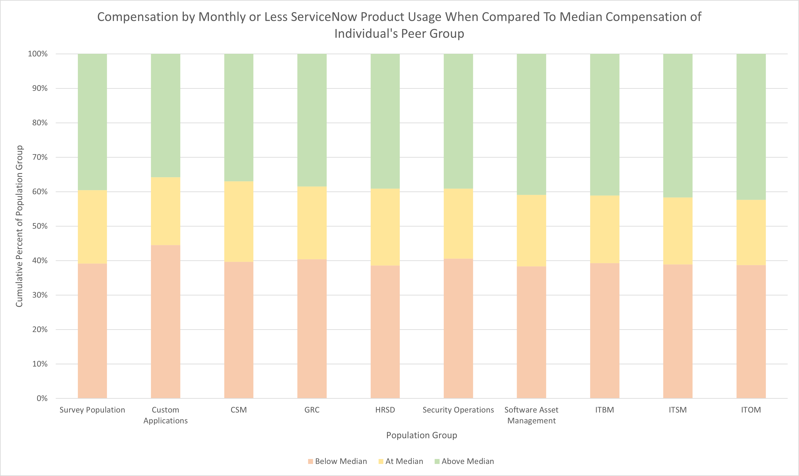
    <figcaption>
        Compensation by Monthly or Less ServiceNow Product Usage When Compared To Median Compensation of Individual's Peer Group
    </figcaption>
    </figure>
</a>

|                           | Below Median | At Median | Above Median |
|---------------------------|--------------|-----------|--------------|
| Survey Population         | 39.13%       | 21.30%    | 39.57%       |
| Custom Applications       | 44.53%       | 19.71%    | 35.77%       |
| CSM                       | 39.67%       | 23.37%    | 36.96%       |
| GRC                       | 40.38%       | 21.15%    | 38.46%       |
| HRSD                      | 38.58%       | 22.34%    | 39.09%       |
| Security Operations       | 40.58%       | 20.29%    | 39.13%       |
| Software Asset Management | 38.34%       | 20.73%    | 40.93%       |
| ITBM                      | 39.26%       | 19.63%    | 41.10%       |
| ITSM                      | 38.89%       | 19.44%    | 41.67%       |
| ITOM                      | 38.69%       | 18.98%    | 42.34%       |

<a href="images/peer-group-comparison-number-of-products-used-frequently.png">
    <figure>
    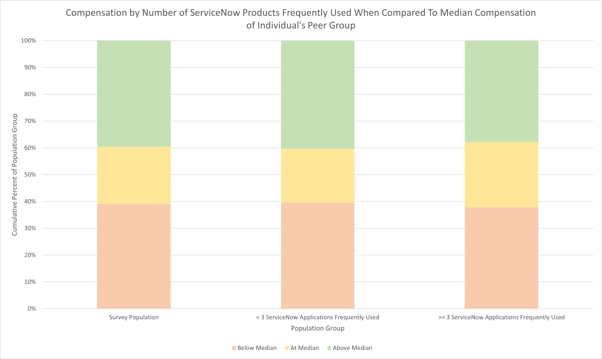
    <figcaption>
        Compensation by Number of ServiceNow Products Used Frequently When Compared To Median Compensation of Individual's Peer Group
    </figcaption>
    </figure>
</a>

|                                                | Below Median | At Median | Above Median |
|------------------------------------------------|--------------|-----------|--------------|
| Survey Population                              | 39.13%       | 21.30%    | 39.57%       |
| < 3 ServiceNow Applications   Frequently Used  | 39.63%       | 20.12%    | 40.24%       |
| >= 3 ServiceNow   Applications Frequently Used | 37.88%       | 24.24%    | 37.88%       |

Most of the ServiceNow Product Usage related features were mid-ranked in terms of importance in predicting compensation. Custom Applications and CSM were ranked the highest among these at 12th and 23rd respectively. Both were associated with increased probabilities of being compensated above median value when using the products frequently and also being compensated below median value when using the products less frequently. Most product usage was not associated with a significant change in the probabilities in either direction.

The decision tree models also indicated that broadly using more of all products may be associated with higher compensation as well. Due to the low importance score of product usage, this was not examined further and the higher importance of skills and capabilities was accepted.

## ServiceNow Capability Usage

<a href="images/peer-group-comparison-capability-usage.png">
    <figure>
    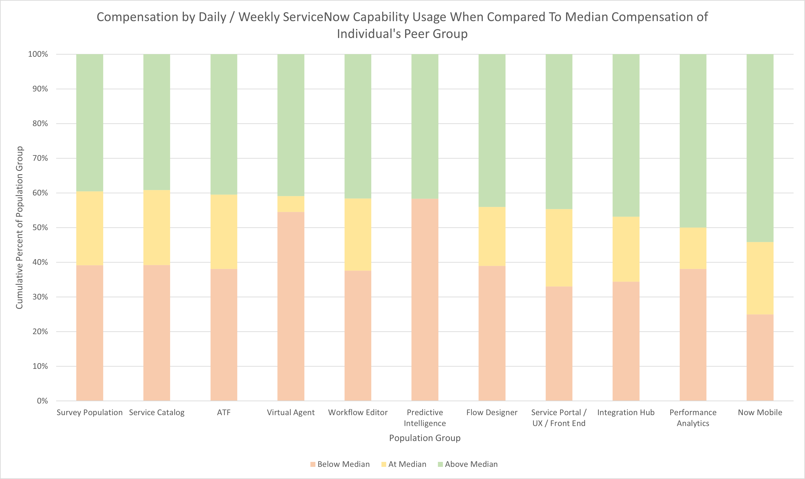
    <figcaption>
        Compensation by Daily / Weekly ServiceNow Capability Usage When Compared To Median Compensation of Individual's Peer Group
    </figcaption>
    </figure>
</a>

|                                   | Below Median | At Median | Above Median |
|-----------------------------------|--------------|-----------|--------------|
| Survey Population                 | 39.13%       | 21.30%    | 39.57%       |
| Service Catalog                   | 39.19%       | 21.62%    | 39.19%       |
| ATF                               | 38.10%       | 21.43%    | 40.48%       |
| Virtual Agent                     | 54.55%       | 4.55%     | 40.91%       |
| Workflow Editor                   | 37.60%       | 20.80%    | 41.60%       |
| Predictive Intelligence           | 58.33%       | 0.00%     | 41.67%       |
| Flow Designer                     | 38.98%       | 16.95%    | 44.07%       |
| Service Portal / UX / Front   End | 33.01%       | 22.33%    | 44.66%       |
| Integration Hub                   | 34.38%       | 18.75%    | 46.88%       |
| Performance Analytics             | 38.10%       | 11.90%    | 50.00%       |
| Now Mobile                        | 25.00%       | 20.83%    | 54.17%       |

<a href="images/peer-group-comparison-infrequent-capability-usage.png">
    <figure>
    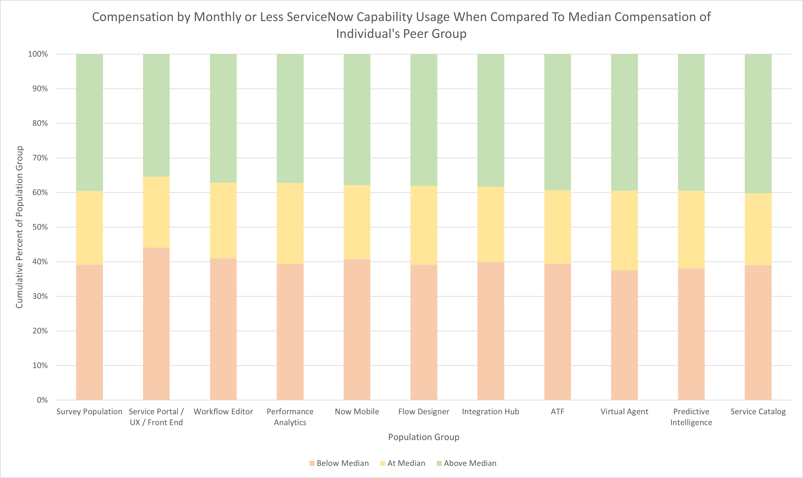
    <figcaption>
        Compensation by Monthly or Less ServiceNow Capability Usage When Compared To Median Compensation of Individual's Peer Group
    </figcaption>
    </figure>
</a>

|                                   | Below Median | At Median | Above Median |
|-----------------------------------|--------------|-----------|--------------|
| Survey Population                 | 39.13%       | 21.30%    | 39.57%       |
| Service Portal / UX / Front   End | 44.09%       | 20.47%    | 35.43%       |
| Workflow Editor                   | 40.95%       | 21.90%    | 37.14%       |
| Performance Analytics             | 39.36%       | 23.40%    | 37.23%       |
| Now Mobile                        | 40.78%       | 21.36%    | 37.86%       |
| Flow Designer                     | 39.18%       | 22.81%    | 38.01%       |
| Integration Hub                   | 39.90%       | 21.72%    | 38.38%       |
| ATF                               | 39.36%       | 21.28%    | 39.36%       |
| Virtual Agent                     | 37.50%       | 23.08%    | 39.42%       |
| Predictive Intelligence           | 38.07%       | 22.48%    | 39.45%       |
| Service Catalog                   | 39.02%       | 20.73%    | 40.24%       |

<a href="images/peer-group-comparison-number-of-capabilities-used-frequently.png">
    <figure>
    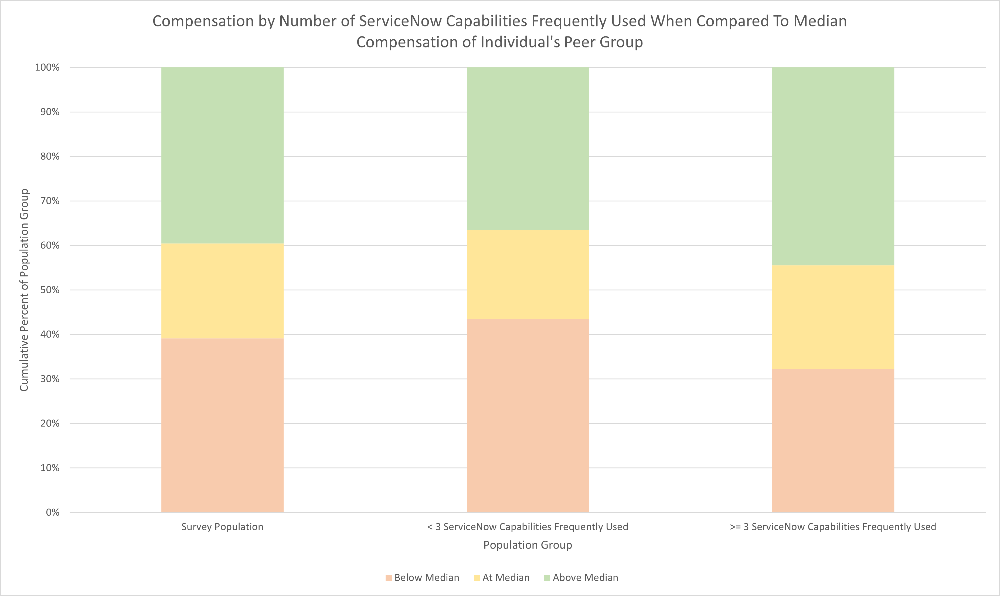
    <figcaption>
        Compensation by Number of ServiceNow Capabilities Used Frequently When Compared To Median Compensation of Individual's Peer Group
    </figcaption>
    </figure>
</a>

|                                                | Below Median | At Median | Above Median |
|------------------------------------------------|--------------|-----------|--------------|
| Survey Population                              | 39.13%       | 21.30%    | 39.57%       |
| < 3 ServiceNow Capabilities Frequently Used  | 43.57%       | 20.00%    | 36.43%       |
| >= 3 ServiceNow Capabilities Frequently Used | 32.22%       | 23.33%    | 44.44%       |

In further support of the findings regarding skills usage, the highest ranked ServiceNow capability was Service Portal / UX / Front End at 16th. Right behind it was the number of ServiceNow Capabilities that the respondent listed as Daily or Weekly used. Similar to the decision tree findings on products and skills, there is a strong indication that breadth of usage is often more important than depth. The survey did not capture depth versus breadth of skill or quality, however, so this should not be taken as an assertion that breadth is universally preferred to depth. Sufficient familiarity to frequently leverage a broad set of ServiceNow applications, skills, and capabilities does often have a stronger impact on compensation than high frequency use of specific ones with only a few examples already mentioned.

## Contribution

<a href="images/peer-group-comparison-contribution.png">
    <figure>
    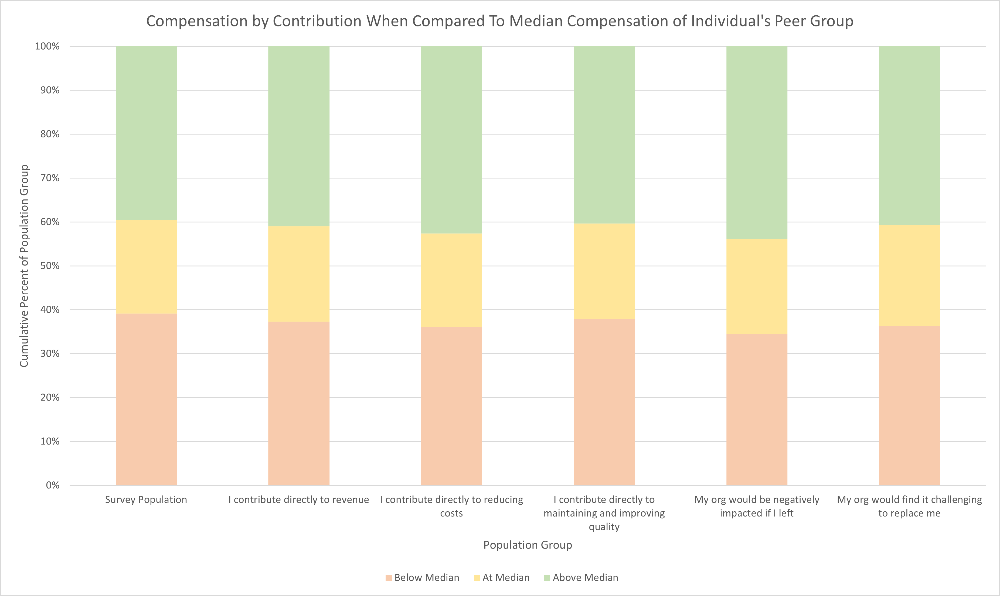
    <figcaption>
        Compensation by Contribution When Compared To Median Compensation of Individual's Peer Group
    </figcaption>
    </figure>
</a>

|                                                              | Below Median | At Median | Above Median |
|--------------------------------------------------------------|--------------|-----------|--------------|
| Survey Population                                            | 39.13%       | 21.30%    | 39.57%       |
| I contribute directly to revenue                           | 37.27%       | 21.74%    | 40.99%       |
| I contribute directly to reducing costs                    | 36.09%       | 21.30%    | 42.60%       |
| I contribute directly to maintaining and improving quality | 37.98%       | 21.63%    | 40.38%       |
| My org would be negatively impacted if I left              | 34.53%       | 21.58%    | 43.88%       |
| My org would find it challenging to replace me             | 36.30%       | 22.96%    | 40.74%       |

<a href="images/peer-group-comparison-contribution-absence.png">
    <figure>
    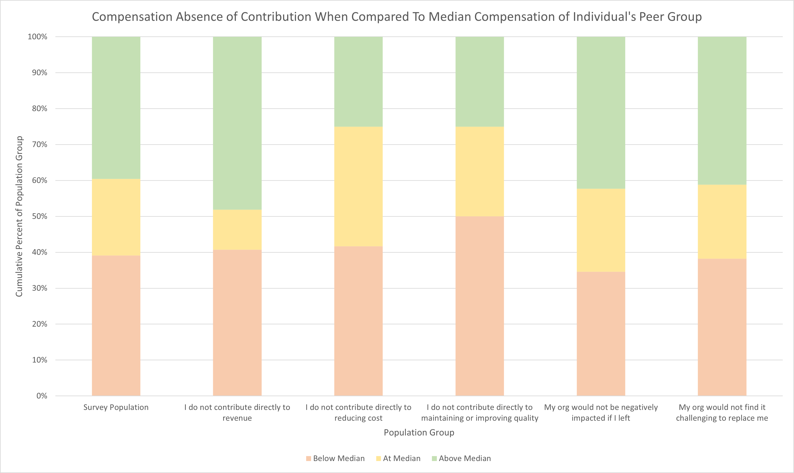
    <figcaption>
        Compensation by Absence of Contribution When Compared To Median Compensation of Individual's Peer Group
    </figcaption>
    </figure>
</a>

|                                                                    | Below Median | At Median | Above Median |
|--------------------------------------------------------------------|--------------|-----------|--------------|
| Survey Population                                                  | 39.13%       | 21.30%    | 39.57%       |
| I do not contribute directly to revenue                          | 40.74%       | 11.11%    | 48.15%       |
| I do not contribute directly to reducing cost                    | 41.67%       | 33.33%    | 25.00%       |
| I do not contribute directly to maintaining or improving quality | 50.00%       | 25.00%    | 25.00%       |
| My org would not be negatively impacted if I left                | 34.62%       | 23.08%    | 42.31%       |
| My org would not find it challenging to replace me               | 38.24%       | 20.59%    | 41.18%       |

Overall, one's statements about their perceived contributions and importance held little value in terms of predicting compensation. Respondent's response to the statement "My organization would be negatively impacted if I left" was ranked the highest at 29th. It is noteworthy that a respondents belief that they do not contribute to maintaining quality, improving quality, or reducing costs was associated with only a 25% probability of being compensated above median value. For those looking to maximize their value, a failure to contribute to an organization's quality or cost reduction could be costly. Conversely, contribution to revenue had virtually no impact which is quite possibly the oddest finding of the analysis.

## Satisfaction

<a href="images/peer-group-comparison-satisfaction.png">
    <figure>
    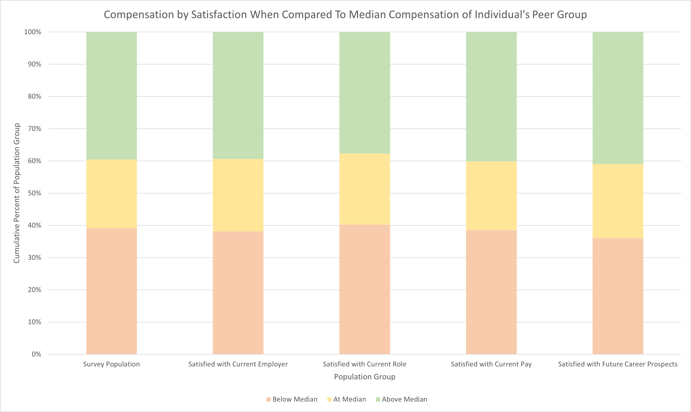
    <figcaption>
        Compensation by Satisfaction When Compared To Median Compensation of Individual's Peer Group
    </figcaption>
    </figure>
</a>

|                                          | Below Median | At Median | Above Median |
|------------------------------------------|--------------|-----------|--------------|
| Survey Population                        | 39.13%       | 21.30%    | 39.57%       |
| Satisfied with Current   Employer        | 38.13%       | 22.50%    | 39.38%       |
| Satisfied with Current Role              | 40.25%       | 22.01%    | 37.74%       |
| Satisfied with Current Pay               | 38.52%       | 21.31%    | 40.16%       |
| Satisfied with Future Career   Prospects | 36.11%       | 22.92%    | 40.97%       |

<a href="images/peer-group-comparison-dissatisfaction.png">
    <figure>
    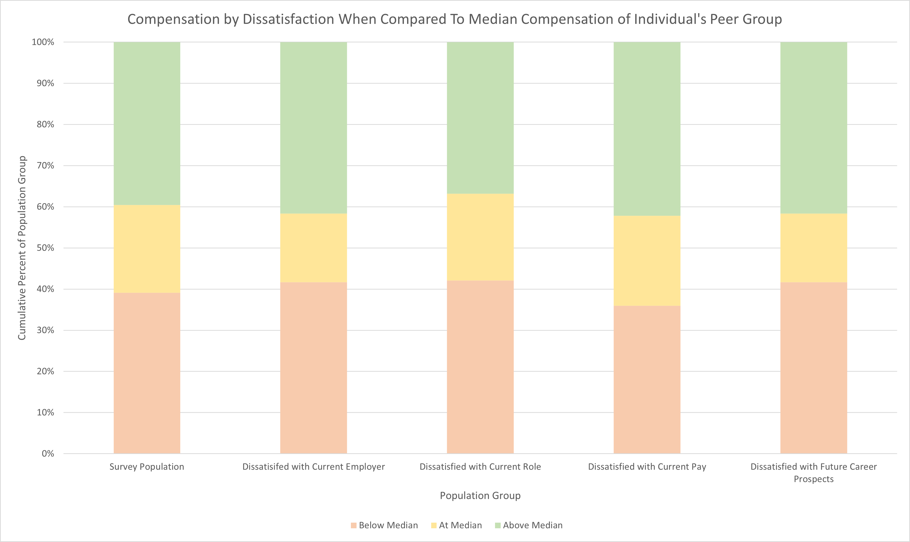
    <figcaption>
        Compensation by Dissatisfaction When Compared To Median Compensation of Individual's Peer Group
    </figcaption>
    </figure>
</a>

|                                             | Below Median | At Median | Above Median |
|---------------------------------------------|--------------|-----------|--------------|
| Survey Population                           | 39.13%       | 21.30%    | 39.57%       |
| Dissatisifed with Current   Employer        | 41.67%       | 16.67%    | 41.67%       |
| Dissatisfied with Current Role              | 42.11%       | 21.05%    | 36.84%       |
| Dissatisfied with Current Pay               | 35.94%       | 21.88%    | 42.19%       |
| Dissatisfied with Future   Career Prospects | 41.67%       | 16.67%    | 41.67%       |

Satisfaction was strangely one of the least important feature sets in terms of predicting compensation with the most important feature being satisfaction with future career prospects at 54th in the list. Overall, satisfaction did not seem strongly correlated with any other particular feature either. Those with low compensation were as likely to be satisfied as not. The same can be said for those with low or high years of experience. A respondent's satisfaction appeared to be largely independent of any other feature, including compensation.

## Hours of Work

<a href="images/peer-group-comparison-hours-of-work.png">
    <figure>
    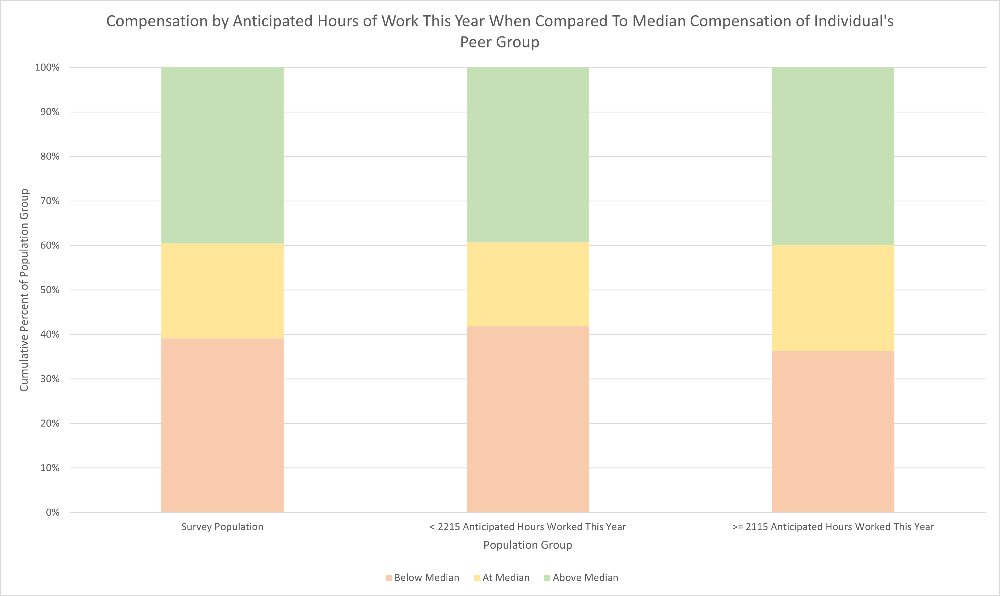
    <figcaption>
        Compensation by Annticipated Hours of Work This Year To Median Compensation of Individual's Peer Group
    </figcaption>
    </figure>
</a>

|                                              | Below Median | At Median | Above Median |
|----------------------------------------------|--------------|-----------|--------------|
| Survey Population                            | 39.13%       | 21.30%    | 39.57%       |
| < 2215 Anticipated Hours   Worked This Year  | 41.88%       | 18.80%    | 39.32%       |
| >= 2115 Anticipated Hours   Worked This Year | 36.28%       | 23.89%    | 39.82%       |

Hours worked this year was ranked 41st in terms of importance in predicting compensation. There was very little evidence to indicate that there was any strong correlation between hours of work and total compensation. Whether examining this feature through correlated regressions or probability splits, this feature had little impact on compensation and appeared to be mostly uncorrelated to other features.