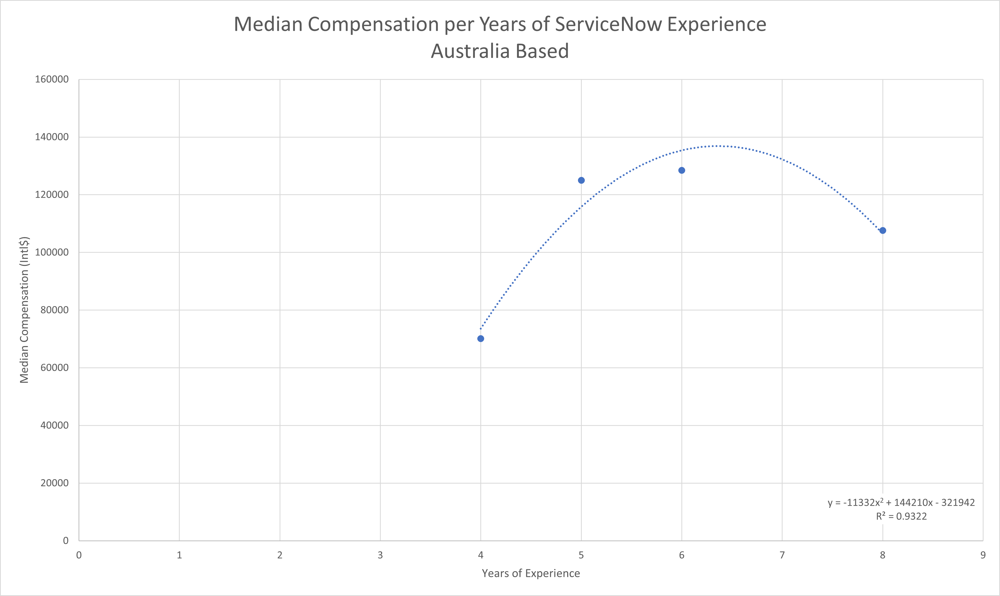
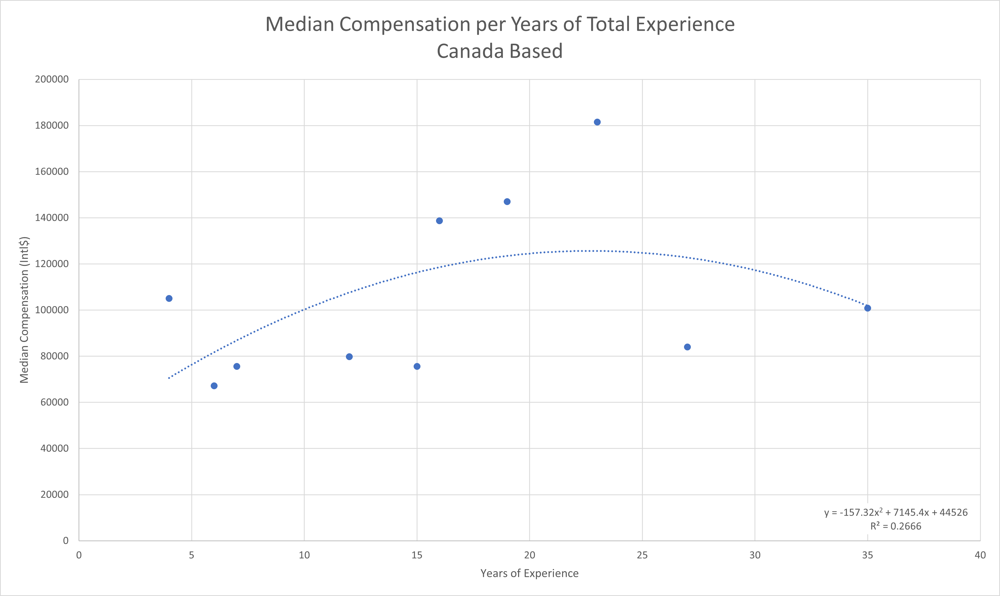
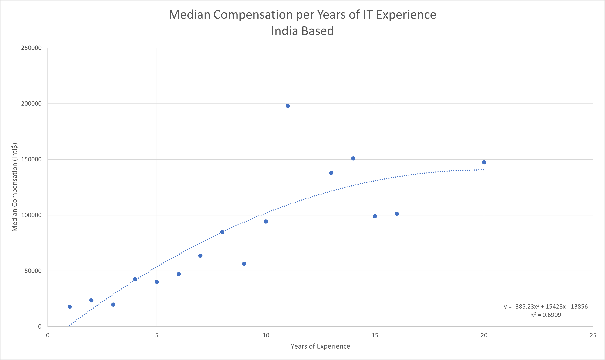
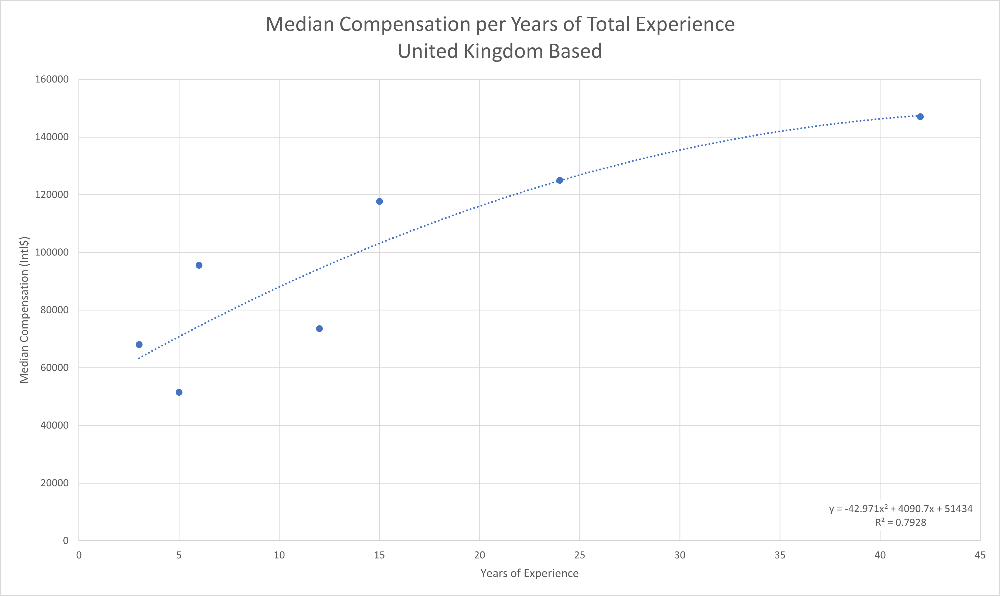
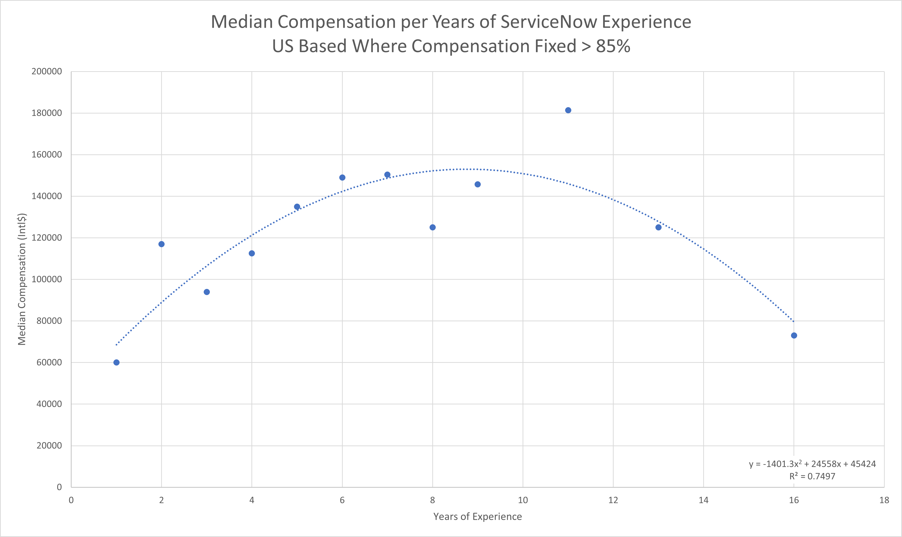
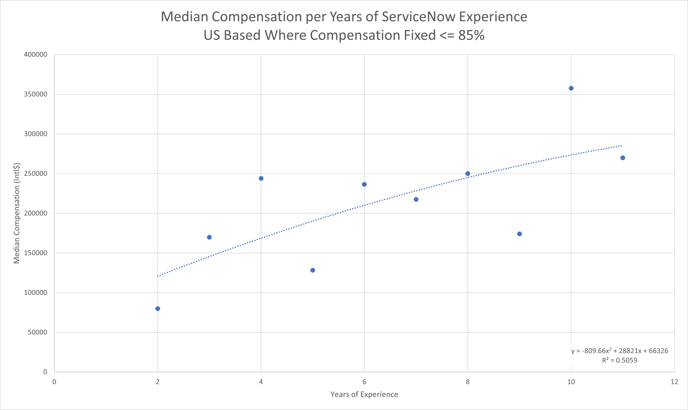

This reference page contains the scatter plots depicting the relationship between years of experience and median compensation as discussed in the [Top Influencing Features][1] section of the report.

## Australia Based

<a href="images/median-compensation-per-exp-australia.png">
    <figure>
    
    <figcaption>
        Median Compensation per Years of ServiceNow Experience for Australia Based Workers
    </figcaption>
    </figure>
</a>

| Years | Median Compensation |
|-------|---------------------|
| 4     | 70,139              |
| 5     | 125,000             |
| 6     | 128,472             |
| 8     | 107,639             |

## Canada Based

<a href="images/median-compensation-per-exp-canada.png">
    <figure>
    
    <figcaption>
        Median Compensation per Years of ServiceNow Experience for Canada Based Workers
    </figcaption>
    </figure>
</a>

| Years | Median Compensation |
|-------|---------------------|
| 4     | 105,042             |
| 6     | 67,227              |
| 7     | 75,630              |
| 12    | 79,832              |
| 15    | 75,630              |
| 16    | 138,655             |
| 19    | 147,059             |
| 23    | 181,513             |
| 27    | 84,034              |
| 35    | 100,840             |

## India Based

<a href="images/median-compensation-per-exp-india.png">
    <figure>
    
    <figcaption>
        Median Compensation per Years of ServiceNow Experience for India Based Workers
    </figcaption>
    </figure>
</a>

| Years | Median Compensation |
|-------|---------------------|
| 1     | 17,916              |
| 2     | 23,574              |
| 3     | 19,802              |
| 4     | 42,433              |
| 5     | 40,075              |
| 6     | 47,148              |
| 7     | 63,649              |
| 8     | 84,866              |
| 9     | 56,577              |
| 10    | 94,295              |
| 11    | 198,020             |
| 13    | 138,072             |
| 14    | 150,872             |
| 15    | 99,010              |
| 16    | 101,367             |
| 20    | 147,336             |

## United Kingdom Based

<a href="images/median-compensation-per-exp-uk.png">
    <figure>
    
    <figcaption>
        Median Compensation per Years of ServiceNow Experience for United Kingdom Based Workers
    </figcaption>
    </figure>
</a>

| Years | Median Compensation |
|-------|---------------------|
| 3     | 68,014              |
| 5     | 51,471              |
| 6     | 95,588              |
| 12    | 73,529              |
| 15    | 117,666             |
| 24    | 125,000             |
| 42    | 147,059             |

## United States Based - Low Risk Pay Group

<a href="images/median-compensation-per-exp-us-low-risk-pay-group.png">
    <figure>
    
    <figcaption>
        Median Compensation per Years of ServiceNow Experience for US Based Workers Where Compensation Fixed > 85%
    </figcaption>
    </figure>
</a>

| Years | Median Compensation |
|-------|---------------------|
| 1     | 60,000              |
| 2     | 117,027             |
| 3     | 94,000              |
| 4     | 112,525             |
| 5     | 135,000             |
| 6     | 149,000             |
| 7     | 150,350             |
| 8     | 125,000             |
| 9     | 145,750             |
| 11    | 181,400             |
| 13    | 125,000             |
| 16    | 73,000              |

## United States Based - High Risk Pay Group

<a href="images/median-compensation-per-exp-us-high-risk-pay-group.png">
    <figure>
    
    <figcaption>
        Median Compensation per Years of ServiceNow Experience for US Based Workers Where Compensation Fixed <= 85%
    </figcaption>
    </figure>
</a>

| Years | Median Compensation |
|-------|---------------------|
| 2     | 80,000              |
| 3     | 170,000             |
| 4     | 244,000             |
| 5     | 128,250             |
| 6     | 236,500             |
| 7     | 217,500             |
| 8     | 250,000             |
| 9     | 174,000             |
| 10    | 357,500             |
| 11    | 270,000             |

[1]: /guides/servicenow-salary-influence-survey-2020/top-influencing-features