The below charts provide a breakdown for each survey question on the ServiceNow Salary Influence Survey 2020. Each chart indicates the percentage of the responding population that selected a particular response for the given question. Some questions were omitted from this summary due to the risk of revealing identifying information. Questions omitted from this summary were still used in the analysis of the data to produce the final results.

Contents:

1. [Age][1]
2. [Gender][2]
3. [Ethnicity][3]
4. [Disability Status][4]
5. [In what geographic location are you employed? [US State]][5]
6. [In what geographic location are you employed? [India Province]][6]
7. [In what geographic location are you employed? [Country]][7]
8. [In what geographic location are you employed? [Continent]][8]
9. [In what geographic location are you employed? [Bureau of Economic Analysis Region]][9]
10. [Are you a military veteran?][10]
11. [Do you identify with the gender majority of the team(s) with whom you most closely work?][11]
12. [Do you identify with the ethnic majority of the team(s) with whom you most closely work?][12]
13. [Do you identify with the cultural majority of the team(s) with whom you most closely work?][13]
14. [Do you identify with the socioeconomic majority of the team(s) with whom you most closely work?][14]
15. [Do you identify with the religious majority of the team(s) with whom you most closely work?][15]
16. [Is your first language the preferred language of the team(s) with whom you most closely work?][16]
17. [What is the highest level of education that you completed?][17]
18. [If you attended college, what was your field of study?][18]
19. [Please indicate the total years of experience you have in the following areas [Total Professional Experience]][19]
20. [Please indicate the total years of experience you have in the following areas [In the IT Field]][20]
21. [Please indicate the total years of experience you have in the following areas [Working with the ServiceNow Platform]][21]
22. [Please indicate the total years of experience you have in the following areas [With your current employer]][22]
23. [Please indicate the total years of experience you have in the following areas [In your current role]][23]
24. [How many different employers have you worked for in your career?][24]
25. [Please select any ServiceNow certifications that you currently possess][25]
26. [Please select any ServiceNow micro-certifications that you currently possess][26]
27. [Please select any Professional certifications that you currently possess][27]
28. [Survey Responses by Total Number of Certifications][28]
29. [Survey Responses by Total Number of Mainline Certifications][29]
30. [Survey Responses by Total Number of Micro-Certifications][30]
31. [Survey Responses by Total Number of CIS Certifications][31]
32. [What is your current employment status?][32]
33. [Which of the following best describes your current job role?][33]
34. [Which of the following best describes your job level?][34]
35. [What percent of the time do you typically spend working remotely (before the COVID-19 Pandemic)?][35]
36. [How many hours do you work in a typical work day?][36]
37. [For each of the following skills, please select the highest frequency at which you typically use the skill on the job.][37]
38. [For each of the following ServiceNow products, please indicate the highest frequency with which you perform work related to the product in your current role.][38]
39. [Please rate the degree to which you agree with the following statements][39]
40. [Please rate the degree to which you are satisfied with the following][40]
41. [Are you currently paid Salary or Hourly?][41]

### Age

<a href="images/survey_responses_by_age.png">
    <figure>
    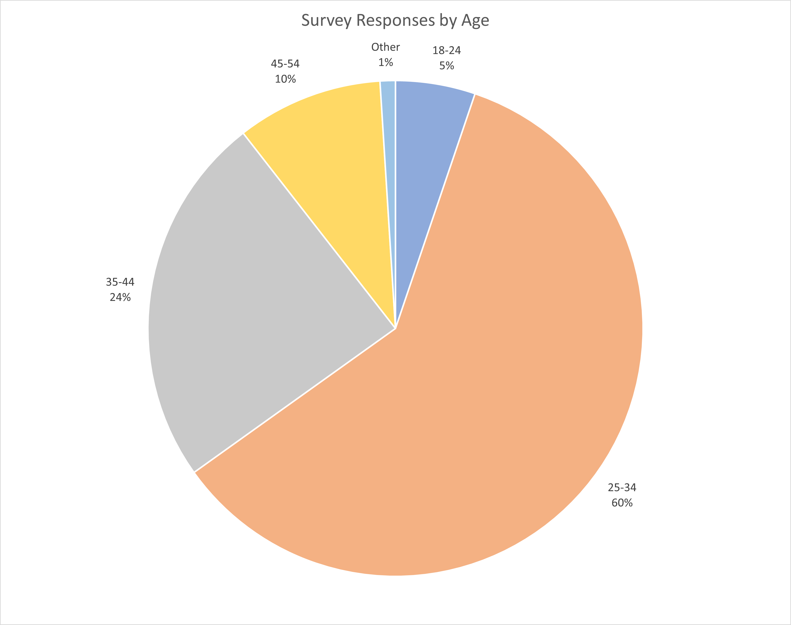
    <figcaption>
        Survey Responses by Age
    </figcaption>
    </figure>
</a>

| Response               | Percent of Respondents |
|------------------------|------------------------|
| 18-24                  | 5.22%                  |
| 25-34                  | 60.00%                 |
| 35-44                  | 24.35%                 |
| 45-54                  | 9.57%                  |
| 55+                    | 0.43%                  |
| Prefer not to disclose | 0.43%                  |

### Gender

<a href="images/survey_responses_by_gender.png">
    <figure>
    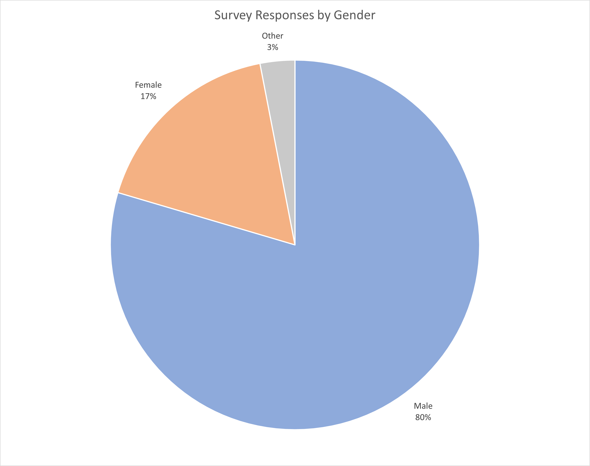
    <figcaption>
        Survey Responses by Gender
    </figcaption>
    </figure>
</a>

| Response               | Percent of Respondents |
|------------------------|------------------------|
| Male                   | 79.57%                 |
| Female                 | 17.39%                 |
| Prefer not to disclose | 2.61%                  |
| Non-binary             | 0.43%                  |

### Ethnicity

<a href="images/survey_responses_by_ethnicity.png">
    <figure>
    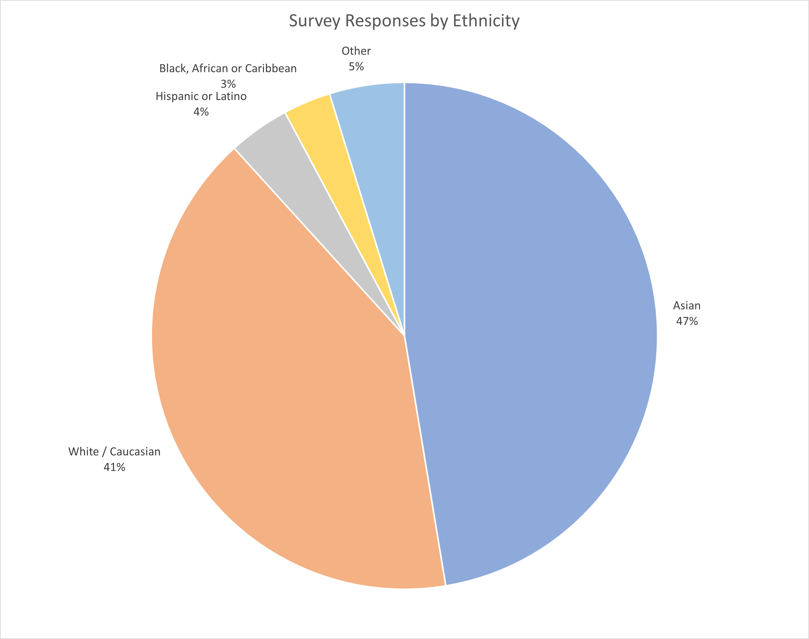
    <figcaption>
        Survey Responses by Ethnicity
    </figcaption>
    </figure>
</a>

| Response                       | Percent of Respondents |
|--------------------------------|------------------------|
| Asian                          | 47.39%                 |
| White / Caucasian              | 40.87%                 |
| Hispanic or Latino             | 3.91%                  |
| Black, African or   Caribbean  | 3.04%                  |
| Prefer not   to disclose       | 2.61%                  |
| Arab                           | 0.87%                  |
| Native American                | 0.87%                  |
| Mixed / multiple ethnic groups | 0.43%                  |

### Disability Status

<a href="images/survey_responses_by_disability_status.png">
    <figure>
    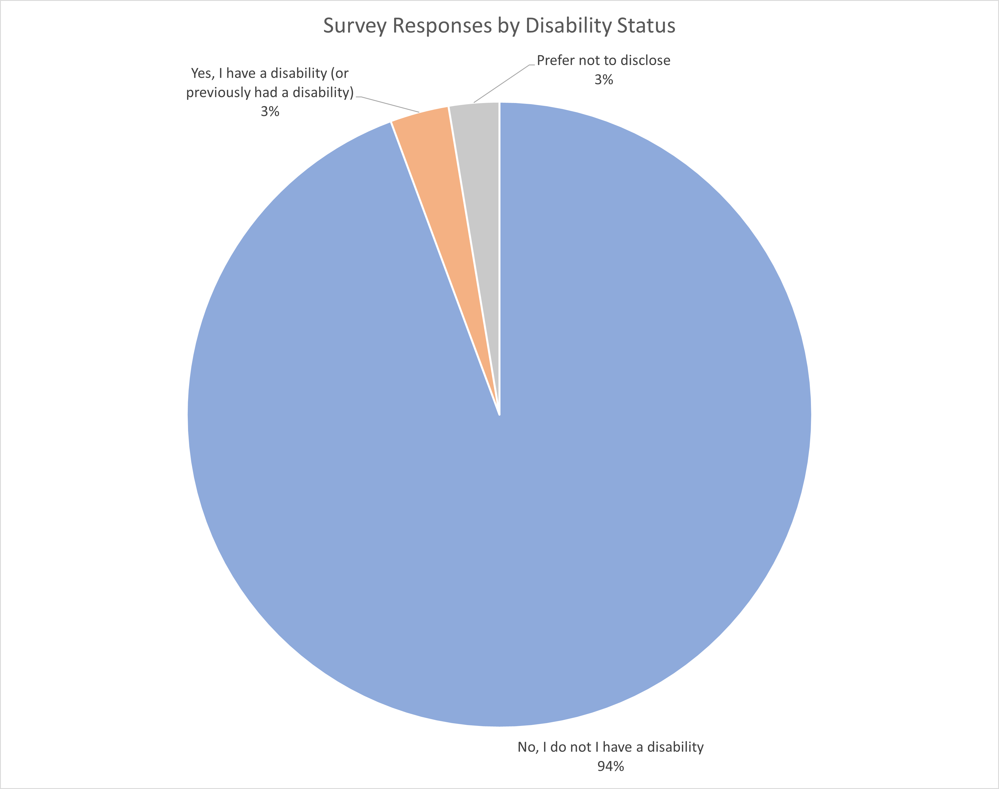
    <figcaption>
        Survey Responses by Disability Status
    </figcaption>
    </figure>
</a>

| Response                                                    | Percent of Respondents |
|-------------------------------------------------------------|------------------------|
| No, I do   not I have a disability                          | 94.35%                 |
| Yes, I have a disability (or   previously had a disability) | 3.04%                  |
| Prefer not to disclose                                      | 2.61%                  |

### In what geographic location are you employed? [State]

This question pertains to US based responses only.

<a href="images/survey_responses_by_state.png">
    <figure>
    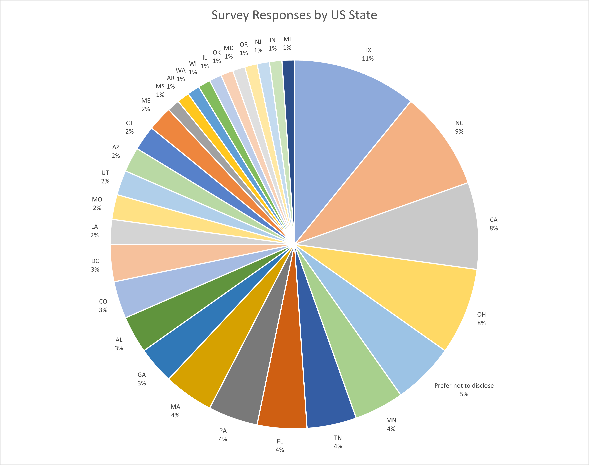
    <figcaption>
        Survey Responses by State
    </figcaption>
    </figure>
</a>

| Response               | Percent of Respondents |
|------------------------|------------------------|
| TX                     | 10.87%                 |
| NC                     | 8.70%                  |
| CA                     | 7.61%                  |
| OH                     | 7.61%                  |
| Prefer not to disclose | 5.43%                  |
| MN                     | 4.35%                  |
| TN                     | 4.35%                  |
| FL                     | 4.35%                  |
| PA                     | 4.35%                  |
| MA                     | 4.35%                  |
| GA                     | 3.26%                  |
| AL                     | 3.26%                  |
| CO                     | 3.26%                  |
| DC                     | 3.26%                  |
| LA                     | 2.17%                  |
| MO                     | 2.17%                  |
| UT                     | 2.17%                  |
| AZ                     | 2.17%                  |
| CT                     | 2.17%                  |
| ME                     | 2.17%                  |
| MS                     | 1.09%                  |
| AR                     | 1.09%                  |
| WA                     | 1.09%                  |
| WI                     | 1.09%                  |
| IL                     | 1.09%                  |
| OK                     | 1.09%                  |
| MD                     | 1.09%                  |
| OR                     | 1.09%                  |
| NJ                     | 1.09%                  |
| IN                     | 1.09%                  |
| MI                     | 1.09%                  |

### In what geographic location are you employed? [India Province]

This question pertains to India based responses only.

<a href="images/survey_responses_by_province_india.png">
    <figure>
    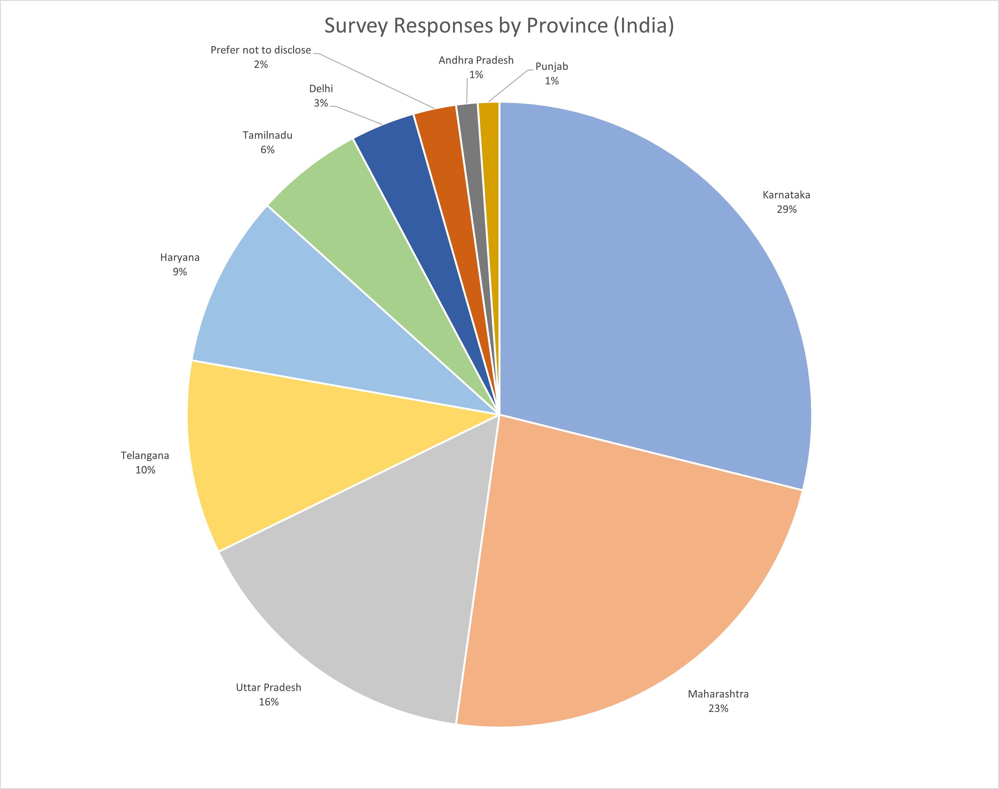
    <figcaption>
        Survey Responses by Province (India)
    </figcaption>
    </figure>
</a>

| Response               | Percent of Respondents |
|------------------------|------------------------|
| Karnataka              | 28.89%                 |
| Maharashtra            | 23.33%                 |
| Uttar Pradesh          | 15.56%                 |
| Telangana              | 10.00%                 |
| Haryana                | 8.89%                  |
| Tamilnadu              | 5.56%                  |
| Delhi                  | 3.33%                  |
| Prefer not to disclose | 2.22%                  |
| Andhra Pradesh         | 1.11%                  |
| Punjab                 | 1.11%                  |

### In what geographic location are you employed? [Country]

<a href="images/survey_responses_by_country.png">
    <figure>
    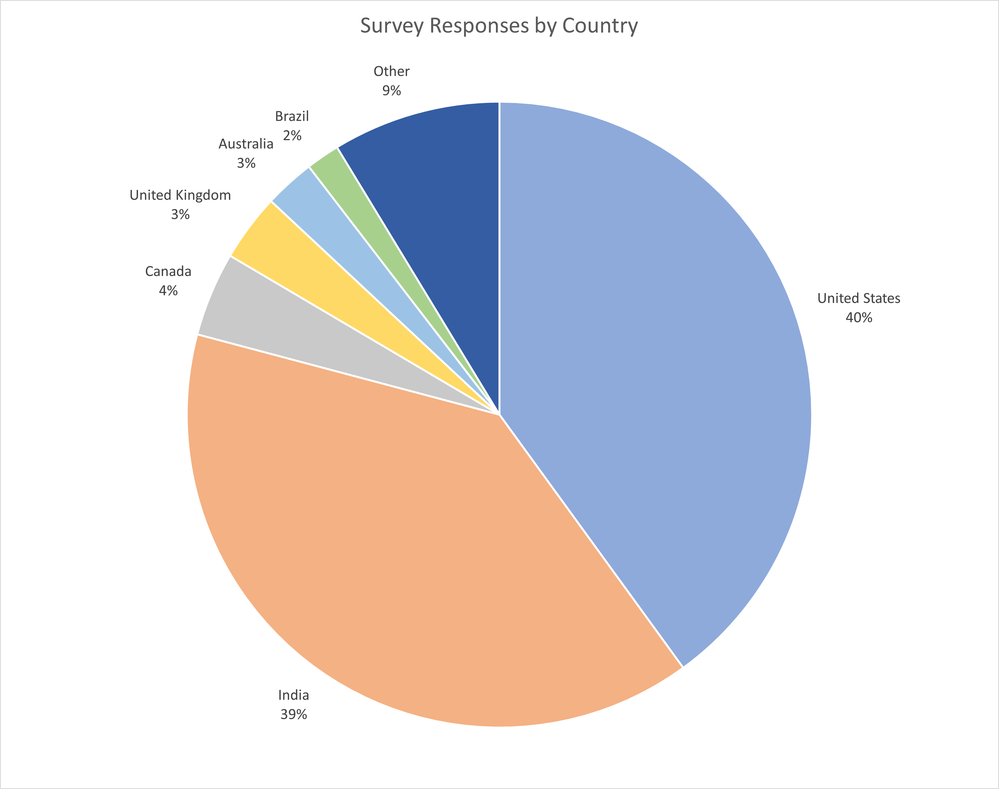
    <figcaption>
        Survey Responses by Country
    </figcaption>
    </figure>
</a>

| Response               | Percent of Respondents |
|------------------------|------------------------|
| United States          | 40.00%                 |
| India                  | 39.13%                 |
| Canada                 | 4.35%                  |
| United Kingdom         | 3.48%                  |
| Australia              | 2.61%                  |
| Brazil                 | 1.74%                  |
| Prefer not to disclose | 0.87%                  |
| Germany                | 0.87%                  |
| Belgium                | 0.87%                  |
| Switzerland            | 0.87%                  |
| Bulgaria               | 0.87%                  |
| Sweden                 | 0.87%                  |
| Poland                 | 0.87%                  |
| Costa Rica             | 0.43%                  |
| Netherlands            | 0.43%                  |
| Ukraine                | 0.43%                  |
| Italy                  | 0.43%                  |
| Spain                  | 0.43%                  |
| Philippines            | 0.43%                  |

### In what geographic location are you employed? [Continent]

The results of this question were inferred from responses to [In which geographic location are you employed [Country]][7].

<a href="images/survey_responses_by_continent.png">
    <figure>
    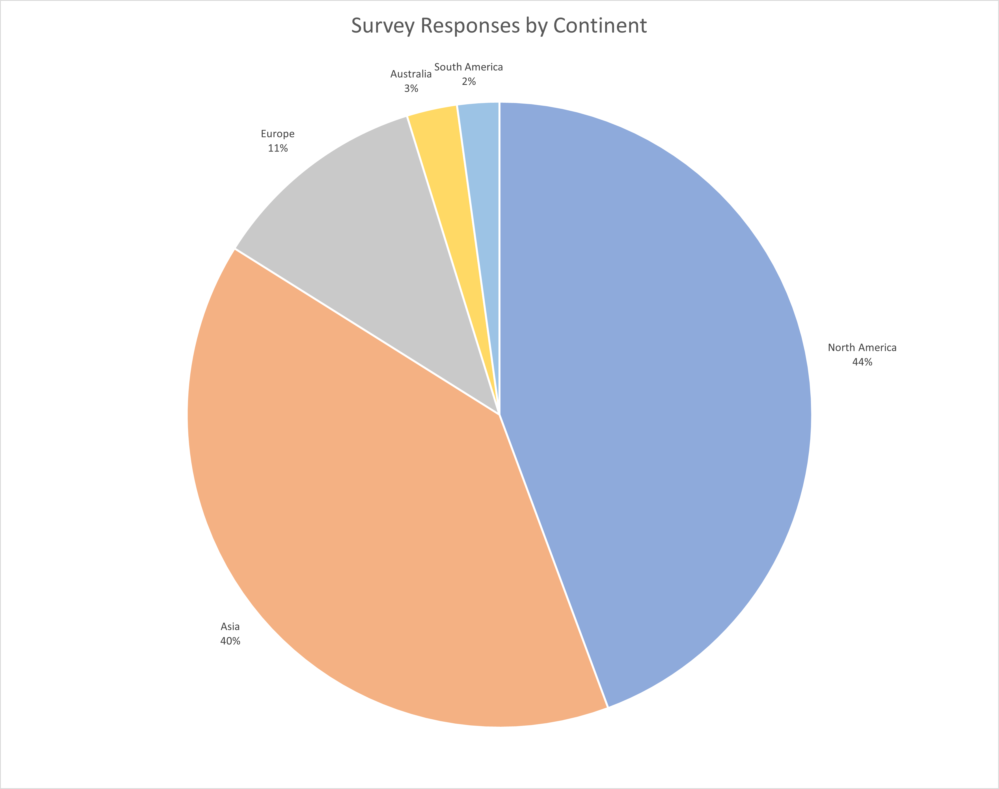
    <figcaption>
        Survey Responses by Continent
    </figcaption>
    </figure>
</a>

| Response      | Percent of Respondents |
|---------------|------------------------|
| North America | 44.35%                 |
| Asia          | 39.57%                 |
| Europe        | 11.30%                 |
| Australia     | 2.61%                  |
| South America | 2.17%                  |

### In what geographic location are you employed? [Bureau of Economic Analysis Region]

The results of this question were inferred from responses to [In which geographic location are you employed [State]][5]. This question pertains to US based responses only.

<a href="images/survey_responses_by_bea_region.png">
    <figure>
    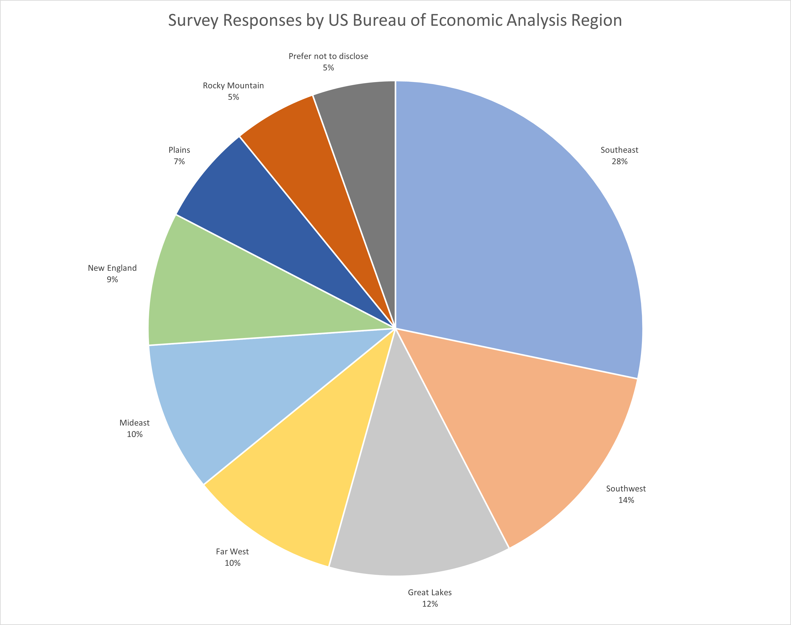
    <figcaption>
        Survey Responses by Bureau of Economic Analysis Region
    </figcaption>
    </figure>
</a>

| Response               | Percent of Respondents |
|------------------------|------------------------|
| Southeast              | 28.26%                 |
| Southwest              | 14.13%                 |
| Great Lakes            | 11.96%                 |
| Far West               | 9.78%                  |
| Mideast                | 9.78%                  |
| New England            | 8.70%                  |
| Plains                 | 6.52%                  |
| Rocky Mountain         | 5.43%                  |
| Prefer not to disclose | 5.43%                  |

### Are you a military veteran?

<a href="images/survey_responses_by_veteran_status.png">
    <figure>
    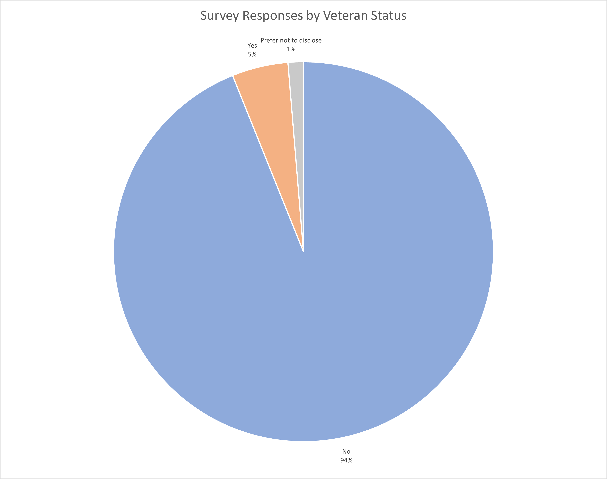
    <figcaption>
        Survey Responses by Veteran Status
    </figcaption>
    </figure>
</a>

| Response               | Percent of Respondents |
|------------------------|------------------------|
| No                     | 93.91%                 |
| Yes                    | 4.78%                  |
| Prefer not to disclose | 1.30%                  |

### Do you identify with the gender majority of the team(s) with whom you most closely work?

<a href="images/survey_responses_by_gender_majority.png">
    <figure>
    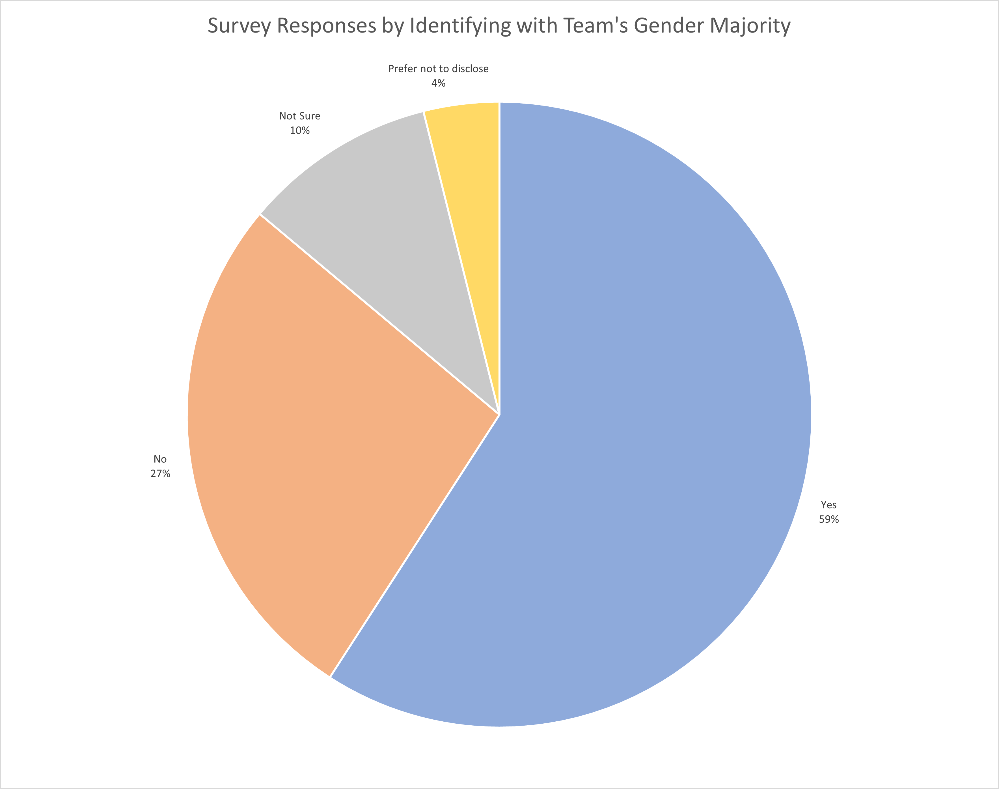
    <figcaption>
        Survey Responses by Identifying with Team's Gender Majority
    </figcaption>
    </figure>
</a>

| Response               | Percent of Respondents |
|------------------------|------------------------|
| Yes                    | 59.13%                 |
| No                     | 26.96%                 |
| Not Sure               | 10.00%                 |
| Prefer not to disclose | 3.91%                  |

### Do you identify with the ethnic majority of the team(s) with whom you most closely work?

<a href="images/survey_responses_by_ethnic_majority.png">
    <figure>
    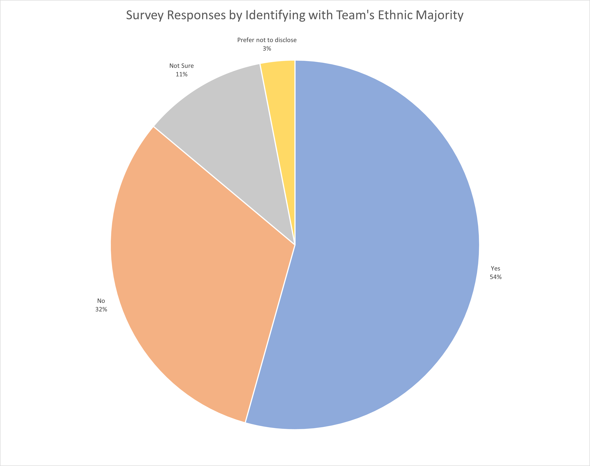
    <figcaption>
        Survey Responses by Identifying with Team's Ethnic Majority
    </figcaption>
    </figure>
</a>

| Response               | Percent of Respondents |
|------------------------|------------------------|
| Yes                    | 54.35%                 |
| No                     | 31.74%                 |
| Not Sure               | 10.87%                 |
| Prefer not to disclose | 3.04%                  |

### Do you identify with the cultural majority of the team(s) with whom you most closely work?

<a href="images/survey_responses_by_cultural_majority.png">
    <figure>
    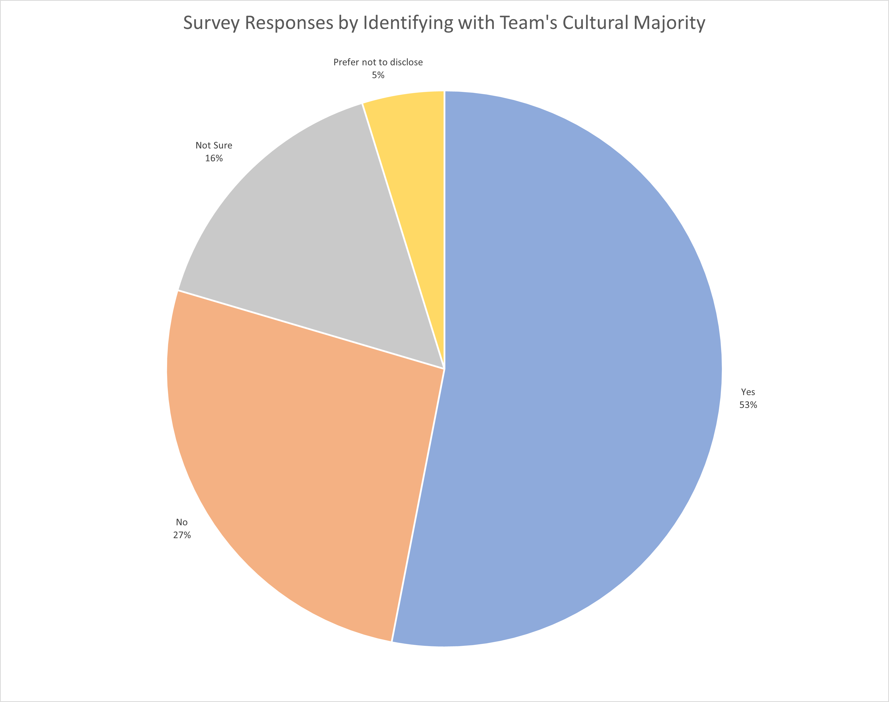
    <figcaption>
        Survey Responses by Identifying with Team's Cultural Majority
    </figcaption>
    </figure>
</a>

| Response               | Percent of Respondents |
|------------------------|------------------------|
| Yes                    | 53.04%                 |
| No                     | 26.52%                 |
| Not Sure               | 15.65%                 |
| Prefer not to disclose | 4.78%                  |

### Do you identify with the socioeconomic majority of the team(s) with whom you most closely work?

<a href="images/survey_responses_by_socioeconomic_majority.png">
    <figure>
    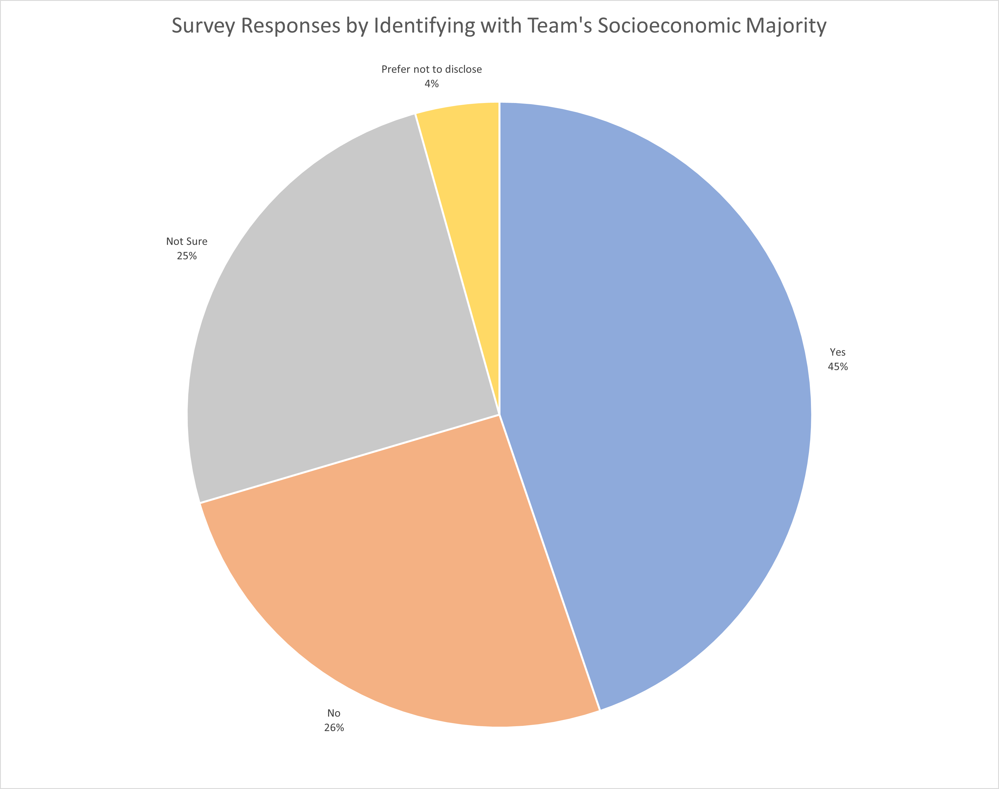
    <figcaption>
        Survey Responses by Identifying with Team's Socioeconomic Majority
    </figcaption>
    </figure>
</a>

| Response               | Percent of Respondents |
|------------------------|------------------------|
| Yes                    | 44.78%                 |
| No                     | 25.65%                 |
| Not Sure               | 25.22%                 |
| Prefer not to disclose | 4.35%                  |

### Do you identify with the religious majority of the team(s) with whom you most closely work?

<a href="images/survey_responses_by_religious_majority.png">
    <figure>
    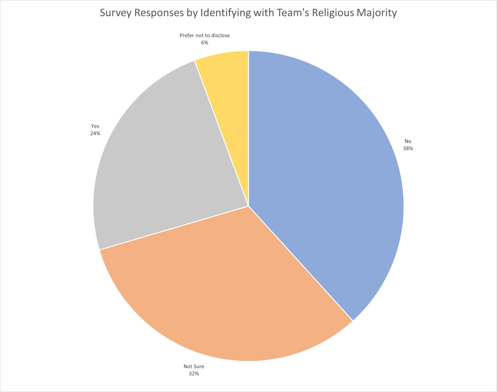
    <figcaption>
        Survey Responses by Identifying with Team's Religious Majority
    </figcaption>
    </figure>
</a>

| Response               | Percent of Respondents |
|------------------------|------------------------|
| No                     | 38.26%                 |
| Not Sure               | 32.17%                 |
| Yes                    | 23.91%                 |
| Prefer not to disclose | 5.65%                  |

### Is your first language the preferred language of the team(s) with whom you most closely work?

<a href="images/survey_responses_by_language_majority.png">
    <figure>
    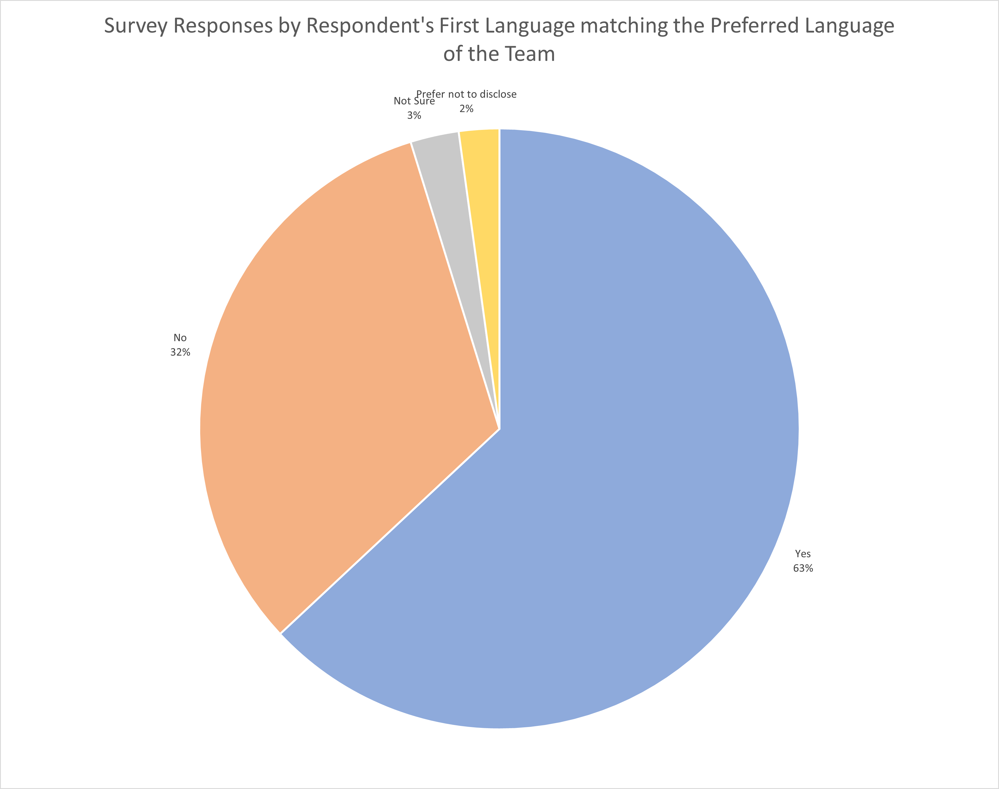
    <figcaption>
        Survey Responses by Respondent's First Language matching the Preferred Language of the Team
    </figcaption>
    </figure>
</a>

| Response               | Percent of Respondents |
|------------------------|------------------------|
| Yes                    | 63.04%                 |
| No                     | 32.17%                 |
| Not Sure               | 2.61%                  |
| Prefer not to disclose | 2.17%                  |

### What is the highest level of education that you completed?

<a href="images/survey_responses_by_education.png">
    <figure>
    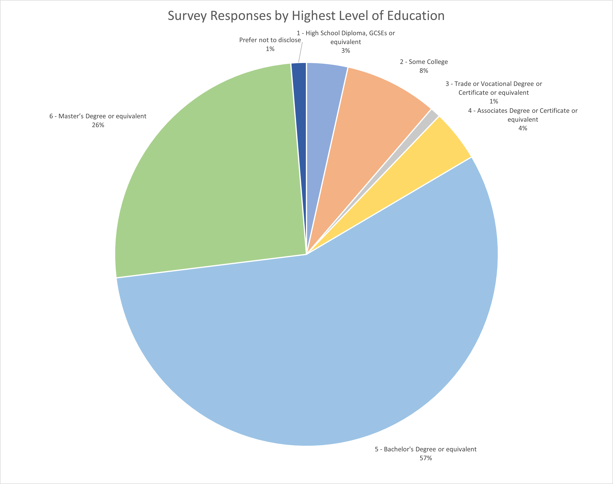
    <figcaption>
        Survey Responses by Highest Level of Education
    </figcaption>
    </figure>
</a>

| Response                                                      | Percent of Respondents |
|---------------------------------------------------------------|------------------------|
| 1 - High   School Diploma, GCSEs or equivalent                | 3.48%                  |
| 2 - Some College                                              | 7.83%                  |
| 3 - Trade or Vocational Degree   or Certificate or equivalent | 0.87%                  |
| 4 - Associates Degree or   Certificate or equivalent          | 4.35%                  |
| 5 - Bachelor's Degree or   equivalent                         | 56.52%                 |
| 6 - Master’s Degree or   equivalent                           | 25.65%                 |
| Prefer not to disclose                                        | 1.30%                  |

### If you attended college, what was your field of study?

<a href="images/survey_responses_by_field_of_study.png">
    <figure>
    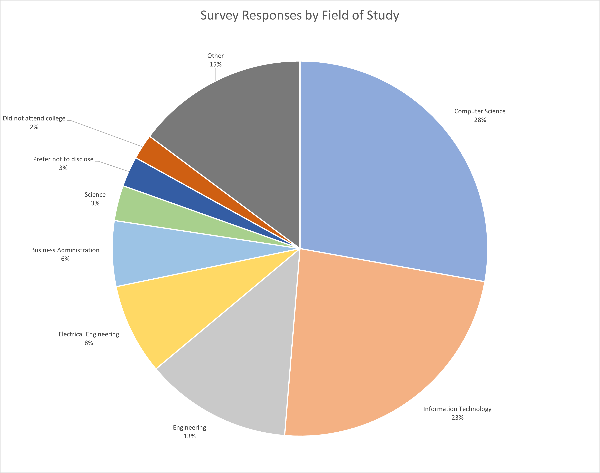
    <figcaption>
        Survey Responses by Highest Level of Education
    </figcaption>
    </figure>
</a>

| Response                                    | Percent of Respondents |
|---------------------------------------------|------------------------|
| Computer   Science                          | 27.83%                 |
| Information Technology                      | 23.48%                 |
| Engineering                                 | 12.61%                 |
| Electrical Engineering                      | 7.83%                  |
| Business Administration                     | 5.65%                  |
| Science                                     | 3.04%                  |
| Prefer not to disclose                      | 2.61%                  |
| Did not attend college                      | 2.17%                  |
| Economics                                   | 1.30%                  |
| Software Engineering                        | 1.30%                  |
| Electronics and Communication               | 0.87%                  |
| Mechanical Engineering                      | 0.87%                  |
| Political Science                           | 0.87%                  |
| Religious Studies                           | 0.43%                  |
| Music                                       | 0.43%                  |
| Anthropology                                | 0.43%                  |
| Fine Arts                                   | 0.43%                  |
| Nursing                                     | 0.43%                  |
| History                                     | 0.43%                  |
| Electronics and Communication   Engineering | 0.43%                  |
| Industrial / Systems   Engineering          | 0.43%                  |
| Multimedia and Web Design                   | 0.43%                  |
| Sociology/Anthropology                      | 0.43%                  |
| Non-science major                           | 0.43%                  |
| Philosophy                                  | 0.43%                  |
| English Literature                          | 0.43%                  |
| Communications                              | 0.43%                  |
| Arts                                        | 0.43%                  |
| Psychology                                  | 0.43%                  |
| Interdisciplinary                           | 0.43%                  |
| Electronics                                 | 0.43%                  |
| Liberal Arts                                | 0.43%                  |
| Mathematics                                 | 0.43%                  |
| Accounting                                  | 0.43%                  |
| Interactive Entertainment                   | 0.43%                  |

### Please indicate the total years of experience you have in the following areas [Total Professional Experience]

<a href="images/survey_responses_by_experience_total.png">
    <figure>
    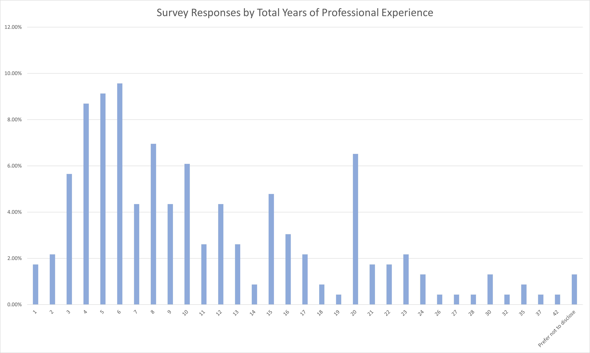
    <figcaption>
        Survey Responses by Total Years of Professional Experience
    </figcaption>
    </figure>
</a>

| Response               | Percent of Respondents |
|------------------------|------------------------|
| 1                      | 1.74%                  |
| 2                      | 2.17%                  |
| 3                      | 5.65%                  |
| 4                      | 8.70%                  |
| 5                      | 9.13%                  |
| 6                      | 9.57%                  |
| 7                      | 4.35%                  |
| 8                      | 6.96%                  |
| 9                      | 4.35%                  |
| 10                     | 6.09%                  |
| 11                     | 2.61%                  |
| 12                     | 4.35%                  |
| 13                     | 2.61%                  |
| 14                     | 0.87%                  |
| 15                     | 4.78%                  |
| 16                     | 3.04%                  |
| 17                     | 2.17%                  |
| 18                     | 0.87%                  |
| 19                     | 0.43%                  |
| 20                     | 6.52%                  |
| 21                     | 1.74%                  |
| 22                     | 1.74%                  |
| 23                     | 2.17%                  |
| 24                     | 1.30%                  |
| 26                     | 0.43%                  |
| 27                     | 0.43%                  |
| 28                     | 0.43%                  |
| 30                     | 1.30%                  |
| 32                     | 0.43%                  |
| 35                     | 0.87%                  |
| 37                     | 0.43%                  |
| 42                     | 0.43%                  |
| Prefer not to disclose | 1.30%                  |

### Please indicate the total years of experience you have in the following areas [In the IT Field]

<a href="images/survey_responses_by_experience_it.png">
    <figure>
    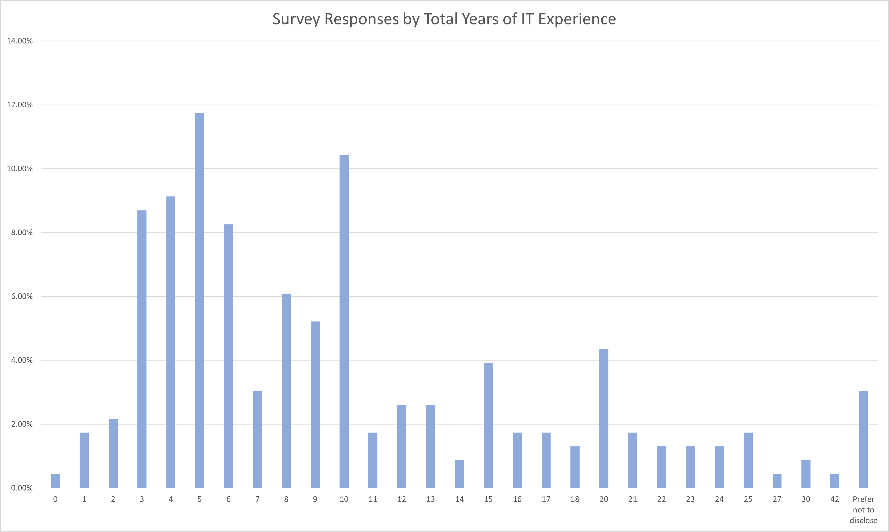
    <figcaption>
        Survey Responses by Total Years of IT Experience
    </figcaption>
    </figure>
</a>

| Response               | Percent of Respondents |
|------------------------|------------------------|
| 0                      | 0.43%                  |
| 1                      | 1.74%                  |
| 2                      | 2.17%                  |
| 3                      | 8.70%                  |
| 4                      | 9.13%                  |
| 5                      | 11.74%                 |
| 6                      | 8.26%                  |
| 7                      | 3.04%                  |
| 8                      | 6.09%                  |
| 9                      | 5.22%                  |
| 10                     | 10.43%                 |
| 11                     | 1.74%                  |
| 12                     | 2.61%                  |
| 13                     | 2.61%                  |
| 14                     | 0.87%                  |
| 15                     | 3.91%                  |
| 16                     | 1.74%                  |
| 17                     | 1.74%                  |
| 18                     | 1.30%                  |
| 20                     | 4.35%                  |
| 21                     | 1.74%                  |
| 22                     | 1.30%                  |
| 23                     | 1.30%                  |
| 24                     | 1.30%                  |
| 25                     | 1.74%                  |
| 27                     | 0.43%                  |
| 30                     | 0.87%                  |
| 42                     | 0.43%                  |
| Prefer not to disclose | 3.04%                  |

### Please indicate the total years of experience you have in the following areas [Working with the ServiceNow Platform]

<a href="images/survey_responses_by_experience_servicenow.png">
    <figure>
    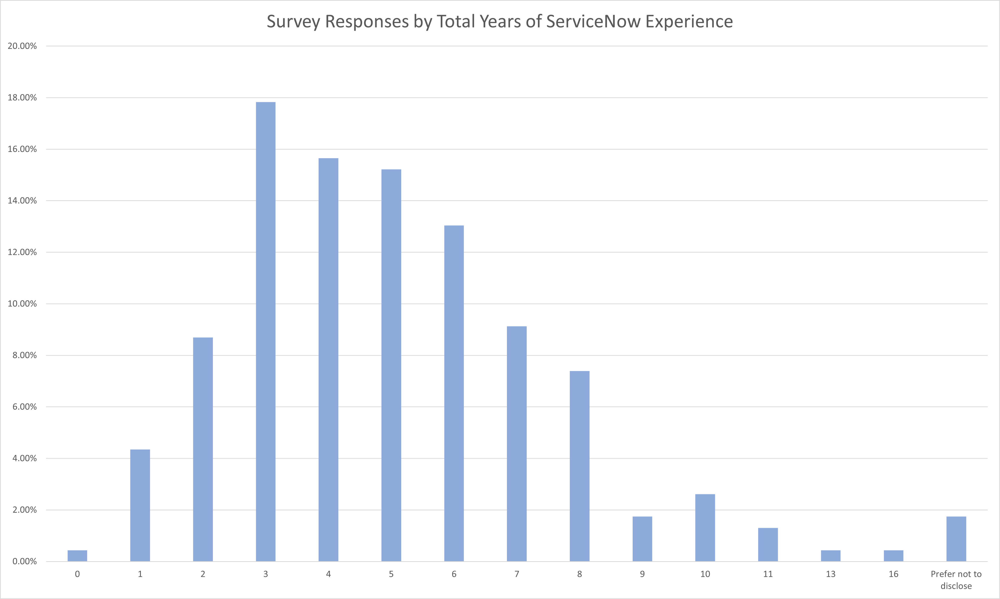
    <figcaption>
        Survey Responses by Total Years of ServiceNow Experience
    </figcaption>
    </figure>
</a>

| Response               | Percent of Respondents |
|------------------------|------------------------|
| 0                      | 0.43%                  |
| 1                      | 4.35%                  |
| 2                      | 8.70%                  |
| 3                      | 17.83%                 |
| 4                      | 15.65%                 |
| 5                      | 15.22%                 |
| 6                      | 13.04%                 |
| 7                      | 9.13%                  |
| 8                      | 7.39%                  |
| 9                      | 1.74%                  |
| 10                     | 2.61%                  |
| 11                     | 1.30%                  |
| 13                     | 0.43%                  |
| 16                     | 0.43%                  |
| Prefer not to disclose | 1.74%                  |

### Please indicate the total years of experience you have in the following areas [With your current employer]

<a href="images/survey_responses_by_experience_current_employer.png">
    <figure>
    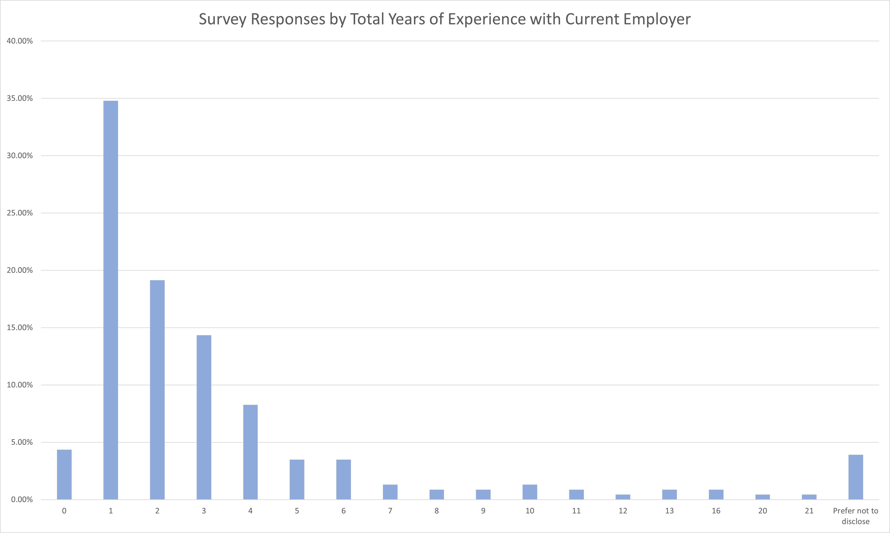
    <figcaption>
        Survey Responses by Total Years of Experience with Current Employer
    </figcaption>
    </figure>
</a>

| Response               | Percent of Respondents |
|------------------------|------------------------|
| 0                      | 4.35%                  |
| 1                      | 34.78%                 |
| 2                      | 19.13%                 |
| 3                      | 14.35%                 |
| 4                      | 8.26%                  |
| 5                      | 3.48%                  |
| 6                      | 3.48%                  |
| 7                      | 1.30%                  |
| 8                      | 0.87%                  |
| 9                      | 0.87%                  |
| 10                     | 1.30%                  |
| 11                     | 0.87%                  |
| 12                     | 0.43%                  |
| 13                     | 0.87%                  |
| 16                     | 0.87%                  |
| 20                     | 0.43%                  |
| 21                     | 0.43%                  |
| Prefer not to disclose | 3.91%                  |

### Please indicate the total years of experience you have in the following areas [In your current role]

<a href="images/survey_responses_by_experience_current_role.png">
    <figure>
    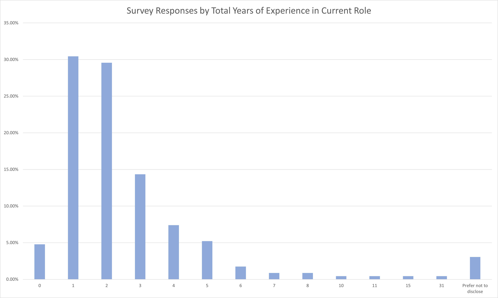
    <figcaption>
        Survey Responses by Total Years of Experience in Current Role
    </figcaption>
    </figure>
</a>

| Response               | Percent of Respondents |
|------------------------|------------------------|
| 0                      | 4.78%                  |
| 1                      | 30.43%                 |
| 2                      | 29.57%                 |
| 3                      | 14.35%                 |
| 4                      | 7.39%                  |
| 5                      | 5.22%                  |
| 6                      | 1.74%                  |
| 7                      | 0.87%                  |
| 8                      | 0.87%                  |
| 10                     | 0.43%                  |
| 11                     | 0.43%                  |
| 15                     | 0.43%                  |
| 31                     | 0.43%                  |
| Prefer not to disclose | 3.04%                  |

### How many different employers have you worked for in your career?

<a href="images/survey_responses_by_number_of_employers.png">
    <figure>
    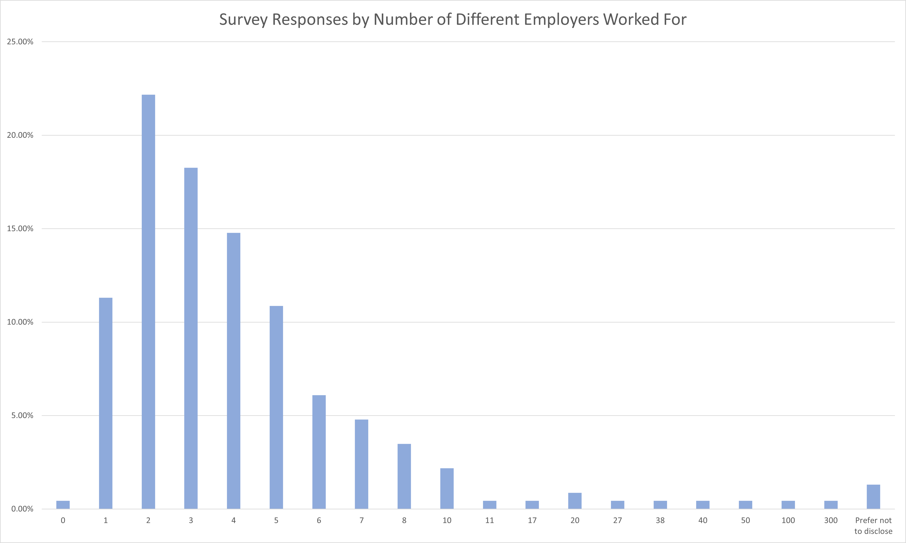
    <figcaption>
        Survey Responses by Number of Employers Worked For
    </figcaption>
    </figure>
</a>

| Response               | Percent of Respondents |
|------------------------|------------------------|
| 0                      | 0.43%                  |
| 1                      | 11.30%                 |
| 2                      | 22.17%                 |
| 3                      | 18.26%                 |
| 4                      | 14.78%                 |
| 5                      | 10.87%                 |
| 6                      | 6.09%                  |
| 7                      | 4.78%                  |
| 8                      | 3.48%                  |
| 10                     | 2.17%                  |
| 11                     | 0.43%                  |
| 17                     | 0.43%                  |
| 20                     | 0.87%                  |
| 27                     | 0.43%                  |
| 38                     | 0.43%                  |
| 40                     | 0.43%                  |
| 50                     | 0.43%                  |
| 100                    | 0.43%                  |
| 300                    | 0.43%                  |
| Prefer not to disclose | 1.30%                  |

### Please select any ServiceNow certifications that you currently possess

The following summarizes each ServiceNow Mainline Certificaiton and the percentage of respondents who indicated that they have the certification.

<a href="images/survey_responses_by_mainline_certification.png">
    <figure>
    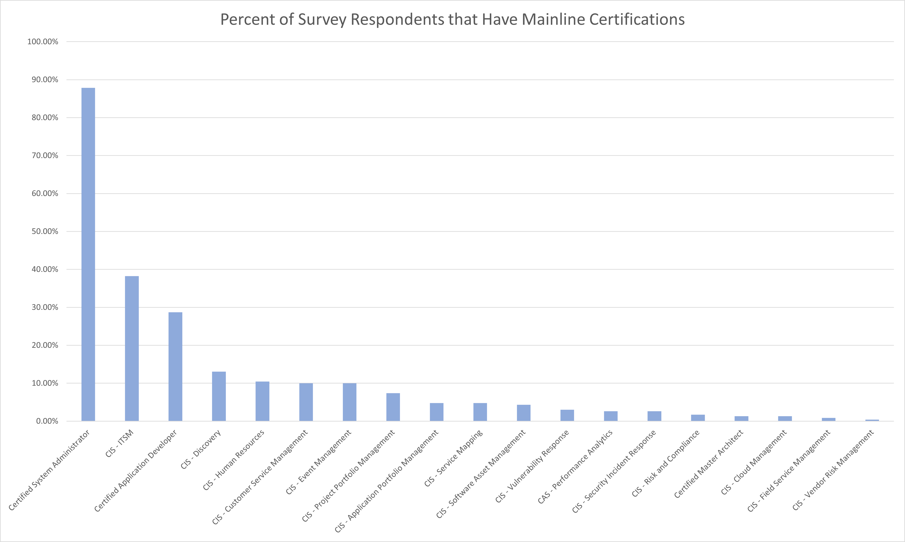
    <figcaption>
        Percent of Survey Respondents that Have Mainline Certifications
    </figcaption>
    </figure>
</a>

| Response                                 | Percent of Respondents |
|------------------------------------------|------------------------|
| Certified   System Administrator         | 87.83%                 |
| CIS - ITSM                               | 38.26%                 |
| Certified Application   Developer        | 28.70%                 |
| CIS - Discovery                          | 13.04%                 |
| CIS - Human Resources                    | 10.43%                 |
| CIS - Customer Service   Management      | 10.00%                 |
| CIS - Event Management                   | 10.00%                 |
| CIS - Project Portfolio   Management     | 7.39%                  |
| CIS - Application Portfolio   Management | 4.78%                  |
| CIS - Service Mapping                    | 4.78%                  |
| CIS - Software Asset   Management        | 4.35%                  |
| CIS - Vulnerability Response             | 3.04%                  |
| CAS - Performance Analytics              | 2.61%                  |
| CIS - Security Incident   Response       | 2.61%                  |
| CIS - Risk and Compliance                | 1.74%                  |
| Certified Master Architect               | 1.30%                  |
| CIS - Cloud Management                   | 1.30%                  |
| CIS - Field Service Management           | 0.87%                  |
| CIS - Vendor Risk Management             | 0.43%                  |

### Please select any ServiceNow micro-certifications that you currently possess

The following summarizes each ServiceNow Micro-Certificaiton and the percentage of respondents who indicated that they have the certification.

<a href="images/survey_responses_by_micro_certification.png">
    <figure>
    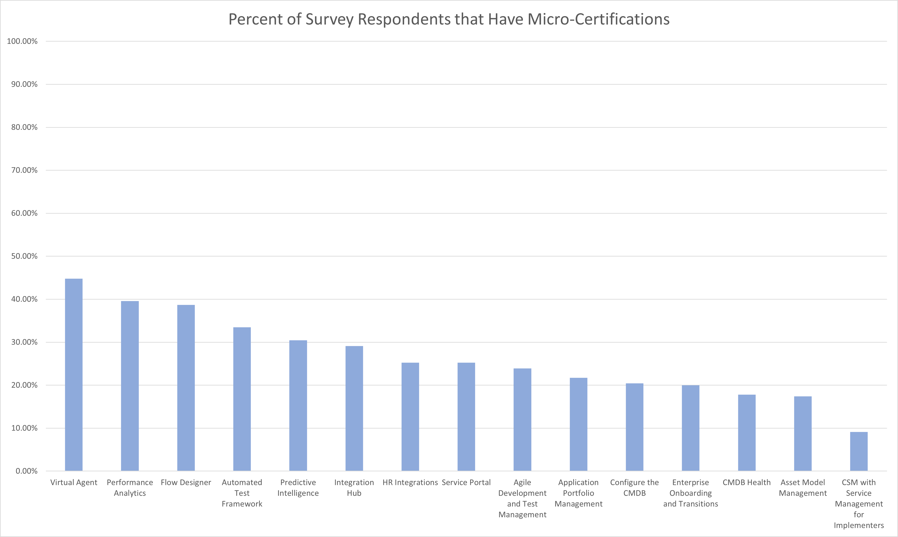
    <figcaption>
        Percent of Survey Respondents that Have Micro-Certifications
    </figcaption>
    </figure>
</a>

| Response                                       | Percent of Respondents |
|------------------------------------------------|------------------------|
| Virtual   Agent                                | 44.78%                 |
| Performance Analytics                          | 39.57%                 |
| Flow Designer                                  | 38.70%                 |
| Automated Test Framework                       | 33.48%                 |
| Predictive Intelligence                        | 30.43%                 |
| Integration Hub                                | 29.13%                 |
| HR Integrations                                | 25.22%                 |
| Service Portal                                 | 25.22%                 |
| Agile Development and Test   Management        | 23.91%                 |
| Application Portfolio   Management             | 21.74%                 |
| Configure the CMDB                             | 20.43%                 |
| Enterprise Onboarding and   Transitions        | 20.00%                 |
| CMDB Health                                    | 17.83%                 |
| Asset Model Management                         | 17.39%                 |
| CSM with Service Management   for Implementers | 9.13%                  |

### Please select any Professional certifications that you currently possess

The following summarizes each Professional Certificaiton and the percentage of respondents who indicated that they have the certification.

<a href="images/survey_responses_by_professional_certification.png">
    <figure>
    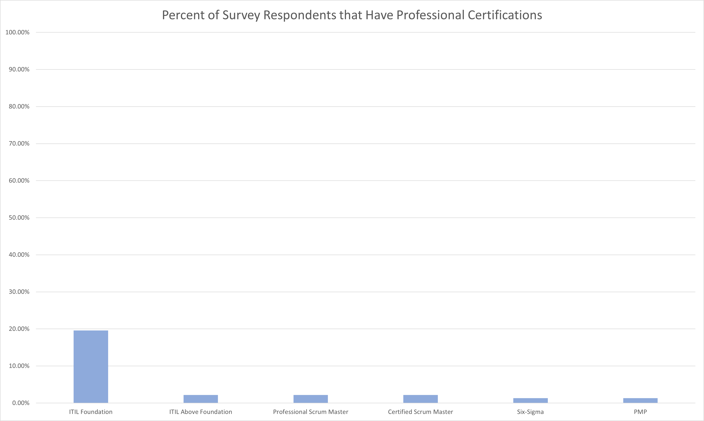
    <figcaption>
        Percent of Survey Respondents that Have Professional Certifications
    </figcaption>
    </figure>
</a>

| Response                  | Percent of Respondents |
|---------------------------|------------------------|
| ITIL   Foundation         | 19.57%                 |
| ITIL Above Foundation     | 2.17%                  |
| Professional Scrum Master | 2.17%                  |
| Certified Scrum Master    | 2.17%                  |
| Six-Sigma                 | 1.30%                  |
| PMP                       | 1.30%                  |

### Survey Responses by Total Number of Certifications

The results of this question were inferred from responses to:
- [Please select any ServiceNow certifications that you currently possess][25]
- [Please select any ServiceNow micro-certifications that you currently possess][26]
- [Please select any Professional certifications that you currently possess][27]

<a href="images/survey_responses_by_certifications_total.png">
    <figure>
    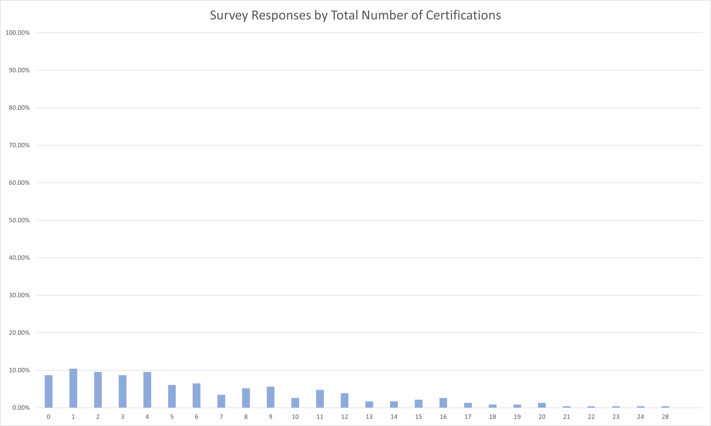
    <figcaption>
        Survey Responses by Total Number of Certifications
    </figcaption>
    </figure>
</a>

| Response | Percent of Respondents |
|----------|------------------------|
| 0        | 8.70%                  |
| 1        | 10.43%                 |
| 2        | 9.57%                  |
| 3        | 8.70%                  |
| 4        | 9.57%                  |
| 5        | 6.09%                  |
| 6        | 6.52%                  |
| 7        | 3.48%                  |
| 8        | 5.22%                  |
| 9        | 5.65%                  |
| 10       | 2.61%                  |
| 11       | 4.78%                  |
| 12       | 3.91%                  |
| 13       | 1.74%                  |
| 14       | 1.74%                  |
| 15       | 2.17%                  |
| 16       | 2.61%                  |
| 17       | 1.30%                  |
| 18       | 0.87%                  |
| 19       | 0.87%                  |
| 20       | 1.30%                  |
| 21       | 0.43%                  |
| 22       | 0.43%                  |
| 23       | 0.43%                  |
| 24       | 0.43%                  |
| 28       | 0.43%                  |

### Survey Responses by Total Number of Mainline Certifications

The results of this question were inferred from responses to:
- [Please select any ServiceNow certifications that you currently possess][25]

<a href="images/survey_responses_by_certifications_mainline.png">
    <figure>
    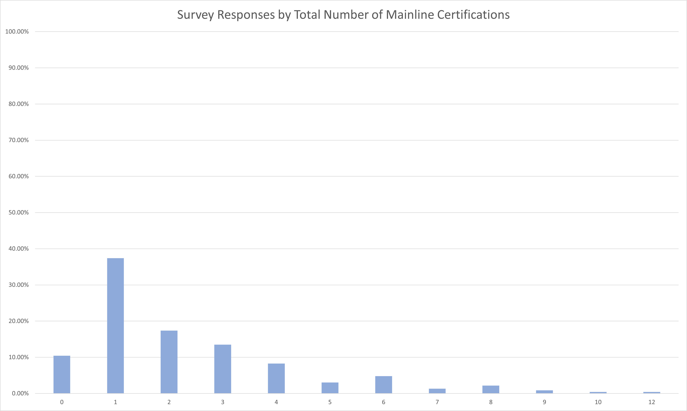
    <figcaption>
        Survey Responses by Total Number of Mainline Certifications
    </figcaption>
    </figure>
</a>

| Response | Percent of Respondents |
|----------|------------------------|
| 0        | 10.43%                 |
| 1        | 37.39%                 |
| 2        | 17.39%                 |
| 3        | 13.48%                 |
| 4        | 8.26%                  |
| 5        | 3.04%                  |
| 6        | 4.78%                  |
| 7        | 1.30%                  |
| 8        | 2.17%                  |
| 9        | 0.87%                  |
| 10       | 0.43%                  |
| 12       | 0.43%                  |

### Survey Responses by Total Number of Micro-Certifications

The results of this question were inferred from responses to:
- [Please select any ServiceNow micro-certifications that you currently possess][26]

<a href="images/survey_responses_by_certifications_micro.png">
    <figure>
    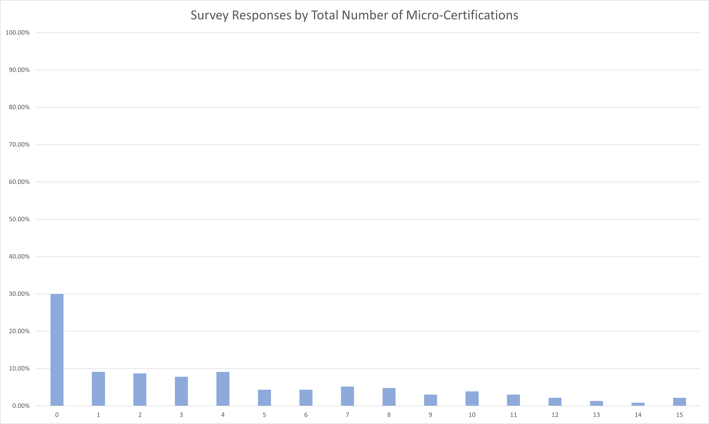
    <figcaption>
        Survey Responses by Total Number of Micro-Certifications
    </figcaption>
    </figure>
</a>

| Response | Percent of Respondents |
|----------|------------------------|
| 0        | 30.00%                 |
| 1        | 9.13%                  |
| 2        | 8.70%                  |
| 3        | 7.83%                  |
| 4        | 9.13%                  |
| 5        | 4.35%                  |
| 6        | 4.35%                  |
| 7        | 5.22%                  |
| 8        | 4.78%                  |
| 9        | 3.04%                  |
| 10       | 3.91%                  |
| 11       | 3.04%                  |
| 12       | 2.17%                  |
| 13       | 1.30%                  |
| 14       | 0.87%                  |
| 15       | 2.17%                  |

### Survey Responses by Total Number of CIS Certifications

The results of this question were inferred from responses to:
- [Please select any ServiceNow certifications that you currently possess][25]

<a href="images/survey_responses_by_certifications_cis.png">
    <figure>
    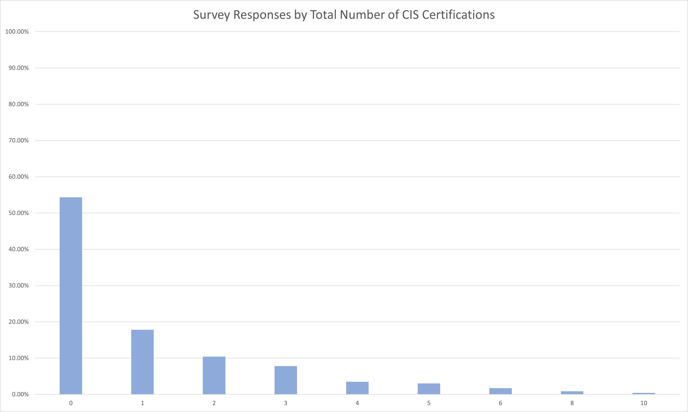
    <figcaption>
        Survey Responses by Total Number of CIS Certifications
    </figcaption>
    </figure>
</a>

| Response | Percent of Respondents |
|----------|------------------------|
| 0        | 54.35%                 |
| 1        | 17.83%                 |
| 2        | 10.43%                 |
| 3        | 7.83%                  |
| 4        | 3.48%                  |
| 5        | 3.04%                  |
| 6        | 1.74%                  |
| 8        | 0.87%                  |
| 10       | 0.43%                  |

### What is your current employment status?

<a href="images/survey_responses_by_employment_status.png">
    <figure>
    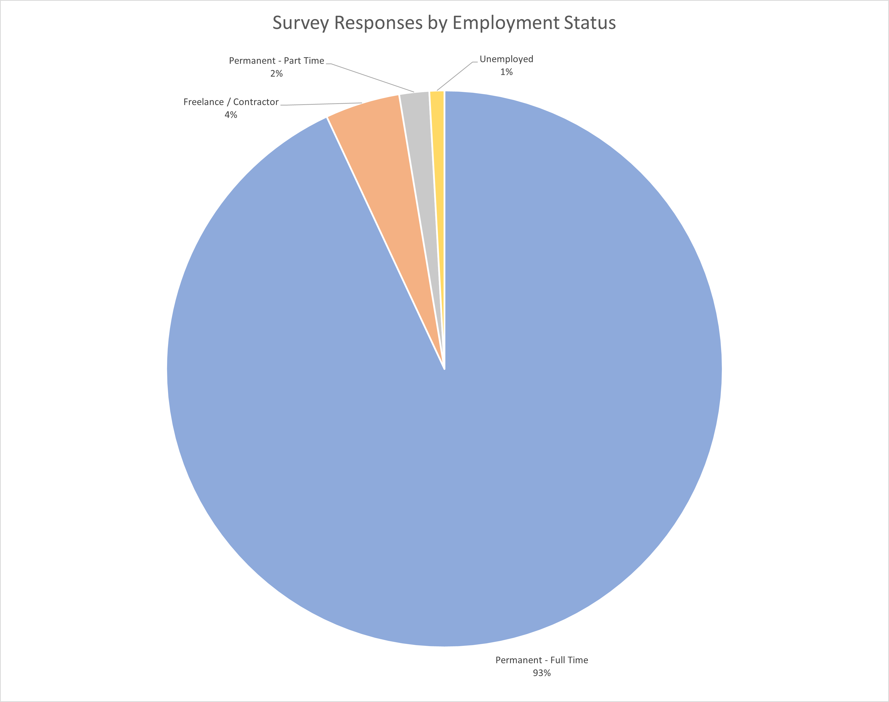
    <figcaption>
        Survey Responses by Employment Status
    </figcaption>
    </figure>
</a>

| Response               | Percent of Respondents |
|------------------------|------------------------|
| Permanent - Full Time  | 93.04%                 |
| Freelance / Contractor | 4.35%                  |
| Permanent - Part Time  | 1.74%                  |
| Unemployed             | 0.87%                  |

### Which of the following best describes your current job role?

<a href="images/survey_responses_by_job_role.png">
    <figure>
    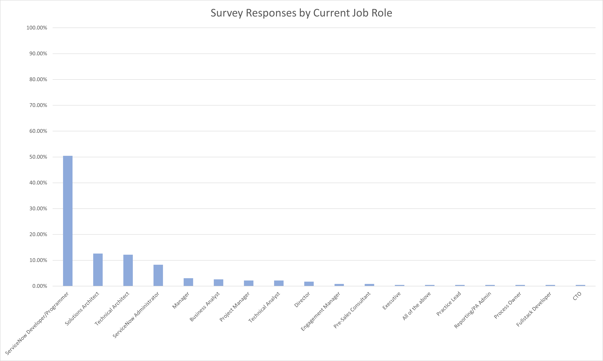
    <figcaption>
        Survey Responses by Current Job Role
    </figcaption>
    </figure>
</a>

| Response                          | Percent of Respondents |
|-----------------------------------|------------------------|
| ServiceNow   Developer/Programmer | 50.43%                 |
| Solutions Architect               | 12.61%                 |
| Technical Architect               | 12.17%                 |
| ServiceNow Administrator          | 8.26%                  |
| Manager                           | 3.04%                  |
| Business Analyst                  | 2.61%                  |
| Project Manager                   | 2.17%                  |
| Technical Analyst                 | 2.17%                  |
| Director                          | 1.74%                  |
| Engagement Manager                | 0.87%                  |
| Pre-Sales Consultant              | 0.87%                  |
| Executive                         | 0.43%                  |
| All of the above                  | 0.43%                  |
| Practice Lead                     | 0.43%                  |
| Reporting/PA Admin                | 0.43%                  |
| Process Owner                     | 0.43%                  |
| Fullstack Developer               | 0.43%                  |
| CTO                               | 0.43%                  |

### Which of the following best describes your job level?

<a href="images/survey_responses_by_job_level.png">
    <figure>
    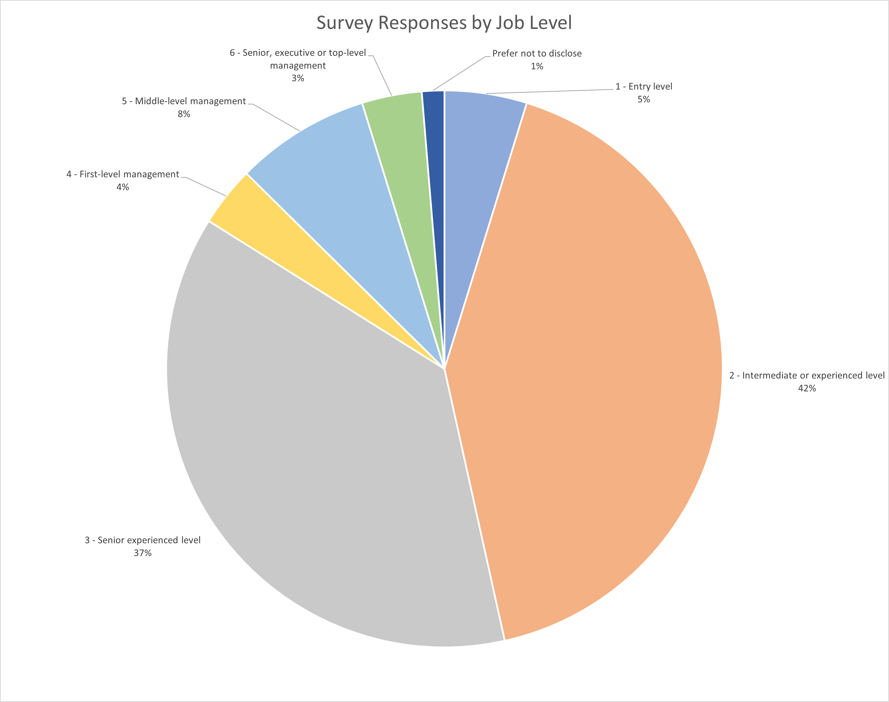
    <figcaption>
        Survey Responses by Current Job Level
    </figcaption>
    </figure>
</a>

| Response                                        | Percent of Respondents |
|-------------------------------------------------|------------------------|
| 1 - Entry   level                               | 4.78%                  |
| 2 - Intermediate or   experienced level         | 41.74%                 |
| 3 - Senior experienced level                    | 37.39%                 |
| 4 - First-level management                      | 3.48%                  |
| 5 - Middle-level management                     | 7.83%                  |
| 6 - Senior, executive or   top-level management | 3.48%                  |
| Prefer not to disclose                          | 1.30%                  |

### What percent of the time do you typically spend working remotely (before the COVID-19 Pandemic)?

<a href="images/survey_responses_by_percent_remote_work.png">
    <figure>
    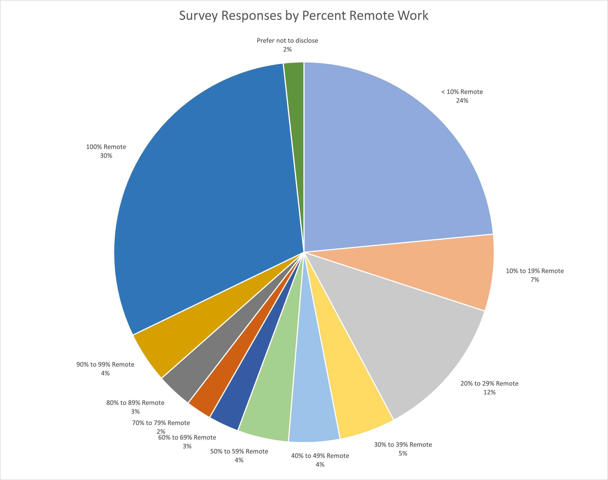
    <figcaption>
        Survey Responses by Percent Remote Work
    </figcaption>
    </figure>
</a>

| Response               | Percent of Respondents |
|------------------------|------------------------|
| 0                      | 15.22%                 |
| 2                      | 0.87%                  |
| 4                      | 0.43%                  |
| 5                      | 3.48%                  |
| 6                      | 0.43%                  |
| 8                      | 1.30%                  |
| 9                      | 1.74%                  |
| 10                     | 5.65%                  |
| 13                     | 0.43%                  |
| 15                     | 0.43%                  |
| 20                     | 12.17%                 |
| 30                     | 3.48%                  |
| 33                     | 0.43%                  |
| 35                     | 0.87%                  |
| 40                     | 4.35%                  |
| 50                     | 4.35%                  |
| 60                     | 2.61%                  |
| 70                     | 1.74%                  |
| 75                     | 0.43%                  |
| 80                     | 3.04%                  |
| 90                     | 2.61%                  |
| 95                     | 0.87%                  |
| 98                     | 0.43%                  |
| 99                     | 0.43%                  |
| 100                    | 30.43%                 |
| Prefer not to disclose | 1.74%                  |

### How many hours do you work in a typical work day?

<a href="images/survey_responses_by_hours_worked_per_day.png">
    <figure>
    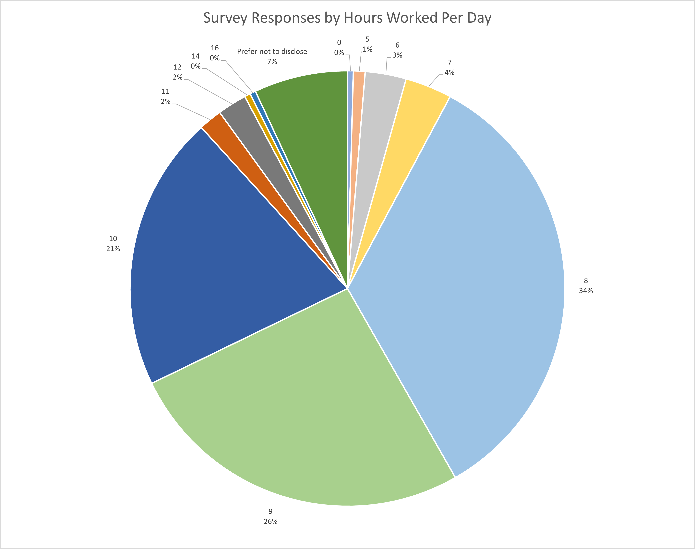
    <figcaption>
        Survey Responses by Percent Remote Work
    </figcaption>
    </figure>
</a>

| Response               | Percent of Respondents |
|------------------------|------------------------|
| 0                      | 0.43%                  |
| 5                      | 0.87%                  |
| 6                      | 3.04%                  |
| 7                      | 3.48%                  |
| 8                      | 33.91%                 |
| 9                      | 26.09%                 |
| 10                     | 20.43%                 |
| 11                     | 1.74%                  |
| 12                     | 2.17%                  |
| 14                     | 0.43%                  |
| 16                     | 0.43%                  |
| Prefer not to disclose | 6.96%                  |

### For each of the following skills, please select the highest frequency at which you typically use the skill on the job.

<a href="images/survey_responses_by_skill_misc.png">
    <figure>
    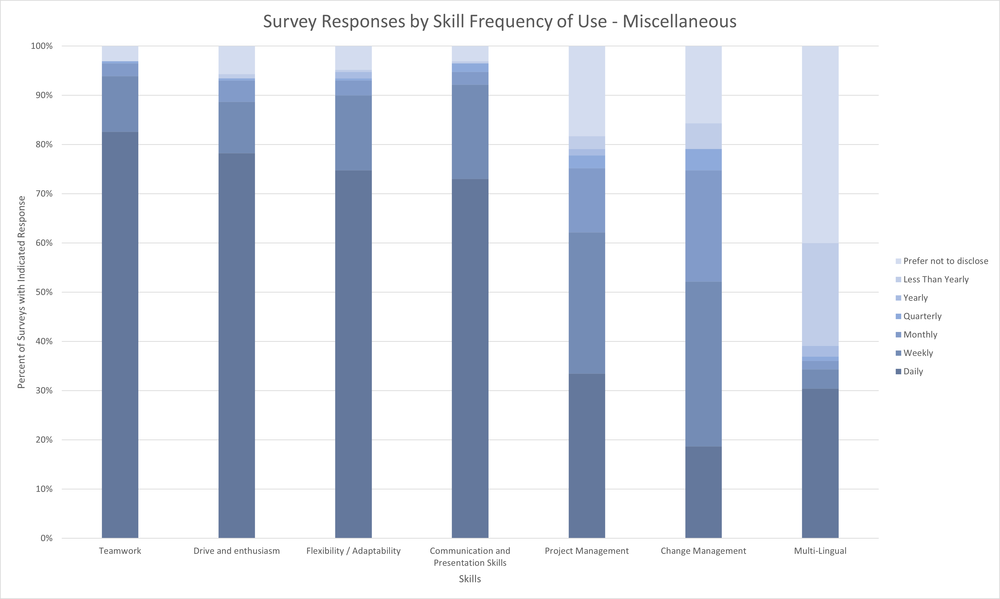
    <figcaption>
        Survey Responses by Skill Frequency of Use - Miscellaneous
    </figcaption>
    </figure>
</a>

|                        | Teamwork | Drive and enthusiasm | Flexibility / Adaptability | Communication and Presentation Skills | Project Management | Change Management | Multi-Lingual |
|------------------------|----------|----------------------|----------------------------|---------------------------------------|--------------------|-------------------|---------------|
| Daily                  | 82.61%   | 78.26%               | 74.78%                     | 73.04%                                | 33.48%             | 18.70%            | 30.43%        |
| Weekly                 | 11.30%   | 10.43%               | 15.22%                     | 19.13%                                | 28.70%             | 33.48%            | 3.91%         |
| Monthly                | 2.61%    | 4.35%                | 3.04%                      | 2.61%                                 | 13.04%             | 22.61%            | 1.74%         |
| Quarterly              | 0.43%    | 0.43%                | 0.43%                      | 1.74%                                 | 2.61%              | 4.35%             | 0.87%         |
| Yearly                 | 0.00%    | 0.00%                | 1.30%                      | 0.00%                                 | 1.30%              | 0.00%             | 2.17%         |
| Less Than Yearly       | 0.00%    | 0.87%                | 0.43%                      | 0.43%                                 | 2.61%              | 5.22%             | 20.87%        |
| Prefer not to disclose | 3.04%    | 5.65%                | 4.78%                      | 3.04%                                 | 18.26%             | 15.65%            | 40.00%        |

<a href="images/survey_responses_by_skill_sales.png">
    <figure>
    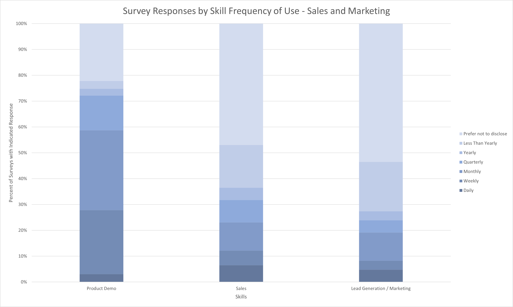
    <figcaption>
        Survey Responses by Skill Frequency of Use - Sales and Marketing
    </figcaption>
    </figure>
</a>

|                        | Product Demo | Sales  | Lead Generation / Marketing |
|------------------------|--------------|--------|-----------------------------|
| Daily                  | 3.04%        | 6.52%  | 4.78%                       |
| Weekly                 | 24.78%       | 5.65%  | 3.48%                       |
| Monthly                | 30.87%       | 10.87% | 10.87%                      |
| Quarterly              | 13.48%       | 8.70%  | 4.78%                       |
| Yearly                 | 2.61%        | 4.78%  | 3.48%                       |
| Less Than Yearly       | 3.04%        | 16.52% | 19.13%                      |
| Prefer not to disclose | 22.17%       | 46.96% | 53.48%                      |

<a href="images/survey_responses_by_skill_architecture.png">
    <figure>
    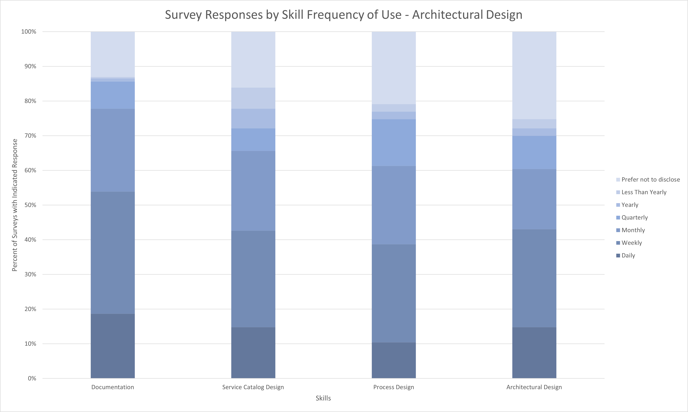
    <figcaption>
        Survey Responses by Skill Frequency of Use - Architectural Design
    </figcaption>
    </figure>
</a>

|                        | Documentation | Service Catalog Design | Process Design | Architectural Design |
|------------------------|---------------|------------------------|----------------|----------------------|
| Daily                  | 18.70%        | 14.78%                 | 10.43%         | 14.78%               |
| Weekly                 | 35.22%        | 27.83%                 | 28.26%         | 28.26%               |
| Monthly                | 23.91%        | 23.04%                 | 22.61%         | 17.39%               |
| Quarterly              | 7.83%         | 6.52%                  | 13.48%         | 9.57%                |
| Yearly                 | 0.87%         | 5.65%                  | 2.17%          | 2.17%                |
| Less Than Yearly       | 0.43%         | 6.09%                  | 2.17%          | 2.61%                |
| Prefer not to disclose | 13.04%        | 16.09%                 | 20.87%         | 25.22%               |

<a href="images/survey_responses_by_skill_development.png">
    <figure>
    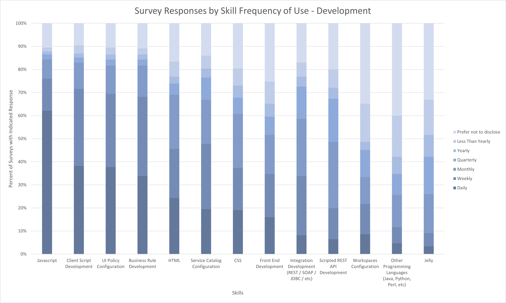
    <figcaption>
        Survey Responses by Skill Frequency of Use - Development
    </figcaption>
    </figure>
</a>

|                        | Javascript | Client Script Development | UI Policy Configuration | Business Rule Development | HTML   | Service Catalog Configuration | CSS    | Front End Development | Integration Development (REST / SOAP / JDBC /   etc) | Scripted REST API Development | Workspaces Configuration | Other Programming Languages (Java, Python,   Perl, etc) | Jelly  |
|------------------------|------------|---------------------------|-------------------------|---------------------------|--------|-------------------------------|--------|-----------------------|------------------------------------------------------|-------------------------------|--------------------------|---------------------------------------------------------|--------|
| Daily                  | 62.17%     | 38.26%                    | 37.83%                  | 33.91%                    | 24.35% | 19.57%                        | 19.13% | 16.09%                | 8.26%                                                | 6.52%                         | 8.70%                    | 4.78%                                                   | 3.48%  |
| Weekly                 | 13.91%     | 33.48%                    | 31.74%                  | 34.35%                    | 21.30% | 28.26%                        | 18.26% | 18.70%                | 25.65%                                               | 13.48%                        | 13.04%                   | 6.96%                                                   | 5.65%  |
| Monthly                | 8.26%      | 11.30%                    | 12.17%                  | 13.48%                    | 23.48% | 19.13%                        | 23.48% | 16.96%                | 24.78%                                               | 28.70%                        | 11.74%                   | 13.91%                                                  | 16.96% |
| Quarterly              | 2.17%      | 2.17%                     | 2.61%                   | 2.61%                     | 4.78%  | 9.57%                         | 6.96%  | 7.83%                 | 13.91%                                               | 18.70%                        | 11.74%                   | 9.13%                                                   | 16.09% |
| Yearly                 | 1.30%      | 1.74%                     | 2.17%                   | 2.17%                     | 3.04%  | 3.91%                         | 5.22%  | 5.65%                 | 4.35%                                                | 4.78%                         | 3.48%                    | 7.39%                                                   | 9.57%  |
| Less Than Yearly       | 1.74%      | 3.48%                     | 3.04%                   | 2.61%                     | 6.52%  | 5.65%                         | 7.39%  | 9.57%                 | 6.09%                                                | 7.83%                         | 16.52%                   | 17.83%                                                  | 15.22% |
| Prefer not to disclose | 10.43%     | 9.57%                     | 10.43%                  | 10.87%                    | 16.52% | 13.91%                        | 19.57% | 25.22%                | 16.96%                                               | 20.00%                        | 34.78%                   | 40.00%                                                  | 33.04% |

### For each of the following ServiceNow products, please indicate the highest frequency with which you perform work related to the product in your current role.

<a href="images/survey_responses_by_product_app.png">
    <figure>
    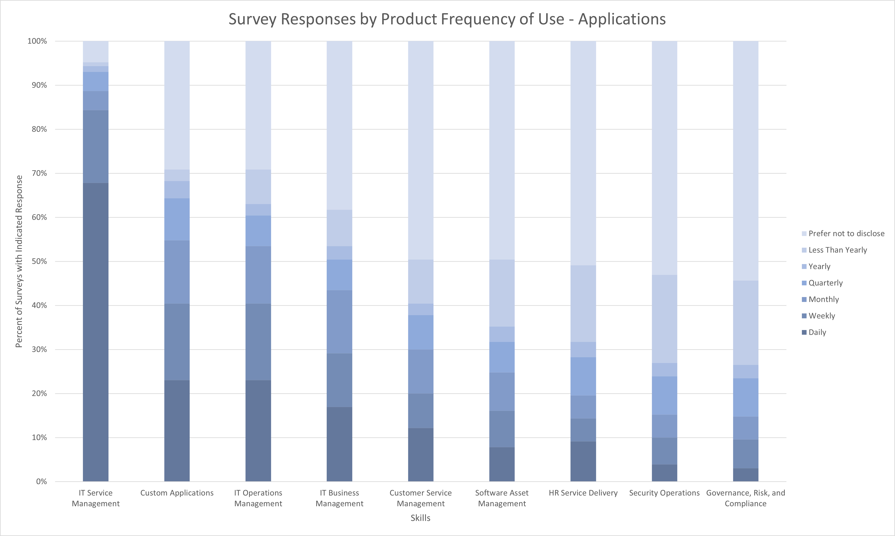
    <figcaption>
        Survey Responses by Product Frequency of Use - Applications
    </figcaption>
    </figure>
</a>

|                        | IT Service Management | Custom Applications | IT Operations Management | IT Business Management | Customer Service Management | Software Asset Management | HR Service Delivery | Security Operations | Governance, Risk, and Compliance |
|------------------------|-----------------------|---------------------|--------------------------|------------------------|-----------------------------|---------------------------|---------------------|---------------------|----------------------------------|
| Daily                  | 67.83%                | 23.04%              | 23.04%                   | 16.96%                 | 12.17%                      | 7.83%                     | 9.13%               | 3.91%               | 3.04%                            |
| Weekly                 | 16.52%                | 17.39%              | 17.39%                   | 12.17%                 | 7.83%                       | 8.26%                     | 5.22%               | 6.09%               | 6.52%                            |
| Monthly                | 4.35%                 | 14.35%              | 13.04%                   | 14.35%                 | 10.00%                      | 8.70%                     | 5.22%               | 5.22%               | 5.22%                            |
| Quarterly              | 4.35%                 | 9.57%               | 6.96%                    | 6.96%                  | 7.83%                       | 6.96%                     | 8.70%               | 8.70%               | 8.70%                            |
| Yearly                 | 1.30%                 | 3.91%               | 2.61%                    | 3.04%                  | 2.61%                       | 3.48%                     | 3.48%               | 3.04%               | 3.04%                            |
| Less Than Yearly       | 0.87%                 | 2.61%               | 7.83%                    | 8.26%                  | 10.00%                      | 15.22%                    | 17.39%              | 20.00%              | 19.13%                           |
| Prefer not to disclose | 4.78%                 | 29.13%              | 29.13%                   | 38.26%                 | 49.57%                      | 49.57%                    | 50.87%              | 53.04%              | 54.35%                           |

<a href="images/survey_responses_by_product_capability.png">
    <figure>
    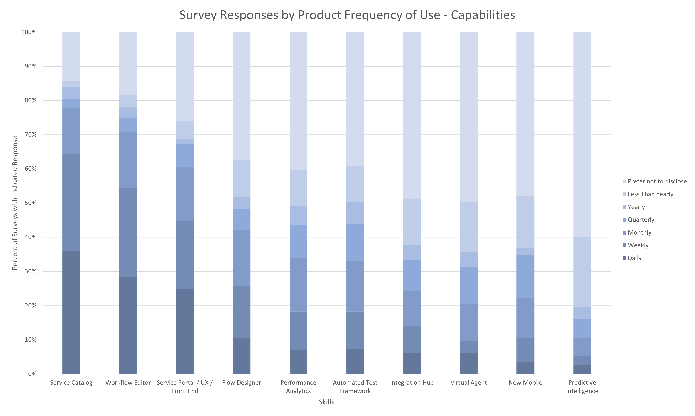
    <figcaption>
        Survey Responses by Product Frequency of Use - Capabilities
    </figcaption>
    </figure>
</a>

|                        | Service Catalog | Workflow Editor | Service Portal / UX / Front End | Flow Designer | Performance Analytics | Automated Test Framework | Integration Hub | Virtual Agent | Now Mobile | Predictive Intelligence |
|------------------------|-----------------|-----------------|---------------------------------|---------------|-----------------------|--------------------------|-----------------|---------------|------------|-------------------------|
| Daily                  | 36.09%          | 28.26%          | 24.78%                          | 10.43%        | 6.96%                 | 7.39%                    | 6.09%           | 6.09%         | 3.48%      | 2.61%                   |
| Weekly                 | 28.26%          | 26.09%          | 20.00%                          | 15.22%        | 11.30%                | 10.87%                   | 7.83%           | 3.48%         | 6.96%      | 2.61%                   |
| Monthly                | 13.48%          | 16.52%          | 15.65%                          | 16.52%        | 15.65%                | 14.78%                   | 10.43%          | 10.87%        | 11.74%     | 5.22%                   |
| Quarterly              | 2.61%           | 3.91%           | 6.96%                           | 6.09%         | 9.57%                 | 10.87%                   | 9.13%           | 10.87%        | 12.61%     | 5.65%                   |
| Yearly                 | 3.48%           | 3.48%           | 1.30%                           | 3.48%         | 5.65%                 | 6.52%                    | 4.35%           | 4.35%         | 2.17%      | 3.48%                   |
| Less Than Yearly       | 1.74%           | 3.48%           | 5.22%                           | 10.87%        | 10.43%                | 10.43%                   | 13.48%          | 14.78%        | 15.22%     | 20.43%                  |
| Prefer not to disclose | 14.35%          | 18.26%          | 26.09%                          | 37.39%        | 40.43%                | 39.13%                   | 48.70%          | 49.57%        | 47.83%     | 60.00%                  |

### Please rate the degree to which you agree with the following statements

<a href="images/survey_responses_for_statement_agreement.png">
    <figure>
    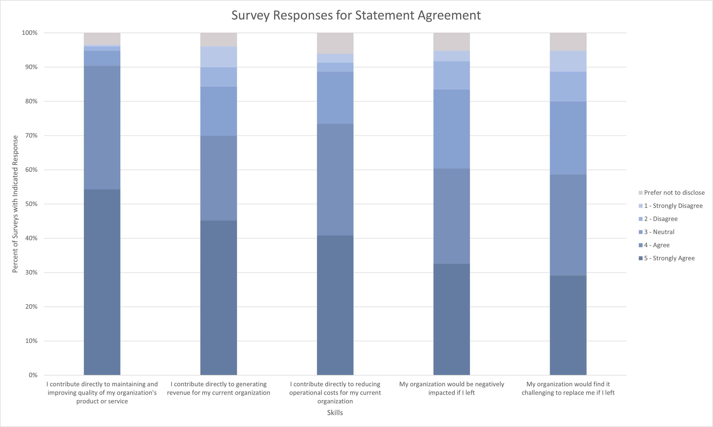
    <figcaption>
        Survey Responses for Statement Agreement
    </figcaption>
    </figure>
</a>

|                        | I contribute directly to maintaining and   improving quality of my organization's product or service | I contribute directly to generating revenue   for my current organization | I contribute directly to reducing operational   costs for my current organization | My organization would be negatively impacted   if I left | My organization would find it challenging to   replace me if I left |
|------------------------|------------------------------------------------------------------------------------------------------|---------------------------------------------------------------------------|-----------------------------------------------------------------------------------|----------------------------------------------------------|---------------------------------------------------------------------|
| 5 - Strongly Agree     | 54.35%                                                                                               | 45.22%                                                                    | 40.87%                                                                            | 32.61%                                                   | 29.13%                                                              |
| 4 - Agree              | 36.09%                                                                                               | 24.78%                                                                    | 32.61%                                                                            | 27.83%                                                   | 29.57%                                                              |
| 3 - Neutral            | 4.35%                                                                                                | 14.35%                                                                    | 15.22%                                                                            | 23.04%                                                   | 21.30%                                                              |
| 2 - Disagree           | 1.30%                                                                                                | 5.65%                                                                     | 2.61%                                                                             | 8.26%                                                    | 8.70%                                                               |
| 1 - Strongly Disagree  | 0.43%                                                                                                | 6.09%                                                                     | 2.61%                                                                             | 3.04%                                                    | 6.09%                                                               |
| Prefer not to disclose | 3.48%                                                                                                | 3.91%                                                                     | 6.09%                                                                             | 5.22%                                                    | 5.22%                                                               |

### Please rate the degree to which you are satisfied with the following

<a href="images/survey_responses_for_satisfaction.png">
    <figure>
    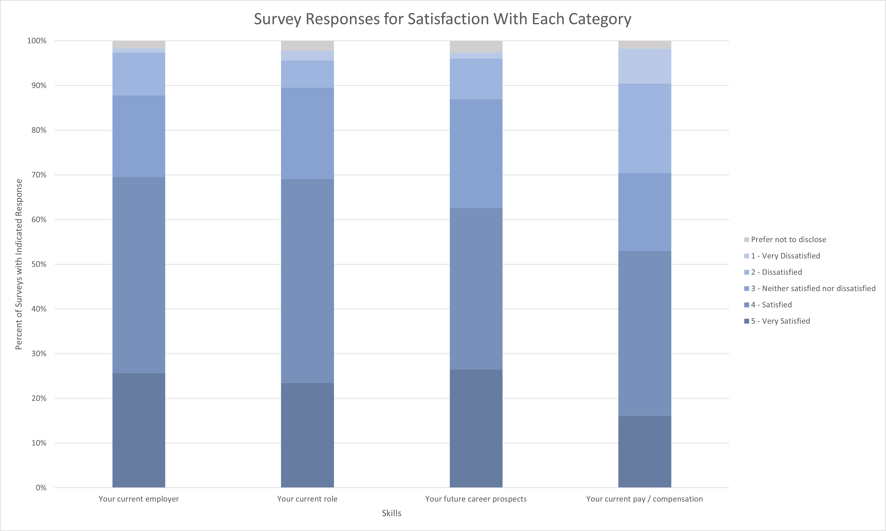
    <figcaption>
        Survey Responses for Satisfaction With Each Category
    </figcaption>
    </figure>
</a>

|                                          | Your current employer | Your current role | Your future career prospects | Your current pay / compensation |
|------------------------------------------|-----------------------|-------------------|------------------------------|---------------------------------|
| 5 - Very Satisfied                       | 25.65%                | 23.48%            | 26.52%                       | 16.09%                          |
| 4 - Satisfied                            | 43.91%                | 45.65%            | 36.09%                       | 36.96%                          |
| 3 - Neither satisfied nor   dissatisfied | 18.26%                | 20.43%            | 24.35%                       | 17.39%                          |
| 2 - Dissatisfied                         | 9.57%                 | 6.09%             | 9.13%                        | 20.00%                          |
| 1 - Very Dissatisfied                    | 0.87%                 | 2.17%             | 1.30%                        | 7.83%                           |
| Prefer not to disclose                   | 1.74%                 | 2.17%             | 2.61%                        | 1.74%                           |

### Are you currently paid Salary or Hourly?

<a href="images/survey_responses_by_salary_or_hourly.png">
    <figure>
    
    <figcaption>
        Survey Responses by Salary or Hourly
    </figcaption>
    </figure>
</a>

| Response               | Percent of Respondents |
|------------------------|------------------------|
| Salary                 | 93.48%                 |
| Hourly                 | 6.09%                  |
| Prefer not to disclose | 0.43%                  |

[1]: #age
[2]: #gender
[3]: #ethnicity
[4]: #disability-status
[5]: #in-what-geographic-location-are-you-employed-state
[6]: #in-what-geographic-location-are-you-employed-india-province
[7]: #in-what-geographic-location-are-you-employed-country
[8]: #in-what-geographic-location-are-you-employed-continent
[9]: #in-what-geographic-location-are-you-employed-bureau-of-economic-analysis-region
[10]: #are-you-a-military-veteran
[11]: #do-you-identify-with-the-gender-majority-of-the-teams-with-whom-you-most-closely-work
[12]: #do-you-identify-with-the-ethnic-majority-of-the-teams-with-whom-you-most-closely-work
[13]: #do-you-identify-with-the-cultural-majority-of-the-teams-with-whom-you-most-closely-work
[14]: #do-you-identify-with-the-socioeconomic-majority-of-the-teams-with-whom-you-most-closely-work
[15]: #do-you-identify-with-the-religious-majority-of-the-teams-with-whom-you-most-closely-work
[16]: #is-your-first-language-the-preferred-language-of-the-teams-with-whom-you-most-closely-work
[17]: #what-is-the-highest-level-of-education-that-you-completed
[18]: #if-you-attended-college-what-was-your-field-of-study
[19]: #please-indicate-the-total-years-of-experience-you-have-in-the-following-areas-total-professional-experience
[20]: #please-indicate-the-total-years-of-experience-you-have-in-the-following-areas-in-the-it-field
[21]: #please-indicate-the-total-years-of-experience-you-have-in-the-following-areas-working-with-the-servicenow-platform
[22]: #please-indicate-the-total-years-of-experience-you-have-in-the-following-areas-with-your-current-employer
[23]: #please-indicate-the-total-years-of-experience-you-have-in-the-following-areas-in-your-current-role
[24]: #how-many-different-employers-have-you-worked-for-in-your-career
[25]: #please-select-any-servicenow-certifications-that-you-currently-possess
[26]: #please-select-any-servicenow-micro-certifications-that-you-currently-possess
[27]: #please-select-any-professional-certifications-that-you-currently-possess
[28]: #survey-responses-by-total-number-of-certifications
[29]: #survey-responses-by-total-number-of-mainline-certifications
[30]: #survey-responses-by-total-number-of-micro-certifications
[31]: #survey-responses-by-total-number-of-cis-certifications
[32]: #what-is-your-current-employment-status
[33]: #which-of-the-following-best-describes-your-job-level
[34]: #which-of-the-following-best-describes-your-job-level
[35]: #what-percent-of-the-time-do-you-typically-spend-working-remotely-before-the-covid-19-pandemic
[36]: #how-many-hours-do-you-work-in-a-typical-work-day
[37]: #for-each-of-the-following-skills-please-select-the-highest-frequency-at-which-you-typically-use-the-skill-on-the-job
[38]: #for-each-of-the-following-servicenow-products-please-indicate-the-highest-frequency-with-which-you-perform-work-related-to-the-product-in-your-current-role
[39]: #please-rate-the-degree-to-which-you-agree-with-the-following-statements
[40]: #please-rate-the-degree-to-which-you-are-satisfied-with-the-following
[41]: #are-you-currently-paid-salary-or-hourly