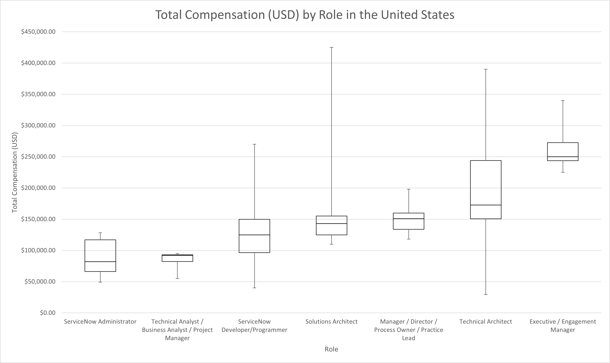
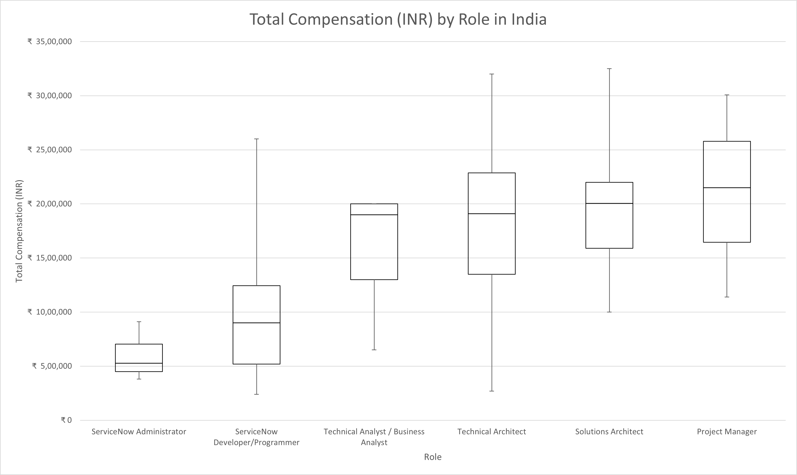
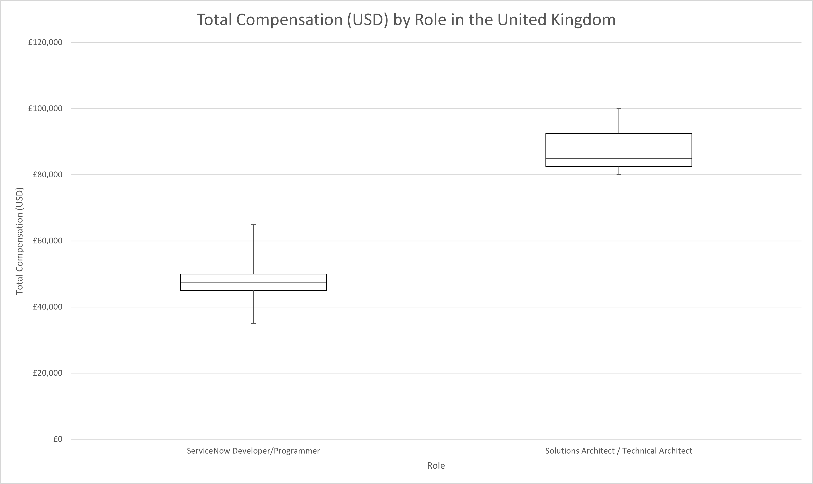
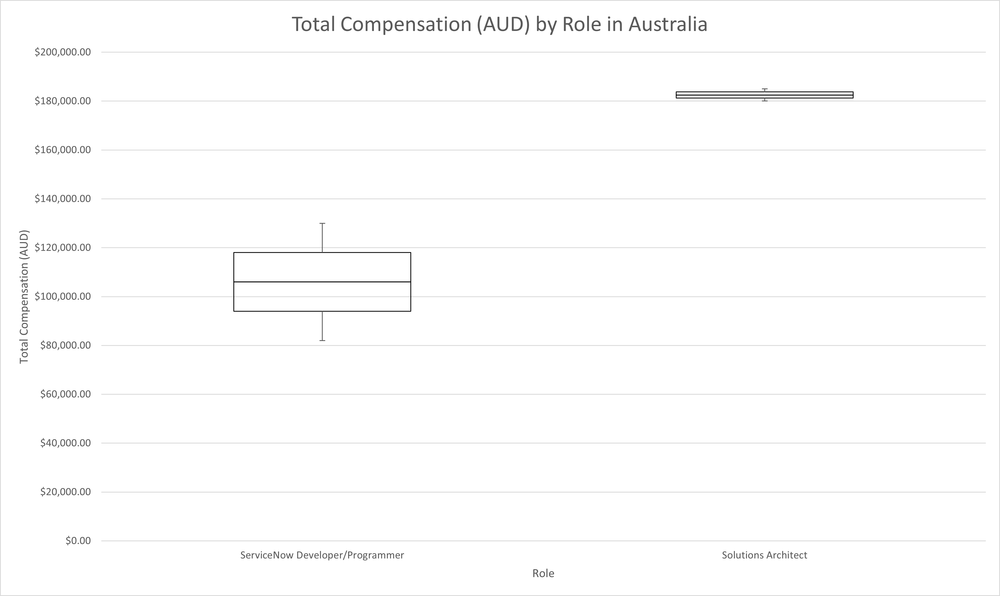
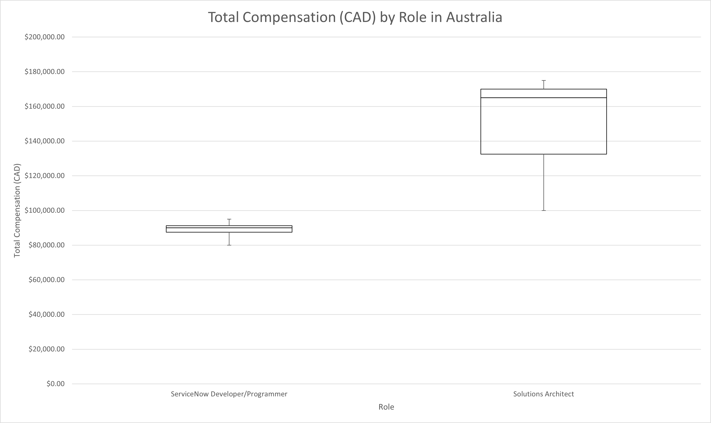

## Role Based Salary Tables

The following salary tables were generated directly from the survey responses without considering any outside data. Based on the findings of the analysis, years of experience is the strongest predictor in determining which quartile an individual is most likely to fall into. Depending on the country, the particular experience can vary. For the United States and Australia, ServiceNow experience was most correlated with compensation. For India, IT experience was most relevant. Lastly, for the United Kingdom and Canada, total experience was most informative. Additionally, for United States based workers, variable compensation (bonus, hourly, etc) of more than 25% of total compensation increases the probability of being compensated in the upper half of the scale.

The findings of the survey indicate that job title is technically irrelevant but strongly correlated with years of experience. In order to maintain consistency with traditional salary table based approaches, the decision was made to include the job titles in the tables. Country and role breakdowns with too few responses submitted were omitted both to preserve anonymity and to reduce the risk of publishing skewed data.

### United States

<a href="images/total-compensation-by-role-us.png">
    <figure>
    
    <figcaption>
        Total Compensation (USD) by Role in the United States
    </figcaption>
    </figure>
</a>

|                                                          | Min      | Q1       | Median   | Q3       | Max      |
|----------------------------------------------------------|----------|----------|----------|----------|----------|
| ServiceNow   Administrator                               | $49,200  | $66,250  | $82,000  | $116,934 | $128,250 |
| Technical   Analyst / Business Analyst / Project Manager | $55,000  | $82,375  | $92,000  | $93,125  | $95,000  |
| ServiceNow   Developer/Programmer                        | $40,000  | $96,509  | $125,000 | $150,000 | $270,000 |
| Solutions Architect                                      | $110,000 | $125,000 | $143,000 | $155,000 | $425,000 |
| Manager / Director / Process Owner /   Practice Lead     | $118,000 | $133,847 | $151,000 | $159,875 | $198,000 |
| Technical   Architect                                    | $29,200  | $150,700 | $172,800 | $244,000 | $390,000 |
| Executive   / Engagement Manager                         | $225,000 | $243,750 | $250,000 | $272,500 | $340,000 |

### India

<a href="images/total-compensation-by-role-india.png">
    <figure>
    
    <figcaption>
        Total Compensation (INR) by Role in India
    </figcaption>
    </figure>
</a>

|                                      | Min          | Q1           | Median       | Q3           | Max          |
|--------------------------------------|--------------|--------------|--------------|--------------|--------------|
| ServiceNow   Administrator           | ₹  3,79,998  | ₹  4,50,002  | ₹  5,27,503  | ₹  7,04,994  | ₹  9,09,994  |
| ServiceNow   Developer/Programmer    | ₹  2,39,991  | ₹  5,20,006  | ₹  9,00,004  | ₹  12,45,006 | ₹  26,00,007 |
| Technical Analyst / Business Analyst | ₹  6,50,002  | ₹  13,00,003 | ₹  18,99,992 | ₹  19,99,997 | ₹  19,99,997 |
| Technical   Architect                | ₹  2,70,003  | ₹  13,49,995 | ₹  19,10,003 | ₹  22,87,504 | ₹  31,99,995 |
| Solutions Architect                  | ₹  10,00,009 | ₹  15,89,997 | ₹  20,05,003 | ₹  21,99,997 | ₹  32,50,008 |
| Project   Manager                    | ₹  11,39,995 | ₹  16,44,995 | ₹  21,49,994 | ₹  25,78,500 | ₹  30,07,005 |

### United Kingdom

<a href="images/total-compensation-by-role-uk.png">
    <figure>
    
    <figcaption>
        Total Compensation (GBP) by Role in the United Kingdom
    </figcaption>
    </figure>
</a>

|                                             | Min     | Q1      | Median  | Q3      | Max      |
|---------------------------------------------|---------|---------|---------|---------|----------|
| ServiceNow   Developer/Programmer           | £35,000 | £45,000 | £47,500 | £50,000 | £65,000  |
| Solutions   Architect / Technical Architect | £80,013 | £82,506 | £85,000 | £92,500 | £100,000 |

### Australia

<a href="images/total-compensation-by-role-australia.png">
    <figure>
    
    <figcaption>
        Total Compensation (AUD) by Role in Australia
    </figcaption>
    </figure>
</a>

|                                   | Min      | Q1       | Median   | Q3       | Max      |
|-----------------------------------|----------|----------|----------|----------|----------|
| ServiceNow   Developer/Programmer | $81,999  | $94,000  | $106,000 | $118,000 | $130,000 |
| Solutions Architect               | $180,000 | $181,250 | $182,500 | $183,750 | $185,000 |

### Canada

<a href="images/total-compensation-by-role-canada.png">
    <figure>
    
    <figcaption>
        Total Compensation (CAD) by Role in Canada
    </figcaption>
    </figure>
</a>

|                                   | Min         | Q1          | Median      | Q3          | Max         |
|-----------------------------------|-------------|-------------|-------------|-------------|-------------|
| ServiceNow   Developer/Programmer | $80,000.13  | $87,499.81  | $89,999.70  | $91,249.80  | $95,000.08  |
| Solutions Architect               | $100,000.46 | $132,499.96 | $164,999.45 | $169,999.83 | $175,000.21 |