Similar to last year, the primary goal of the Salary Survey was to identify which features had the strongest influence on an individual’s compensation. The results of this years survey validated the major findings regarding the most important features. Overall, this year's survey found that somewhere between 85% and 94% of the ability of the collected data to predict an individual's compensation could be summarized by an individual's country of employment, years of experience, and (for United States based workers) what percent of your total compensation is guaranteed vs variable ([method][1]). This is compared to last years finding of 81% to 93%. 

| Prediction   Model               | Model Trained | MAPE        | MdAPE       | MAPE (2020 Survey) |
|----------------------------------|---------------|-------------|-------------|--------------------|
| Optimum Model                    | 2021          | 0.155215682 | 0.093181818 | 0.13523            |
| Top Features Model*              | 2021          | 0.310270372 | 0.082611676 | 0.2704             |
| Top Regression Model             | 2020          | 0.368444469 | 0.240857117 | 0.32912            |
| Traditional Salary Table Model   | 2020          | 0.405887133 | 0.265833292 | 0.29396            |
| Educated Random Prediction Model | 2021          | 1.600086682 | 0.458430457 | 1.17475            |
| Random Prediction Model          | 2021          | 3.506528357 | 1.244990944 | 2.75631            |

*The top features changed from the 2020 survey to the 2021 survey so the MAPE is not directly comparable

The table above shows 6 regression tree models that were trained or used during the analysis ([Read more about this table][3]) which yielded a few takeaways. 

First, the prediction models generated during last year's survey have been validated by this year's survey responses with some reservation. An important factor in determining the validity of any machine learning model is the ability of the model to generalize to new data sets. For this reason, this year's survey used the Top Regression Model and the Traditional Salary Table Model that were generated during last year's survey. In this way, last year's survey data was the training data set while this year's data acted as the validation data set. The Top Regression Model, which was determined to be the preferred model last year, generalized to this year's data quite well. There was a slight decline in the prediction MAPE but overall it remained very close to the accuracy seen in the training set. The Traditional Salary Table model, which last year was deemed to be less effective at predicting compensation, saw a more significant decline in prediction accuracy in the validation set indicating it does not generalize as well. Both of these findings validate and support the conclusions found during last year's survey. The main limitation is that there is likely at least some overlap between last year's data set and this year which may skew in favor of validation. The exact degree of overlap is not known due to the anonymity of the survey. A best estimate based on the change (increase or decrease) to the number of submissions by country indicates that at least 23% of the data set is unique compared to last year's data set, although this may be higher given the potential for job changes and compensation changes even within the same data set. This certainly leaves some room for doubt on how well the models generalize but overall there is some indication that last years conclusions regarding the top features were accurate.

The second takeaway is that the changes in the features collected did not produce improvements in the prediction models. While many of the core features such as Country of Employment, Compensation Structure, Experience, and Job Role were collected in both surveys, there were numerous features that were replaced in this year's survey. For example, features involving skills, work effort, and certifications were not collected while questions involving the current employer, the individual's relationships and professional network, and negotiation tactics were included in the new survey. Despite these changes, no significant improvements were noted in the predictions of the new models. It does appear that the new models may have performed slightly worse than last year's but this may be due to more extreme outliers in this year's data set skewing the MAPE values. These extreme outliers are the primary reason that MdAPE was used along side MAPE in this year's survey. Regardless, there are a couple possible interpretations of these findings. One interpretation is that the top features are the only ones that matter and any improvement yielded by the presence of either set of secondary features is not statistically significant. The other interpretation is that both sets of secondary features are equally significant. Another possibility is that the two sets of secondary features are somehow covariant. Further studies comparing the impact of these secondary features could clarify the relationship. Given the currently available information, it is most likely that neither sets of secondary features are particularly relevant. The method used to build these models is highly susceptible to overfitting and can yield similar results to p-hacking. For this reason, it is best to assume no statistical significance in the impact of the secondary feature sets absent other supporting evidence.

Lastly, the use of Median Absolute Percent Error (MdAPE) in this year's survey indicates that the models may be more accurate than originally believed. Mean Absolute Percent Error is known to be susceptible to outliers. This year's analysis found that the use of MAPE on compensation's lognormal distribution may have skewed in favor of a higher prediction error. This year, both MAPE and MdAPE were included in the analysis and results. The use of MdAPE, which is more robust to outliers, yielded a much lower average error. This indicates that on average, the prediction models may be more accurate than previously believed. This would also imply that the top features are likely even better predictors than previously believed. Given the previous conclusion that most of the top features are demographic and not reliably within the control of the individual, this has significant ramifications for how much most individuals can truly influence their compensation.

| Feature   (Leave One Covariant Out)     | MAPE     | Feature Importance (MAPE) | MdAPE  | Feature Importance (MdAPE) |
|-----------------------------------------|----------|---------------------------|--------|----------------------------|
| Country of Employment                   | 0.677004 | 0.521788438               | 0.0991 | 0.005893709                |
| Job Level                               | 0.214229 | 0.059013297               | 0.0877 | -0.005520909               |
| Employer                                | 0.203329 | 0.048113145               | 0.1111 | 0.017918005                |
| Relationships                           | 0.182778 | 0.027562434               | 0.1046 | 0.011461401                |
| Compensation Structure                  | 0.17884  | 0.02362417                | 0.122  | 0.028830419                |
| Years of Experience                     | 0.173482 | 0.01826597                | 0.103  | 0.009827572                |
| Age                                     | 0.163871 | 0.008655566               | 0.0993 | 0.006105308                |
| Job Role                                | 0.163103 | 0.007887149               | 0.098  | 0.004853896                |
| Individual perception of pay importance | 0.156314 | 0.001098611               | 0.0906 | -0.00253931                |
| Gender                                  | 0.156257 | 0.001041553               | 0.0975 | 0.004318182                |
| Employment Status                       | 0.155216 | 0                         | 0.0932 | 0                          |
| Negotiation                             | 0.14889  | -0.006325361              | 0.0847 | -0.008519913               |

Given how well last year's prediction models generalized to this year's data, it should come as no surprise that when repeating the [Leave One Covariant Out (LOCO)][4] method of calculating feature importance, last year's findings remained relatively consistent as seen in the table above. In this year's dataset, Feature Importance was calculated using both MAPE and MdAPE for greater clarity. Interestingly, only the Job Level feature was considered important by MAPE calculated feature importance but was considered to have no importance when using MdAPE. In this case, Job Level was discarded as an important feature due to both the inconclusive feature importance values and the negative feature importance when using the more robust to outliers MdAPE value. 

Based on the findings of both salary surveys, the list of most important features influencing individual compensation has been updated to: Country of Employment, Compensation Structure, Years of Experience, Employer, and Individual Relationships. The remainder of this section will take a closer look at these features.

## Country of Employment

<a href="images/total_compensation_distribution_by_country.png">
    <figure>
    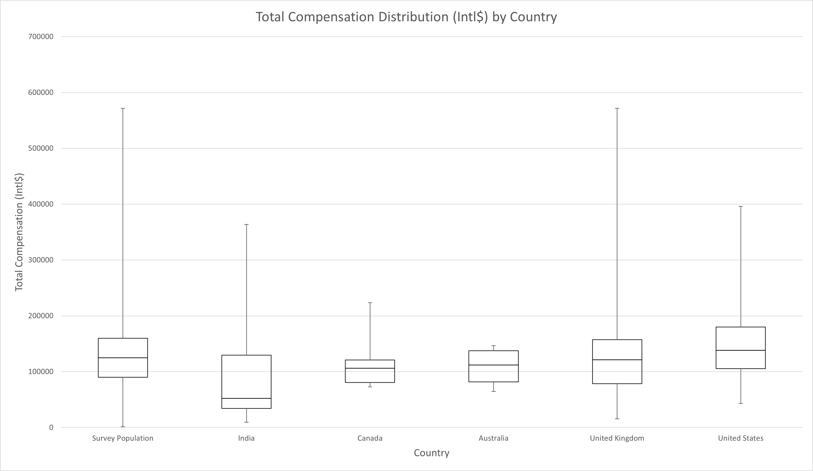
    <figcaption>
        Total Compensation Distribution by Country
    </figcaption>
    </figure>
</a>

|        | Survey Population | India  | Canada   | Australia | United Kingdom | United States |
|--------|-------------------|--------|----------|-----------|----------------|---------------|
| Min    | 1500              | 9550   | 72946    | 64549     | 15724          | 42800         |
| Q1     | 90000             | 34198  | 80862    | 81706.25  | 78620          | 105500        |
| Median | 125000            | 52298  | 106103   | 112112    | 121503         | 138500        |
| Q3     | 160000            | 129607 | 121048.5 | 137677.3  | 157240         | 180000        |
| Max    | 571781            | 363809 | 223811   | 146493    | 571781         | 396000        |

Country of employment is still likely the feature with the highest importance. Although the feature ranked lower in this year's results compared to last year, this is mostly due to a change in the survey respondent demographics. Feature importance is heavily affected by the size of the population impacted. Around 50% of last year's survey population was employed in Canada, Australia, the United Kingdom, or the United States which meant the other 50% of the responses were from countries with significantly different compensation distributions. Around 82% of this year's survey was composed of responses from those same countries with similar distributions. This can be seen in the boxplot above depicting the compensation distributions in the countries with the largest representation. Additionally, country of employment is composed of one question while other features are composed of multiple questions. Despite these considerations skewing against Country of employment, it still appeared in the features with the highest feature importance.

| Country                  | Median   Compensation (Intl$) |
|--------------------------|-------------------------------|
| Morocco                  | 6675                          |
| Russia                   | 7850                          |
| Tunisia                  | 16000                         |
| India                    | 52298                         |
| New Zealand              | 64549                         |
| Belgium                  | 66560                         |
| Pakistan                 | 85271                         |
| Prefer not to disclose   | 91980                         |
| Netherlands              | 94883                         |
| Philippines              | 100000                        |
| Bulgaria                 | 102989                        |
| Canada                   | 106103                        |
| Australia                | 112112                        |
| Luxembourg               | 114001                        |
| United Kingdom           | 121503                        |
| Germany                  | 123914.5                      |
| United States            | 138500                        |

When comparing median compensation by country to last year's results, a similar pattern emerges with wildly different compensation depending on country of employment as seen in the table above. Once again, it can be seen that workers in India are compensated on average 38% of the purchasing power (38 cents per dollar) of the workers in the United States.

The accuracy of the individual values in the table above are heavily influenced by the sample size of that particular country. The United States and India are likely more accurate. Canada, Australia, and the United Kingdom are likely somewhat accurate. The other countries have a much higher probability of being inaccurate. 

<a href="images/total_compensation_distribution_by_country_gni_per_capita.png">
    <figure>
    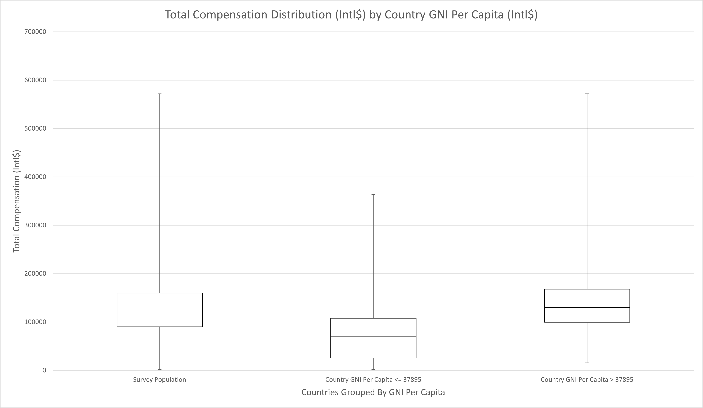
    <figcaption>
        Total Compensation Distribution by Country GNI Per Capita
    </figcaption>
    </figure>
</a>

|        | Survey Population | Country GNI Per Capita <= 37895 | Country GNI Per Capita > 37895 |
|--------|-------------------|---------------------------------|--------------------------------|
| Min    | 1500              | 1500                            | 15724                          |
| Q1     | 90000             | 25466.5                         | 99500                          |
| Median | 125000            | 70667                           | 130000                         |
| Q3     | 160000            | 107807                          | 168000                         |
| Max    | 571781            | 363809                          | 571781                         |

To compensate for potential inaccuracy and to confirm the deeper pattern seen in last year's survey, the countries were grouped by economic strength using [GNI Per Capita][5]. As seen in the chart above, the familiar pattern emerged. Workers in countries with lower economic strength (Country GNI Per Capita <= 37895) are compensated less than those in countries with stronger economic strength (Country GNI Per Capita > 37895). The GNI Per Capita split that yielded the most distinct distribution (37895) was lower than the split selected last year (55840) but Country GNI Per Capita still demonstrated the same pattern. Using the same split as last year yielded more overlap between the interquartile range of the two distributions but the overall pattern persisted. It is also important to note that in both surveys, the best split depicted in each report was selected by the Decision Tree algorithm, not manually.

Overall, the findings from the 2019 Salary Survey were validated with the important takeaway being that the difference in compensation across geographic boundaries is not simply a difference in currency value. It is not simply a cost of living adjustment but rather is a quality of life adjustment. Workers in developing economies are objectively compensated lower purchasing power because of their disadvantaged economic situation.

## Compensation Structure

While the next few features varied in their ranking between MAPE and MdAPE values, compensation structure makes a strong case for the second most important feature. After ranking second in last year's survey, this year's survey took a closer look at compensation structure and the results give a much more precise understanding of how compensation structure impacts total compensation.

<a href="images/total_compensation_distribution_by_commission.png">
    <figure>
    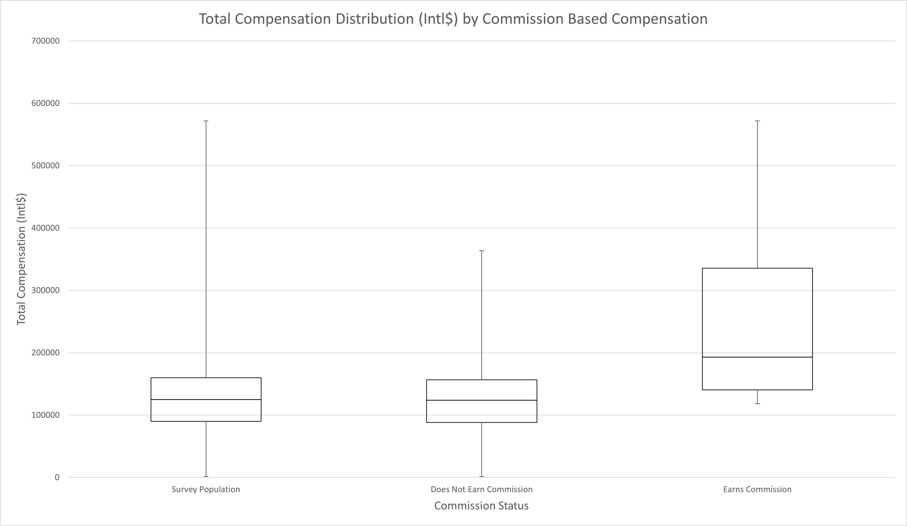
    <figcaption>
        Total Compensation Distribution by Commission Based Compensation
    </figcaption>
    </figure>
</a>

|        | Survey Population | Does Not Earn Commission | Earns Commission |
|--------|-------------------|--------------------------|------------------|
| Min    | 1500              | 1500                     | 118160           |
| Q1     | 90000             | 88351.25                 | 140515.8         |
| Median | 125000            | 123750                   | 193061.5         |
| Q3     | 160000            | 156680                   | 335562.5         |
| Max    | 571781            | 363809                   | 571781           |

The first notable finding is that most of the highest earning individuals in the ServiceNow industry worldwide are earning a commission. As shown in the chart above, individuals who reported earning any commission almost exclusively appeared in the upper two quartiles of worldwide earners with nearly 75% of commission earners earning in the upper 25% of non-commission earners. On average, individuals who earn commission are earning more than 1.5 times the purchasing power of those who do not earn a commission. 

<a href="images/total_compensation_distribution_by_commission_base_only.png">
    <figure>
    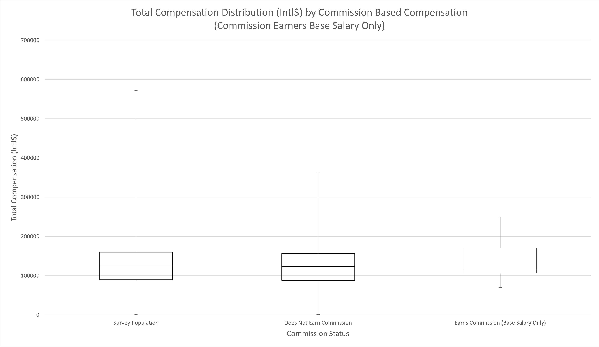
    <figcaption>
        Total Compensation Distribution by Commission Based Compensation (Commission Earners Base Salary Only)
    </figcaption>
    </figure>
</a>

|        | Survey Population | Does Not Earn Commission | Earns Commission (Base Salary Only) |
|--------|-------------------|--------------------------|-------------------------------------|
| Min    | 1500              | 1500                     | 69956.9                             |
| Q1     | 90000             | 88351.25                 | 107451.513                          |
| Median | 125000            | 123750                   | 115000                              |
| Q3     | 160000            | 156680                   | 171193.39                           |
| Max    | 571781            | 363809                   | 250000                              |

Digging into commission based pay further reveals that the base salary for commission earners is not significantly different from the distribution of total compensation for non-commission earners. In fact, commission earner's base salary skews slightly higher than non-commission earners. This finding appears to refute the conclusion in last year's survey that individuals were putting compensation at risk to earn higher compensation. It would be overly aggressive to jump to this conclusion, however. One possible explanation that could still support the risk-reward model of compensation is if commission earners start with lower base salary and scale it over time with consistent performance. The data in this survey does not support that interpretation but it is possible the survey sample skews in favor of more established commission earners.

<a href="images/total_compensation_distribution_by_bonus_percent.png">
    <figure>
    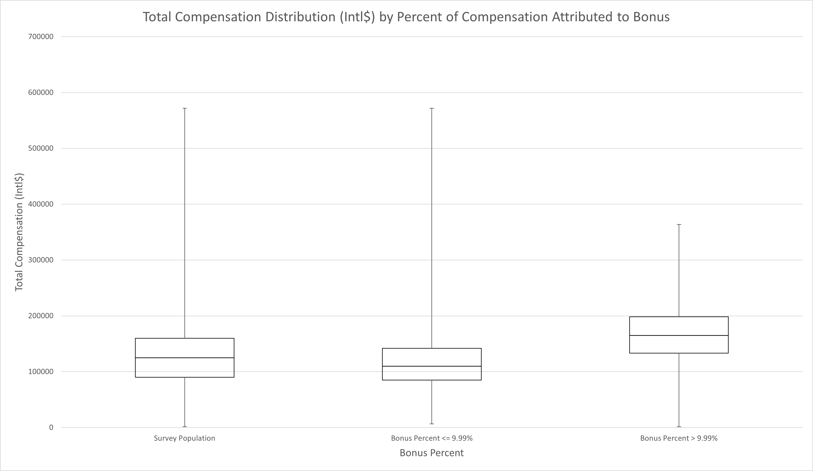
    <figcaption>
        Total Compensation Distribution by Percent of Compensation Attributed to Bonus
    </figcaption>
    </figure>
</a>

|        | Survey Population | Bonus Percent <= 9% | Bonus Percent > 9% |
|--------|-------------------|---------------------|--------------------|
| Min    | 1500              | 6675                | 1500               |
| Q1     | 90000             | 85000               | 133184             |
| Median | 125000            | 110000              | 165000             |
| Q3     | 160000            | 142000              | 198500             |
| Max    | 571781            | 571781              | 363809             |

Similar to commissions, a bonus exceeding 9.99% tends to predict higher compensation with similar effect as shown in the chart above. Those who earn more than 9.99% of their compensation in bonus, on average earn 1.5 times more than those who earn less than or equal to 9.99% of their compensation in bonus. It is interesting to note that higher bonus earner do have a longer lower quartile so it is not as strong a predictor as earning a commission. Since nearly all high bonus earners earn less than 25% of their compensation in bonus, the base salary trend holds true for bonus as well. Those earning more in bonus do not appear to be risking base compensation compared to lower bonus earners.

There does appear to be a similar trend for hourly workers, though there is less supporting data to confirm the trend. In any case, it appears that one of the best ways for any worker to earn more is to add a variable component to their pay: commissions, bonus, or hourly pay. Similar to last year's conclusion, this may be the feature that is most within each individual's control.

## Employer

A newly added top feature in this year's survey is the choice of Employer. This relationship is significantly more nuanced than the top features previously identified. Instead of a clear trend that is generally applicable, the employer based features were more niche and specific. The two most important aspects of the feature identified in the analysis were Employer Size and Employer Industry.

<a href="images/total_compensation_distribution_by_employer_size.png">
    <figure>
    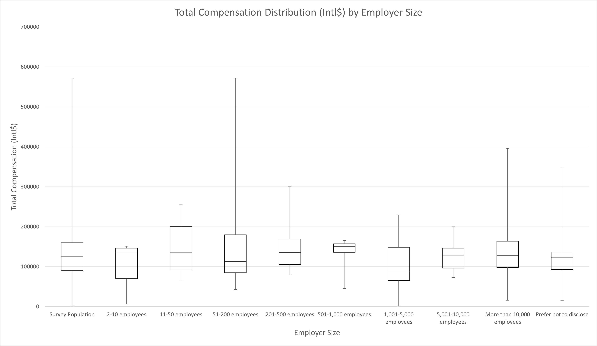
    <figcaption>
        Total Compensation Distribution by Employer Size
    </figcaption>
    </figure>
</a>

|        | Survey Population | 2-10 employees | 11-50 employees | 51-200 employees | 201-500 employees | 501-1,000 employees | 1,001-5,000 employees | 5,001-10,000 employees | More than 10,000 employees | Prefer not to disclose |
|--------|-------------------|----------------|-----------------|------------------|-------------------|---------------------|-----------------------|------------------------|----------------------------|------------------------|
| Min    | 1500              | 6675           | 64549           | 42800            | 79498             | 45314               | 1500                  | 72946                  | 15724                      | 16000                  |
| Q1     | 90000             | 70000          | 91520           | 85000            | 105606            | 135798              | 65453.5               | 96317.75               | 98101.5                    | 93187                  |
| Median | 125000            | 137000         | 135000          | 113293           | 136000            | 150000              | 89206                 | 128832.5               | 127455                     | 123895                 |
| Q3     | 160000            | 146493         | 200123          | 180000           | 169500            | 157240              | 148500                | 146250                 | 163500                     | 136996.8               |
| Max    | 571781            | 151200         | 255000          | 571781           | 300000            | 165000              | 230000                | 200000                 | 396000                     | 350000                 |

Interestingly, treating employer size as a continuous variable resulted in very poor differentiation in the resulting populations. In fact, the splits that were most often preferred for employer size targeted specific cohorts rather than generalizing. The chart above reflects this in that there is no easily discernible trend in the relationship between employer size and compensation. 

To some degree, it appears that it may be possible to divide the population into three main cohorts: employers with 1,000 employees or less, employers with 1,001 to 5,000 employees, and employers with more than 5,000 employees. Under this interpretation of the data, smaller employers pay the most, mid-size employers pay the least, and the largest employers pay closer to the median.

Another potential interpretation is to treat the decision tree splits as identifying specific employers or a smaller cohort of similar employers. In this interpretation, we target three specific employer cohorts: 51-200 employees, 201-500 employees, and 1,001-5,000 employees. The smaller two tend to compensate above population median while the larger of the three tends to compensate below population median. It is possible that specific employers in those cohorts are skewing the data but it is also possible that employers in those ranges are structurally similar or even modelled after one another.

Given the multiple interpretations, it is difficult to draw explicit conclusions with the available data. There is not enough evidence in the data set to prefer one interpretation over another.

<a href="images/total_compensation_distribution_by_employer_industry.png">
    <figure>
    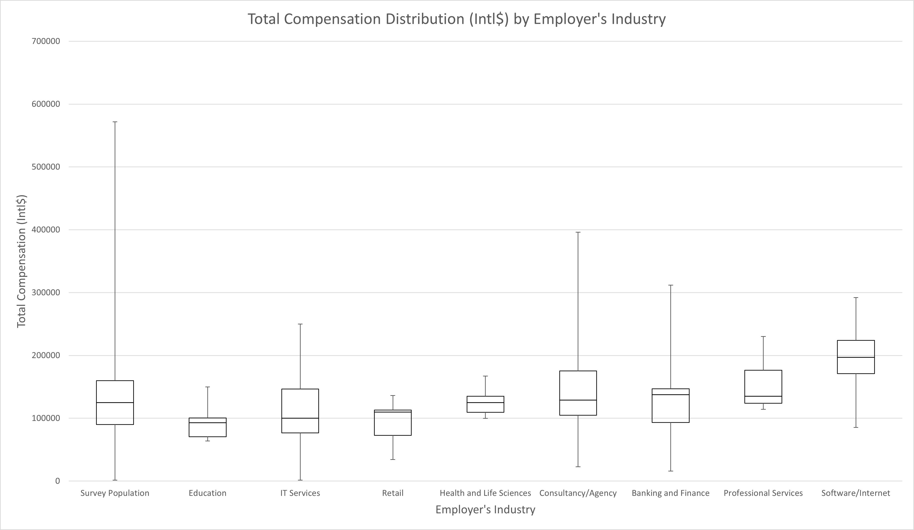
    <figcaption>
        Total Compensation Distribution by Employer's Industry
    </figcaption>
    </figure>
</a>

|        | Survey Population | Education | IT Services | Retail | Health and Life Sciences | Consultancy/Agency | Banking and Finance | Professional Services | Software/Internet |
|--------|-------------------|-----------|-------------|--------|--------------------------|--------------------|---------------------|-----------------------|-------------------|
| Min    | 1500              | 64000     | 1500        | 34289  | 100000                   | 22738              | 16000               | 114356                | 85271             |
| Q1     | 90000             | 70750     | 76842       | 72946  | 109660                   | 104952.3           | 93179.5             | 124000                | 171260            |
| Median | 125000            | 93000     | 100000      | 110000 | 125000                   | 129044.5           | 137500              | 135000                | 197000            |
| Q3     | 160000            | 100452    | 146493      | 113293 | 135000                   | 175237.5           | 147000              | 176575                | 224000            |
| Max    | 571781            | 150000    | 250000      | 136166 | 167000                   | 396000             | 312000              | 230000                | 292250            |

The decision tree model also indicated the importance of the employer's industry. Specifically, it focused on IT Services, Consultancy/Agency, and Health and Life Sciences industries. Examining this further in the chart above, it's difficult to draw any conclusions. Once again it appears as though the importance of an individual's employer is nuanced and highly circumstantial. In fact, within the decision tree model, the employer features tended to appear in the leaf nodes or very close to the leaf nodes further implying the influence is more specific and less of a general trend.

<a href="images/total_compensation_distribution_by_employer_relationship_to_sn.png">
    <figure>
    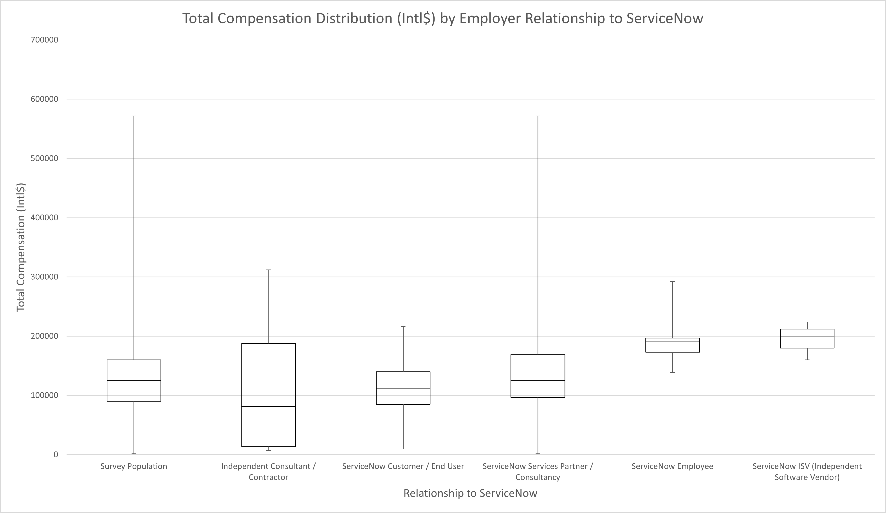
    <figcaption>
        Total Compensation Distribution by Employer's Relationship to ServiceNow
    </figcaption>
    </figure>
</a>

|        | Survey Population | Independent Consultant /   Contractor | ServiceNow Customer / End User | ServiceNow Services Partner /   Consultancy | ServiceNow Employee | ServiceNow ISV (Independent   Software Vendor) |
|--------|-------------------|---------------------------------------|--------------------------------|---------------------------------------------|---------------------|------------------------------------------------|
| Min    | 1500              | 6675                                  | 9550                           | 1500                                        | 139000              | 160000                                         |
| Q1     | 90000             | 13668.75                              | 85135.5                        | 96623                                       | 173000              | 180061.5                                       |
| Median | 125000            | 81246.5                               | 112320                         | 125000                                      | 191750              | 200123                                         |
| Q3     | 160000            | 187869.8                              | 140056                         | 168750                                      | 197000              | 212061.5                                       |
| Max    | 571781            | 312000                                | 216000                         | 571781                                      | 292250              | 224000                                         |

Lastly, as an interesting side note, there appears to be some limited support for the idea that consulting companies pay more than ServiceNow customers. Certainly, the data indicates a higher potential for consultants but it is also interesting to note that on average workers at ServiceNow end customers are earning 90 cents per Intl$ compared to consultants. It is important to note that this particular differentiation did not appear in the decision tree models and is likely much less important than numerous other factors (including other aspects pertaining to the employer). In fact, it appears that the phenomena is less impactful than commonly discussed. Humorously, the more pronounced difference exists for ServiceNow employees, ISV's, and independent contractors although the data was limited in these cohorts and may be more prone to error.

To summarize, an individual's choice of employer is very important with regards to expected compensation but easily generalizable rules proved elusive in the analysis.

## Relationships

Relationships is another new addition to the top influencing features in this year's survey. Unlike employer, though, the correlation is very apparent for relationships. This survey examined the influence of relationships from peers all the way up through executive management and at every level, a stronger confidence in relationship correlated to improving odds of higher compensation.

<a href="images/total_compensation_distribution_by_relationship_org_peers.png">
    <figure>
    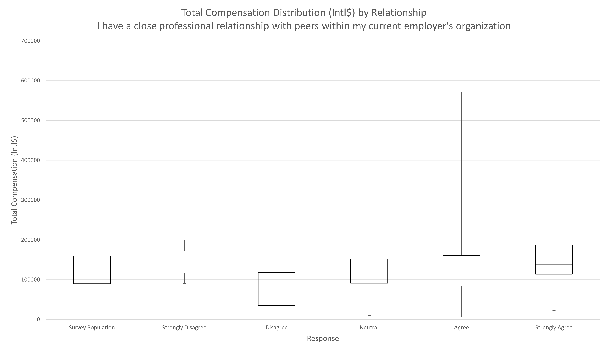
    <figcaption>
        Total Compensation Distribution by Relationship with Organization Peers
    </figcaption>
    </figure>
</a>

|        | Survey Population | Strongly Disagree | Disagree | Neutral  | Agree    | Strongly Agree |
|--------|-------------------|-------------------|----------|----------|----------|----------------|
| Min    | 1500              | 90000             | 1500     | 9550     | 6675     | 22738          |
| Q1     | 90000             | 117530.8          | 35650    | 90950.25 | 84494    | 113847         |
| Median | 125000            | 145061.5          | 89397.5  | 110000   | 121751.5 | 139136         |
| Q3     | 160000            | 172592.3          | 118250   | 151875   | 161250   | 187000         |
| Max    | 571781            | 200123            | 150000   | 250000   | 571781   | 396000         |

In the case of relationships with peers within an individual's organization, the chart above indicates a mostly increasing trend of median compensation as confidence in the existence of a relationship improves. The sole exception is those who responded Strongly Disagree to having a relationship with peers. The exact reason for this phenomena was not examined further.

It is important to note, however, that in general peer relationships appear to be a requisite to achieve median compensation. A response of Strongly Agree correlates closely with the overall survey population distribution. So it appears as though a failure to manage peer relationships is detrimental to one's compensation but successfully managing peer relationships does not influence higher than median compensation compared to the survey population.

<a href="images/total_compensation_distribution_by_relationship_sn_industry_peers.png">
    <figure>
    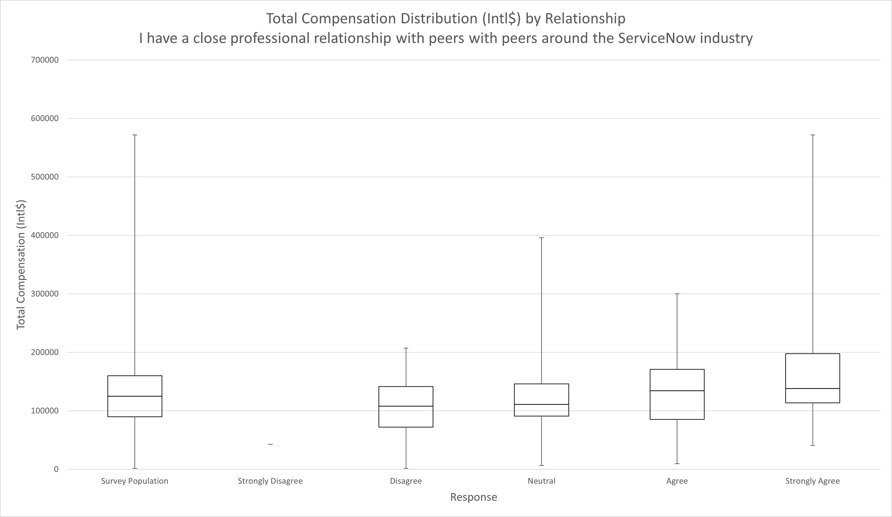
    <figcaption>
        Total Compensation Distribution by Relationship with ServiceNow Industry Peers
    </figcaption>
    </figure>
</a>

|        | Survey Population | Strongly Disagree | Disagree | Neutral | Agree  | Strongly Agree |
|--------|-------------------|-------------------|----------|---------|--------|----------------|
| Min    | 1500              | 42800             | 1500     | 6675    | 9550   | 40739          |
| Q1     | 90000             | 42800             | 72050    | 91140   | 85271  | 113750         |
| Median | 125000            | 42800             | 108106   | 111160  | 134536 | 138214         |
| Q3     | 160000            | 42800             | 141750   | 146250  | 171000 | 197750         |
| Max    | 571781            | 42800             | 207270   | 396000  | 300000 | 571781         |

Similarly, managing peer relationships within the ServiceNow Industry overall appears to be requisite for median compensation. Interestingly, those who responded Strongly Disagree regarding peer relationship within the organization responded differently to the question regarding peers within the industry. In this case, the trend clearly increases as the individual's confidence in the relationship increases.

<a href="images/total_compensation_distribution_by_relationship_supervisor.png">
    <figure>
    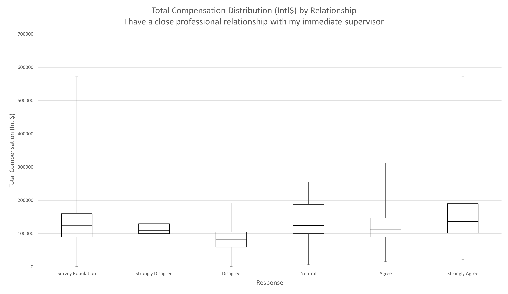
    <figcaption>
        Total Compensation Distribution by Relationship with Immediate Supervisor
    </figcaption>
    </figure>
</a>

|        | Survey Population | Strongly Disagree | Disagree | Neutral | Agree    | Strongly Agree |
|--------|-------------------|-------------------|----------|---------|----------|----------------|
| Min    | 1500              | 90000             | 1500     | 6675    | 15724    | 22738          |
| Q1     | 90000             | 100000            | 59157    | 100000  | 89925.5  | 102535.3       |
| Median | 125000            | 110000            | 82976    | 124500  | 113293   | 136297         |
| Q3     | 160000            | 130000            | 105041   | 188000  | 147531.5 | 190125         |
| Max    | 571781            | 150000            | 191750   | 255000  | 312000   | 571781         |

Relationship with immediate supervisor deviates very little from the previous two breakdowns. The most notable difference is a slight shift in the upper quartiles away from the Neutral response. As the relationship moves up the organizational hierarchy, the confidence in the relationship is steadily correlating to higher potential compensation. In the next few charts, this trend is magnified even further. 

<a href="images/total_compensation_distribution_by_relationship_senior_management.png">
    <figure>
    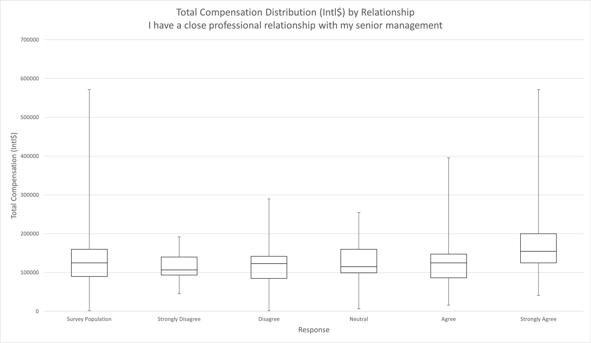
    <figcaption>
        Total Compensation Distribution by Relationship with Senior Management
    </figcaption>
    </figure>
</a>

|        | Survey Population | Strongly Disagree | Disagree | Neutral | Agree    | Strongly Agree |
|--------|-------------------|-------------------|----------|---------|----------|----------------|
| Min    | 1500              | 45314             | 1500     | 6675    | 16000    | 40929          |
| Q1     | 90000             | 93500             | 85000    | 99500   | 86665.5  | 125000         |
| Median | 125000            | 107000            | 123000   | 115000  | 125000   | 155000         |
| Q3     | 160000            | 140000            | 141840   | 160000  | 147531.5 | 200123         |
| Max    | 571781            | 191750            | 290000   | 255000  | 396000   | 571781         |

Relationship with senior management begins to take on a different trend. First, absence of a relationship is much less likely to penalize an individual's compensation. Any response less than Strongly Agree is steadily normalizing to a distribution that approximates the survey population overall. In other words, it has no identifiable effect. Those who responded Strongly Agree to having a close professional relationship with senior management, however, see a noticeable benefit. Those individuals on average will earn 1.24 times the purchasing power compared to the survey population median.

<a href="images/total_compensation_distribution_by_relationship_executive_management.png">
    <figure>
    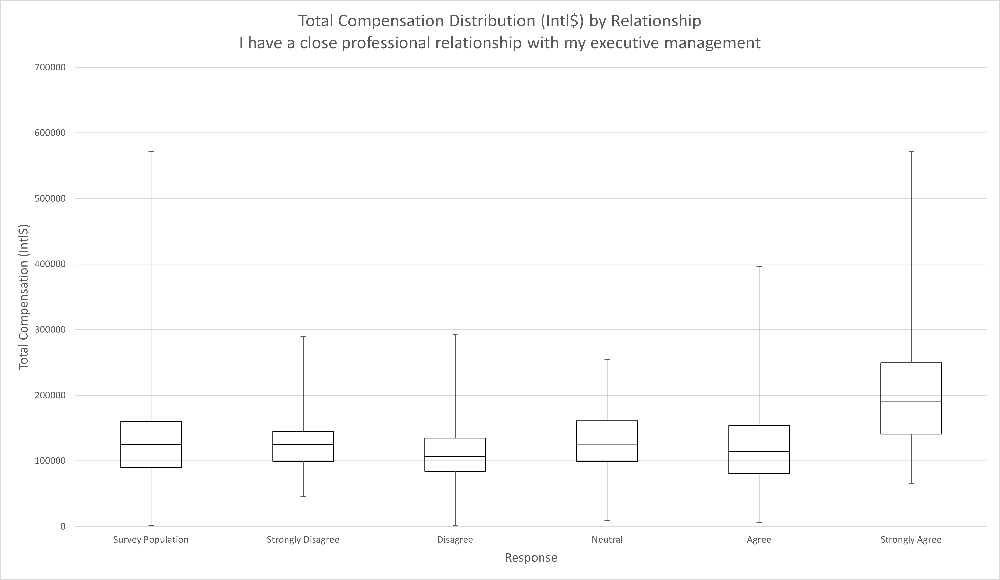
    <figcaption>
        Total Compensation Distribution by Relationship with Executive Management
    </figcaption>
    </figure>
</a>

|        | Survey Population | Strongly Disagree | Disagree | Neutral  | Agree  | Strongly Agree |
|--------|-------------------|-------------------|----------|----------|--------|----------------|
| Min    | 1500              | 45314             | 1500     | 9550     | 6675   | 65000          |
| Q1     | 90000             | 99500             | 84119    | 98952    | 80749  | 141031.5       |
| Median | 125000            | 125227.5          | 106606   | 125832.5 | 114356 | 191500         |
| Q3     | 160000            | 144500            | 134851.5 | 161250   | 154220 | 249405.5       |
| Max    | 571781            | 290000            | 292250   | 255000   | 396000 | 571781         |

This trend is significantly magnified when examining the relationship with executive management. A Strongly Agree response to a close relationship with executive management on average earns 1.532 times the purchasing power compared to the survey population median. In fact, even the lowest compensated respondents who replied Strongly Agree are shifted up an entire quartile compared to other responses. It's also important to note that while there is some overlap between Strongly Agree responses and earning Commission, the relationships are independent enough of one another to consider each as a significant influencing feature. 

<a href="images/median_compensation_per_relationship_score.png">
    <figure>
    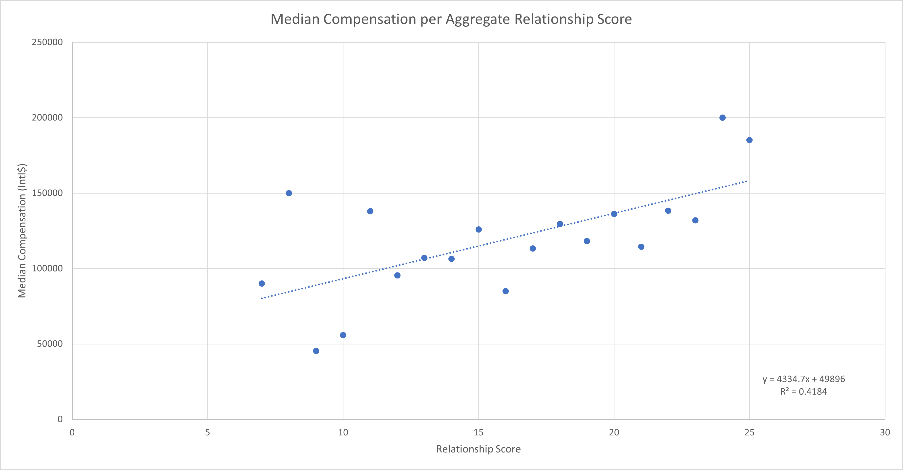
    <figcaption>
        Total Compensation Distribution by Aggregate Relationship Score
    </figcaption>
    </figure>
</a>

| Relationship Score | Median Compensation (Intl$) |
|--------------------|-----------------------------|
| 7                  | 90000                       |
| 8                  | 150000                      |
| 9                  | 45314                       |
| 10                 | 55750                       |
| 11                 | 138000                      |
| 12                 | 95356                       |
| 13                 | 107000                      |
| 14                 | 106380.5                    |
| 15                 | 125895                      |
| 16                 | 85000                       |
| 17                 | 113293                      |
| 18                 | 129684                      |
| 19                 | 118160                      |
| 20                 | 136166                      |
| 21                 | 114356                      |
| 22                 | 138272                      |
| 23                 | 132000                      |
| 24                 | 200000                      |
| 25                 | 185150                      |

Given the progressive trend favoring respondents who manage close relationships across the organizational hierarchy, it should come as no surprise that the trend generalizes well. When calculating an aggregate relationship score by attributing points to each relationship response (Strongly Disagree = 1 and Strongly Agree = 5), the relationship score correlates fairly well with median compensation. There are a few anomalies, particularly in the lower relationship scores which reflects the Strongly Disagree phenomena previously discussed.

The implications of this data should not be understated. An individual's relationships across the spectrum but especially with organizational leadership strongly correlates with higher compensation. The data does not provide any indication as to the underlying cause. One possible interpretation is the less noble "it's not what you know but who you know". Another possible interpretation is that business leaders surround themselves with exemplary people who create more value and therefore are compensated fairly. It could also be that cultivating a relationship with leadership ensures leadership is more aware of an individuals contributions. Alternatively, it could be a combination of multiple causes that is not easily explained by any one model.

Regardless of the underlying cause, cultivating relationships is clearly an important piece of earning at an individual's full potential.

## Years of Experience

Years of Experience dropped from the third position down to the fifth position in this year's survey as compared to last year's. There was still compelling evidence that it should be included in the top features. Notably, the Top Regression Model that was trained on last year's data was still quite accurate in predicting compensation of this year's responses. That model was heavily reliant upon the relationship between years of experience and compensation to derive it's prediction.

While the regression model was not retrained using this year's data, generating the scatter plots and regression lines for this year's data revealed similar patterns. For simplicity, the scatter plots here are provided at the population level rather than by Country of Employment.

<a href="images/median_compensation_per_it_experience.png">
    <figure>
    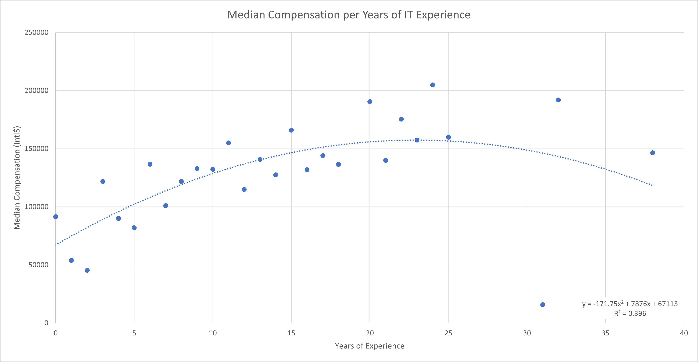
    <figcaption>
        Median Compensation per Years of IT Experience
    </figcaption>
    </figure>
</a>

| Years of Experience IT | Median Compensation (Intl$) |
|------------------------|-----------------------------|
| 0                      | 91520                       |
| 1                      | 53869                       |
| 2                      | 45314                       |
| 3                      | 121751.5                    |
| 4                      | 90077                       |
| 5                      | 82000                       |
| 6                      | 136684                      |
| 7                      | 101051.5                    |
| 8                      | 121790                      |
| 9                      | 132899                      |
| 10                     | 132303.5                    |
| 11                     | 155000                      |
| 12                     | 115000                      |
| 13                     | 140750                      |
| 14                     | 127455                      |
| 15                     | 166000                      |
| 16                     | 132000                      |
| 17                     | 144136                      |
| 18                     | 136534.5                    |
| 20                     | 190500                      |
| 21                     | 140000                      |
| 22                     | 175500                      |
| 23                     | 157500                      |
| 24                     | 205000                      |
| 25                     | 160000                      |
| 31                     | 15724                       |
| 32                     | 192000                      |
| 38                     | 146493                      |

Years of IT Experience provided the least significant relationship per the R-Squared value of 0.396. This is similar to last year's findings which demonstrated that ServiceNow Experience and Total Experience more often had a closer relationship with the exception being in India. Since India declined in survey responses this year, it is expected that would negatively impact the relationship at the population level.

<a href="images/median_compensation_per_total_experience.png">
    <figure>
    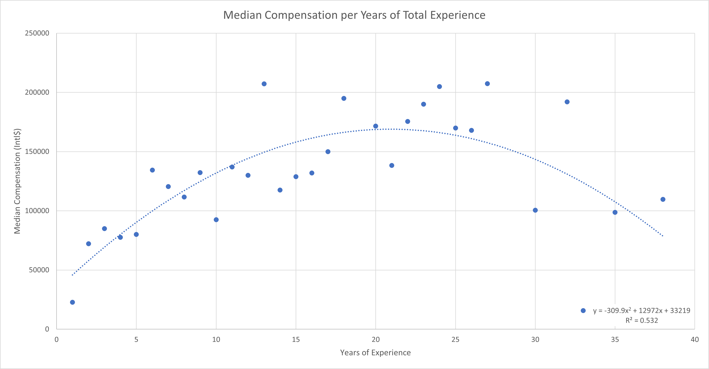
    <figcaption>
        Median Compensation per Years of Total Experience
    </figcaption>
    </figure>
</a>

| Years of Experience Total | Median Compensation (Intl$) |
|---------------------------|-----------------------------|
| 1                         | 22738                       |
| 2                         | 72157                       |
| 3                         | 85000                       |
| 4                         | 77635.5                     |
| 5                         | 80100                       |
| 6                         | 134368                      |
| 7                         | 120500                      |
| 8                         | 111646.5                    |
| 9                         | 132268                      |
| 10                        | 92500                       |
| 11                        | 137000                      |
| 12                        | 130000                      |
| 13                        | 207270                      |
| 14                        | 117608                      |
| 15                        | 128834.5                    |
| 16                        | 132000                      |
| 17                        | 150000                      |
| 18                        | 195000                      |
| 20                        | 171620                      |
| 21                        | 138272                      |
| 22                        | 175500                      |
| 23                        | 190000                      |
| 24                        | 205000                      |
| 25                        | 170000                      |
| 26                        | 168000                      |
| 27                        | 207500                      |
| 30                        | 100500                      |
| 32                        | 192000                      |
| 33                        | 15724                       |
| 35                        | 98808                       |
| 38                        | 109746.5                    |

The next best fit relationship was between Total Experience and compensation with an R-Squared value of 0.532. The parabolic curve peaks around the 20 year mark before declining which is familiar pattern seen in last years results.

<a href="images/median_compensation_per_servicenow_experience.png">
    <figure>
    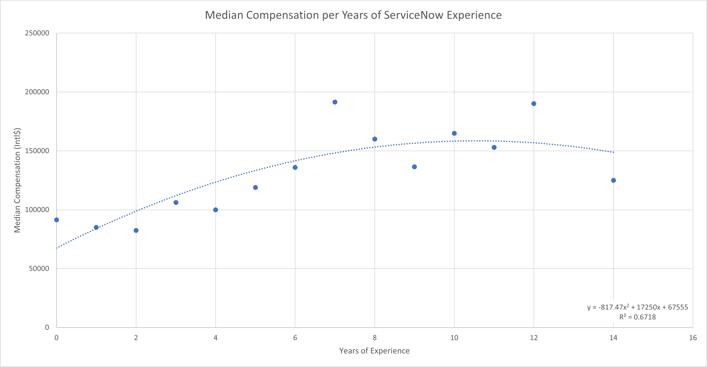
    <figcaption>
        Median Compensation per Years of ServiceNow Experience
    </figcaption>
    </figure>
</a>

| Years of Experience ServiceNow | Median Compensation (Intl$) |
|--------------------------------|-----------------------------|
| 0                              | 91520                       |
| 1                              | 85000                       |
| 2                              | 82488                       |
| 3                              | 106157.5                    |
| 4                              | 100000                      |
| 5                              | 118992.5                    |
| 6                              | 136000                      |
| 7                              | 191500                      |
| 8                              | 160000                      |
| 9                              | 136428                      |
| 10                             | 165000                      |
| 11                             | 153000                      |
| 12                             | 190075                      |
| 14                             | 125000                      |

The most significant best fit relationship for years of experience was ServiceNow Experience with an R-Squared value of 0.6718. Given the bias towards US based responses in this year's survey, this coincides with the finding last year that ServiceNow Experience provided the most significance for US based workers.

Little more was done in this year's survey to further analyze or qualify any of the findings in last year's survey. The evidence certainly validates that years of experience plays an important role in predicting an individual's compensation.

## Remaining Features

The decision tree method had difficulty distinguishing influences from some of the less influential features. To get a better idea, the remaining features were compared [in a more targeted way][8] to get an idea of which ones may be more influential. The following table summarizes the findings of the peer group comparisons to rank which feature had the most influence on the resulting [peer group comparison chart][9]. The lower the sum weighted similarity distance, the more similar the peer group comparison was to the overall population's distribution and therefore the less influence that feature is likely to have on compensation. In the sections that follow, these potential influences will be explored more thoroughly.

| Rank | Feature Category  | Feature                                                                            | Sum Weighted Similarity Distance from Overall Population Distribution |
|------|-------------------|------------------------------------------------------------------------------------|-----------------------------------------------------------------------|
| 1    | Negotiation       | After Initial Offer                                                                | 0.199071093                                                           |
| 2    | Negotiation       | When Promoted                                                                      | 0.176514894                                                           |
| 3    | Current Employer  | Business Model                                                                     | 0.175499057                                                           |
| 4    | Current Employer  | Relationship to ServiceNow                                                         | 0.17166619                                                            |
| 5    | Current Role      | Current Job Level                                                                  | 0.143713407                                                           |
| 6    | Relationship      | My professional network is involved in potential employers making me a   job offer | 0.138330665                                                           |
| 7    | Current Employer  | Employer Size                                                                      | 0.135091354                                                           |
| 8    | Negotiation       | When I feel I deserve it                                                           | 0.134338568                                                           |
| 9    | Demographics      | Ethnicity                                                                          | 0.131360231                                                           |
| 10   | Relationship      | Peers in ServiceNow Industry                                                       | 0.128253288                                                           |
| 11   | Importance of Pay | In the past                                                                        | 0.128230918                                                           |
| 12   | Relationship      | Peers at Current Employer                                                          | 0.12597102                                                            |
| 13   | Relationship      | Senior Management                                                                  | 0.125155152                                                           |
| 14   | Relationship      | Executive Management                                                               | 0.122612731                                                           |
| 15   | Current Employer  | Profit Model                                                                       | 0.115748047                                                           |
| 16   | Negotiation       | At Predetermined Intervals                                                         | 0.112770202                                                           |
| 17   | Demographics      | Gender                                                                             | 0.093021651                                                           |
| 18   | Importance of Pay | In the future                                                                      | 0.091827384                                                           |
| 19   | Relationship      | Immediate Supervisor                                                               | 0.069091806                                                           |
| 20   | Current Role      | Employment Status                                                                  | 0.024166134                                                           |

[1]: /guides/servicenow-salary-influence-survey-2021/methods#percent-of-attributable-predictive-capability
[2]: /guides/servicenow-salary-influence-survey-2021/methods/#step-3-top-influencing-features-analysis
[3]: /guides/servicenow-salary-influence-survey-2021/methods#prediction-models
[4]: /guides/servicenow-salary-influence-survey-2021/methods/#calculate-feature-importance
[8]: /guides/servicenow-salary-influence-survey-2021/methods/#step-4-targeted-feature-analysis
[9]: /guides/servicenow-salary-influence-survey-2021/methods/#peer-group-comparison