Beyond the top influencing features, the members of the ServiceNow community expressed an interest in exploring what influence a variety of other features may have. In the next section, the influence of demographic features on compensation will be explored. The methods used in this section can be viewed [here][1].

## Gender

<a href="images/total_compensation_distribution_by_country_gender_and_gni_per_capita.png">
    <figure>
    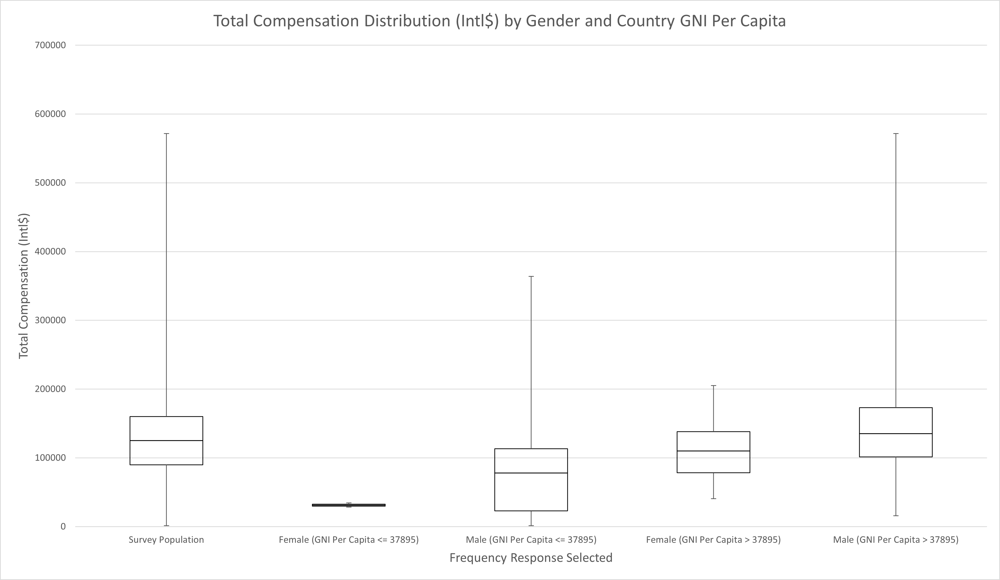
    <figcaption>
        Total Compensation Distribution by Gender and Country GNI Per Capita
    </figcaption>
    </figure>
</a>

|        | Survey Population | Female (GNI Per Capita <= 37895) | Male (GNI Per Capita <= 37895) | Female (GNI Per Capita > 37895) | Male (GNI Per Capita > 37895) |
|--------|-------------------|----------------------------------|--------------------------------|---------------------------------|-------------------------------|
| Min    | 1500              | 28195                            | 1500                           | 40739                           | 15724                         |
| Q1     | 90000             | 29718.5                          | 22738                          | 78200                           | 101375                        |
| Median | 125000            | 31242                            | 77889                          | 110000                          | 135399                        |
| Q3     | 160000            | 32765.5                          | 113293                         | 138000                          | 173162.5                      |
| Max    | 571781            | 34289                            | 363809                         | 205000                          | 571781                        |

Another validated finding from last year's survey is the gender pay gap. Despite a slightly lower representation of women in the survey this year compared to last year, the gender feature appeared in the decision tree analysis and was ranked with a positive feature importance. In the overall population, the survey found that women earn on average 86% of the purchasing power compared to men which supports last year's finding. In wealthier countries, this year's survey found a slightly lower ratio with women earning around 81% of the purchasing power compared to men as shown in the chart above. The finding that women are underrepresented in the industry was also validated in this year's survey with 15% of the survey population identifying as a women while 17% reported in last year's survey.

Given the politicized nature of the gender pay gap discussion, the next sections will examine the phenomena more closely to determine what underlying factors may contribute.

### Compensation Structure

<a href="images/population_composition_by_gender_and_commission_status.png">
    <figure>
    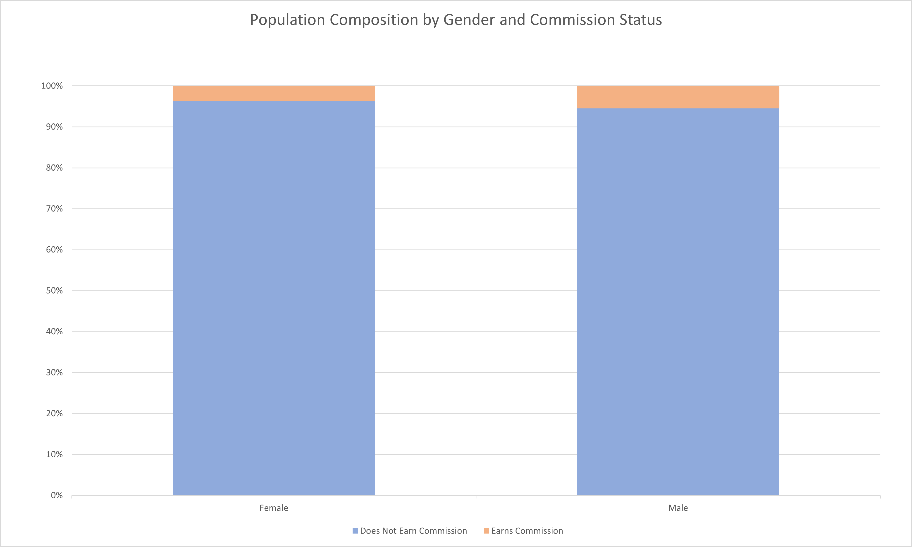
    <figcaption>
        Population Composition by Gender and Commission Status
    </figcaption>
    </figure>
</a>

| Response | Does Not Earn Commission | Earns Commission |
|----------|--------------------------|------------------|
| Female   | 96.30%                   | 3.70%            |
| Male     | 94.52%                   | 5.48%            |

As established in the top influencing features, earning a commission is a predictor of high compensation. This is one area that may be negatively impacting women as men are almost 1.5 times more likely to earn a commission. While this impacts a relatively small percentage of the overall population overall, the importance of variable compensation has been well established across both survey years.

<a href="images/women_earn_less_variable_pay.png">
    <figure>
    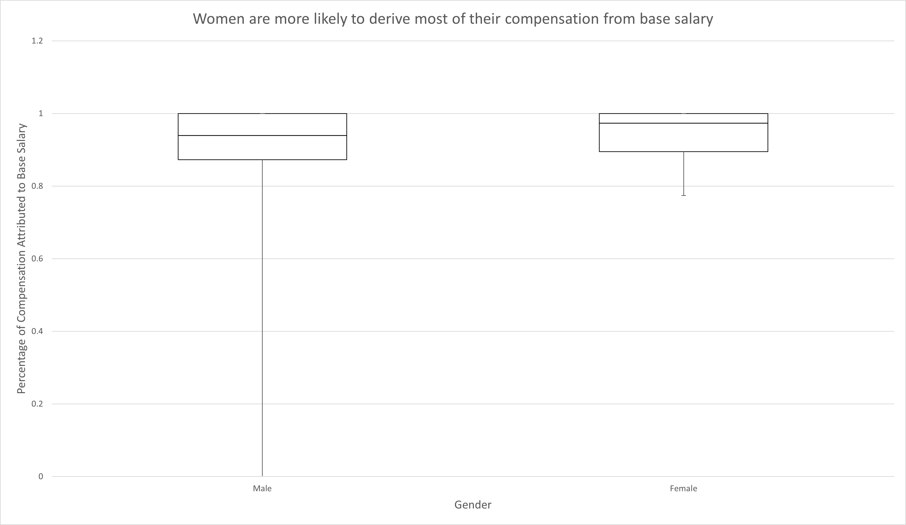
    <figcaption>
        Women are more likely to derive most of their compensation from base salary
    </figcaption>
    </figure>
</a>

|        | Male   | Female |
|--------|--------|--------|
| Min    | 0      | 0.7742 |
| Q1     | 0.8727 | 0.8951 |
| Median | 0.9394 | 0.9733 |
| Q3     | 1      | 1      |
| Max    | 1      | 1      |

Similarly, women tend to earn more of their compensation in base salary overall. Outside of commissions, any variable compensation tends to predict higher compensation overall. With this in mind, it does appear that compensation structure may play a significant role in the gender pay gap. This analysis provides little insight into why this difference exist and there are many potential explanations of varying connotations. It is also unclear if a causal relationship exists such that providing women more access to variable compensation would in fact shrink the pay gap. This could be an avenue worth exploring for women looking to increase their compensation and also for future research.

### Employer

<a href="images/population_composition_by_gender_and_employer_type.png">
    <figure>
    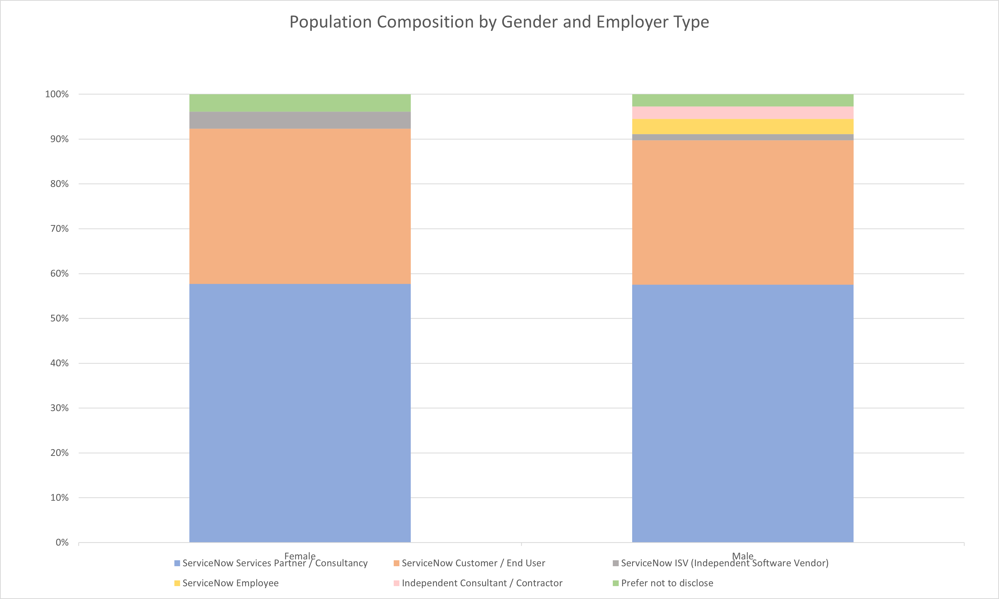
    <figcaption>
        Population Composition by Gender and Employer Type
    </figcaption>
    </figure>
</a>

| Response | ServiceNow Services Partner /   Consultancy | ServiceNow Customer / End User | ServiceNow ISV (Independent   Software Vendor) | ServiceNow Employee | Independent Consultant /   Contractor | Prefer not to disclose |
|----------|---------------------------------------------|--------------------------------|------------------------------------------------|---------------------|---------------------------------------|------------------------|
| Female   | 57.69%                                      | 34.62%                         | 3.85%                                          | 0.00%               | 0.00%                                 | 3.85%                  |
| Male     | 57.53%                                      | 32.19%                         | 1.37%                                          | 3.42%               | 2.74%                                 | 2.74%                  |

<a href="images/population_composition_by_gender_and_employer_size.png">
    <figure>
    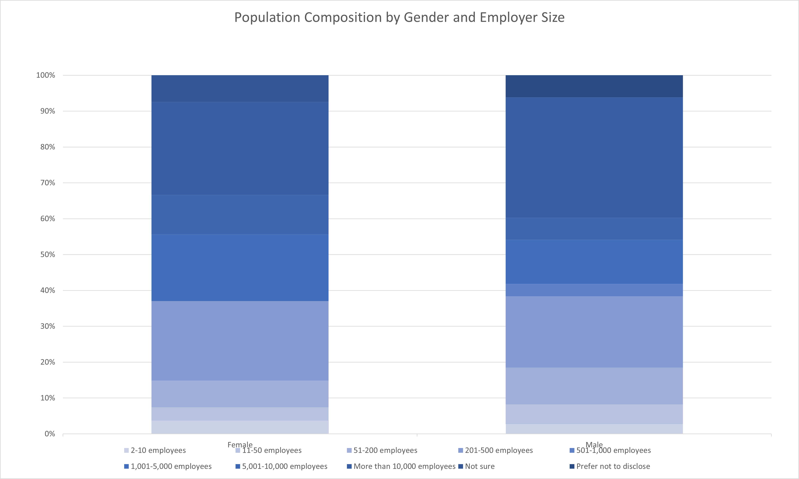
    <figcaption>
        Population Composition by Gender and Employer Size
    </figcaption>
    </figure>
</a>

| Response | 2-10 employees | 11-50 employees | 51-200 employees | 201-500 employees | 501-1,000 employees | 1,001-5,000 employees | 5,001-10,000 employees | More than 10,000 employees | Not sure | Prefer not to disclose |
|----------|----------------|-----------------|------------------|-------------------|---------------------|-----------------------|------------------------|----------------------------|----------|------------------------|
| Female   | 3.70%          | 3.70%           | 7.41%            | 22.22%            | 0.00%               | 18.52%                | 11.11%                 | 25.93%                     | 7.41%    | 0.00%                  |
| Male     | 2.74%          | 5.48%           | 10.27%           | 19.86%            | 3.42%               | 12.33%                | 6.16%                  | 33.56%                     | 0.00%    | 6.16%                  |

Employer type is another of the top features in terms of importance that is worth exploring. It can be seen in the charts above that there is little difference in the composition of employer choice between men and women. The difference is certainly not enough to explain the gender pay gap. It is also worth noting that there is not much difference when examining the chosen employer's industry. Men and women have very similar distributions across industries. The one notable difference is that approximately 7% of women reported working in Healthcare while only around 3.5% of men reported working in Healthcare. Healthcare as an industry did appear in the decision tree as predicting lower average compensation but it is unclear if the pay gap is the reason Healthcare has a lower than average compensation or if women disproportionately choosing the Healthcare industry is driving the pay gap.

### Relationships

<a href="images/population_composition_by_gender_and_executive_relationship.png">
    <figure>
    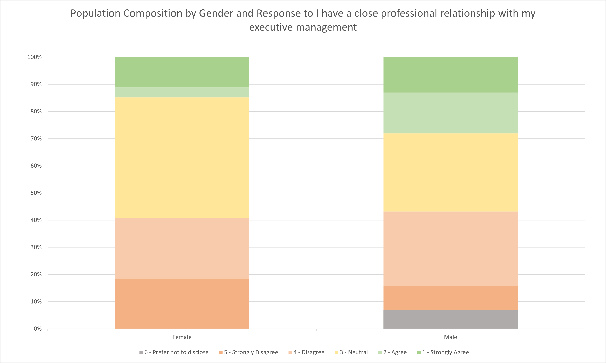
    <figcaption>
        Population Composition by Gender and Response to I have a close professional relationship with my executive management
    </figcaption>
    </figure>
</a>

| Response | 6 - Prefer not to disclose | 5 - Strongly Disagree | 4 - Disagree | 3 - Neutral | 2 - Agree | 1 - Strongly Agree |
|----------|----------------------------|-----------------------|--------------|-------------|-----------|--------------------|
| Female   | 0.00%                      | 18.52%                | 22.22%       | 44.44%      | 3.70%     | 11.11%             |
| Male     | 6.85%                      | 8.90%                 | 27.40%       | 28.77%      | 15.07%    | 13.01%             |

Another well established important feature in this year's survey is an individual's relationships, relationships with executive management more specifically. In this area, women are significantly more likely to have reported neutrally to having a close professional relationship with their executive management and less likely to report that they agreed compared to men. The strongly agree segment was similar between men and women but compensation appears to scale with strength of the relationship, so a more than 4 times decrease in reporting rate of having a close relationship could partially explain the gender gap. Due to the composition, it seems more likely that the correlation between relationship and compensation is a driver of the pay gap than gender being a driver of the correlation between relationship and compensation.

<a href="images/women_have_a_lower_relationship_score.png">
    <figure>
    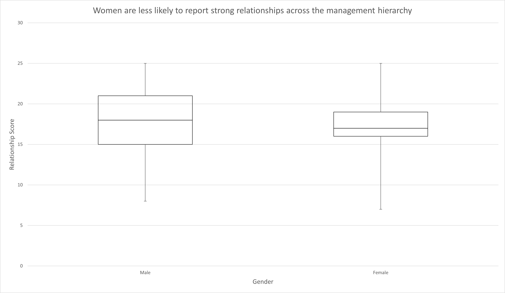
    <figcaption>
        Women are less likely to report strong relationships across the management hierarchy
    </figcaption>
    </figure>
</a>

|        | Male | Female |
|--------|------|--------|
| Min    | 8    | 7      |
| Q1     | 15   | 16     |
| Median | 18   | 17     |
| Q3     | 21   | 19     |
| Max    | 25   | 25     |

Overall, women tend to have a lower relationship score on average. Men were more likely to score over 20 which indicates responding Agree or higher to all relationship questions. Women scored lower with regards to executive and senior level management relationships in particular. With each of these data points in mind, it seems very likely that relationships are influencing the gender pay gap. This is also consistent with other studies that indicate that women struggle with professional networking though this analysis does not examine the role that gender norms may contribute to this issue.

### Negotiation

<a href="images/women_negotiate_less_frequently.png">
    <figure>
    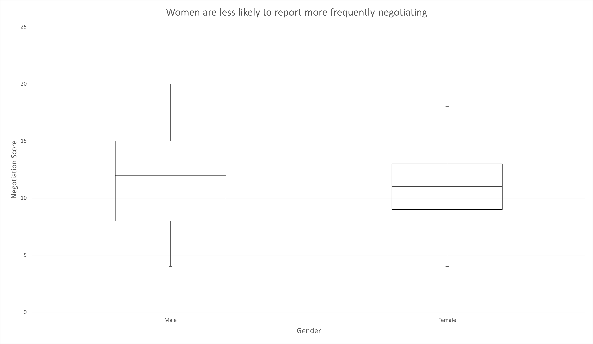
    <figcaption>
        Women are less likely to report more frequently negotiating
    </figcaption>
    </figure>
</a>

|        | Male | Female |
|--------|------|--------|
| Min    | 4    | 4      |
| Q1     | 8    | 9      |
| Median | 12   | 11     |
| Q3     | 15   | 13     |
| Max    | 20   | 18     |

With regards to negotiation, women in teh ServiceNow industry do appear to negotiate somewhat less frequently than men. Women responded neutrally towards questions regarding their negotiation frequency more often than men who tended to spread to the extremes as the Negotiation Score chart shows above.

<a href="images/population_composition_by_gender_and_negotiate_initial_offer.png">
    <figure>
    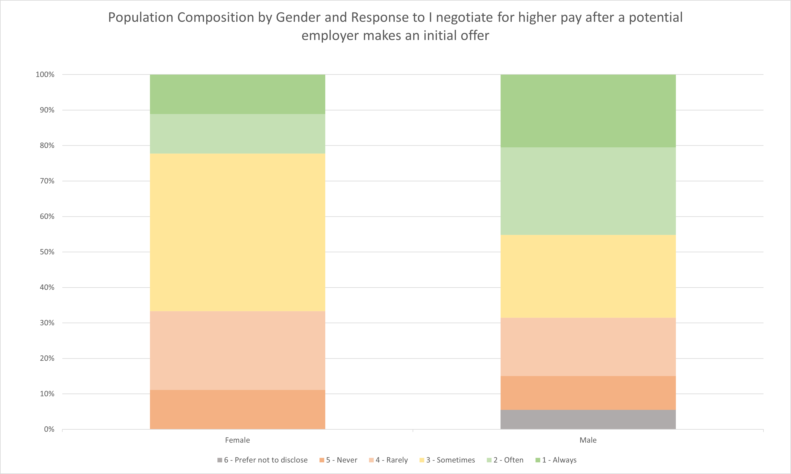
    <figcaption>
        Population Composition by Gender and Response to I negotiate for higher pay after a potential employer makes an initial offer
    </figcaption>
    </figure>
</a>

| Response | 6 - Prefer not to disclose | 5 - Never | 4 - Rarely | 3 - Sometimes | 2 - Often | 1 - Always |
|----------|----------------------------|-----------|------------|---------------|-----------|------------|
| Female   | 0.00%                      | 11.11%    | 22.22%     | 44.44%        | 11.11%    | 11.11%     |
| Male     | 5.48%                      | 9.59%     | 16.44%     | 23.29%        | 24.66%    | 20.55%     |

More importantly, as discussed in the Negotiation Influence section, women are less likely to respond that they always negotiate an initial offer. Of all the negotiation strategies, always negotiating an initial offer was most strongly associated with higher compensation compared to any of the other negotiating strategies. Overall, however, it is unlikely that negotiation strategy is playing a significant role in the gender pay gap. This is due to the lack of demonstrated importance from the negotiation features as discussed later.

### Recap

Last year's survey found that there were few differences between men and women in terms of attributes closely associated with a meritocracy model of compensation such as skills, work effort, and work performed. When a difference did exist, it was typically women who outperformed men within peer groups such as in education attained. This year's survey, on the other hand, found significant differences that may be contributing to the gender pay gap. These differences, though, focus primarily on compensation structures and professional network rather than job performance and duties. The nature of these differences seriously undermines many arguments that compensation is based on meritocracy. If anything, the attributes that separate men and women in this analysis indicate that power dynamics, societal norms, and social strata are a better explanation for the gender pay gap. This is hardly a new concept and there are a number of other studies that have discussed this phenomena more effectively and in greater detail but in an industry that prides itself on demonstration of skill as the highest value, it is interesting to see that the data does not seem to support this theoretical framework. 

## Ethnicity

<a href="images/total_compensation_distribution_by_ethnicity.png">
    <figure>
    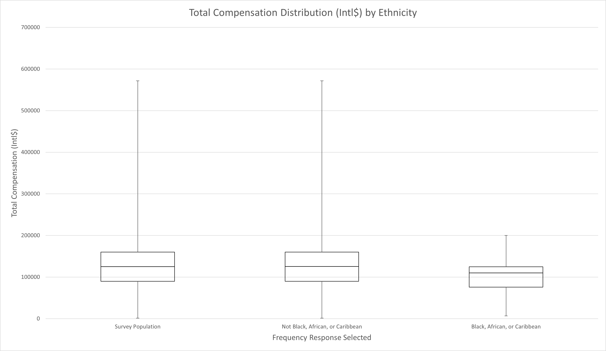
    <figcaption>
        Total Compensation Distribution (Intl$) by Ethnicity
    </figcaption>
    </figure>
</a>

|        | Survey Population | Not Black, African, or Caribbean | Black, African, or Caribbean |
|--------|-------------------|----------------------------------|------------------------------|
| Min    | 1500              | 1500                             | 6675                         |
| Q1     | 90000             | 90000                            | 75708.5                      |
| Median | 125000            | 125665                           | 110000                       |
| Q3     | 160000            | 160000                           | 124750                       |
| Max    | 571781            | 571781                           | 200000                       |

Another validated finding from last year's survey is the racial pay gap. This year found that individuals who identified as Black, African, or Caribbean earned on average just 88% of the purchasing power compared to the rest of the surveyed population. Also similar to last year's finding is that when examining ethnicity, the most differentiating split was whether or not someone responded as Black, African, or Caribbean. The following subsections will examine how ethnicity interacts with other top features. 

### Compensation Structure

<a href="images/black_african_caribbean_earn_less_variable_pay.png">
    <figure>
    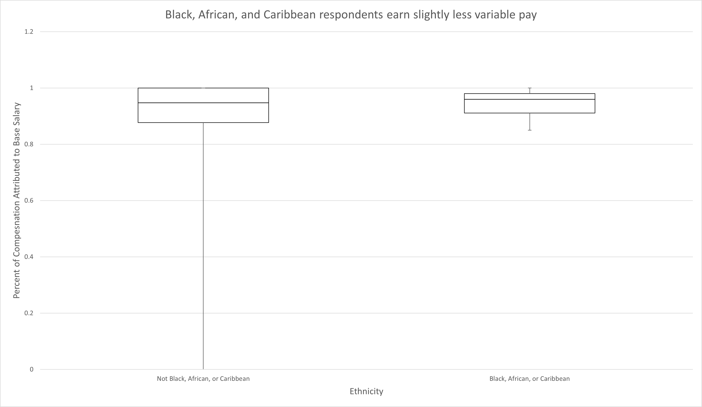
    <figcaption>
        Black, African, and Caribbean respondents earn slightly less variable pay
    </figcaption>
    </figure>
</a>

|        | Not Black, African, or Caribbean | Black, African, or Caribbean |
|--------|----------------------------------|------------------------------|
| Min    | 0                                | 0.85                         |
| Q1     | 0.8772                           | 0.91095                      |
| Median | 0.9474                           | 0.96                         |
| Q3     | 1                                | 0.98045                      |
| Max    | 1                                | 1                            |

The familiar trend in compensation structure seems to impact the racial pay gap as well. Black, African, and Caribbean respondents tended to earn more of their compensation through base salary. Interestingly, the average compensation of the group correlated very closely with the average variable compensation with women earning the least, Black, African, and Caribbean respondents earning somewhere in the middle, and the rest of the population earning the most. It is also worth noting that there were no Black, African, and Caribbean respondents who reported earning a commission. 

### Employer

<a href="images/population_composition_by_ethnicity_and_employer_type.png">
    <figure>
    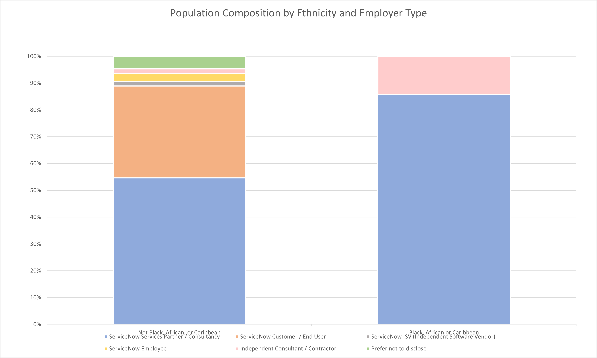
    <figcaption>
        Population Composition by Ethnicity and Employer Size
    </figcaption>
    </figure>
</a>

| Response                           | ServiceNow Services Partner /   Consultancy | ServiceNow Customer / End User | ServiceNow ISV (Independent   Software Vendor) | ServiceNow Employee | Independent Consultant /   Contractor | Prefer not to disclose |
|------------------------------------|---------------------------------------------|--------------------------------|------------------------------------------------|---------------------|---------------------------------------|------------------------|
| Not Black, African, or   Caribbean | 54.65%                                      | 34.30%                         | 1.74%                                          | 2.91%               | 1.74%                                 | 4.65%                  |
| Black, African or Caribbean        | 85.71%                                      | 0.00%                          | 0.00%                                          | 0.00%               | 14.29%                                | 0.00%                  |

<a href="images/population_composition_by_ethnicity_and_employer_size.png">
    <figure>
    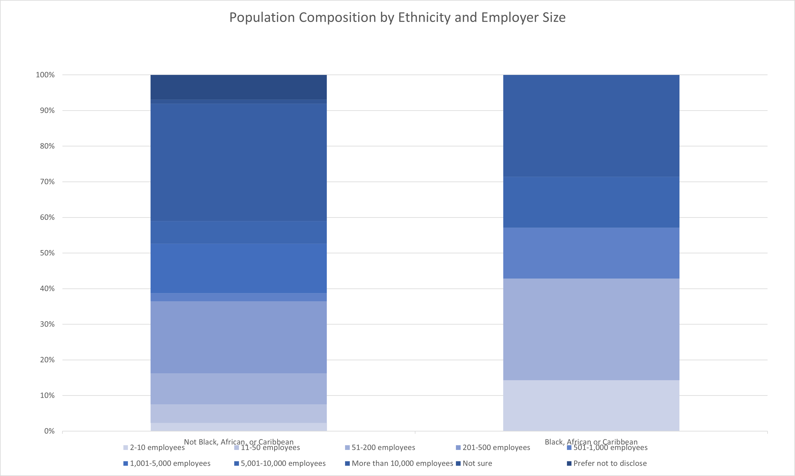
    <figcaption>
        Population Composition by Ethnicity and Employer Size
    </figcaption>
    </figure>
</a>

| Response                           | 2-10 employees | 11-50 employees | 51-200 employees | 201-500 employees | 501-1,000 employees | 1,001-5,000 employees | 5,001-10,000 employees | More than 10,000 employees | Not sure | Prefer not to disclose |
|------------------------------------|----------------|-----------------|------------------|-------------------|---------------------|-----------------------|------------------------|----------------------------|----------|------------------------|
| Not Black, African, or   Caribbean | 2.31%          | 5.20%           | 8.67%            | 20.23%            | 2.31%               | 13.87%                | 6.36%                  | 32.95%                     | 1.16%    | 6.94%                  |
| Black, African or Caribbean        | 14.29%         | 0.00%           | 28.57%           | 0.00%             | 14.29%              | 0.00%                 | 14.29%                 | 28.57%                     | 0.00%    | 0.00%                  |

There are some compositional differences in the choice of employer as well. Black, African, and Caribbean respondents are overrepresented in employers of sizes that were correlated with lower than average compensation but they also were more likely to work at Consultancies which tended to compensate above average. It is difficult to draw any firm conclusions regarding these differences and the correlations between employer and compensation were somewhat unclear to begin with.

### Relationships

<a href="images/population_composition_by_ethnicity_and_executive_relationship.png">
    <figure>
    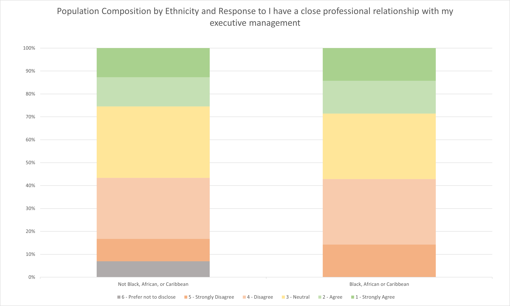
    <figcaption>
        Population Composition by Ethnicity and Response to I have a close professional relationship with my executive management
    </figcaption>
    </figure>
</a>

Relationships appear to have little negative impact on the racial pay gap within this analysis. Black, African, and Caribbean respondents were as likely as the rest of the population to have close professional relationships with their executive management as seen in the chart above. Overall, there was little difference between the two subpopulations.

| Response                           | 6 - Prefer not to disclose | 5 - Strongly Disagree | 4 - Disagree | 3 - Neutral | 2 - Agree | 1 - Strongly Agree |
|------------------------------------|----------------------------|-----------------------|--------------|-------------|-----------|--------------------|
| Not Black, African, or   Caribbean | 6.94%                      | 9.83%                 | 26.59%       | 31.21%      | 12.72%    | 12.72%             |
| Black, African or Caribbean        | 0.00%                      | 14.29%                | 28.57%       | 28.57%      | 14.29%    | 14.29%             |

<a href="images/black_african_caribbean_similar_relationships.png">
    <figure>
    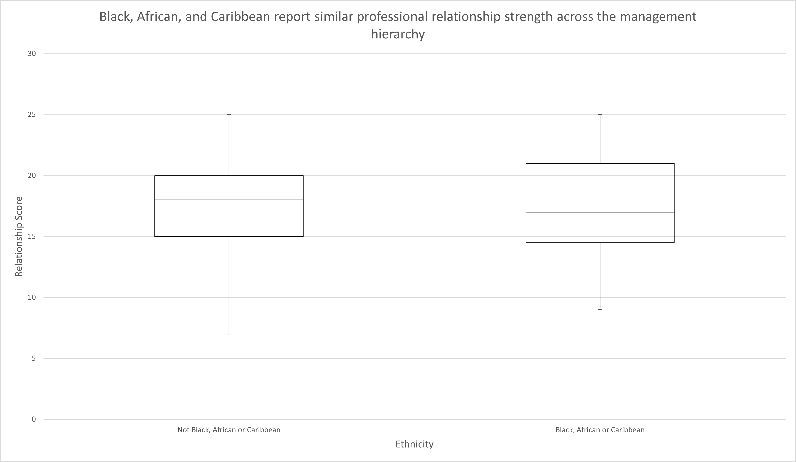
    <figcaption>
        Black, African, and Caribbean report similar professional relationship strength across the management hierarchy
    </figcaption>
    </figure>
</a>

|        | Not Black, African or Caribbean | Black, African or Caribbean |
|--------|---------------------------------|-----------------------------|
| Min    | 7                               | 9                           |
| Q1     | 15                              | 14.5                        |
| Median | 18                              | 17                          |
| Q3     | 20                              | 21                          |
| Max    | 25                              | 25                          |

Similarly, expanding to the overall relationship score, there was still little difference between the two subpopulations. Interestingly, all Black, African, or Caribbean respondents identified as male and shared similar relationship profiles with the rest of the male dominant population. 

### Negotiation

<a href="images/black_african_caribbean_negotiate_as_frequently.png">
    <figure>
    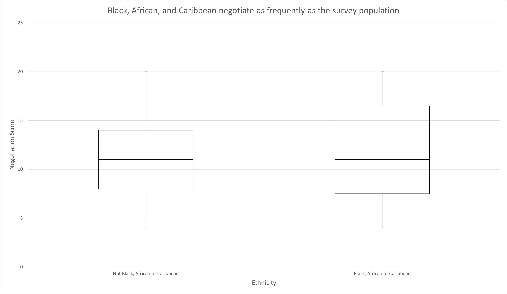
    <figcaption>
        Black, African, and Caribbean negotiate as frequently as the survey population
    </figcaption>
    </figure>
</a>

|        | Not Black, African or Caribbean | Black, African or Caribbean |
|--------|---------------------------------|-----------------------------|
| Min    | 4                               | 4                           |
| Q1     | 8                               | 7.5                         |
| Median | 11                              | 11                          |
| Q3     | 14                              | 16.5                        |
| Max    | 20                              | 20                          |

Regarding negotiation score, Black, African, and Caribbean respondents tended either strongly or perfectly neutral but overall had a similar profile in negotiation strategy compared to the rest of the population. 

<a href="images/population_composition_by_ethnicity_and_negotiate_initial_offer.png">
    <figure>
    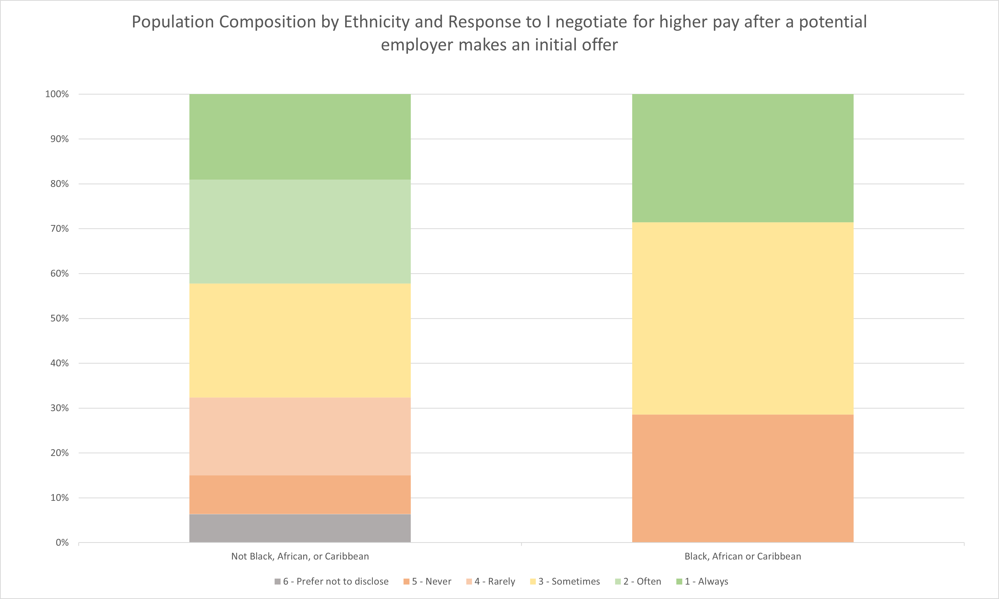
    <figcaption>
        Population Composition by Ethnicity and Response to I negotiate for higher pay after a potential employer makes an initial offer
    </figcaption>
    </figure>
</a>

| Response                           | 6 - Prefer not to disclose | 5 - Never | 4 - Rarely | 3 - Sometimes | 2 - Often | 1 - Always |
|------------------------------------|----------------------------|-----------|------------|---------------|-----------|------------|
| Not Black, African, or   Caribbean | 6.36%                      | 8.67%     | 17.34%     | 25.43%        | 23.12%    | 19.08%     |
| Black, African or Caribbean        | 0.00%                      | 28.57%    | 0.00%      | 42.86%        | 0.00%     | 28.57%     |

More importantly, Black, African, or Caribbean respondents tend to always negotiate an initial offer at a higher rate than the rest of the population. This behavior correlates with higher compensation although this may be caused by covariance with other features as discussed later. 

### Recap

Similar to the analysis for women, Black, African, and Caribbean respondents were found to be similar or in some cases excel in attributes that would be expected to drive compensation in a meritocracy based model. This year's findings further erode support for that model by indicating that the lack of variable compensation may do more to drive the racial pay gap than skills or work performance. It is also interesting to note that this year's data indicates a sort of social hierarchy in which access to variable compensation and commissions and cultivation of professional relationships particularly those in senior and executive management tend to drive compensation outcomes. In this model, women have less of both, Black, African, or Caribbean respondents have less of one of the two, while the rest of the population had more of both.

[1]: /guides/servicenow-salary-influence-survey-2020/methods/#step-4-targeted-feature-analysis