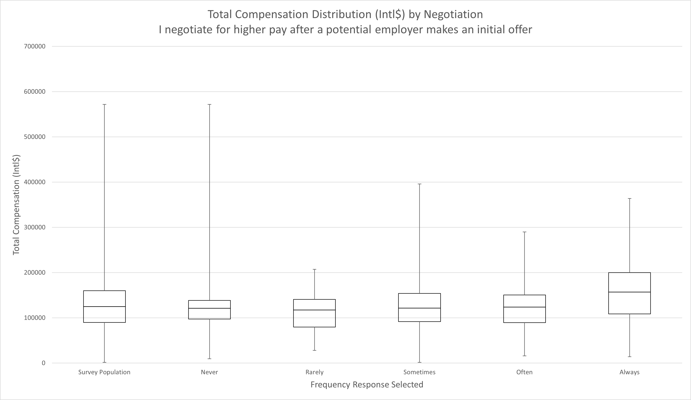
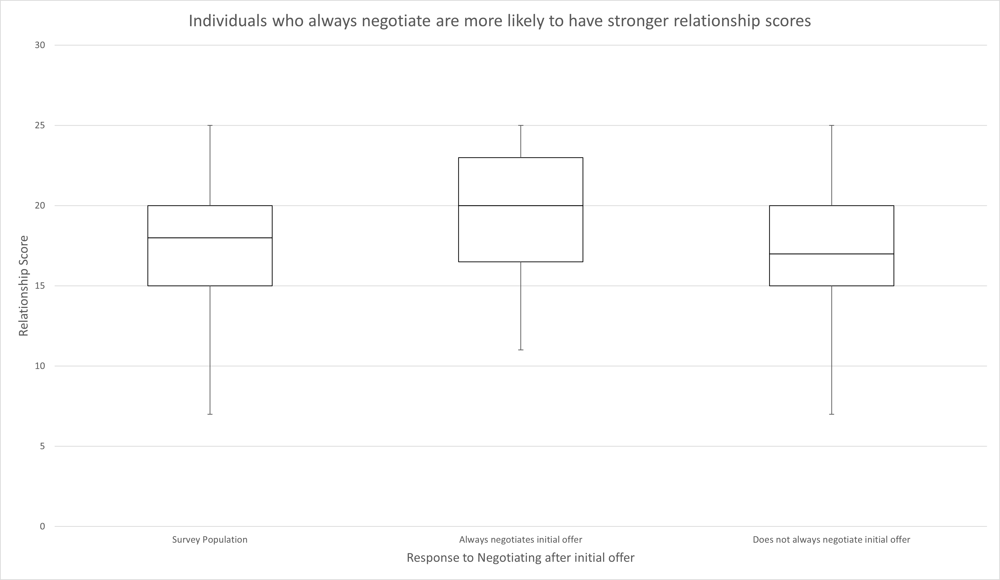
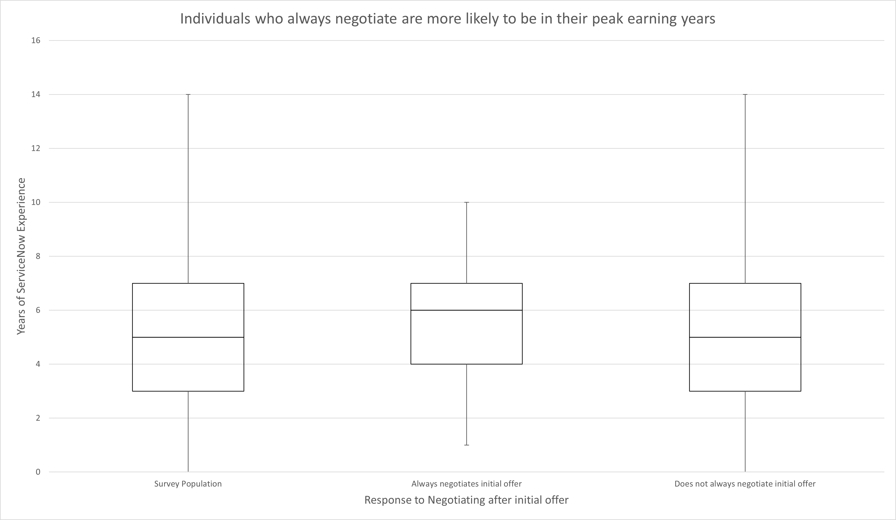
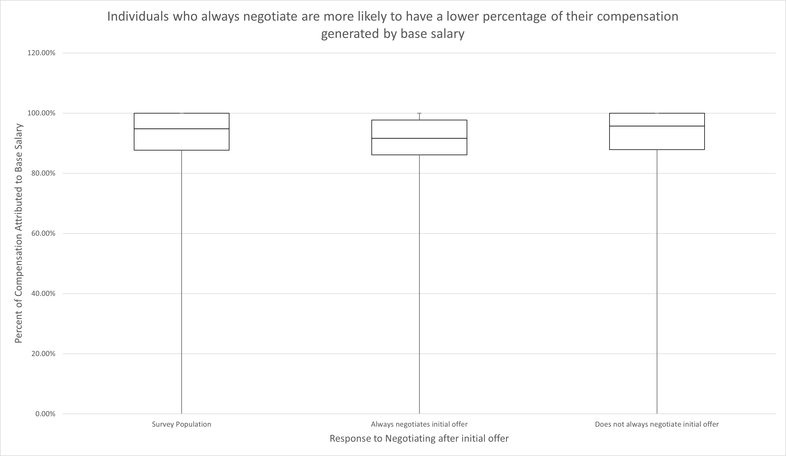
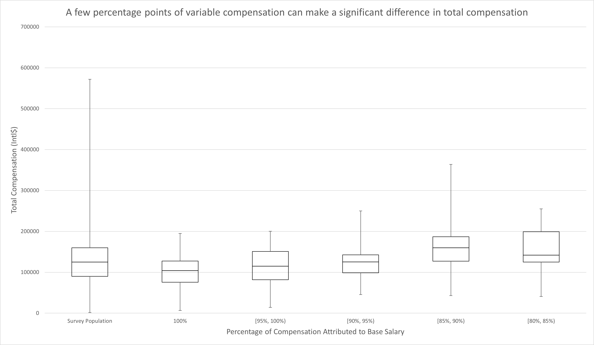

Negotiation as a tactic to increase individual compensation is well established in both industry literature and research literature, so it may seem surprising that negotiation did not rank in the top influencing features. With a negative feature importance, the LOCO method implies that negotiation features are not important in predicting an individual's compensation. To accurately frame the conversation, it should be noted that this analysis was examining real-world impact of behaviors on compensation. In other words, it would be accurate to say this study has found that negotiating (at initial offer, promotion, periodic reviews, and at random) is not a defining characteristic of higher earning workers in the ServiceNow industry. It would be inaccurate to assume that this study implies that negotiation does not work. In fact, the peer group analysis scored both negotiation after initial offer and negotiation when promoted influence whether an individual will fall above median, at median, or below median compensation.

<a href="images/total_compensation_distribution_by_negotiation_initial_offer.png">
    <figure>
    
    <figcaption>
        Total Compensation Distribution by Negotiation After Initial Offer
    </figcaption>
    </figure>
</a>

|        | Survey Population | Never    | Rarely | Sometimes | Often    | Always   |
|--------|-------------------|----------|--------|-----------|----------|----------|
| Min    | 1500              | 9550     | 28195  | 1500      | 16000    | 14200    |
| Q1     | 90000             | 97500    | 79775  | 91647.5   | 89582.75 | 108880.5 |
| Median | 125000            | 121082   | 117500 | 121503    | 124000   | 157240   |
| Q3     | 160000            | 138747.8 | 140880 | 154000    | 150625   | 200061.5 |
| Max    | 571781            | 571781   | 207270 | 396000    | 290000   | 363809   |

More specifically, it can be seen in the chart above that individuals who responded that they always negotiate at initial offer earn on average 1.28 times the purchasing power compared to those who responded with any of the other choices. At face value, it may seem as though this should have caused the feature to rank higher but this differentiation is somewhat misleading. Keep in mind that the Leave One Covariant Out method of calculating feature importance is a test to see if other features can adequately explain the dependent variable (compensation) in absence of the feature left out (in this case negotiation). When comparing the no assumption decision tree to the LOCO decision tree for negotiation, experience, relationship, and compensation structure features fill in the gap for the missing negotiation features. Especially given that each of those features are already the most important features, it is very likely that they explain compensation than negotiation. While these interactions can be quite nuanced, the next few charts will examine some of those interactions at the population level.

<a href="images/negotiators_have_stronger_relationships.png">
    <figure>
    
    <figcaption>
        Individuals who always negotiate are more likely to have stronger relationship scores
    </figcaption>
    </figure>
</a>

|        | Survey Population | Always negotiates initial offer | Does not always negotiate initial offer |
|--------|-------------------|---------------------------------|-----------------------------------------|
| Min    | 7                 | 11                              | 7                                       |
| Q1     | 15                | 16.5                            | 15                                      |
| Median | 18                | 20                              | 17                                      |
| Q3     | 20                | 23                              | 20                                      |
| Max    | 25                | 25                              | 25                                      |

Respondents who replied that they always negotiate after an initial offer were much more likely to have higher relationship scores. In fact, approximately 50% of those individuals replied "Agree" or "Strongly Agree" to all relationship questions including having a close relationship with senior leadership and executive leadership within their organization. This is compared to just 25% of individuals who did not reply "Always" to negotiating after an initial offer. As established in the Top Features, strength of relationship is strongly correlated with higher compensation and a linear correlation exists between strength of relationships and compensation. So in many cases where negotiation correlates with compensation, it may simply be explained by covariance with relationship features. More plainly, it's more likely that an individuals professional network predicts both compensation and whether or not the individual always negotiates. It's less likely that always negotiating predicts compensation directly.

<a href="images/negotiators_are_in_peak_earning_years.png">
    <figure>
    
    <figcaption>
        Individuals who always negotiate are more likely to be in their peak earning years
    </figcaption>
    </figure>
</a>

|        | Survey Population | Always negotiates initial offer | Does not always negotiate initial offer |
|--------|-------------------|---------------------------------|-----------------------------------------|
| Min    | 0                 | 1                               | 0                                       |
| Q1     | 3                 | 4                               | 3                                       |
| Median | 5                 | 6                               | 5                                       |
| Q3     | 7                 | 7                               | 7                                       |
| Max    | 14                | 10                              | 14                                      |

The Always Negotiate cohort was also more likely to be in their peak earning years. In the chart above, it can be seen that the boxplot for the Always Negotiate cohort is more compressed toward the median of 6 years of ServiceNow experience. The relationship between experience and compensation has previously been established to be parabolic with the peak compensation around the 10 year mark. The Always Negotiate cohort both skews closer to the 10 year mark and is more compressed, excluding the lower earning years at the lower and upper bounds of experience. Similar to relationship features, it has already been established that experience is a top influencing feature as well. So once again, it's more likely that experience predicts compensation and whether or not an individual always negotiates.

<a href="images/negotiators_earn_more_variable_pay.png">
    <figure>
    
    <figcaption>
        Individuals who always negotiate are more likely to have a lower percentage of their compensation generated by base salary
    </figcaption>
    </figure>
</a>

|        | Survey Population | Always negotiates initial offer | Does not always negotiate initial offer |
|--------|-------------------|---------------------------------|-----------------------------------------|
| Min    | 0                 | 0                               | 0                                       |
| Q1     | 87.70%            | 86.10%                          | 87.90%                                  |
| Median | 94.80%            | 91.60%                          | 95.70%                                  |
| Q3     | 100%              | 97.70%                          | 100%                                    |
| Max    | 100%              | 100%                            | 100%                                    |

Lastly, the Always Negotiate cohort was more likely to have a lower percentage of their compensation generated by salary and a higher percentage generated by variable compensation such as bonus, commission. As established in the Top Influencing Features, variable compensation structures are highly predictive of higher compensation. The difference between the Always Negotiate and Does not Always Negotiate cohorts appears more subtle with regards to the compensation structure at first glance. After all, is a 3 percentage point to 5 percentage point shift in favor of variable compensation significant?

<a href="images/percent_salary_impact_on_total_compensation.png">
    <figure>
    
    <figcaption>
        A few percentage points of variable compensation can make a significant difference in total compensation
    </figcaption>
    </figure>
</a>

|        | Survey Population | 100%     | [95%, 100%) | [90%, 95%) | [85%, 90%) | [80%, 85%) |
|--------|-------------------|----------|-------------|------------|------------|------------|
| Min    | 1500              | 6675     | 14200       | 45314      | 42800      | 40929      |
| Q1     | 90000             | 75881.5  | 82000       | 98856      | 127053.5   | 125092     |
| Median | 125000            | 104000   | 115000      | 125332.5   | 160000     | 142031.5   |
| Q3     | 160000            | 127613.5 | 151000      | 142750     | 187000     | 199250     |
| Max    | 571781            | 195000   | 200123      | 250000     | 363809     | 255000     |

Yes, small changes in variable compensation can yield significant differences in total compensation as indicated in the chart above. Taking a look at the median values of base salary composing 91.6% (Always Negotiate) and 95.7% (Does not Always Negotiate) of total compensation, the roughly 4 percentage point shift is almost a 9% difference in median compensation. Combined with the fact that 25% of the Does not Always Negotiate cohort earns 100% of their income through base salary and the slight difference between the compensation structure of the two cohorts begins to look more significant in terms of outcome.

There is no one feature that appears to completely explain the relationship between the Always Negotiate cohort and higher than average compensation. Instead, it appears to be the combination of other features that best describe it, including compensation structure, experience, and professional relationships. The absence of any of those three features increases the prediction error while the absence of negotiation is easily compensated for by the presence of the other features. This may indicate a more complex interaction underlying these features. For example, perhaps individuals with better soft skills are more likely to negotiate, have more and broader relationships, and therefore negotiate better compensation structures. Therefore, while this analysis reveals negotiation to be of low importance in predicting compensation this should not be taken to imply that negotiation is an ineffective strategy for improving compensation. It should also be noted that other studies have indicated that the impact of negotiation is incremental and compounds over time which could explain why a compensation difference was not noticed in this survey outside of the group that always negotiated the initial offer. An experimental setup that investigated change of compensation over time instead of the point in time analysis performed by this survey would likely yield more conclusive findings. 