The below charts provide a breakdown for each survey question on the ServiceNow Salary Influence Survey 2020. Each chart indicates the percentage of the responding population that selected a particular response for the given question. Some questions were omitted from this summary due to the risk of revealing identifying information. Questions omitted from this summary were still used in the analysis of the data to produce the final results.

Contents:

1. [Currency][1]
2. [What is your current employment status?][2]
3. [Which of the following best describes your current job role?][3]
4. [Which of the following best describes your current job level?][4]
5. [Age][5]
6. [Gender][6]
7. [Ethnicity][7]
8. [In which country are you employed?][8]
9. [How many years of total career experience do you have?][9]
10. [How many years of experience do you have working in an IT field?][10]
11. [How many years of experience do you have working with ServiceNow?][11]
12. [Which of the following best describes your current employer?][12]
13. [Which of the following best describes the Industry in which your current employer operates?][13]
14. [Which of the following best describes your current employer's primary business model?][14]
15. [Which of the following best describes how many people currently work for your current employer?][15]
16. [Is your current employer a for profit or non-profit organization?][16]
17. [I have a close professional relationship with peers within my current employer's organization][17]
18. [I have a close professional relationship with peers around the ServiceNow industry][18]
19. [I have a close professional relationship with my immediate supervisor][19]
20. [I have a close professional relationship with my senior management][20]
21. [I have a close professional relationship with my executive management][21]
22. [I negotiate for higher pay after a potential employer makes an initial offer][22]
23. [I negotiate for higher pay from my employer at predetermined intervals specified by my employer][23]
24. [I negotiate for higher pay from my employer when I receive a promotion][24]
25. [I negotiate for higher pay from my employer when I feel I deserve it][25]
26. [My professional network is involved in potential employers making me a job offer][26]
27. [How important is a pay increase to you when considering future job opportunities?][27]
28. [How important have pay increases been to you when considering past job opportunities up until now?][28]

### Currency

<a href="images/survey_responses_by_currency.png">
    <figure>
    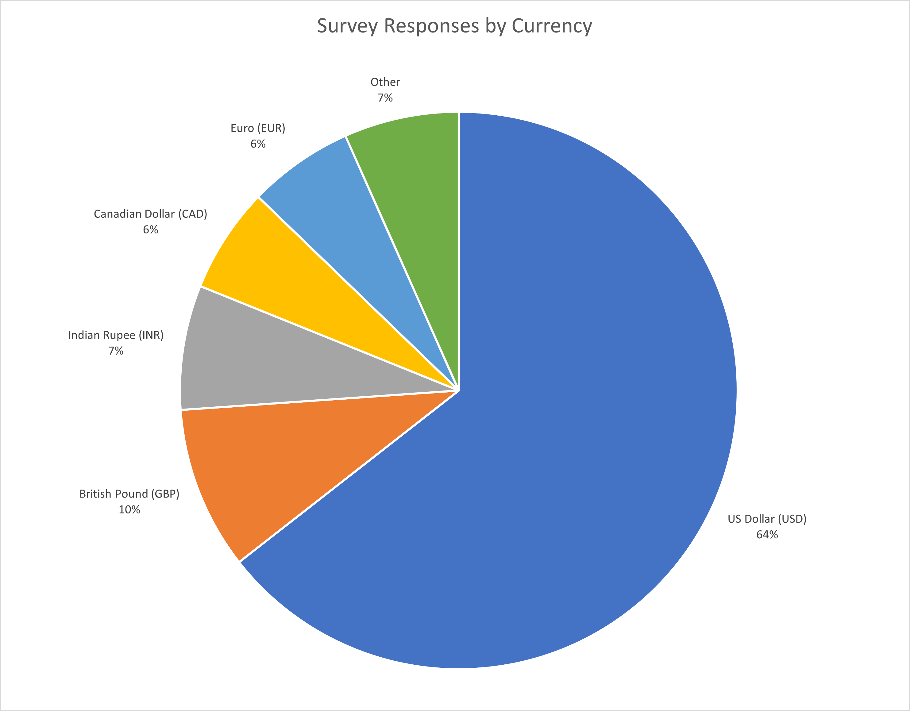
    <figcaption>
        Survey Responses by Currency
    </figcaption>
    </figure>
</a>

| Response                | Percent of Respondents |
|-------------------------|------------------------|
| US   Dollar (USD)       | 64.44%                 |
| British Pound (GBP)     | 9.44%                  |
| Indian Rupee (INR)      | 7.22%                  |
| Euro (EUR)              | 6.11%                  |
| Canadian Dollar (CAD)   | 6.11%                  |
| Australian Dollar (AUD) | 3.89%                  |
| Tunisian Dinar (TND)    | 0.56%                  |
| Bulgarian Lev (BGN)     | 0.56%                  |
| Philippine Peso (PHP)   | 0.56%                  |
| Pakistani Rupee (PKR)   | 0.56%                  |
| Moroccan Dirham (MAD)   | 0.56%                  |

### What is your current employment status?

<a href="images/survey_responses_by_employment_status.png">
    <figure>
    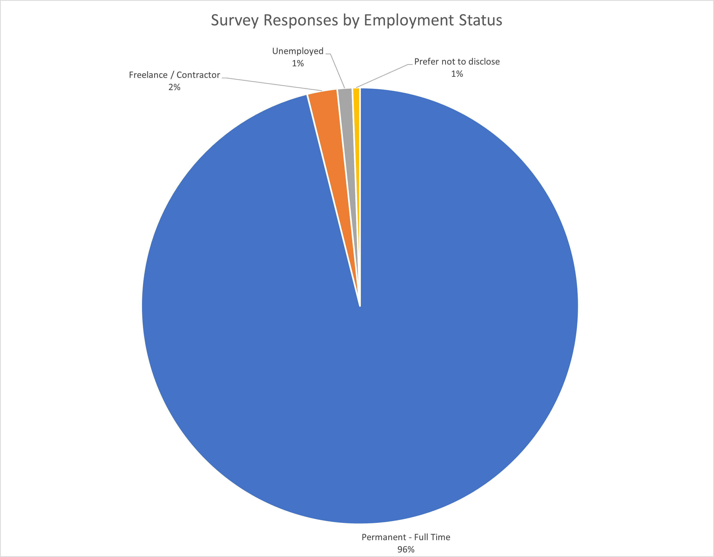
    <figcaption>
        Survey Responses by Employment Status
    </figcaption>
    </figure>
</a>

| Response               | Percent of Respondents |
|------------------------|------------------------|
| Permanent - Full Time  | 96.11%                 |
| Freelance / Contractor | 2.22%                  |
| Unemployed             | 1.11%                  |
| Prefer not to disclose | 0.56%                  |

### Which of the following best describes your current job role?

<a href="images/survey_responses_by_current_job_role.png">
    <figure>
    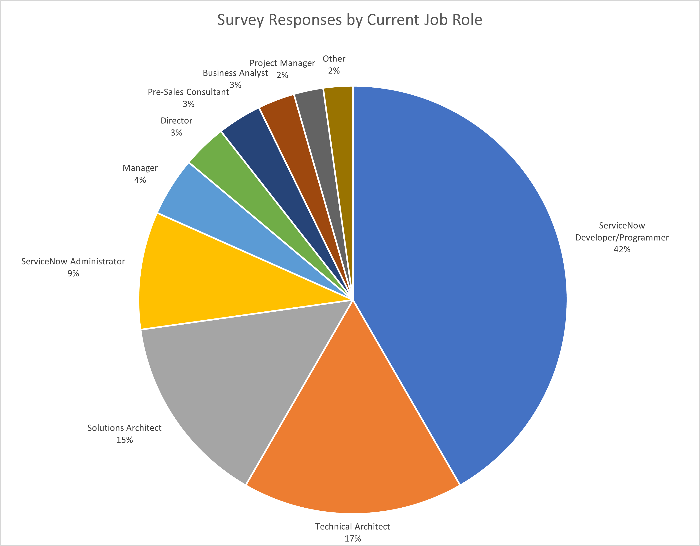
    <figcaption>
        Survey Responses by Current Job Role
    </figcaption>
    </figure>
</a>

| Response          | Percent of Respondents |
|-------------------|------------------------|
| ServiceNow   Developer/Programmer | 41.67% |
| Technical Architect               | 16.67% |
| Solutions Architect               | 14.44% |
| ServiceNow Administrator          | 8.89%  |
| Manager                           | 4.44%  |
| Director                          | 3.33%  |
| Pre-Sales Consultant              | 3.33%  |
| Business Analyst                  | 2.78%  |
| Project Manager                   | 2.22%  |
| Engagement Manager                | 1.11%  |
| Prefer not to disclose            | 0.56%  |
| Technical Analyst                 | 0.56%  |

### Which of the following best describes your current job level?

<a href="images/survey_responses_by_current_job_level.png">
    <figure>
    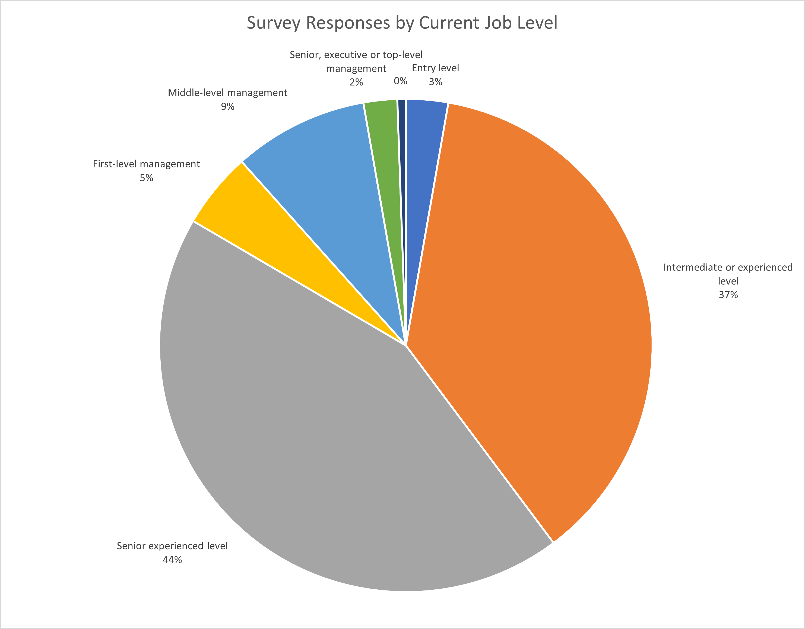
    <figcaption>
        Survey Responses by Current Job Level
    </figcaption>
    </figure>
</a>

| Response                                    | Percent of Respondents |
|---------------------------------------------|------------------------|
| Entry   level                               | 2.78%                  |
| Intermediate or experienced   level         | 37.22%                 |
| Senior experienced level                    | 43.89%                 |
| First-level management                      | 5.00%                  |
| Middle-level management                     | 8.89%                  |
| Senior, executive or top-level   management | 2.22%                  |
| Prefer not to disclose                      | 0.56%                  |

### Age

<a href="images/survey_responses_by_age.png">
    <figure>
    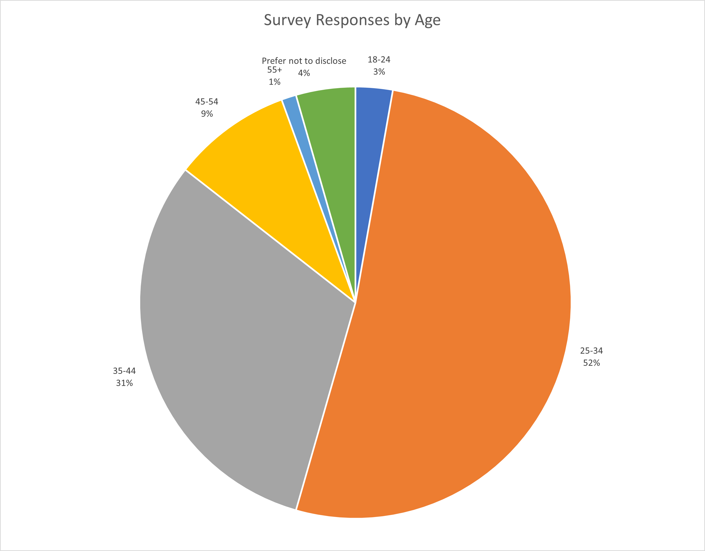
    <figcaption>
        Survey Responses by Age
    </figcaption>
    </figure>
</a>

| Response               | Percent of Respondents |
|------------------------|------------------------|
| 18-24                  | 2.78%                  |
| 25-34                  | 51.67%                 |
| 35-44                  | 31.11%                 |
| 45-54                  | 8.89%                  |
| 55+                    | 1.11%                  |
| Prefer not to disclose | 4.44%                  |

### Gender

<a href="images/survey_responses_by_gender.png">
    <figure>
    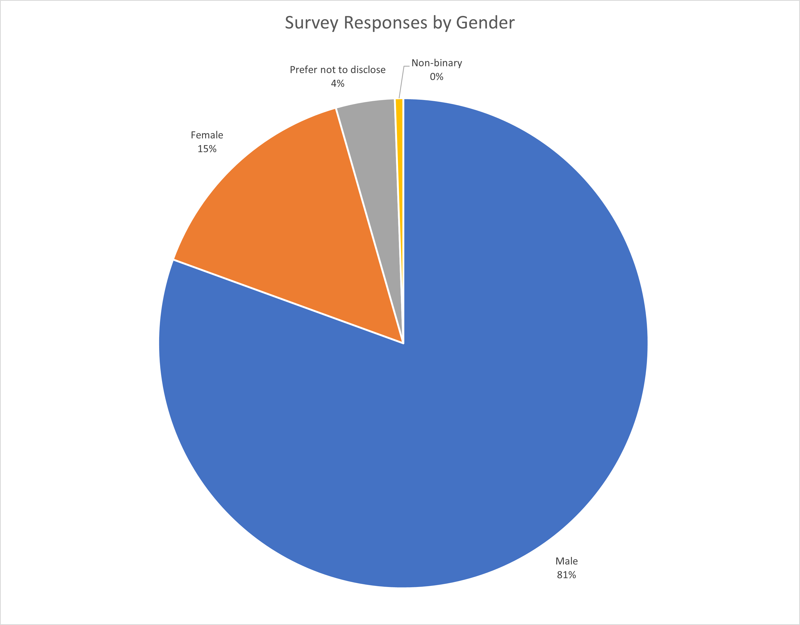
    <figcaption>
        Survey Responses by Gender
    </figcaption>
    </figure>
</a>

| Response               | Percent of Respondents |
|------------------------|------------------------|
| Male                   | 80.56%                 |
| Female                 | 15.00%                 |
| Prefer not to disclose | 3.89%                  |
| Non-binary             | 0.56%                  |

### Ethnicity

<a href="images/survey_responses_by_ethnicity.png">
    <figure>
    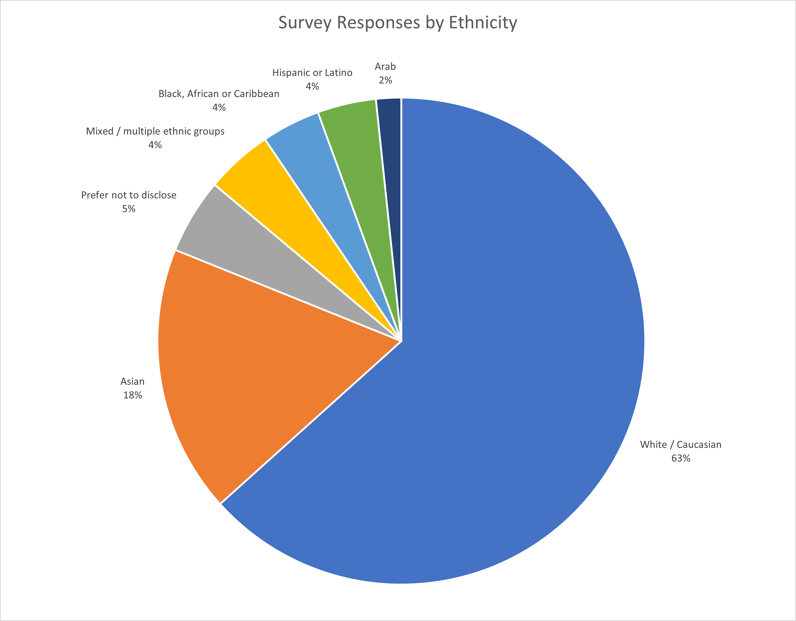
    <figcaption>
        Survey Responses by Ethnicity
    </figcaption>
    </figure>
</a>

| Response                       | Percent of Respondents |
|--------------------------------|------------------------|
| White / Caucasian              | 63.33%                 |
| Asian                          | 17.78%                 |
| Prefer not to disclose         | 5.00%                  |
| Mixed / multiple ethnic groups | 4.44%                  |
| Black, African or Caribbean    | 3.89%                  |
| Hispanic or Latino             | 3.89%                  |
| Arab                           | 1.67%                  |

### In which country are you employed?

<a href="images/survey_responses_by_country.png">
    <figure>
    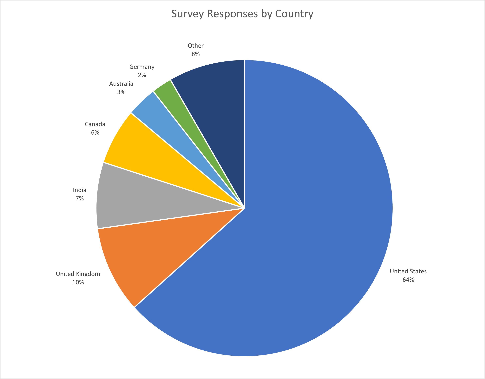
    <figcaption>
        Survey Responses by Country
    </figcaption>
    </figure>
</a>

| Response               | Percent of Respondents |
|------------------------|------------------------|
| United   States        | 63.33%                 |
| United Kingdom         | 9.44%                  |
| India                  | 7.22%                  |
| Canada                 | 6.11%                  |
| Australia              | 3.33%                  |
| Germany                | 2.22%                  |
| Prefer not to disclose | 1.11%                  |
| Russia                 | 1.11%                  |
| Bulgaria               | 1.11%                  |
| Luxembourg             | 1.11%                  |
| Pakistan               | 0.56%                  |
| Belgium                | 0.56%                  |
| Philippines            | 0.56%                  |
| Tunisia                | 0.56%                  |
| New Zealand            | 0.56%                  |
| Morocco                | 0.56%                  |
| Netherlands            | 0.56%                  |

### How many years of total career experience do you have?

<a href="images/survey_responses_by_total_experience.png">
    <figure>
    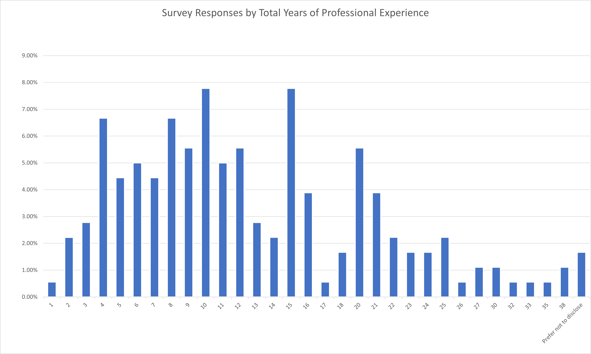
    <figcaption>
        Survey Responses by Total Years of Professional Experience
    </figcaption>
    </figure>
</a>

| Response               | Percent of Respondents |
|------------------------|------------------------|
| 1                      | 0.56%                  |
| 2                      | 2.22%                  |
| 3                      | 2.78%                  |
| 4                      | 6.67%                  |
| 5                      | 4.44%                  |
| 6                      | 5.00%                  |
| 7                      | 4.44%                  |
| 8                      | 6.67%                  |
| 9                      | 5.56%                  |
| 10                     | 7.78%                  |
| 11                     | 5.00%                  |
| 12                     | 5.56%                  |
| 13                     | 2.78%                  |
| 14                     | 2.22%                  |
| 15                     | 7.78%                  |
| 16                     | 3.89%                  |
| 17                     | 0.56%                  |
| 18                     | 1.67%                  |
| 20                     | 5.56%                  |
| 21                     | 3.89%                  |
| 22                     | 2.22%                  |
| 23                     | 1.67%                  |
| 24                     | 1.67%                  |
| 25                     | 2.22%                  |
| 26                     | 0.56%                  |
| 27                     | 1.11%                  |
| 30                     | 1.11%                  |
| 32                     | 0.56%                  |
| 33                     | 0.56%                  |
| 35                     | 0.56%                  |
| 38                     | 1.11%                  |
| Prefer not to disclose | 1.67%                  |

### How many years of experience do you have working in an IT field?

<a href="images/survey_responses_by_it_experience.png">
    <figure>
    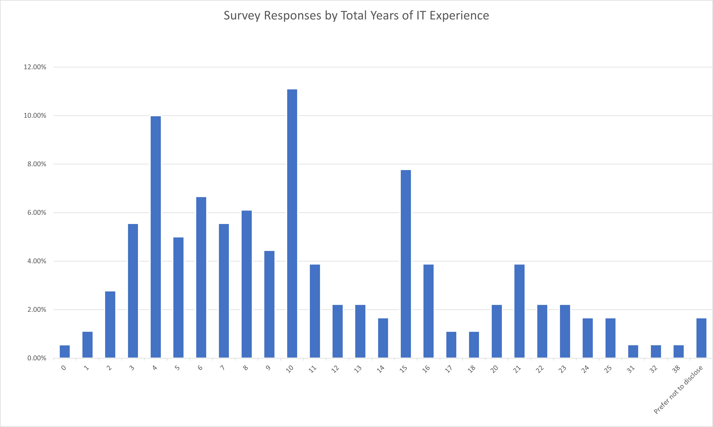
    <figcaption>
        Survey Responses by Total Years of IT Experience
    </figcaption>
    </figure>
</a>

| Response               | Percent of Respondents |
|------------------------|------------------------|
| 0                      | 0.56%                  |
| 1                      | 1.11%                  |
| 2                      | 2.78%                  |
| 3                      | 5.56%                  |
| 4                      | 10.00%                 |
| 5                      | 5.00%                  |
| 6                      | 6.67%                  |
| 7                      | 5.56%                  |
| 8                      | 6.11%                  |
| 9                      | 4.44%                  |
| 10                     | 11.11%                 |
| 11                     | 3.89%                  |
| 12                     | 2.22%                  |
| 13                     | 2.22%                  |
| 14                     | 1.67%                  |
| 15                     | 7.78%                  |
| 16                     | 3.89%                  |
| 17                     | 1.11%                  |
| 18                     | 1.11%                  |
| 20                     | 2.22%                  |
| 21                     | 3.89%                  |
| 22                     | 2.22%                  |
| 23                     | 2.22%                  |
| 24                     | 1.67%                  |
| 25                     | 1.67%                  |
| 31                     | 0.56%                  |
| 32                     | 0.56%                  |
| 38                     | 0.56%                  |
| Prefer not to disclose | 1.67%                  |

### How many years of experience do you have working with ServiceNow?

<a href="images/survey_responses_by_servicenow_experience.png">
    <figure>
    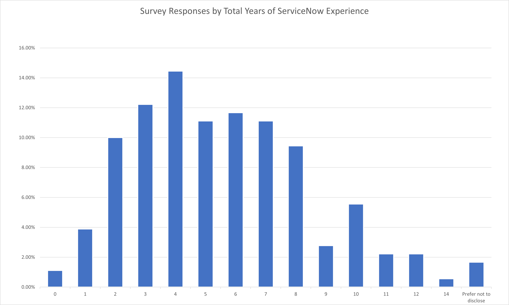
    <figcaption>
        Survey Responses by Total Years of IT Experience
    </figcaption>
    </figure>
</a>

| Response               | Percent of Respondents |
|------------------------|------------------------|
| 0                      | 1.11%                  |
| 1                      | 3.89%                  |
| 2                      | 10.00%                 |
| 3                      | 12.22%                 |
| 4                      | 14.44%                 |
| 5                      | 11.11%                 |
| 6                      | 11.67%                 |
| 7                      | 11.11%                 |
| 8                      | 9.44%                  |
| 9                      | 2.78%                  |
| 10                     | 5.56%                  |
| 11                     | 2.22%                  |
| 12                     | 2.22%                  |
| 14                     | 0.56%                  |
| Prefer not to disclose | 1.67%                  |

### Which of the following best describes your current employer?

<a href="images/survey_responses_by_current_employer_category.png">
    <figure>
    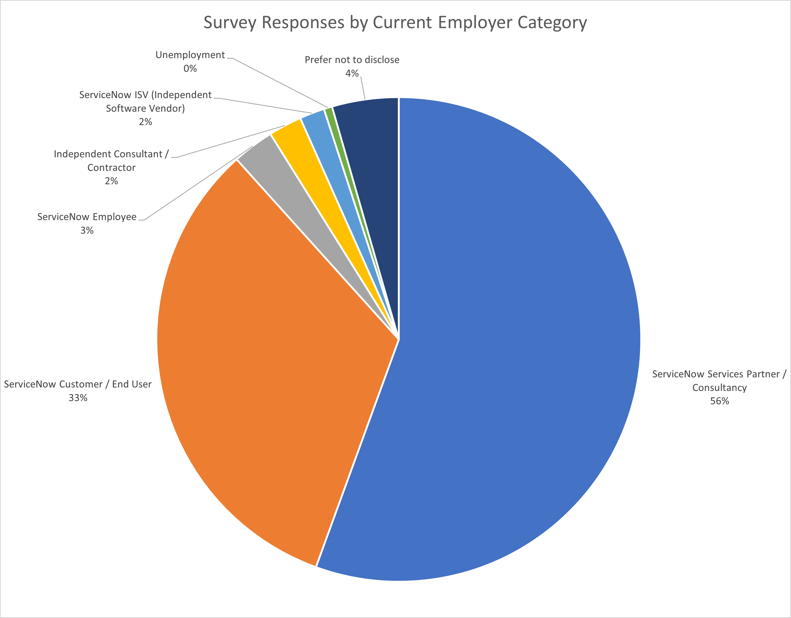
    <figcaption>
        Survey Responses by Current Employer's Category
    </figcaption>
    </figure>
</a>

| Response                                       | Percent of Respondents |
|------------------------------------------------|------------------------|
| ServiceNow Services Partner /   Consultancy    | 55.56%                 |
| ServiceNow Customer / End User                 | 32.78%                 |
| ServiceNow Employee                            | 2.78%                  |
| Independent Consultant /   Contractor          | 2.22%                  |
| ServiceNow ISV (Independent   Software Vendor) | 1.67%                  |
| Unemployment                                   | 0.56%                  |
| Prefer not to disclose                         | 4.44%                  |

### Which of the following best describes the Industry in which your current employer operates?

<a href="images/survey_responses_by_current_employer_industry.png">
    <figure>
    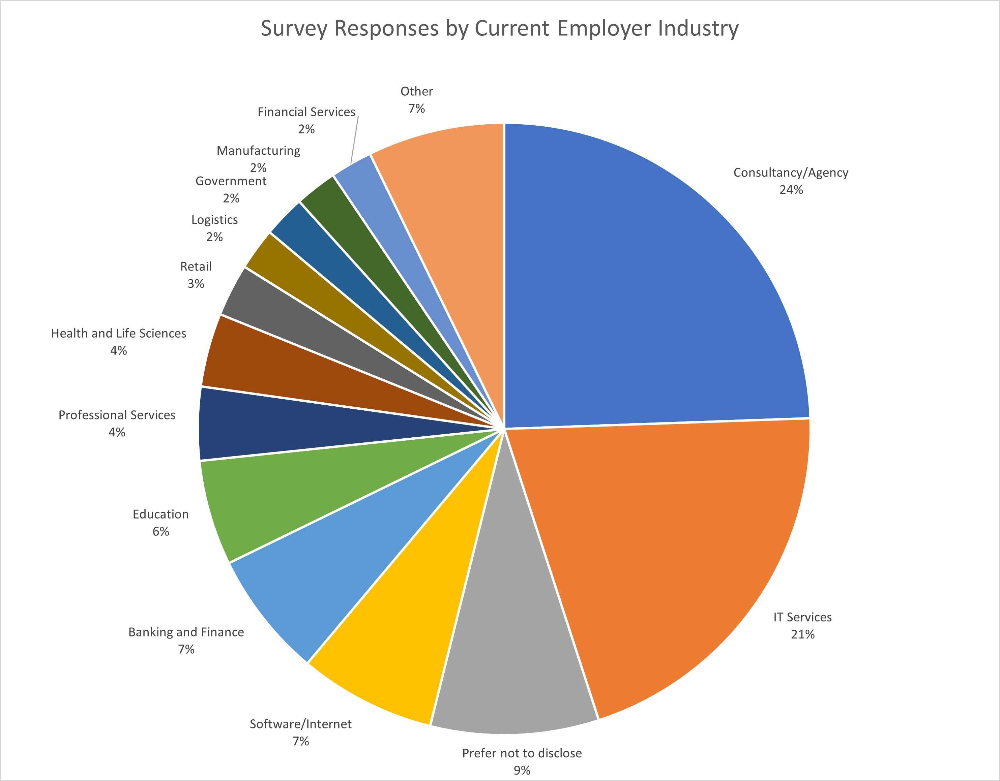
    <figcaption>
        Survey Responses by Current Employer's Industry
    </figcaption>
    </figure>
</a>

| Response                                          | Percent of Respondents |
|---------------------------------------------------|------------------------|
| Consultancy/Agency                                | 24.44%                 |
| IT Services                                       | 20.56%                 |
| Prefer not to disclose                            | 8.89%                  |
| Software/Internet                                 | 7.22%                  |
| Banking and Finance                               | 6.67%                  |
| Education                                         | 5.56%                  |
| Professional Services                             | 3.89%                  |
| Health and Life Sciences                          | 3.89%                  |
| Retail                                            | 2.78%                  |
| Logistics                                         | 2.22%                  |
| Government                                        | 2.22%                  |
| Manufacturing                                     | 2.22%                  |
| Financial Services                                | 2.22%                  |
| Insurance                                         | 1.67%                  |
| Federal                                           | 1.11%                  |
| Energy                                            | 1.11%                  |
| All the above                                     | 0.56%                  |
| Many of the above                                 | 0.56%                  |
| Very large industry-agnostic consultancy          | 0.56%                  |
| Multi-facet depending on each client's   industry | 0.56%                  |
| Identity governance administration                | 0.56%                  |
| All                                               | 0.56%                  |
### Which of the following best describes your current employer's primary business model?

<a href="images/survey_responses_by_current_employer_business_model.png">
    <figure>
    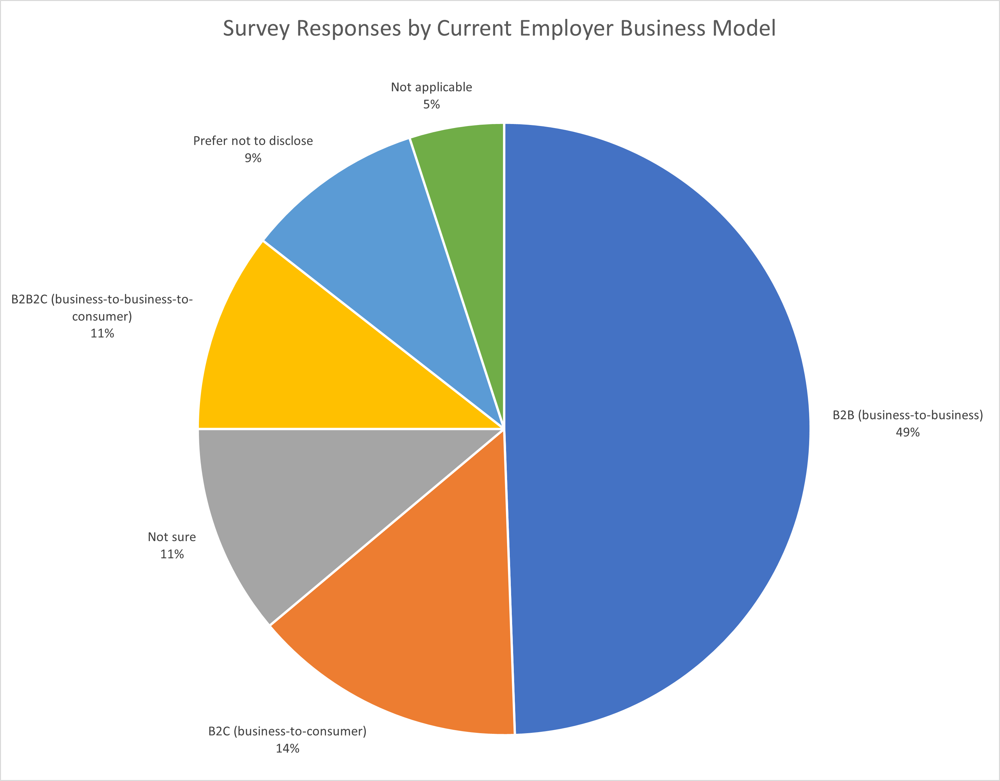
    <figcaption>
        Survey Responses by Current Employer's Business Model
    </figcaption>
    </figure>
</a>

| Response                                   | Percent of Respondents |
|--------------------------------------------|------------------------|
| B2B (business-to-business)                 | 49.44%                 |
| B2C (business-to-consumer)                 | 14.44%                 |
| Not sure                                   | 11.11%                 |
| B2B2C   (business-to-business-to-consumer) | 10.56%                 |
| Prefer not to disclose                     | 9.44%                  |
| Not applicable                             | 5.00%                  |

### Which of the following best describes how many people currently work for your current employer?

<a href="images/survey_responses_by_current_employer_size.png">
    <figure>
    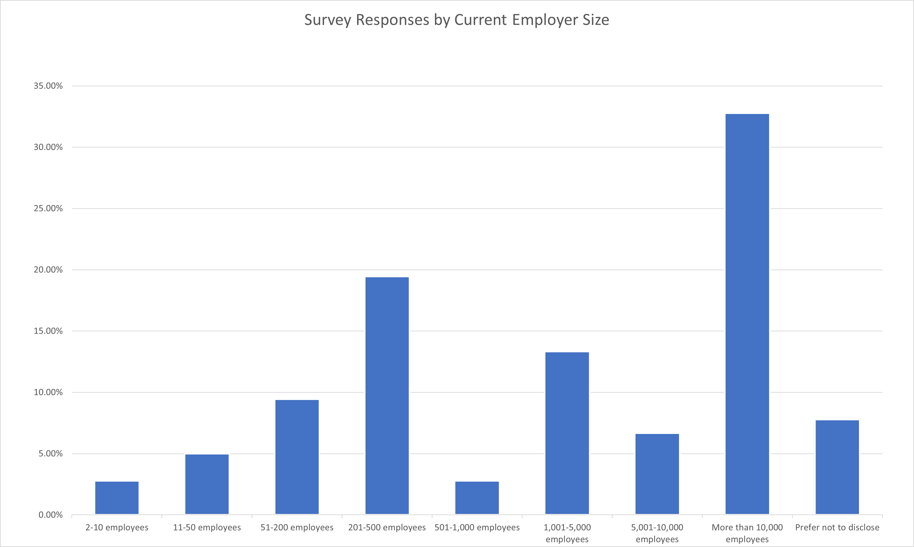
    <figcaption>
        Survey Responses by Current Employer's Size
    </figcaption>
    </figure>
</a>

| Response                   | Percent of Respondents |
|----------------------------|------------------------|
| 2-10 employees             | 2.78%                  |
| 11-50 employees            | 5.00%                  |
| 51-200 employees           | 9.44%                  |
| 201-500 employees          | 19.44%                 |
| 501-1,000 employees        | 2.78%                  |
| 1,001-5,000 employees      | 13.33%                 |
| 5,001-10,000 employees     | 6.67%                  |
| More than 10,000 employees | 32.78%                 |
| Prefer not to disclose     | 7.78%                  |

### Is your current employer a for profit or non-profit organization?

<a href="images/survey_responses_by_current_employer_profit_status.png">
    <figure>
    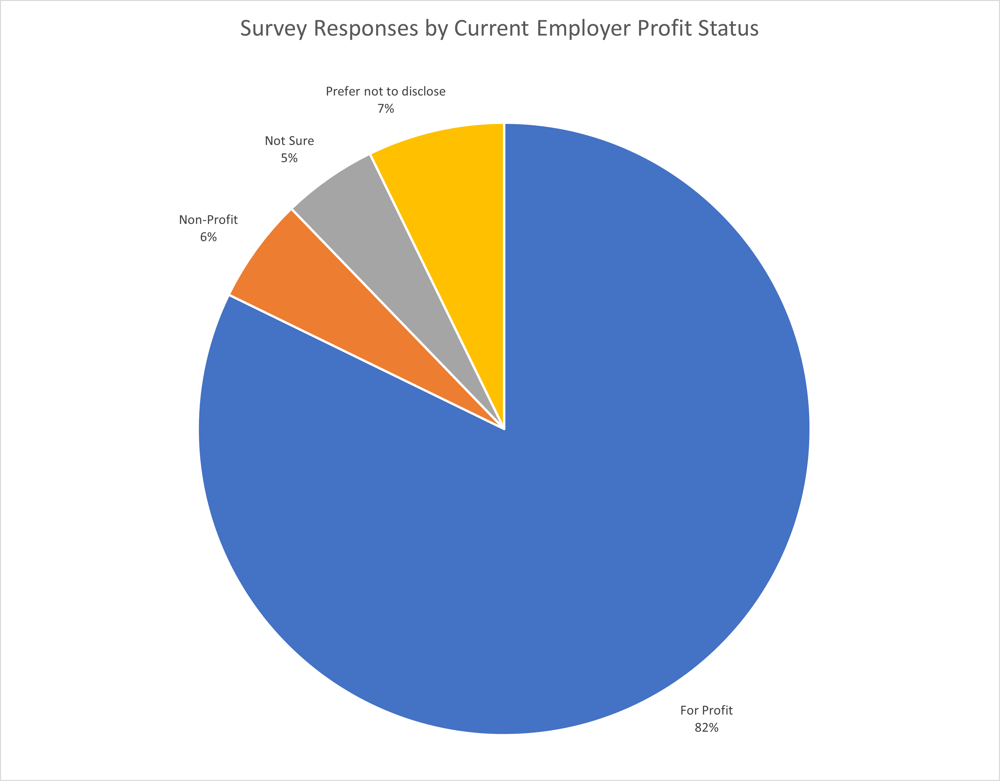
    <figcaption>
        Survey Responses by Current Employer's Profit Status
    </figcaption>
    </figure>
</a>

| Response               | Percent of Respondents |
|------------------------|------------------------|
| For Profit             | 82.22%                 |
| Non-Profit             | 5.56%                  |
| Not Sure               | 5.00%                  |
| Prefer not to disclose | 7.22%                  |

### I have a close professional relationship with peers within my current employer's organization

<a href="images/survey_responses_by_relationship_current_org_peers.png">
    <figure>
    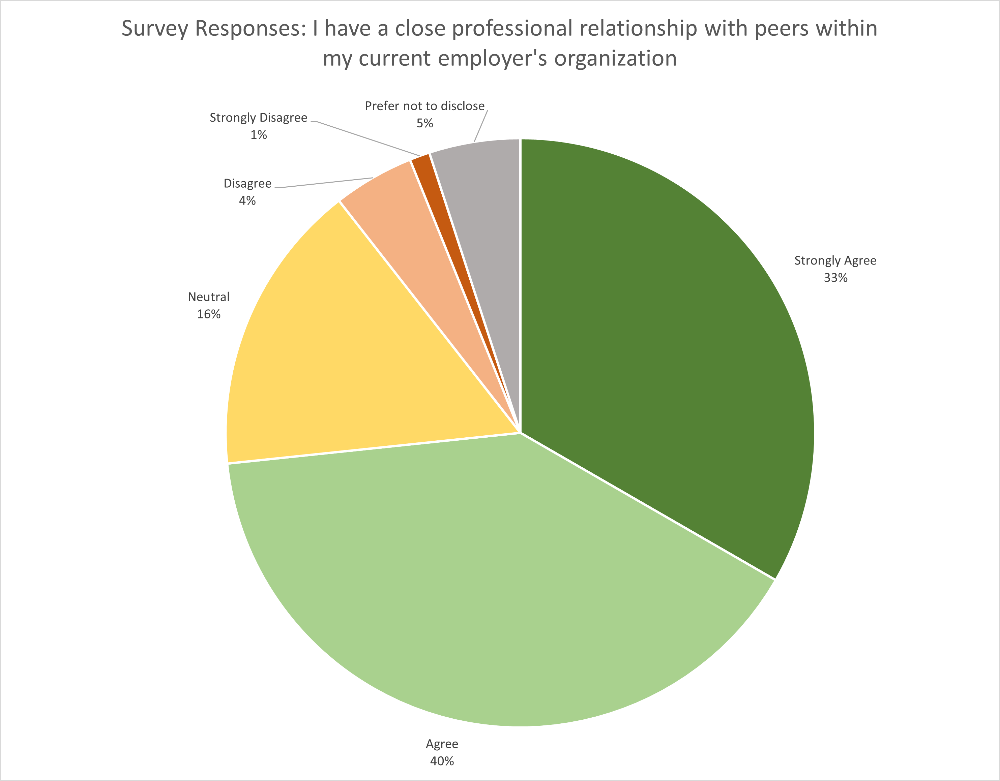
    <figcaption>
        Survey Responses: I have a close professional relationship with peers within my current employer's organization
    </figcaption>
    </figure>
</a>

| Response               | Percent of Respondents |
|------------------------|------------------------|
| Strongly Agree         | 33.33%                 |
| Agree                  | 40.00%                 |
| Neutral                | 16.11%                 |
| Disagree               | 4.44%                  |
| Strongly Disagree      | 1.11%                  |
| Prefer not to disclose | 5.00%                  |

### I have a close professional relationship with peers around the ServiceNow industry

<a href="images/survey_responses_by_relationship_industry_peers.png">
    <figure>
    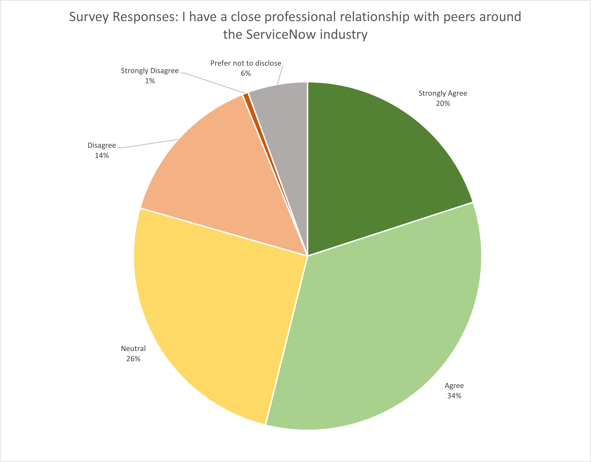
    <figcaption>
        Survey Responses: I have a close professional relationship with peers around the ServiceNow industry
    </figcaption>
    </figure>
</a>

| Response               | Percent of Respondents |
|------------------------|------------------------|
| Strongly Agree         | 20.00%                 |
| Agree                  | 33.89%                 |
| Neutral                | 25.56%                 |
| Disagree               | 14.44%                 |
| Strongly Disagree      | 0.56%                  |
| Prefer not to disclose | 5.56%                  |

### I have a close professional relationship with my immediate supervisor

<a href="images/survey_responses_by_relationship_supervisor.png">
    <figure>
    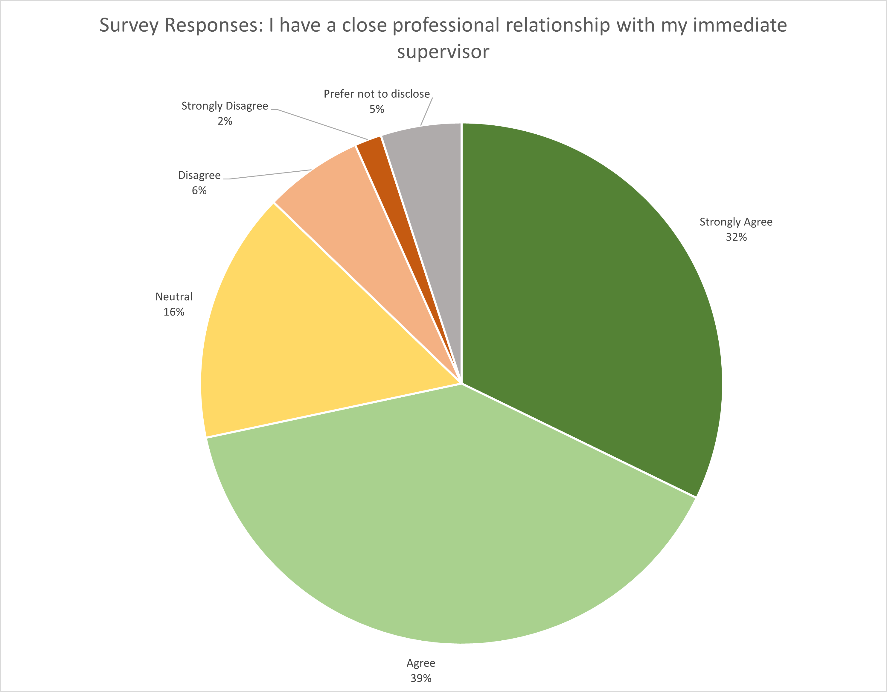
    <figcaption>
        Survey Responses: I have a close professional relationship with my immediate supervisor
    </figcaption>
    </figure>
</a>

| Response               | Percent of Respondents |
|------------------------|------------------------|
| Strongly Agree         | 32.22%                 |
| Agree                  | 39.44%                 |
| Neutral                | 15.56%                 |
| Disagree               | 6.11%                  |
| Strongly Disagree      | 1.67%                  |
| Prefer not to disclose | 5.00%                  |

### I have a close professional relationship with my senior management

<a href="images/survey_responses_by_relationship_senior_management.png">
    <figure>
    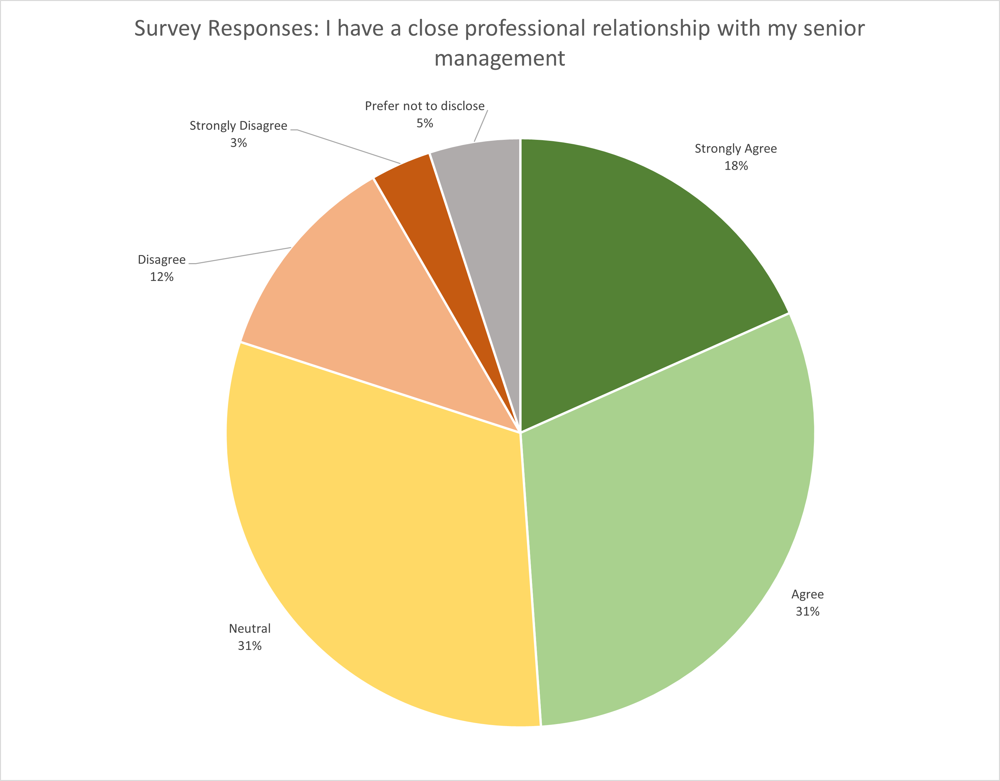
    <figcaption>
        Survey Responses: I have a close professional relationship with my senior management
    </figcaption>
    </figure>
</a>

| Response               | Percent of Respondents |
|------------------------|------------------------|
| Strongly Agree         | 18.33%                 |
| Agree                  | 30.56%                 |
| Neutral                | 31.11%                 |
| Disagree               | 11.67%                 |
| Strongly Disagree      | 3.33%                  |
| Prefer not to disclose | 5.00%                  |

### I have a close professional relationship with my executive management

<a href="images/survey_responses_by_relationship_executive_management.png">
    <figure>
    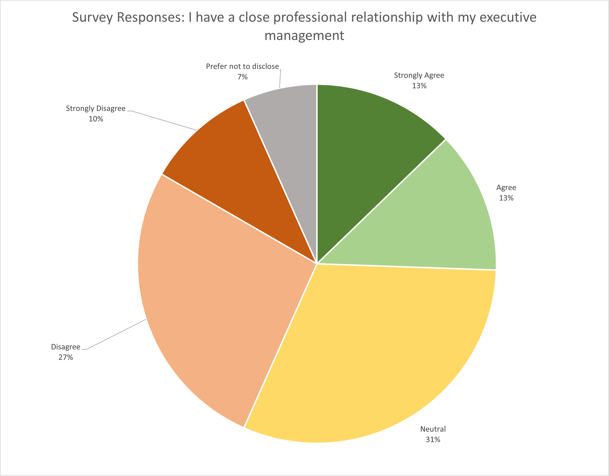
    <figcaption>
        Survey Responses: I have a close professional relationship with my executive management
    </figcaption>
    </figure>
</a>

| Response               | Percent of Respondents |
|------------------------|------------------------|
| Strongly Agree         | 12.78%                 |
| Agree                  | 12.78%                 |
| Neutral                | 31.11%                 |
| Disagree               | 26.67%                 |
| Strongly Disagree      | 10.00%                 |
| Prefer not to disclose | 6.67%                  |

### I negotiate for higher pay after a potential employer makes an initial offer

<a href="images/survey_responses_by_negotiate_initial_offer.png">
    <figure>
    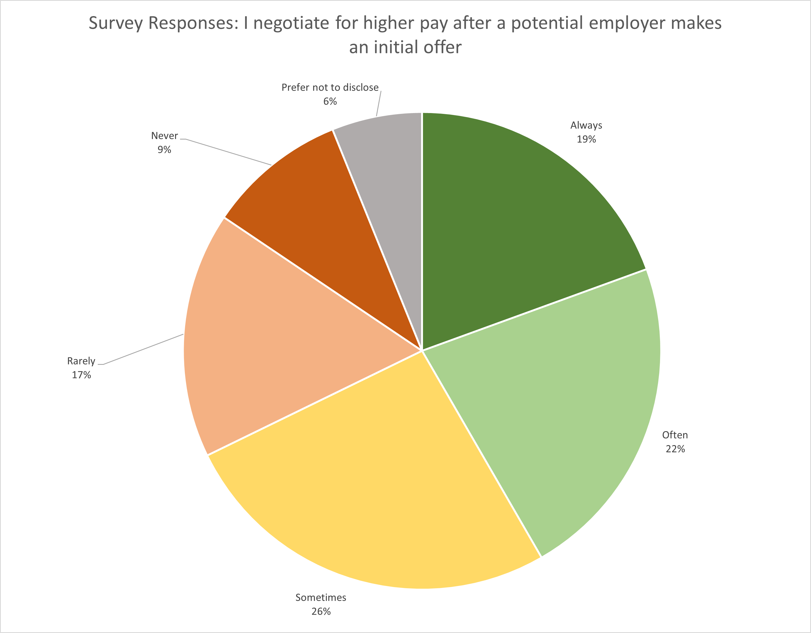
    <figcaption>
        Survey Responses: I negotiate for higher pay after a potential employer makes an initial offer
    </figcaption>
    </figure>
</a>

| Response               | Percent of Respondents |
|------------------------|------------------------|
| Always                 | 19.44%                 |
| Often                  | 22.22%                 |
| Sometimes              | 26.11%                 |
| Rarely                 | 16.67%                 |
| Never                  | 9.44%                  |
| Prefer not to disclose | 6.11%                  |

### I negotiate for higher pay from my employer at predetermined intervals specified by my employer

<a href="images/survey_responses_by_negotiate_intervals.png">
    <figure>
    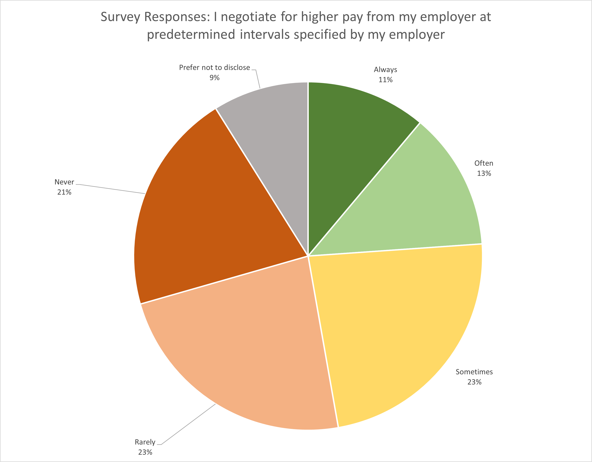
    <figcaption>
        Survey Responses: I negotiate for higher pay from my employer at predetermined intervals specified by my employer
    </figcaption>
    </figure>
</a>

| Response               | Percent of Respondents |
|------------------------|------------------------|
| Always                 | 11.11%                 |
| Often                  | 12.78%                 |
| Sometimes              | 23.33%                 |
| Rarely                 | 23.33%                 |
| Never                  | 20.56%                 |
| Prefer not to disclose | 8.89%                  |

### I negotiate for higher pay from my employer when I receive a promotion

<a href="images/survey_responses_by_negotiate_promotion.png">
    <figure>
    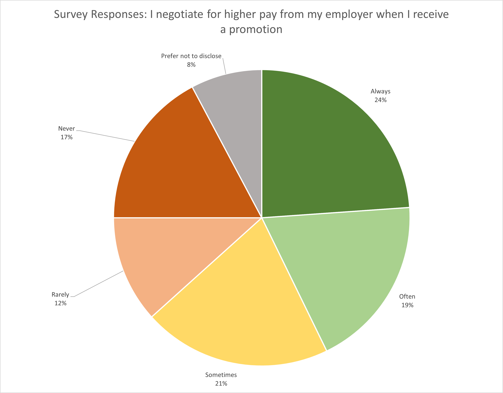
    <figcaption>
        Survey Responses: I negotiate for higher pay from my employer when I receive a promotion
    </figcaption>
    </figure>
</a>

| Response               | Percent of Respondents |
|------------------------|------------------------|
| Always                 | 23.89%                 |
| Often                  | 18.89%                 |
| Sometimes              | 20.56%                 |
| Rarely                 | 11.67%                 |
| Never                  | 17.22%                 |
| Prefer not to disclose | 7.78%                  |

### I negotiate for higher pay from my employer when I feel I deserve it

<a href="images/survey_responses_by_negotiate_deserve.png">
    <figure>
    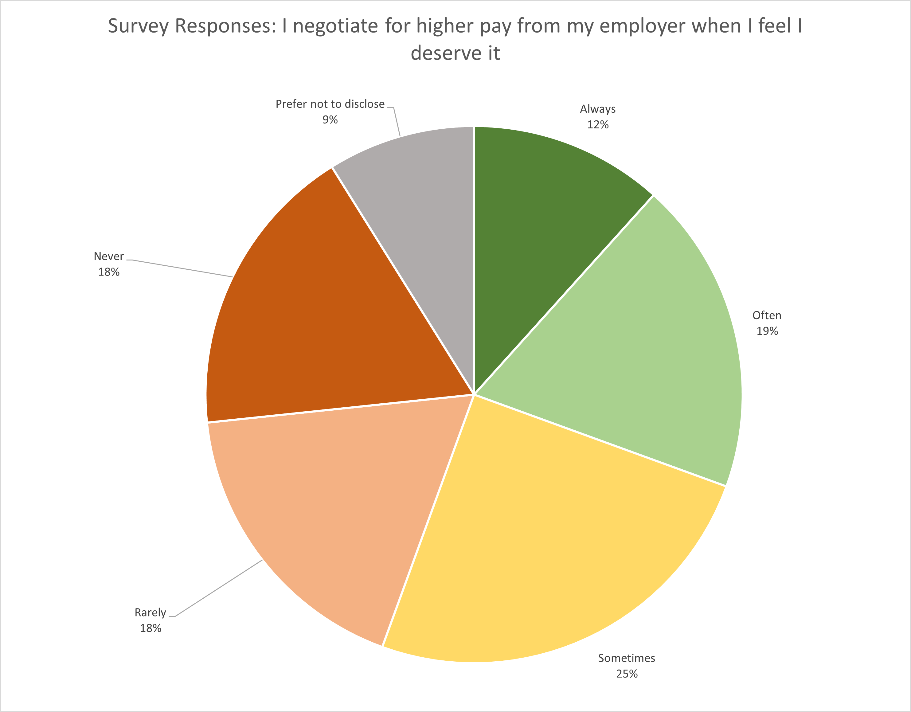
    <figcaption>
        Survey Responses: I negotiate for higher pay from my employer when I feel I deserve it
    </figcaption>
    </figure>
</a>

| Response               | Percent of Respondents |
|------------------------|------------------------|
| Always                 | 11.67%                 |
| Often                  | 18.89%                 |
| Sometimes              | 25.00%                 |
| Rarely                 | 17.78%                 |
| Never                  | 17.78%                 |
| Prefer not to disclose | 8.89%                  |

### My professional network is involved in potential employers making me a job offer

<a href="images/survey_responses_by_relationship_network.png">
    <figure>
    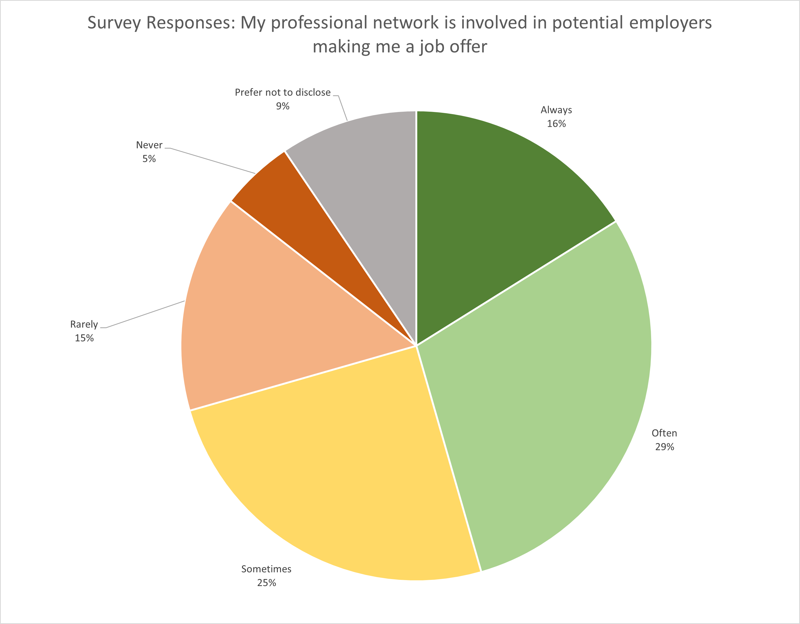
    <figcaption>
        Survey Responses: My professional network is involved in potential employers making me a job offer
    </figcaption>
    </figure>
</a>

| Response               | Percent of Respondents |
|------------------------|------------------------|
| Always                 | 16.11%                 |
| Often                  | 29.44%                 |
| Sometimes              | 25.00%                 |
| Rarely                 | 15.00%                 |
| Never                  | 5.00%                  |
| Prefer not to disclose | 9.44%                  |

### How important is a pay increase to you when considering future job opportunities?

<a href="images/survey_responses_by_pay_importance_future.png">
    <figure>
    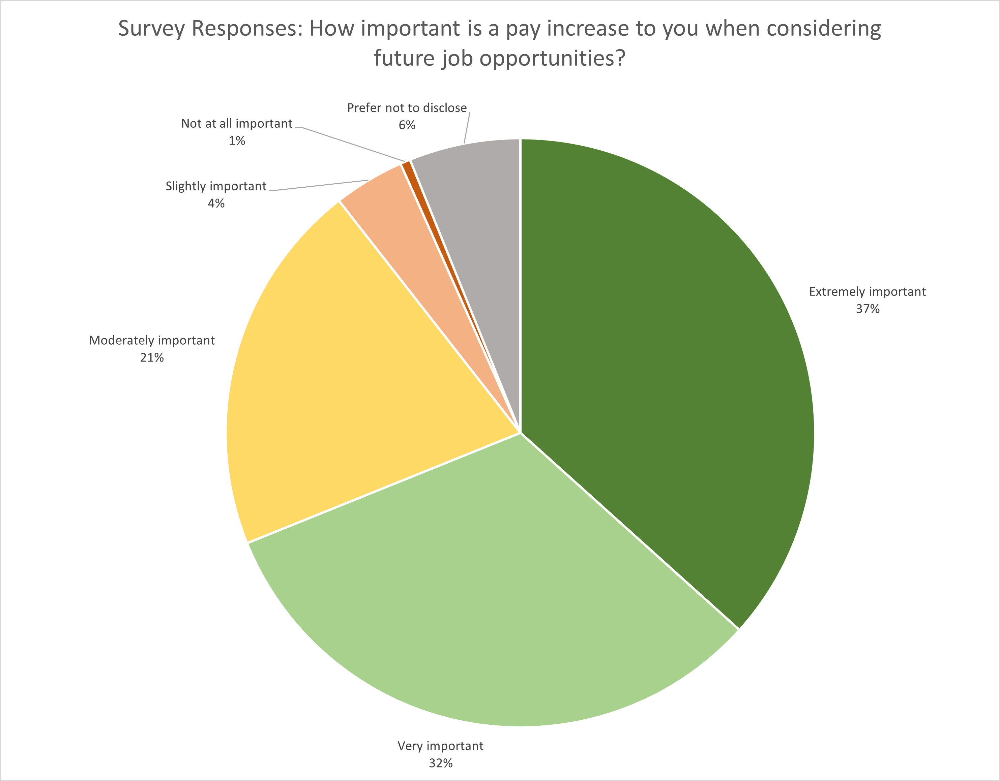
    <figcaption>
        Survey Responses: How important is a pay increase to you when considering future job opportunities?
    </figcaption>
    </figure>
</a>

| Response               | Percent of Respondents |
|------------------------|------------------------|
| Extremely important    | 36.67%                 |
| Very important         | 32.22%                 |
| Moderately important   | 20.56%                 |
| Slightly important     | 3.89%                  |
| Not at all important   | 0.56%                  |
| Prefer not to disclose | 6.11%                  |

### How important have pay increases been to you when considering past job opportunities up until now?

<a href="images/survey_responses_by_pay_importance_past.png">
    <figure>
    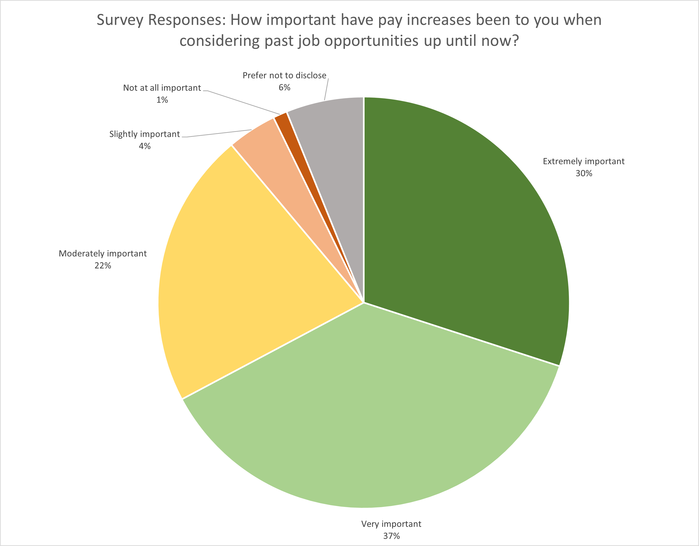
    <figcaption>
        Survey Responses: How important have pay increases been to you when considering past job opportunities up until now?
    </figcaption>
    </figure>
</a>

| Response               | Percent of Respondents |
|------------------------|------------------------|
| Extremely important    | 30.00%                 |
| Very important         | 37.22%                 |
| Moderately important   | 21.67%                 |
| Slightly important     | 3.89%                  |
| Not at all important   | 1.11%                  |
| Prefer not to disclose | 6.11%                  |

[1]: #currency
[2]: #what-is-your-current-employment-status
[3]: #which-of-the-following-best-describes-your-current-job-role
[4]: #which-of-the-following-best-describes-your-current-job-level
[5]: #age
[6]: #gender
[7]: #ethnicity
[8]: #in-which-country-are-you-employed
[9]: #how-many-years-of-total-career-experience-do-you-have
[10]: #how-many-years-of-experience-do-you-have-working-in-an-it-field
[11]: #how-many-years-of-experience-do-you-have-working-with-servicenow
[12]: #which-of-the-following-best-describes-your-current-employer
[13]: #which-of-the-following-best-describes-the-industry-in-which-your-current-employer-operates
[14]: #which-of-the-following-best-describes-your-current-employers-primary-business-model
[15]: #which-of-the-following-best-describes-how-many-people-currently-work-for-your-current-employer
[16]: #is-your-current-employer-a-for-profit-or-non-profit-organization
[17]: #i-have-a-close-professional-relationship-with-peers-within-my-current-employers-organization
[18]: #i-have-a-close-professional-relationship-with-peers-around-the-servicenow-industry
[19]: #i-have-a-close-professional-relationship-with-my-immediate-supervisor
[20]: #i-have-a-close-professional-relationship-with-my-senior-management
[21]: #i-have-a-close-professional-relationship-with-my-executive-management
[22]: #i-negotiate-for-higher-pay-after-a-potential-employer-makes-an-initial-offer
[23]: #i-negotiate-for-higher-pay-from-my-employer-at-predetermined-intervals-specified-by-my-employer
[24]: #i-negotiate-for-higher-pay-from-my-employer-when-i-receive-a-promotion
[25]: #i-negotiate-for-higher-pay-from-my-employer-when-i-feel-i-deserve-it
[26]: #my-professional-network-is-involved-in-potential-employers-making-me-a-job-offer
[27]: #how-important-is-a-pay-increase-to-you-when-considering-future-job-opportunities
[28]: #how-important-have-pay-increases-been-to-you-when-considering-past-job-opportunities-up-until-now