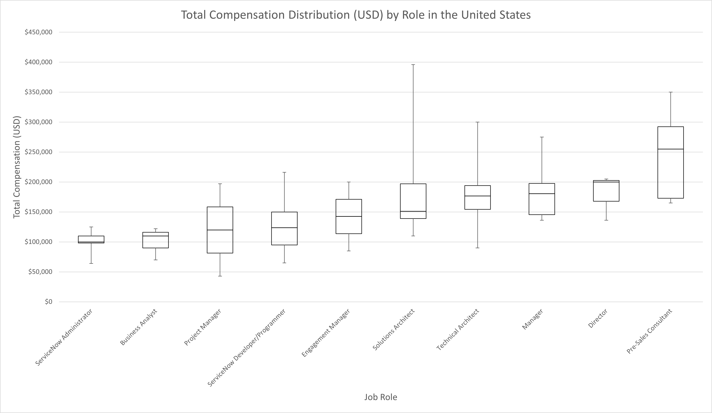
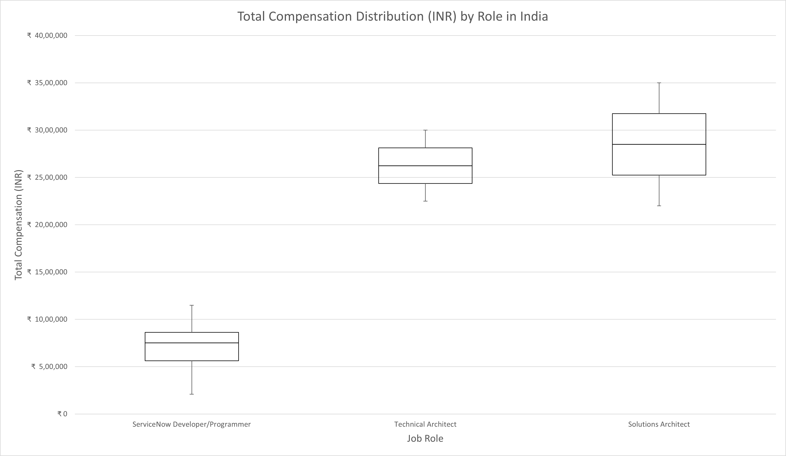
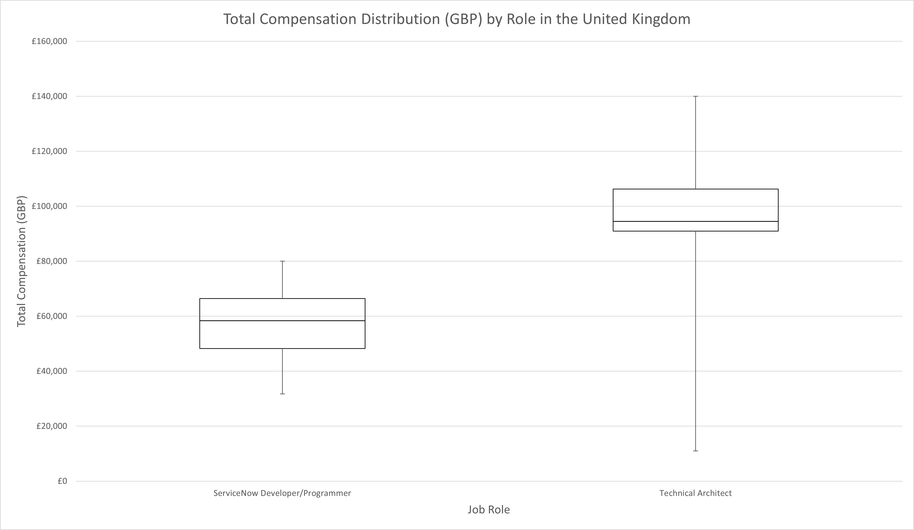
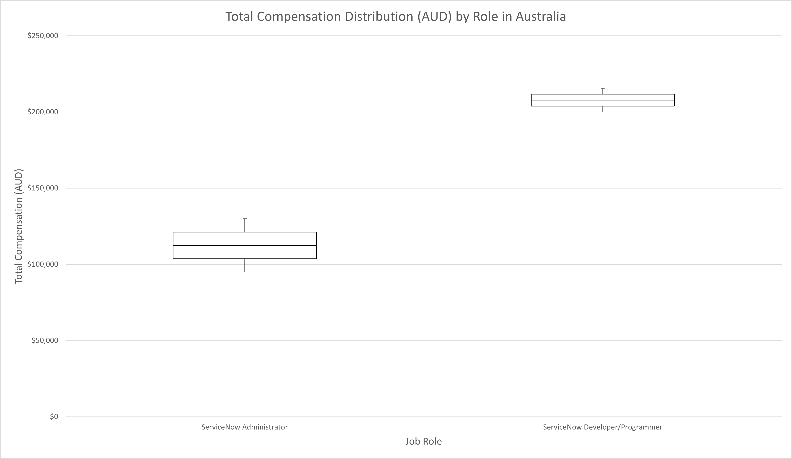
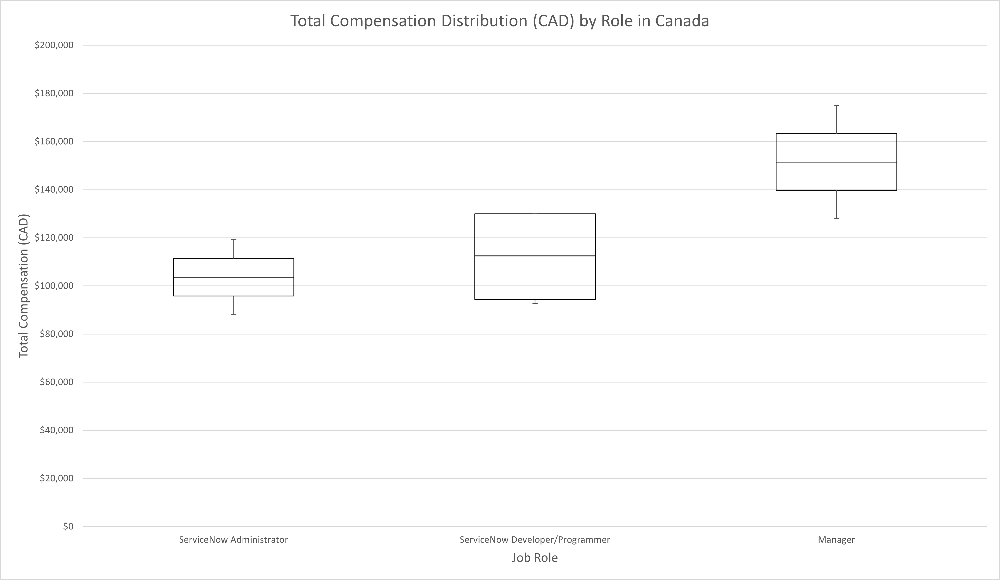

## Role Based Salary Tables

The following salary tables were generated directly from the survey responses without considering any outside data. The findings of the survey indicate that these salary tables are not actually the most effective way to predict compensation. In order to maintain consistency with traditional salary table based approaches, the decision was made to include the job titles in the tables. Country and role breakdowns with too few responses submitted were omitted both to preserve anonymity and to reduce the risk of publishing skewed data. These values are based solely on the data submitted and may be inaccurate due to sample bias. 

Using this source as your only reference is not advised.

### United States

<a href="images/total_compensation_by_role_us.png">
    <figure>
    
    <figcaption>
        Total Compensation (USD) by Role in the United States
    </figcaption>
    </figure>
</a>

|                                 | Min    | Q1     | Median | Q3     | Max    |
|---------------------------------|--------|--------|--------|--------|--------|
| ServiceNow Administrator        | 64000  | 98000  | 100000 | 110000 | 125000 |
| Business Analyst                | 70000  | 90000  | 110000 | 116000 | 122000 |
| Project Manager                 | 42800  | 81350  | 119900 | 158450 | 197000 |
| ServiceNow Developer/Programmer | 65000  | 94880  | 123750 | 150000 | 216000 |
| Engagement Manager              | 85000  | 113750 | 142500 | 171250 | 200000 |
| Solutions Architect             | 110000 | 139000 | 151000 | 197000 | 396000 |
| Technical Architect             | 90000  | 154375 | 176825 | 194125 | 300000 |
| Manager                         | 136166 | 145565 | 180630 | 197500 | 275000 |
| Director                        | 136000 | 168000 | 200000 | 202500 | 205000 |
| Pre-Sales Consultant            | 165000 | 173000 | 255000 | 292250 | 350000 |

### India

There were significantly fewer responses from India this year compared to last year. This year's values may be less accurate than the previous year.

<a href="images/total_compensation_by_role_india.png">
    <figure>
    
    <figcaption>
        Total Compensation (INR) by Role in India
    </figcaption>
    </figure>
</a>

|                                 | Min          | Q1           | Median       | Q3           | Max          |
|---------------------------------|--------------|--------------|--------------|--------------|--------------|
| ServiceNow Developer/Programmer | ₹  2,10,000  | ₹  5,62,999  | ₹  7,52,999  | ₹  8,63,508  | ₹  11,50,010 |
| Technical Architect             | ₹  22,49,994 | ₹  24,37,493 | ₹  26,24,992 | ₹  28,12,492 | ₹  29,99,991 |
| Solutions Architect             | ₹  21,99,989 | ₹  25,24,995 | ₹  28,50,001 | ₹  31,74,995 | ₹  34,99,990 |

### United Kingdom

There were relatively few responses from the United Kingdom to this survey. The values reported may be inaccurate or biased based on the sample.

<a href="images/total_compensation_by_role_uk.png">
    <figure>
    
    <figcaption>
        Total Compensation (GBP) by Role in the United Kingdom
    </figcaption>
    </figure>
</a>

|                                 | Min     | Q1      | Median  | Q3       | Max      |
|---------------------------------|---------|---------|---------|----------|----------|
| ServiceNow Developer/Programmer | £31,700 | £48,250 | £58,425 | £66,463  | £80,000  |
| Technical Architect             | £11,000 | £91,000 | £94,500 | £106,250 | £140,000 |

### Australia

There were relatively few responses from the United Kingdom to this survey. The values reported may be inaccurate or biased based on the sample.

<a href="images/total_compensation_by_role_australia.png">
    <figure>
    
    <figcaption>
        Total Compensation (AUD) by Role in Australia
    </figcaption>
    </figure>
</a>

|                                 | Min      | Q1       | Median   | Q3       | Max      |
|---------------------------------|----------|----------|----------|----------|----------|
| ServiceNow Administrator        | $94,999  | $103,750 | $112,500 | $121,250 | $130,000 |
| ServiceNow Developer/Programmer | $199,999 | $203,899 | $207,800 | $211,700 | $215,600 |

### Canada

There were relatively few responses from the United Kingdom to this survey. The values reported may be inaccurate or biased based on the sample.

<a href="images/total_compensation_by_role_canada.png">
    <figure>
    
    <figcaption>
        Total Compensation (CAD) by Role in Canada
    </figcaption>
    </figure>
</a>

|                                 | Min      | Q1       | Median   | Q3       | Max      |
|---------------------------------|----------|----------|----------|----------|----------|
| ServiceNow Administrator        | $88,000  | $95,800  | $103,600 | $111,400 | $119,200 |
| ServiceNow Developer/Programmer | $92,700  | $94,425  | $112,500 | $130,000 | $130,000 |
| Manager                         | $128,000 | $139,750 | $151,500 | $163,250 | $175,001 |